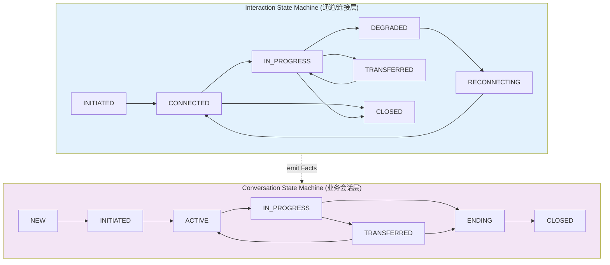
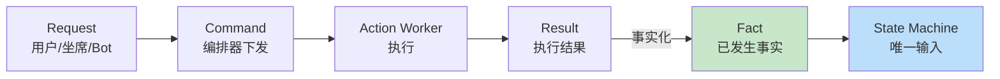
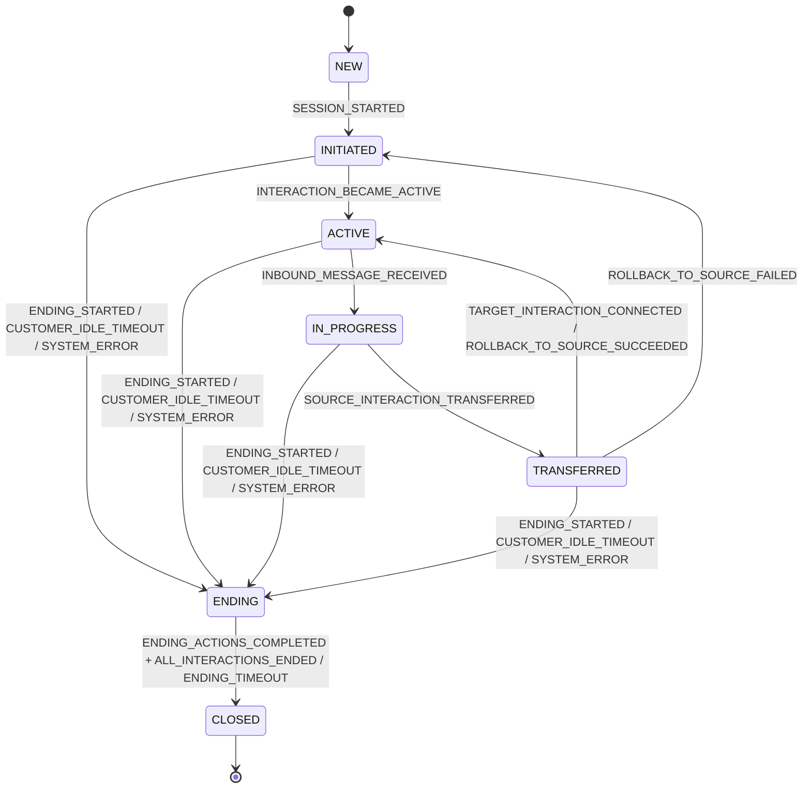
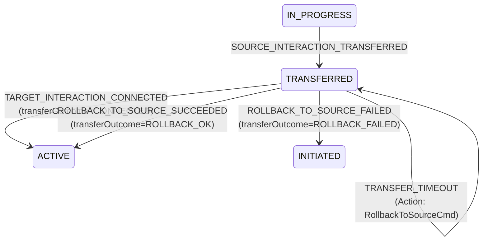
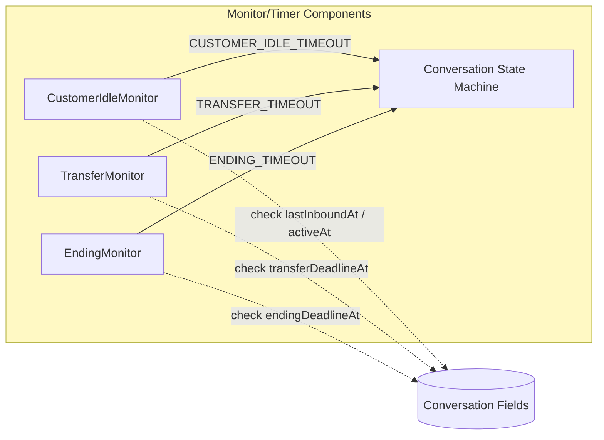
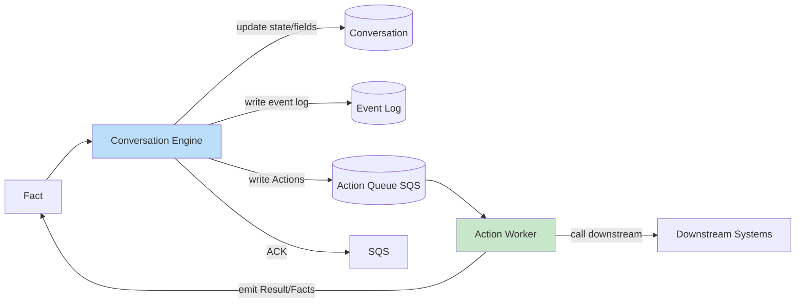
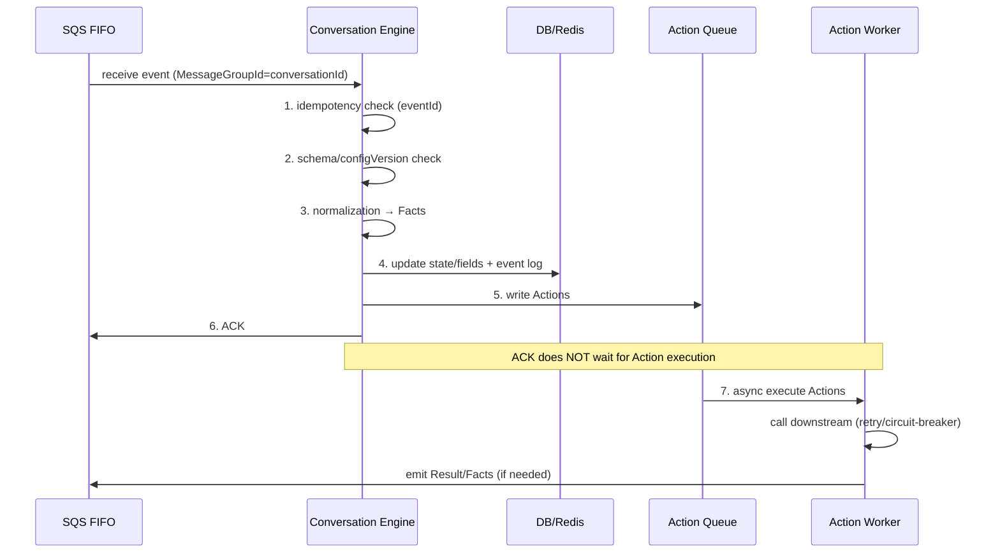

# AI Messaging Hub: 状态机管理与事件驱动编排详细设计

> 本文档定义 AI Messaging Hub 的核心状态机管理架构与事件驱动编排机制。系统采用双层状态机模型，通过标准事件语义、字段驱动编排、强治理规则和可观测审计，确保会话生命周期的可靠管理。
>
> **版本**: version3
> **最后更新**: 2026-08-31

---

## 1. Overview

### 1.1 双层状态机模型

系统采用两层独立但协同的状态机：

| 层级 | 名称 | 职责 |
|------|------|------|
| **通道/连接层** | Interaction | 连接建立、心跳、降级、重连、通道关闭；以及跨渠道转接时 source 的 detach 标记与回滚恢复 |
| **业务会话层** | Conversation | 会话生命周期、跨渠道转接编排、Customer Idle 治理、统一 ending/close 收敛、Survey（作为字段） |



### 1.2 设计目标（评审版）

| 目标 | 说明 |
|------|------|
| **关注点分离** | Conversation 不承载过多"流程子状态"，保持主状态少且稳定；复杂流程用字段 + Facts + Actions 编排表达 |
| **标准事件模型** | 事件分层为 Request / Command / Fact / Result；状态机只消费 Fact |
| **可靠异步动作** | 统一用 Action（替代 Outbox 命名）解耦慢调用，Action 具备幂等键 |
| **强治理** | Customer Idle、Transfer Deadline、ENDING 不可逆且最终必达 CLOSED |
| **可观测可审计** | Conversation state + event log 为 source of truth |

### 1.3 强治理规则

- **Customer Idle**: 任何可等待输入的状态都能进入 ENDING（endReason=CUSTOMER_IDLE）
- **Transfer Deadline**: TRANSFERRED 180s 强制失败并回滚
- **ENDING 不可逆**: 且最终必达 CLOSED（默认 120s 强制收敛）

---

## 2. 标准事件模型（Event Semantics）

事件分为四层，状态机只消费 Fact 层事件：

| 层级 | 名称 | 定义 | 示例 |
|------|------|------|------|
| **Request** | 请求 | 用户/坐席/Bot 的请求（不保证成功） | `ESCALATE_REQUESTED` |
| **Command** | 命令 | 编排器下发给执行器的指令（通过 Action Worker 执行） | `CONNECT_TARGET_INTERACTION_CMD` |
| **Fact** | 事实 | 已发生且可审计的事实（Conversation/Interaction 状态机唯一输入） | `TARGET_INTERACTION_CONNECTED` |
| **Result** | 结果 | Command 的执行结果，可事实化为 Fact | `CONNECT_TARGET_FAILED` |



---

## 3. 状态模型（主状态 + 字段）

### 3.1 ConversationState

```java
public enum ConversationState {
    NEW,
    INITIATED,      // 会话已创建，等待 interaction ready（或下游分配）
    ACTIVE,         // 当前绑定 interaction ready（对应 InteractionState=CONNECTED）
    IN_PROGRESS,    // 已收到客户入站消息（INBOUND），业务进行中
    TRANSFERRED,    // CBOL 跨渠道转接阶段（in-flight，等待 target 结果或回滚）
    ENDING,         // 不可逆：关闭前收尾编排（保证最终 CLOSED）
    CLOSED          // 最终收敛态
}
```



### 3.2 InteractionState

```java
public enum InteractionState {
    INITIATED,
    CONNECTED,       // ready to respond（不再需要 ACTIVE）
    IN_PROGRESS,     // 已收到客户 INBOUND
    DEGRADED,
    RECONNECTING,
    CONSULT_TRANSFER, // GENESYS ONLY (manager consult in-progress)
    TRANSFERRED,     // cross-channel source detached/completed marker
    CLOSED
}
```

### 3.3 Conversation 关键字段

这些字段必须持久化（Redis/DB）以保证恢复与对账。

#### 3.3.1 结束治理字段

| 字段 | 类型 | 说明 |
|------|------|------|
| `endReason` | enum | 结束原因（见 3.3.5） |
| `endingDeadlineAt` | timestamp | ENDING 强制收敛时间（默认 now+120s，可被刷新） |
| `endingActionsDone` | bool | 收尾动作集合是否完成 |
| `interactionsClosed` | bool | 是否已收到 ALL_INTERACTIONS_ENDED |
| `closeInteractionsDeferred` | bool | 是否延迟 CloseInteractions |

#### 3.3.2 Customer Idle 字段

| 字段 | 类型 | 说明 |
|------|------|------|
| `lastInboundAt` | timestamp | 最后一条客户入站消息时间（没有则为 null） |
| `activeAt` | timestamp | 进入 ACTIVE 的时间（无 inbound 时 idle 以此为起点） |

#### 3.3.3 Transfer 字段

| 字段 | 类型 | 说明 |
|------|------|------|
| `transferInFlight` | bool | 在 TRANSFERRED 为 true |
| `transferDeadlineAt` | timestamp | TRANSFERRED 超时时间（now+180s） |
| `transferOutcome` | enum | NONE / CONNECTED / CONNECT_FAILED / ROLLBACK_OK / ROLLBACK_FAILED / TIMEOUT |

#### 3.3.4 Survey 字段

| 字段 | 类型 | 说明 |
|------|------|------|
| `surveyEligible` | bool | 进入 ENDING 时评估 |
| `surveyStatus` | enum | NONE / SENT / SUBMITTED / TIMEOUT / SKIPPED |

#### 3.3.5 EndReason

```java
public enum EndReason {
    CUSTOMER_ENDED,
    AGENT_ENDED,
    BOT_ENDED,
    SYSTEM_ERROR,
    CUSTOMER_IDLE  // 统一 idle（包括 SURVEY_TIMEOUT）
}
```

---

## 4. Facts（状态机输入事件）最小集合

为了降低复杂度，建议把"同义事件"在 Normalizer 层归一到以下集合。

### 4.1 ConversationFactEvent（建议最终集合）

```java
public enum ConversationFactEvent {
    // lifecycle
    SESSION_STARTED,
    ALL_INTERACTIONS_ENDED,

    // readiness & messaging
    INTERACTION_BECAME_ACTIVE,
    INBOUND_MESSAGE_RECEIVED,

    // ending
    ENDING_STARTED,              // payload: endReason
    ENDING_ACTIONS_COMPLETED,
    ENDING_TIMEOUT,

    // customer idle (ideal rule)
    CUSTOMER_IDLE_TIMEOUT,       // -> ENDING(endReason=CUSTOMER_IDLE)

    // survey (as field in ENDING)
    SURVEY_SUBMITTED,
    SURVEY_TIMEOUT,
    SURVEY_SKIPPED,

    // transfer (cross-channel)
    SOURCE_INTERACTION_TRANSFERRED,
    TARGET_INTERACTION_INITIATED,
    TARGET_INTERACTION_CONNECTED,
    TARGET_INTERACTION_CONNECT_FAILED,
    ROLLBACK_TO_SOURCE_SUCCEEDED,
    ROLLBACK_TO_SOURCE_FAILED,
    TRANSFER_TIMEOUT,            // 180s exceeded -> force rollback

    // genesys same-channel / consult (conversation no-op)
    GENESYS_CONSULT_TRANSFER_STARTED,
    GENESYS_CONSULT_TRANSFER_ENDED,
    GENESYS_AGENT_TRANSFER_STARTED,
    GENESYS_AGENT_TRANSFER_COMPLETED,
    GENESYS_AGENT_TRANSFER_FAILED,

    // system
    SYSTEM_ERROR,

    // downstream availability
    DOWNSTREAM_UNAVAILABLE
}
```

---

## 5. Conversation 状态迁移规则（权威表）

> 目标：让迁移表"短且稳定"。除少数关键迁移外，其余用字段更新 + Action 编排实现。

### 5.1 基础生命周期

| 当前状态 | Fact | 目标状态 | 备注（字段/Action） |
|----------|------|----------|---------------------|
| NEW | SESSION_STARTED | INITIATED | Action: InitiateDownstreamAssignment |
| INITIATED | INTERACTION_BECAME_ACTIVE | ACTIVE | set activeAt=now; Action: SendWelcomeMessage |
| ACTIVE | INBOUND_MESSAGE_RECEIVED | IN_PROGRESS | set lastInboundAt=now; Action: RecordFirstResponse |

> **DOWNSTREAM_UNAVAILABLE**: 不改变状态（仍 INITIATED），只触发系统提醒（见 7.2）。

### 5.2 跨渠道转接（TRANSFERRED，含 180s deadline）

| 当前状态 | Fact | 目标状态 | 备注（字段/Action） |
|----------|------|----------|---------------------|
| IN_PROGRESS | SOURCE_INTERACTION_TRANSFERRED | TRANSFERRED | set transferInFlight=true; set transferDeadlineAt=now+transferDeadlineSeconds(默认180s) |
| TRANSFERRED | TARGET_INTERACTION_INITIATED | TRANSFERRED | Action: ConnectTargetInteractionCmd |
| TRANSFERRED | TARGET_INTERACTION_CONNECTED | ACTIVE | set transferInFlight=false; set transferOutcome=CONNECTED |
| TRANSFERRED | TARGET_INTERACTION_CONNECT_FAILED | TRANSFERRED | Action: RollbackToSourceCmd |
| TRANSFERRED | TRANSFER_TIMEOUT | TRANSFERRED | treat as connect_failed; Action: RollbackToSourceCmd |
| TRANSFERRED | ROLLBACK_TO_SOURCE_SUCCEEDED | ACTIVE | set transferInFlight=false; set transferOutcome=ROLLBACK_OK |
| TRANSFERRED | ROLLBACK_TO_SOURCE_FAILED | INITIATED | set transferInFlight=false; set transferOutcome=ROLLBACK_FAILED |

> 说明：这套规则不引入额外 transfer 子状态，仅用 Facts + 字段表达。



### 5.3 进入 ENDING（统一收敛入口）

#### 5.3.1 统一 ending 入口

| 当前状态 | Fact | 目标状态 | 备注 |
|----------|------|----------|------|
| INITIATED/ACTIVE/IN_PROGRESS/TRANSFERRED | ENDING_STARTED | ENDING | set endReason from payload; 触发 ENDING actions |

#### 5.3.2 system error

| 当前状态 | Fact | 目标状态 | 备注 |
|----------|------|----------|------|
| ANY (except CLOSED) | SYSTEM_ERROR | ENDING | set endReason=SYSTEM_ERROR; 触发 ENDING actions |

### 5.4 Customer Idle（理想规则：全覆盖进入 ENDING）

CUSTOMER_IDLE_TIMEOUT 由 CustomerIdleMonitor 触发（见第 8 章）。

| 当前状态 | Fact | 目标状态 | 备注 |
|----------|------|----------|------|
| INITIATED | CUSTOMER_IDLE_TIMEOUT | ENDING | set endReason=CUSTOMER_IDLE; ENDING actions |
| ACTIVE | CUSTOMER_IDLE_TIMEOUT | ENDING | set endReason=CUSTOMER_IDLE; ENDING actions |
| IN_PROGRESS | CUSTOMER_IDLE_TIMEOUT | ENDING | set endReason=CUSTOMER_IDLE; ENDING actions |
| TRANSFERRED | CUSTOMER_IDLE_TIMEOUT | ENDING | 特殊：不取消转接；刷新 endingDeadlineAt；延迟 CloseInteractions |
| ENDING | CUSTOMER_IDLE_TIMEOUT | ENDING | no-op（可刷新 endReason=customer idle） |

---

## 6. ENDING 规则（不可逆 + 最终必达 CLOSED）

### 6.1 ENDING 基本原则

- **ENDING 不可逆**: 不会返回 INITIATED/ACTIVE/IN_PROGRESS/TRANSFERRED
- **ENDING 必选 Action**: Notify、CloseInteractions
- **即使 Action 失败/超时，也必须最终 CLOSED**

### 6.2 ENDING 的收敛条件（两条件 + 超时强制）

- `endingActionsDone=true`（Fact: ENDING_ACTIONS_COMPLETED）
- `interactionsClosed=true`（Fact: ALL_INTERACTIONS_ENDED）
- 两者都 true → CLOSED
- 或 ENDING_TIMEOUT → 强制 CLOSED

| 当前状态 | Fact | 目标状态 | 备注 |
|----------|------|----------|------|
| ENDING | ENDING_ACTIONS_COMPLETED | ENDING/CLOSED | set endingActionsDone=true; if interactionsClosed=true then CLOSED |
| ENDING | ALL_INTERACTIONS_ENDED | ENDING/CLOSED | set interactionsClosed=true; if endingActionsDone=true then CLOSED |
| ENDING | ENDING_TIMEOUT | CLOSED | 强制 close，记录告警原因 |

```mermaid
flowchart TB
    A[进入 ENDING] --> B[set endReason<br/>触发 ENDING actions]
    B --> C{endingActionsDone<br/>&&<br/>interactionsClosed?}
    C -->|Yes| D[CLOSED]
    C -->|No| E{ENDING_TIMEOUT?<br/>(now >= endingDeadlineAt)}
    E -->|Yes| F[强制 CLOSED<br/>记录告警原因]
    E -->|No| G[等待 Facts<br/>ENDING_ACTIONS_COMPLETED<br/>ALL_INTERACTIONS_ENDED]
    G --> C

    style D fill:#c8e6c9
    style F fill:#ffcdd2
```

### 6.3 TRANSFERRED→ENDING（customer idle）特殊要求落地（不取消转接）

当 TRANSFERRED + CUSTOMER_IDLE_TIMEOUT → ENDING 时：

进入 ENDING 时执行：
- 立即 Action: Notify
- set `closeInteractionsDeferred=true`（延迟 CloseInteractions，避免干扰转接）
- 刷新 `endingDeadlineAt`（方案 B）：
  - `endingDeadlineAt = max(now + endingDeadlineSeconds, transferDeadlineAt + endingDeadlineSeconds)`
- 允许 ENDING 内处理转接 outcome Facts（不改状态，仅用于解除 defer）：
  - TARGET_INTERACTION_CONNECTED / ROLLBACK_TO_SOURCE_SUCCEEDED / ROLLBACK_TO_SOURCE_FAILED / TRANSFER_TIMEOUT

解除 defer 规则：
- 收到任意转接 outcome 后：
  - set `closeInteractionsDeferred=false`
  - 触发 Action: CloseInteractions（若此前未执行）

### 6.4 Survey 简化：作为 ENDING 内字段等待（不再用主状态）

- 进入 ENDING 时若 `surveyEligible=true`：
  - Action: SendSurveyCommand
  - set `surveyStatus=SENT`
- 收到 survey facts：
  - SURVEY_SUBMITTED → `surveyStatus=SUBMITTED`
  - SURVEY_SKIPPED → `surveyStatus=SKIPPED`
  - SURVEY_TIMEOUT → `surveyStatus=TIMEOUT` 且 set `endReason=CUSTOMER_IDLE`（统一口径）

是否延迟 CloseInteractions 等 survey：由字段控制（可选）。
若需要等 survey 完成再关连接：可将 `closeInteractionsDeferred = closeInteractionsDeferred || (surveyStatus==SENT)`，并在 SUBMITTED/TIMEOUT/SKIPPED 时解除。

---

## 7. Interaction 状态迁移规则（权威表，含 TRANSFERRED 回滚）

### 7.1 基础连接/消息/重连（CONNECTED 即 ready）

| 当前状态 | 事件 | 目标状态 | 备注 |
|----------|------|----------|------|
| INITIATED | CONNECTION_SUCCESS | CONNECTED | emit Fact: INTERACTION_BECAME_ACTIVE |
| INITIATED | CONNECTION_FAIL | CLOSED | 若为 target，emit Fact: TARGET_INTERACTION_CONNECT_FAILED |
| CONNECTED | FIRST_INBOUND_MESSAGE_RECEIVED | IN_PROGRESS | emit Fact: INBOUND_MESSAGE_RECEIVED |
| CONNECTED/IN_PROGRESS | HEARTBEAT_MISS | DEGRADED | emit Fact: CONNECTION_DEGRADED; 触发重连 |
| DEGRADED | RECONNECT_ATTEMPT | RECONNECTING | backoff reconnect |
| RECONNECTING | RECONNECT_SUCCESS | CONNECTED/IN_PROGRESS | emit Fact: RECONNECT_SUCCEEDED |
| RECONNECTING | RECONNECT_FAIL | CLOSED | emit Fact: RECONNECT_FAILED |
| ANY | END_REQUESTED | CLOSED | 若为最后一个 emit ALL_INTERACTIONS_ENDED |

### 7.2 跨渠道转接：source 进入 TRANSFERRED 与回滚

| 当前状态（source） | 事件/Fact | 目标状态 | 备注 |
|-------------------|-----------|----------|------|
| IN_PROGRESS | TRANSFER_SUCCESS | TRANSFERRED | source detach 完成 |
| TRANSFERRED | ROLLBACK_TO_SOURCE_SUCCEEDED | IN_PROGRESS | 回滚成功回到 IN_PROGRESS |
| TRANSFERRED | ROLLBACK_TO_SOURCE_FAILED | DEGRADED | 回滚失败进入 DEGRADED |

### 7.3 Genesys consult transfer（Conversation 不变）

- Genesys Interaction: IN_PROGRESS → CONSULT_TRANSFER → IN_PROGRESS
- emit Facts: GENESYS_CONSULT_TRANSFER_STARTED/ENDED
- Conversation: no-op

---

## 8. Monitor / Timer（确保简化逻辑可实现）

### 8.1 CustomerIdleMonitor（理想规则的唯一触发源）

- **适用状态**: INITIATED / ACTIVE / IN_PROGRESS / TRANSFERRED / ENDING(可选)
- **触发条件**:
  - 若 `lastInboundAt != null`: `now - lastInboundAt > customerIdleSeconds`
  - 否则: `now - activeAt > customerIdleSeconds`（activeAt 不存在可退化为 sessionStartedAt）
- **输出 Fact**: `CUSTOMER_IDLE_TIMEOUT`

### 8.2 TransferMonitor（TRANSFERRED 180s 超时强制回滚）

- **适用状态**: TRANSFERRED
- **触发条件**: `now >= transferDeadlineAt`
- **输出 Fact**: `TRANSFER_TIMEOUT`（随后 Action: RollbackToSourceCmd）

### 8.3 EndingMonitor（ENDING 120s 强制 close）

- **适用状态**: ENDING
- **触发条件**: `now >= endingDeadlineAt`
- **输出 Fact**: `ENDING_TIMEOUT`（强制 CLOSED）



---

## 9. Action 机制

### 9.1 组件划分

| 组件 | 职责 |
|------|------|
| **Conversation Engine** | 消费 Facts → 更新状态/字段 → 写入 Actions → ACK SQS |
| **Action Worker** | 消费 Actions → 调用下游系统（可重试/熔断/并行）→ 产出必要的 Result/Facts |



### 9.2 Action 记录字段建议

| 字段 | 说明 |
|------|------|
| `actionId` | 唯一标识 |
| `conversationId` | 关联会话 |
| `triggerEventId` | 触发的事件 ID |
| `actionType` | 动作类型 |
| `actionIdempotencyKey` | `= conversationId + ":" + triggerEventId + ":" + actionType` |
| `payload` | 动作参数 |
| `status` | PENDING / RUNNING / SUCCEEDED / FAILED |
| `retryCount` / `nextRetryAt` | 重试信息 |

### 9.3 ENDING 必选 Actions（强制）

- **Notify**（必选，进入 ENDING 立即写入）
- **CloseInteractions**（必选）
  - 若 `closeInteractionsDeferred=false`: 立即写入
  - 若 `closeInteractionsDeferred=true`: 待 transfer outcome / survey 完成后写入；否则 ENDING_TIMEOUT 时 best-effort 执行并强制 CLOSED

### 9.4 典型 Actions（示例）

- InitiateDownstreamAssignment
- SendWelcomeMessage
- RecordFirstResponse
- NotifySystemUnavailable（仅系统提醒场景）
- ConnectTargetInteractionCmd
- RollbackToSourceCmd
- SendSurveyCommand
- Notify
- CloseInteractions
- ArchiveConversation（可选：以 CLOSED 作为最终触发点执行）

---

## 10. 事件处理流水线与分布式一致性（保持简洁）

### 10.1 SQS FIFO 语义

- `MessageGroupId = conversationId`: 组内有序
- 投递语义: at-least-once（可能重复）
- 必须实现:
  - 事件幂等: `eventId`
  - Action 幂等: `actionIdempotencyKey`

### 10.2 消费流程（ACK 不等待 Action 执行）

1. Idempotency check（eventId）
2. Schema/configVersion 校验
3. Normalization（映射为 Facts）
4. 状态/字段更新 + event log 落库
5. 写入 Actions
6. ACK SQS
7. Action Worker 异步执行



---

## 11. 场景对齐验证（覆盖所有已提出场景）

下列场景均以"简化后主状态"验证，不再依赖 END_CHAT/SURVEY 主状态。

### 11.1 用户进入后不说话直到超时（endReason=CUSTOMER_IDLE）

- **Conversation**: NEW → INITIATED → ACTIVE → CUSTOMER_IDLE_TIMEOUT → ENDING(endReason=CUSTOMER_IDLE) → CLOSED
- **Interaction**: INITIATED → CONNECTED → (CloseInteractions) → CLOSED

### 11.2 用户在 Bot → 转接 Agent 失败 → 回退 Bot（rollback success）

- **Conversation**: IN_PROGRESS → SOURCE_INTERACTION_TRANSFERRED → TRANSFERRED → TARGET_CONNECT_FAILED → (rollback) → ACTIVE → IN_PROGRESS
- **Interaction(Bot source)**: IN_PROGRESS → TRANSFERRED → ROLLBACK_TO_SOURCE_SUCCEEDED → IN_PROGRESS

### 11.3 VIP 直进 Agent → 转 Bot 执行业务 → 再转回 Agent

- **Phase1**: NEW→INITIATED→ACTIVE→IN_PROGRESS（VIP routing 直接选 Agent）
- **Phase2**: IN_PROGRESS→TRANSFERRED→ACTIVE→IN_PROGRESS（Agent→Bot）
- **Phase3**: IN_PROGRESS→TRANSFERRED→ACTIVE→IN_PROGRESS（Bot→Agent）
- **结束**: 进入 ENDING→CLOSED

### 11.4 CBOL NEW 成功，但 agent/bot 全 down，只能 CBOL 系统提醒

- **Conversation**: NEW→INITIATED，收到 DOWNSTREAM_UNAVAILABLE 仍 INITIATED
- **Action**: NotifySystemUnavailable（系统提醒）
- 若客户 idle: CUSTOMER_IDLE_TIMEOUT→ENDING(endReason=CUSTOMER_IDLE)→CLOSED

### 11.5 Genesys consult transfer（manager），Conversation 不变

- **Conversation**: 保持 IN_PROGRESS
- **Interaction**: IN_PROGRESS → CONSULT_TRANSFER → IN_PROGRESS
- **Facts**: 仅审计/指标

### 11.6 Genesys transfer back to queue / agent-to-agent（同渠道），Conversation 不变

- **Conversation**: 保持 IN_PROGRESS
- **Facts**: GENESYS_AGENT_TRANSFER_* no-op

### 11.7 Survey 不再是主状态：在 ENDING 内等待，timeout 统一 CUSTOMER_IDLE

- 进入 ENDING 时发 survey（eligible）
- SURVEY_TIMEOUT → surveyStatus=TIMEOUT 且 endReason=CUSTOMER_IDLE
- 最终 ENDING→CLOSED（两条件或 timeout 强制）

### 11.8 TRANSFERRED 阶段 customer idle：进入 ENDING 但不取消转接（刷新 deadline）

- **Conversation**: TRANSFERRED + CUSTOMER_IDLE_TIMEOUT → ENDING(endReason=CUSTOMER_IDLE)
- `closeInteractionsDeferred=true`，等待 transfer outcome 后执行 CloseInteractions
- `endingDeadlineAt` 刷新: `max(now+120, transferDeadlineAt+120)`
- 最终必达 CLOSED（ENDING_TIMEOUT 兜底）

### 11.9 TRANSFERRED 180s 无结果：强制 transfer timeout 并回滚

- **TransferMonitor**: TRANSFER_TIMEOUT
- **Action**: RollbackToSourceCmd
- 回滚成功: 回到 ACTIVE（若已在 ENDING，则不改状态，仅用于解除 defer）
- 最终必达 CLOSED（如果已进入 ENDING）

---

## 12. 配置项（默认值建议）

| 配置项 | 默认值 | 说明 |
|--------|--------|------|
| `endingDeadlineSeconds` | 120 | ENDING 强制收敛时间（秒） |
| `transferDeadlineSeconds` | 180 | TRANSFERRED 超时时间（秒） |
| `customerIdleSeconds` | 按业务配置 | Customer Idle 超时时间（秒） |
| `surveyEnabled` | — | 是否启用 Survey |
| `sequenceBarrierEnabled` | false | 是否启用严格顺序屏障（如需严格顺序再开） |

---

## 附录：关键设计决策总结

| 决策 | 选择 | 理由 |
|------|------|------|
| 主状态数量 | Conversation 7 个，Interaction 8 个 | 保持少且稳定，复杂流程用字段表达 |
| 状态机输入 | 仅 Fact 层 | Request/Command/Result 不直接驱动状态机 |
| 异步动作 | Action（替代 Outbox） | 统一命名，具备幂等键 |
| Survey | ENDING 内字段，非主状态 | 避免主状态膨胀 |
| Transfer | TRANSFERRED 主状态 + 字段 | 不引入额外 transfer 子状态 |
| ENDING | 不可逆，必达 CLOSED | 强治理，两条件 + 超时强制 |
| Customer Idle | 全覆盖进入 ENDING | 任何可等待输入状态都能 idle 结束 |
| 分布式一致性 | SQS FIFO + 幂等 + ACK 不等 Action | at-least-once + 幂等保证最终一致 |

---

*AI Messaging Hub 状态机管理与事件驱动编排详细设计 — version3 — 2026-08-31*
