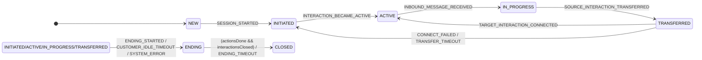
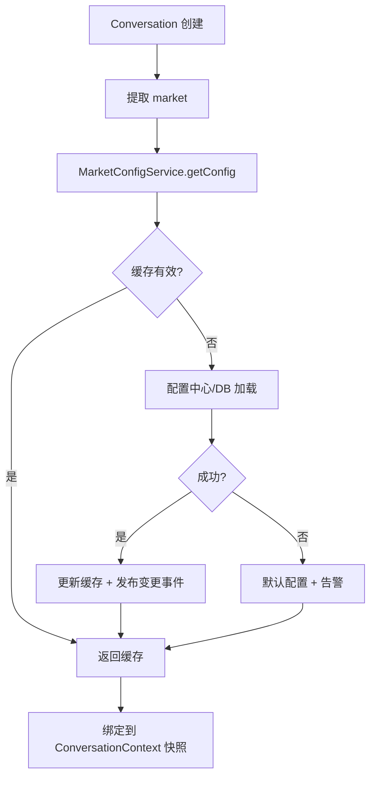
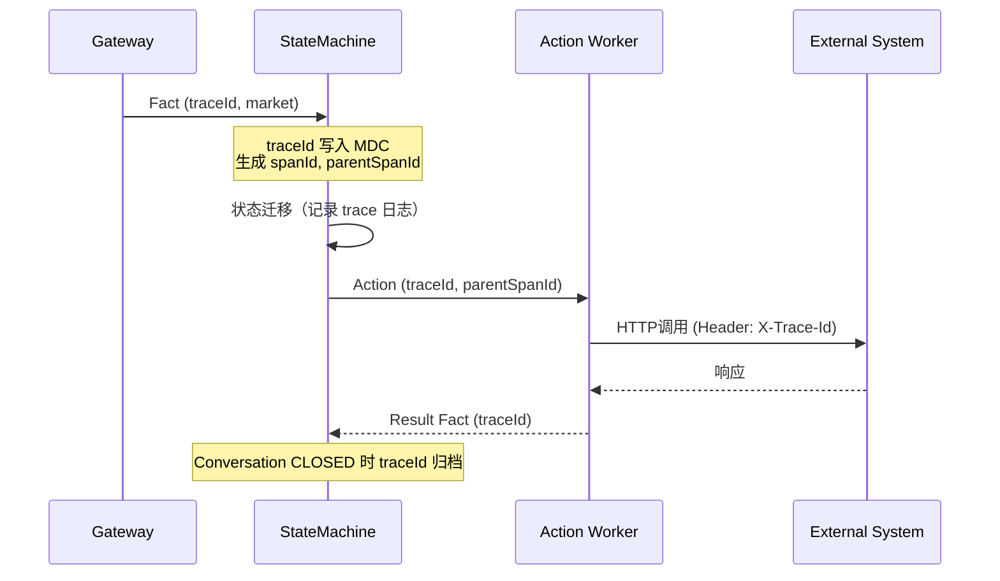
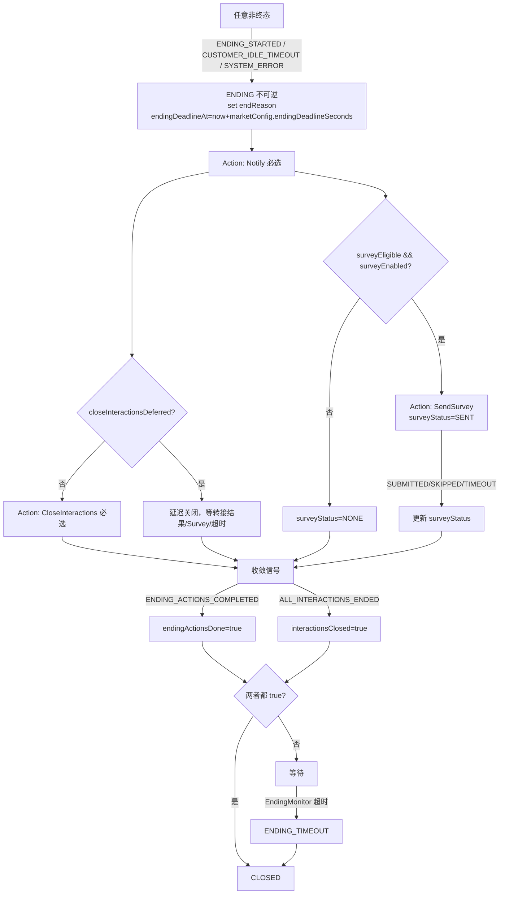

# AI Messaging Hub: 状态机管理与事件驱动编排设计

> **版本**: version6（重构简化版）
> **最后更新**: 2026-08-31
> **设计哲学**: 参考 COLA StateMachine — 无状态、表驱动、DSL 配置、零依赖、极简核心

---

## 1. 设计原则与目标

### 1.1 核心原则

| 原则 | 说明 |
|------|------|
| **无状态引擎** | 引擎仅存储迁移规则，当前状态由业务层注入；天然线程安全，可全局共享 |
| **表驱动** | Map 查找 O(1)，无反射，无 Spring 容器依赖 |
| **双层状态机** | Interaction（通道层）+ Conversation（业务层），职责分离 |
| **事件驱动** | 状态机唯一输入是 Fact（已发生的事实），通过 Normalizer 归一外部事件 |
| **ENDING 强治理** | ENDING 不可逆，必达 CLOSED；两条件（actionsDone + interactionsClosed）+ 超时强制 |
| **Transfer 失败不回滚** | 跨渠道转接失败/超时直接回 INITIATED（重新分配/兜底），不执行 rollback |
| **Multi-Market** | 支持 market 级别差异化配置，配置热更新，运行中会话使用创建时快照 |
| **全链路 Trace** | 每次执行携带 traceId，贯穿事件、状态迁移、Action、外部调用 |

### 1.2 系统边界

```
外部事件 → Normalizer → Fact → Conversation Engine → Action → Action Worker → 外部系统
                          ↓                                    ↓
                    状态迁移（持久化）                    产出 Fact（回流）
```

---

## 2. 状态模型

### 2.1 ConversationState（业务会话层）

```java
public enum ConversationState {
    NEW,            // 会话已创建
    INITIATED,      // 等待 interaction ready（或下游分配）
    ACTIVE,         // interaction ready（CONNECTED）
    IN_PROGRESS,    // 已收到客户入站消息，业务进行中
    TRANSFERRED,    // 跨渠道转接中（in-flight，等待 target 结果或超时）
    ENDING,         // 不可逆：关闭前收尾编排（保证最终 CLOSED）
    CLOSED          // 最终收敛态
}
```

#### Conversation 状态机图



### 2.2 InteractionState（通道连接层）

```java
public enum InteractionState {
    INITIATED, CONNECTED, IN_PROGRESS, DEGRADED, RECONNECTING,
    CONSULT_TRANSFER,  // GENESYS ONLY
    TRANSFERRED,       // cross-channel source detached marker
    CLOSED
}
```

> Interaction 保留 TRANSFERRED 作为 source detach 标记；transfer 失败不要求回滚，资源由 CloseInteractions 或通道侧回收。

### 2.3 Conversation 关键字段

#### 标识与追踪

| 字段 | 类型 | 说明 |
|------|------|------|
| `conversationId` | string | 会话唯一标识（UUID） |
| `market` | string | 市场标识（CN/US/EU/APAC），决定配置来源 |
| `traceId` | string | 全链路追踪 ID，会话创建时生成 |
| `tenantId` | string | 租户标识（可选） |

#### 结束治理

| 字段 | 类型 | 说明 |
|------|------|------|
| `endReason` | enum | `CUSTOMER_IDLE / CUSTOMER_ENDED / AGENT_ENDED / BOT_ENDED / SYSTEM_ERROR` |
| `endingDeadlineAt` | timestamp | ENDING 强制收敛时间（market 配置，默认 now+120s） |
| `endingActionsDone` | bool | 收尾动作是否完成 |
| `interactionsClosed` | bool | 是否已收到 ALL_INTERACTIONS_ENDED |
| `closeInteractionsDeferred` | bool | TRANSFERRED idle 进入 ENDING 时延迟关闭 |

#### Customer Idle / Transfer / Survey

| 分组 | 字段 | 说明 |
|------|------|------|
| Idle | `lastInboundAt`, `activeAt` | 最后入站时间 / 进入 ACTIVE 时间 |
| Transfer | `transferInFlight`, `transferDeadlineAt`, `transferOutcome` | 转接中标记 / 截止时间 / 结果(NONE/CONNECTED/FAILED/TIMEOUT) |
| Survey | `surveyEligible`, `surveyStatus` | 是否符合发 survey / 状态(NONE/SENT/SUBMITTED/TIMEOUT/SKIPPED) |

---

## 3. 事件模型

### 3.1 四层语义

| 层级 | 定义 | 状态机是否消费 |
|------|------|---------------|
| **Request** | 用户/坐席/Bot 的请求（不保证成功） | 否 |
| **Command** | 编排器下发给执行器的指令（通过 Action 执行） | 否 |
| **Fact** | 已发生且可审计的事实 | **是（唯一输入）** |
| **Result** | Command 执行结果，可事实化为 Fact | 否（转为 Fact 后消费） |

### 3.2 ConversationFactEvent 枚举

```java
public enum ConversationFactEvent {
    // lifecycle
    SESSION_STARTED, ALL_INTERACTIONS_ENDED,
    // readiness & messaging
    INTERACTION_BECAME_ACTIVE, INBOUND_MESSAGE_RECEIVED,
    // ending
    ENDING_STARTED, ENDING_ACTIONS_COMPLETED, ENDING_TIMEOUT,
    // customer idle
    CUSTOMER_IDLE_TIMEOUT,
    // survey (field in ENDING)
    SURVEY_SUBMITTED, SURVEY_TIMEOUT, SURVEY_SKIPPED,
    // transfer (cross-channel) — 失败/超时直接回 INITIATED，不 rollback
    SOURCE_INTERACTION_TRANSFERRED, TARGET_INTERACTION_INITIATED,
    TARGET_INTERACTION_CONNECTED, TARGET_INTERACTION_CONNECT_FAILED, TRANSFER_TIMEOUT,
    // genesys same-channel / consult (conversation no-op)
    GENESYS_CONSULT_TRANSFER_STARTED, GENESYS_CONSULT_TRANSFER_ENDED,
    GENESYS_AGENT_TRANSFER_STARTED, GENESYS_AGENT_TRANSFER_COMPLETED, GENESYS_AGENT_TRANSFER_FAILED,
    // system
    SYSTEM_ERROR, DOWNSTREAM_UNAVAILABLE
}
```

---

## 4. 核心能力

### 4.1 Multi-Market 配置

#### 配置模型

```java
public record StateMachineMarketConfig(
    String market,
    int version,
    long customerIdleSeconds,       // 默认 300
    long transferDeadlineSeconds,   // 默认 180
    long endingDeadlineSeconds,     // 默认 120
    boolean surveyEnabled,          // 默认 true
    boolean transferEnabled,        // 默认 true
    boolean genesysEnabled,         // 默认 false
    String fallbackRoutingStrategy, // 默认 REASSIGN
    Map<String, String> customProperties
) {}
```

#### 配置加载与热更新



- **热更新**：配置中心推送 → 缓存失效 → 新会话使用新配置；运行中会话保持创建时快照
- **灰度与回滚**：支持按比例灰度；配置版本化，异常时快速回滚
- **使用方式**：所有超时/开关逻辑通过 `context.getMarketConfig()` 获取

### 4.2 TraceId 全链路追踪

#### TraceContext

```java
public record TraceContext(
    String traceId,           // UUID v4，会话级唯一
    String conversationId,
    String market,
    String spanId,            // 每次状态迁移生成新 span
    String parentSpanId,      // 触发本次迁移的上游 span
    long startTime,
    Map<String, String> tags  // eventType, fromState, toState, guardResult 等
) {}
```

#### 追踪流程



#### 关键规则

- **MDC 集成**：`StateMachineTraceInterceptor` 在 `fireEvent` 前后写入/清理 MDC，所有日志自动携带 traceId
- **Action 透传**：Action 记录携带 traceId；Worker 消费时写入 MDC；外部调用通过 `X-Trace-Id` header 透传；结果 Fact 携带原 traceId
- **重试保持 traceId**：Action 重试时 traceId 不变，增加 `retryCount` 标签
- **存储查询**：ELK 按 traceId 检索全链路；关键迁移（ENDING/CLOSED）持久化到审计表；正常流量 10% 采样，异常全量

---

## 5. 状态迁移规则

### 5.1 Conversation 基础生命周期

| 当前状态 | Fact | 目标状态 | 备注 |
|----------|------|----------|------|
| NEW | SESSION_STARTED | INITIATED | Action: InitiateDownstreamAssignment |
| INITIATED | INTERACTION_BECAME_ACTIVE | ACTIVE | set activeAt; Action: SendWelcomeMessage |
| ACTIVE | INBOUND_MESSAGE_RECEIVED | IN_PROGRESS | set lastInboundAt; Action: RecordFirstResponse |
| INITIATED | DOWNSTREAM_UNAVAILABLE | INITIATED | Action: NotifySystemUnavailable |

### 5.2 跨渠道转接（TRANSFERRED）

> **核心口径**：失败/超时不执行 rollback，直接回 INITIATED（重新分配/兜底）。

| 当前状态 | Fact | 目标状态 | 备注 |
|----------|------|----------|------|
| IN_PROGRESS | SOURCE_INTERACTION_TRANSFERRED | TRANSFERRED | set transferInFlight=true; transferDeadlineAt=now+marketConfig.transferDeadlineSeconds |
| TRANSFERRED | TARGET_INTERACTION_INITIATED | TRANSFERRED | Action: ConnectTargetInteractionCmd |
| TRANSFERRED | TARGET_INTERACTION_CONNECTED | ACTIVE | set transferInFlight=false; transferOutcome=CONNECTED |
| TRANSFERRED | TARGET_INTERACTION_CONNECT_FAILED | INITIATED | set transferInFlight=false; transferOutcome=FAILED; Action: InitiateDownstreamAssignment 或兜底 |
| TRANSFERRED | TRANSFER_TIMEOUT | INITIATED | set transferInFlight=false; transferOutcome=TIMEOUT; Action: InitiateDownstreamAssignment 或兜底 |

### 5.3 进入 ENDING（统一收敛入口）

| 当前状态 | Fact | 目标状态 | 备注 |
|----------|------|----------|------|
| INITIATED/ACTIVE/IN_PROGRESS/TRANSFERRED | ENDING_STARTED | ENDING | set endReason; 触发 ENDING actions |
| ANY(except CLOSED) | SYSTEM_ERROR | ENDING | endReason=SYSTEM_ERROR |
| INITIATED/ACTIVE/IN_PROGRESS | CUSTOMER_IDLE_TIMEOUT | ENDING | endReason=CUSTOMER_IDLE |
| TRANSFERRED | CUSTOMER_IDLE_TIMEOUT | ENDING | **特殊**：不取消转接；刷新 endingDeadlineAt；延迟 CloseInteractions |

### 5.4 ENDING 收敛规则

- **两条件**：`endingActionsDone=true`（ENDING_ACTIONS_COMPLETED）且 `interactionsClosed=true`（ALL_INTERACTIONS_ENDED）→ CLOSED
- **超时强制**：`ENDING_TIMEOUT`（now >= endingDeadlineAt）→ 强制 CLOSED，记录告警
- **不可逆**：ENDING 内除关闭相关 Facts 外，其余仅 no-op + audit

### 5.5 ENDING 内特殊处理

| 场景 | 处理 |
|------|------|
| **TRANSFERRED idle → ENDING** | 立即 Notify；set closeInteractionsDeferred=true；刷新 endingDeadlineAt=max(now+endingSeconds, transferDeadlineAt+endingSeconds)；转接结果到达后解除 defer 并 CloseInteractions |
| **Survey 字段化** | 进入 ENDING 时若 surveyEligible 且 marketConfig.surveyEnabled → Action: SendSurvey, surveyStatus=SENT；SURVEY_TIMEOUT → surveyStatus=TIMEOUT 且 endReason=CUSTOMER_IDLE |
| **必选 Actions** | Notify（必选）、CloseInteractions（必选，可延迟） |

### 5.6 Interaction 规则（简化）

- 基础链路：INITIATED → CONNECTED → IN_PROGRESS（由 inbound 推进）
- 弹性恢复：DEGRADED（心跳丢失）→ RECONNECTING → CONNECTED/IN_PROGRESS/CLOSED（重连失败）
- Genesys consult：IN_PROGRESS ↔ CONSULT_TRANSFER（仅 GENESYS）
- 终态：CLOSED（END_REQUESTED 可从任意非终态进入）

---

## 6. 关键流程

### 6.1 Transfer Flow

```mermaid
flowchart TD
    A[IN_PROGRESS] -->|SOURCE_INTERACTION_TRANSFERRED| B[TRANSFERRED\ntransferInFlight=true\ndeadline=now+marketConfig.transferDeadlineSeconds]
    B -->|TARGET_INTERACTION_INITIATED| B
    B -->|TARGET_INTERACTION_CONNECTED| C[ACTIVE\ntransferOutcome=CONNECTED]
    B -->|TARGET_INTERACTION_CONNECT_FAILED| D[INITIATED\ntransferOutcome=FAILED\n重新分配/兜底]
    B -->|TransferMonitor 超时| E[TRANSFER_TIMEOUT]
    E --> D
    B -->|CUSTOMER_IDLE_TIMEOUT| F[ENDING\nendReason=CUSTOMER_IDLE\nNotify now\nCloseInteractions deferred\ndeadline=max(now+ending, transferDeadline+ending)]
    F -->|转接结果到达| G[解除 defer\nAction: CloseInteractions]
    G --> H[等待 ALL_INTERACTIONS_ENDED & ENDING_ACTIONS_COMPLETED\n或 ENDING_TIMEOUT]
```

### 6.2 ENDING Flow



---

## 7. 运行时机制

### 7.1 Monitor / Timer

> 所有超时阈值从 `marketConfig` 获取，支持 market 差异化。

| Monitor | 覆盖状态 | 条件 | 触发 Fact |
|---------|----------|------|-----------|
| **CustomerIdleMonitor** | INITIATED / ACTIVE / IN_PROGRESS / TRANSFERRED | 有 inbound: now-lastInboundAt > customerIdleSeconds；无 inbound: now-activeAt > customerIdleSeconds | CUSTOMER_IDLE_TIMEOUT |
| **TransferMonitor** | TRANSFERRED | now >= transferDeadlineAt 且 transferInFlight=true | TRANSFER_TIMEOUT |
| **EndingMonitor** | ENDING | now >= endingDeadlineAt | ENDING_TIMEOUT（强制 CLOSED） |

### 7.2 Action 机制

#### 组件分工

- **Conversation Engine**：消费 Facts → 更新状态/字段 → 写 Actions → ACK（不等待 Action 执行）
- **Action Worker**：执行 Actions（重试/熔断/幂等）→ 产出 Facts（如 ENDING_ACTIONS_COMPLETED）

#### Action 数据模型

```java
public record StateMachineAction(
    String actionId, String actionType,
    String conversationId, String market, String traceId, String parentSpanId,
    Map<String, Object> payload,
    long createdAt, int maxRetries, int retryCount
) {}
```

#### 执行流程

1. Engine 下发 Action（携带 traceId、parentSpanId）
2. Worker 从队列消费 → 提取 traceId 写入 MDC
3. 执行 Action → 调用外部系统时透传 `X-Trace-Id`
4. 执行完成 → 产出结果 Fact（携带原 traceId）
5. 失败重试 → 保持 traceId，增加 retryCount

---

## 8. 场景验证

| # | 场景 | 状态链路 |
|---|------|----------|
| 1 | 用户进入后不说话直到超时 | NEW→INITIATED→ACTIVE→CUSTOMER_IDLE_TIMEOUT→ENDING(endReason=CUSTOMER_IDLE)→CLOSED |
| 2 | Bot→Agent 转接失败（不回滚） | IN_PROGRESS→SOURCE_INTERACTION_TRANSFERRED→TRANSFERRED→TARGET_INTERACTION_CONNECT_FAILED→INITIATED→... |
| 3 | TRANSFERRED 超时（不回滚） | TRANSFERRED→TRANSFER_TIMEOUT→INITIATED→... |
| 4 | TRANSFERRED 阶段 customer idle | TRANSFERRED→CUSTOMER_IDLE_TIMEOUT→ENDING(defer CloseInteractions)→转接结果/超时→CloseInteractions→CLOSED |
| 5 | 下游全 down | NEW→INITIATED→DOWNSTREAM_UNAVAILABLE(stay)→NotifySystemUnavailable→CUSTOMER_IDLE_TIMEOUT→ENDING→CLOSED |
| 6 | Survey timeout | ENDING 内 SURVEY_TIMEOUT → surveyStatus=TIMEOUT 且 endReason=CUSTOMER_IDLE |
| 7 | Multi-Market 差异化 | CN market idle=180s vs US market idle=300s，同一套代码不同超时 |
| 8 | TraceId 全链路 | 用户请求(traceId) → Fact → 状态迁移(span) → Action → 外部调用(X-Trace-Id) → 结果 Fact → CLOSED 归档 |

---

## 附录：版本变更记录

### version6 vs version5

| 变更点 | 说明 |
|--------|------|
| 结构重构 | 14 章 → 9 章，合并相关内容（状态模型、事件模型、核心能力、关键流程、运行时机制） |
| 设计哲学 | 明确参考 COLA StateMachine：无状态、表驱动、DSL、零依赖、极简核心 |
| 简化原则 | 移除独立"简化原则"章节，合并到设计原则表 |
| 减少冗余 | 合并 Conversation/Interaction 状态模型，合并 Transfer/ENDING 流程图说明 |
| 保持功能 | Multi-Market 配置、TraceId 追踪、Transfer 不回滚、ENDING 强治理等核心功能全部保留 |

### version5 vs version4

| 变更点 | 说明 |
|--------|------|
| Multi-Market | 新增 market 级别差异化配置（超时/开关/策略），配置热更新 |
| TraceId | 新增全链路追踪，贯穿事件/状态迁移/Action/外部调用，MDC 集成 |
| Conversation 字段 | 新增 conversationId、market、traceId、tenantId |
| Monitor 超时 | 从 marketConfig 动态获取，支持热更新 |

### version4 vs version3

| 变更点 | version3 | version4 |
|--------|----------|----------|
| Transfer 失败 | 执行 RollbackToSourceCmd，回 ACTIVE | 直接回 INITIATED（重新分配/兜底） |
| transferOutcome | 含 ROLLBACK_OK/ROLLBACK_FAILED | NONE/CONNECTED/FAILED/TIMEOUT |
| endReason | CUSTOMER_ENDED 为首 | CUSTOMER_IDLE 为首选 |
| Interaction TRANSFERRED | 回滚到 IN_PROGRESS | 不要求回滚，由 CloseInteractions 回收 |

---

*AI Messaging Hub 状态机设计 — version6（重构简化版）— 2026-08-31*
