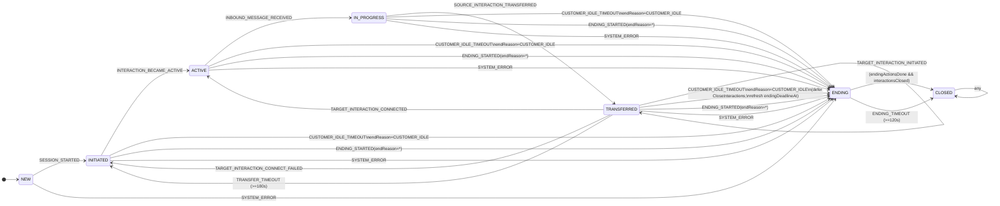
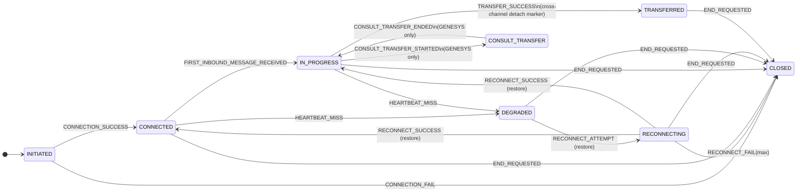

# AI Messaging Hub: 状态机管理与事件驱动编排详细设计（简化版·整篇最终稿）

> 本稿已按最新口径更新：**Transfer 失败后不执行 rollback，Conversation 直接回到 INITIATED**。
>
> **版本**: version4（最终稿）
> **最后更新**: 2026-08-31

---

## 简化原则

1. **Conversation 主状态仅保留**: `NEW / INITIATED / ACTIVE / IN_PROGRESS / TRANSFERRED / ENDING / CLOSED`
2. **移除 END_CHAT / SURVEY 主状态**: Survey 改为 `surveyStatus` 字段在 ENDING 内等待
3. **Interaction 保留 TRANSFERRED 状态**（跨渠道转接 source detach 标记），CONNECTED 即 ready
4. **Customer Idle 理想逻辑**: 所有可等待客户输入的状态超时 → `ENDING`，`endReason=CUSTOMER_IDLE`；`SURVEY_TIMEOUT` endReason 也统一为 `CUSTOMER_IDLE`
5. **TRANSFERRED 阶段 customer idle**: 进入 ENDING **但不取消转接**，刷新 ENDING deadline，等转接结果后再执行 CloseInteractions
6. **TRANSFERRED 最大执行窗口默认 180 秒**: 一直无结果则触发 transfer timeout，并同样直接回 INITIATED
7. **ENDING 不可逆**: 默认 120 秒强制收敛到 CLOSED；Action 失败/超时也必须最终关闭
8. **ENDING 必选 Action**: Notify、CloseInteractions（允许 deferred）

---

## 1. Overview

本文档定义 AI Messaging Hub 的核心状态机管理架构与事件驱动编排机制。系统采用双层状态机模型：

- **Interaction（通道/连接层）**: 连接建立、心跳、降级、重连、关闭；以及跨渠道转接时的 source detach 标记（TRANSFERRED）。
- **Conversation（业务会话层）**: 会话生命周期、跨渠道转接编排、Customer Idle 治理、ENDING/CLOSED 收敛、Survey（字段化）。

---

## 2. 标准事件模型（Request / Command / Fact / Result）

| 层级 | 名称 | 定义 |
|------|------|------|
| **Request** | 请求 | 用户/坐席/Bot 的请求（不保证成功） |
| **Command** | 命令 | 编排器下发给执行器的指令（通过 Action 执行） |
| **Fact** | 事实 | 已发生且可审计的事实（状态机唯一输入） |
| **Result** | 结果 | Command 执行结果，可事实化为 Fact |

---

## 3. 状态模型（主状态 + 字段）

### 3.1 ConversationState（主状态）

```java
public enum ConversationState {
    NEW,
    INITIATED,      // 会话已创建，等待 interaction ready（或下游分配）
    ACTIVE,         // 当前绑定 interaction ready（InteractionState=CONNECTED）
    IN_PROGRESS,    // 已收到客户入站消息（INBOUND），业务进行中
    TRANSFERRED,    // CBOL 跨渠道转接阶段（in-flight，等待 target 结果或超时）
    ENDING,         // 不可逆：关闭前收尾编排（保证最终 CLOSED）
    CLOSED          // 最终收敛态
}
```

#### 3.1.1 Conversation 状态机图（Mermaid）



### 3.2 InteractionState（保留 TRANSFERRED）

```java
public enum InteractionState {
    INITIATED,
    CONNECTED,
    IN_PROGRESS,
    DEGRADED,
    RECONNECTING,
    CONSULT_TRANSFER, // GENESYS ONLY
    TRANSFERRED,      // cross-channel source detached marker
    CLOSED
}
```

#### 3.2.1 Interaction 状态机图（Mermaid）



### 3.3 Conversation 关键字段（字段化复杂流程）

#### 3.3.1 结束治理字段

| 字段 | 类型 | 说明 |
|------|------|------|
| `endReason` | enum | `CUSTOMER_IDLE / CUSTOMER_ENDED / AGENT_ENDED / BOT_ENDED / SYSTEM_ERROR` |
| `endingDeadlineAt` | timestamp | ENDING 强制收敛时间（默认 now+120s，可刷新） |
| `endingActionsDone` | bool | 收尾动作集合是否完成 |
| `interactionsClosed` | bool | 是否已收到 ALL_INTERACTIONS_ENDED |
| `closeInteractionsDeferred` | bool | 在 TRANSFERRED idle 进入 ENDING 时使用 |

#### 3.3.2 Customer Idle 字段

| 字段 | 类型 | 说明 |
|------|------|------|
| `lastInboundAt` | timestamp | 最后一条客户入站消息时间 |
| `activeAt` | timestamp | 进入 ACTIVE 的时间（无 inbound 时 idle 以此为起点） |

#### 3.3.3 Transfer 字段

| 字段 | 类型 | 说明 |
|------|------|------|
| `transferInFlight` | bool | 在 TRANSFERRED 为 true |
| `transferDeadlineAt` | timestamp | now+180s |
| `transferOutcome` | enum | `NONE / CONNECTED / FAILED / TIMEOUT` |

#### 3.3.4 Survey 字段（不再是主状态）

| 字段 | 类型 | 说明 |
|------|------|------|
| `surveyEligible` | bool | 是否符合发 survey 条件 |
| `surveyStatus` | enum | `NONE / SENT / SUBMITTED / TIMEOUT / SKIPPED` |

---

## 4. Facts（状态机输入事件）

> Normalizer 将外部事件归一为 Facts，Conversation/Interaction 状态机仅消费 Facts。

```java
public enum ConversationFactEvent {
    // lifecycle
    SESSION_STARTED,
    ALL_INTERACTIONS_ENDED,

    // readiness & messaging
    INTERACTION_BECAME_ACTIVE,
    INBOUND_MESSAGE_RECEIVED,

    // ending
    ENDING_STARTED,              // payload: endReason
    ENDING_ACTIONS_COMPLETED,
    ENDING_TIMEOUT,              // force close at ending deadline

    // customer idle (ideal rule)
    CUSTOMER_IDLE_TIMEOUT,

    // survey (field in ENDING)
    SURVEY_SUBMITTED,
    SURVEY_TIMEOUT,              // endReason=CUSTOMER_IDLE
    SURVEY_SKIPPED,

    // transfer (cross-channel)
    SOURCE_INTERACTION_TRANSFERRED,
    TARGET_INTERACTION_INITIATED,
    TARGET_INTERACTION_CONNECTED,
    TARGET_INTERACTION_CONNECT_FAILED, // no rollback; conversation returns INITIATED
    TRANSFER_TIMEOUT,                 // no rollback; conversation returns INITIATED

    // genesys same-channel / consult (conversation no-op)
    GENESYS_CONSULT_TRANSFER_STARTED,
    GENESYS_CONSULT_TRANSFER_ENDED,
    GENESYS_AGENT_TRANSFER_STARTED,
    GENESYS_AGENT_TRANSFER_COMPLETED,
    GENESYS_AGENT_TRANSFER_FAILED,

    // system
    SYSTEM_ERROR,

    // downstream availability
    DOWNSTREAM_UNAVAILABLE
}
```

---

## 5. Conversation 状态迁移规则（权威表）

### 5.1 基础生命周期

| 当前状态 | Fact | 目标状态 | 备注（字段/Action） |
|----------|------|----------|---------------------|
| NEW | SESSION_STARTED | INITIATED | Action: `InitiateDownstreamAssignment` |
| INITIATED | INTERACTION_BECAME_ACTIVE | ACTIVE | set `activeAt=now`; Action: `SendWelcomeMessage` |
| ACTIVE | INBOUND_MESSAGE_RECEIVED | IN_PROGRESS | set `lastInboundAt=now`; Action: `RecordFirstResponse` |
| INITIATED | DOWNSTREAM_UNAVAILABLE | INITIATED | Action: `NotifySystemUnavailable` |

### 5.2 跨渠道转接（TRANSFERRED，含 180s deadline）

> 最新口径: transfer 失败/超时后**不执行 rollback**，Conversation 直接回 `INITIATED`（重新分配/兜底）。

| 当前状态 | Fact | 目标状态 | 备注（字段/Action） |
|----------|------|----------|---------------------|
| IN_PROGRESS | SOURCE_INTERACTION_TRANSFERRED | TRANSFERRED | set `transferInFlight=true`; set `transferDeadlineAt=now+transferDeadlineSeconds(默认180s)` |
| TRANSFERRED | TARGET_INTERACTION_INITIATED | TRANSFERRED | Action: `ConnectTargetInteractionCmd` |
| TRANSFERRED | TARGET_INTERACTION_CONNECTED | ACTIVE | set `transferInFlight=false`; set `transferOutcome=CONNECTED` |
| TRANSFERRED | TARGET_INTERACTION_CONNECT_FAILED | INITIATED | set `transferInFlight=false`; set `transferOutcome=FAILED`; Action: `InitiateDownstreamAssignment` 或兜底 |
| TRANSFERRED | TRANSFER_TIMEOUT | INITIATED | set `transferInFlight=false`; set `transferOutcome=TIMEOUT`; Action: `InitiateDownstreamAssignment` 或兜底 |

### 5.3 进入 ENDING（统一收敛入口）

| 当前状态 | Fact | 目标状态 | 备注 |
|----------|------|----------|------|
| INITIATED/ACTIVE/IN_PROGRESS/TRANSFERRED | ENDING_STARTED | ENDING | set endReason; 触发 ENDING actions |
| ANY(except CLOSED) | SYSTEM_ERROR | ENDING | set endReason=SYSTEM_ERROR; 触发 ENDING actions |

### 5.4 Customer Idle（理想规则：全覆盖进入 ENDING，reason=customer idle）

| 当前状态 | Fact | 目标状态 | 备注 |
|----------|------|----------|------|
| INITIATED | CUSTOMER_IDLE_TIMEOUT | ENDING | endReason=CUSTOMER_IDLE; ENDING actions |
| ACTIVE | CUSTOMER_IDLE_TIMEOUT | ENDING | endReason=CUSTOMER_IDLE; ENDING actions |
| IN_PROGRESS | CUSTOMER_IDLE_TIMEOUT | ENDING | endReason=CUSTOMER_IDLE; ENDING actions |
| TRANSFERRED | CUSTOMER_IDLE_TIMEOUT | ENDING | 特殊：不取消转接；刷新 endingDeadlineAt；延迟 CloseInteractions |
| ENDING | CUSTOMER_IDLE_TIMEOUT | ENDING | no-op（可确认 reason=customer idle） |

---

## 6. Transfer Flow（含 180s timeout 与 TRANSFERRED idle→ENDING 特殊处理）

```mermaid
flowchart TD
    A[Conversation IN_PROGRESS\n(source interaction serving)] -->|Fact: SOURCE_INTERACTION_TRANSFERRED| B[Conversation TRANSFERRED\ntransferInFlight=true\nset transferDeadlineAt=now+180s]

    B -->|Fact: TARGET_INTERACTION_INITIATED| B

    B -->|Fact: TARGET_INTERACTION_CONNECTED| C[Conversation ACTIVE\ntransferInFlight=false\ntransferOutcome=CONNECTED]

    B -->|Fact: TARGET_INTERACTION_CONNECT_FAILED| D[Conversation INITIATED\ntransferInFlight=false\ntransferOutcome=FAILED\nAction: InitiateDownstreamAssignment or fallback]

    B -->|TransferMonitor: >=180s| E[Fact: TRANSFER_TIMEOUT]
    E --> D

    %% Customer idle during transfer: enter ENDING but don't cancel transfer
    B -->|Fact: CUSTOMER_IDLE_TIMEOUT| F[Conversation ENDING\nendReason=CUSTOMER_IDLE\nNotify now\nCloseInteractions deferred\nendingDeadlineAt=max(now+120s, transferDeadlineAt+120s)]

    %% After entering ENDING, transfer result may still arrive; used to release deferred close
    F -->|Fact: TARGET_INTERACTION_CONNECTED| G[Release defer\nAction: CloseInteractions]
    F -->|Fact: TARGET_INTERACTION_CONNECT_FAILED| G
    F -->|Fact: TRANSFER_TIMEOUT| G

    G --> H[Wait ALL_INTERACTIONS_ENDED & ENDING_ACTIONS_COMPLETED\nor ENDING_TIMEOUT]
```

---

## 7. ENDING（不可逆 + 必达 CLOSED + Survey 字段化）

### 7.1 ENDING 不可逆

- ENDING 不回退到任何业务态。
- ENDING 内除"关闭相关 Facts"外，其余 Facts 仅做 no-op + audit（必要时更新字段）。

### 7.2 ENDING 收敛规则（两条件 + 超时强制）

- `endingActionsDone=true`（ENDING_ACTIONS_COMPLETED）
- `interactionsClosed=true`（ALL_INTERACTIONS_ENDED）
- 两者都 true → CLOSED
- 或 ENDING_TIMEOUT → 强制 CLOSED

| 当前状态 | Fact | 目标状态 | 备注 |
|----------|------|----------|------|
| ENDING | ENDING_ACTIONS_COMPLETED | ENDING/CLOSED | set `endingActionsDone=true`; 若 `interactionsClosed=true` 则 CLOSED |
| ENDING | ALL_INTERACTIONS_ENDED | ENDING/CLOSED | set `interactionsClosed=true`; 若 `endingActionsDone=true` 则 CLOSED |
| ENDING | ENDING_TIMEOUT | CLOSED | 强制 close，记录告警原因 |

### 7.3 TRANSFERRED idle → ENDING（不取消转接）处理

当 `TRANSFERRED + CUSTOMER_IDLE_TIMEOUT → ENDING` 时：

- 立即 Action: Notify
- set `closeInteractionsDeferred=true`
- 刷新 `endingDeadlineAt`（方案 B）：
  - `endingDeadlineAt = max(now + endingDeadlineSeconds, transferDeadlineAt + endingDeadlineSeconds)`
- ENDING 内允许消费 transfer 结果（CONNECTED/FAILED/TIMEOUT）仅用于解除 defer（不改变状态）：
  - 解除 defer: `closeInteractionsDeferred=false`，触发 Action: CloseInteractions（若此前未执行）

### 7.4 Survey 字段化（不再进入 SURVEY 状态）

进入 ENDING 时若 `surveyEligible=true`：
- Action: SendSurvey
- `surveyStatus=SENT`

收到 survey facts：
- SURVEY_SUBMITTED → `surveyStatus=SUBMITTED`
- SURVEY_SKIPPED → `surveyStatus=SKIPPED`
- SURVEY_TIMEOUT → `surveyStatus=TIMEOUT` 且 **endReason=CUSTOMER_IDLE**

### 7.5 ENDING Flow（Mermaid）

```mermaid
flowchart TD
    A[Any state except CLOSED] -->|Fact: ENDING_STARTED(endReason=*)| B[ENDING (irreversible)\nPersist endReason\nSet endingDeadlineAt=now+120s]
    A -->|Fact: CUSTOMER_IDLE_TIMEOUT| B2[ENDING (irreversible)\nendReason=CUSTOMER_IDLE\nSet/refresh endingDeadlineAt]
    A -->|Fact: SYSTEM_ERROR| B3[ENDING (irreversible)\nendReason=SYSTEM_ERROR]

    %% On entry actions
    B --> C[Action: Notify (mandatory)]
    B2 --> C
    B3 --> C
    B --> D{closeInteractionsDeferred?}
    B2 --> D
    B3 --> D
    D -->|no| E[Action: CloseInteractions (mandatory)]
    D -->|yes| F[Defer CloseInteractions\nuntil transfer outcome or survey resolved\nor ENDING_TIMEOUT]

    %% Survey as field (no SURVEY state)
    C --> S{surveyEligible?}
    S -->|yes| S1[Action: SendSurveyCommand\nsurveyStatus=SENT]
    S -->|no| S2[surveyStatus=NONE]

    S1 -->|Fact: SURVEY_SUBMITTED| S3[surveyStatus=SUBMITTED]
    S1 -->|Fact: SURVEY_SKIPPED| S4[surveyStatus=SKIPPED]
    S1 -->|Fact: SURVEY_TIMEOUT| S5[surveyStatus=TIMEOUT\nendReason=CUSTOMER_IDLE]

    %% Convergence signals
    E --> X{Got ALL_INTERACTIONS_ENDED?}
    F --> X
    S2 --> X
    S3 --> X
    S4 --> X
    S5 --> X

    X -->|Fact: ALL_INTERACTIONS_ENDED| Y[interactionsClosed=true]
    X -->|Fact: ENDING_ACTIONS_COMPLETED| Z[endingActionsDone=true]

    Y --> W{endingActionsDone?}
    Z --> W
    W -->|yes| CLOSED[CLOSED]
    W -->|no| WAIT[ENDING waiting]

    WAIT -->|EndingMonitor: >= endingDeadlineAt| TIMEOUT[Fact: ENDING_TIMEOUT]
    TIMEOUT --> CLOSED
```

---

## 8. Interaction 状态机规则（简化版）

### 8.1 基础连接/消息/重连

- INITIATED → CONNECTED → IN_PROGRESS（由 inbound 推进）
- DEGRADED/RECONNECTING 用于弹性恢复
- CLOSED 为终态

> 因最新口径 transfer 失败不回滚，Interaction 不要求从 TRANSFERRED 回 IN_PROGRESS；TRANSFERRED 资源回收由 CloseInteractions 或通道侧策略关闭并回收。

---

## 9. Monitor / Timer（确保理想规则可落地）

### 9.1 CustomerIdleMonitor

- 覆盖状态: `INITIATED / ACTIVE / IN_PROGRESS / TRANSFERRED`
- 条件:
  - 有 inbound: `now - lastInboundAt > customerIdleSeconds`
  - 无 inbound: `now - activeAt > customerIdleSeconds`（若尚未 ACTIVE，可用 sessionStartedAt）
- 触发 Fact: `CUSTOMER_IDLE_TIMEOUT`

### 9.2 TransferMonitor（TRANSFERRED 180s）

- 状态: TRANSFERRED
- 条件: `now >= transferDeadlineAt` 且仍 `transferInFlight=true`
- 触发 Fact: `TRANSFER_TIMEOUT`（Conversation 直接回 INITIATED）

### 9.3 EndingMonitor（ENDING 120s）

- 状态: ENDING
- 条件: `now >= endingDeadlineAt`
- 触发 Fact: `ENDING_TIMEOUT`（强制 CLOSED）

---

## 10. Action 机制（ACK 不等待执行）

### 10.1 组件

- **Conversation Engine**: 消费 Facts → 更新状态/字段 → 写 Actions → ACK
- **Action Worker**: 执行 Actions（重试/熔断/幂等），并在必要时产出 Facts（如 ENDING_ACTIONS_COMPLETED）

### 10.2 ENDING 必选 Actions（强制）

- **Notify**（必选）
- **CloseInteractions**（必选；可延迟）

---

## 11. 场景对齐验证（按最新"失败不回滚"口径）

### 11.1 用户进入后不说话直到超时（CUSTOMER_IDLE）

`NEW→INITIATED→ACTIVE→CUSTOMER_IDLE_TIMEOUT→ENDING(endReason=CUSTOMER_IDLE)→CLOSED`

### 11.2 Bot → Agent 转接失败（不回滚，直接回 INITIATED）

`IN_PROGRESS→SOURCE_INTERACTION_TRANSFERRED→TRANSFERRED→TARGET_INTERACTION_CONNECT_FAILED→INITIATED→...`（重新分配/兜底）

### 11.3 TRANSFERRED 180s 超时（不回滚，回 INITIATED）

`TRANSFERRED→TRANSFER_TIMEOUT→INITIATED→...`（重新分配/兜底）

### 11.4 TRANSFERRED 阶段 customer idle：进入 ENDING 不取消转接

`TRANSFERRED→CUSTOMER_IDLE_TIMEOUT→ENDING(defer CloseInteractions, refresh deadline)→(transfer result arrives or timeout)→CloseInteractions→CLOSED`

### 11.5 CBOL new 成功但 agent/bot 全 down

`NEW→INITIATED→DOWNSTREAM_UNAVAILABLE (stay)→NotifySystemUnavailable→CUSTOMER_IDLE_TIMEOUT→ENDING→CLOSED`

### 11.6 Survey timeout endReason 统一 CUSTOMER_IDLE

ENDING 内 `SURVEY_TIMEOUT`: `surveyStatus=TIMEOUT` 且 `endReason=CUSTOMER_IDLE`

---

## 附录：关键设计决策总结（version4 vs version3 变更）

| 决策点 | version3 | version4（最终稿） | 变更理由 |
|--------|----------|-------------------|----------|
| Transfer 失败处理 | 执行 RollbackToSourceCmd，回 ACTIVE | 直接回 INITIATED（重新分配/兜底） | 简化流程，避免回滚复杂度 |
| transferOutcome | NONE/CONNECTED/CONNECT_FAILED/ROLLBACK_OK/ROLLBACK_FAILED/TIMEOUT | NONE/CONNECTED/FAILED/TIMEOUT | 移除回滚相关状态 |
| endReason | CUSTOMER_ENDED/AGENT_ENDED/BOT_ENDED/SYSTEM_ERROR/CUSTOMER_IDLE | CUSTOMER_IDLE/CUSTOMER_ENDED/AGENT_ENDED/BOT_ENDED/SYSTEM_ERROR | 统一 CUSTOMER_IDLE 为首选 |
| Interaction TRANSFERRED 回滚 | 回 IN_PROGRESS | 不要求回滚，由 CloseInteractions 或通道侧回收 | 与 Conversation 口径一致 |
| ROLLBACK_TO_SOURCE_* Facts | 存在 | 移除（Conversation 不再消费） | 简化事件集合 |

---

*AI Messaging Hub 状态机管理与事件驱动编排详细设计 — version4（简化版·整篇最终稿）— 2026-08-31*
