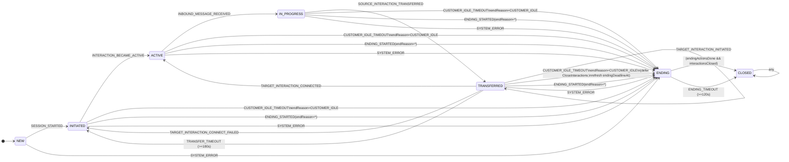
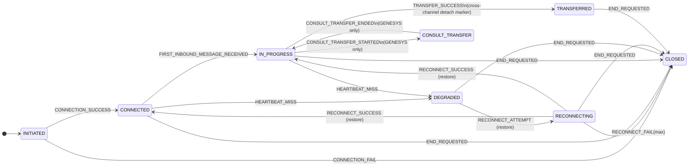
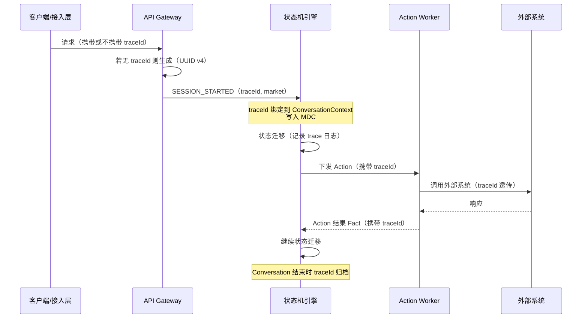

# AI Messaging Hub: 状态机管理与事件驱动编排详细设计

> 本稿已按最新口径更新：**Transfer 失败后不执行 rollback，Conversation 直接回到 INITIATED**。
> 本稿新增：**Multi-Market 配置支持** 与 **TraceId 全链路追踪**。
>
> **版本**: version5
> **最后更新**: 2026-08-31

---

## 简化原则

1. **Conversation 主状态仅保留**: `NEW / INITIATED / ACTIVE / IN_PROGRESS / TRANSFERRED / ENDING / CLOSED`
2. **移除 END_CHAT / SURVEY 主状态**: Survey 改为 `surveyStatus` 字段在 ENDING 内等待
3. **Interaction 保留 TRANSFERRED 状态**（跨渠道转接 source detach 标记），CONNECTED 即 ready
4. **Customer Idle 理想逻辑**: 所有可等待客户输入的状态超时 → `ENDING`，`endReason=CUSTOMER_IDLE`；`SURVEY_TIMEOUT` endReason 也统一为 `CUSTOMER_IDLE`
5. **TRANSFERRED 阶段 customer idle**: 进入 ENDING **但不取消转接**，刷新 ENDING deadline，等转接结果后再执行 CloseInteractions
6. **TRANSFERRED 最大执行窗口默认 180 秒**: 一直无结果则触发 transfer timeout，并同样直接回 INITIATED
7. **ENDING 不可逆**: 默认 120 秒强制收敛到 CLOSED；Action 失败/超时也必须最终关闭
8. **ENDING 必选 Action**: Notify、CloseInteractions（允许 deferred）

---

## 1. Overview

本文档定义 AI Messaging Hub 的核心状态机管理架构与事件驱动编排机制。系统采用双层状态机模型：

- **Interaction（通道/连接层）**: 连接建立、心跳、降级、重连、关闭；以及跨渠道转接时的 source detach 标记（TRANSFERRED）。
- **Conversation（业务会话层）**: 会话生命周期、跨渠道转接编排、Customer Idle 治理、ENDING/CLOSED 收敛、Survey（字段化）。

### 1.1 Multi-Market 支持

项目将部署到多个 market（如 CN、US、EU、APAC 等），状态机需支持 market 级别的差异化配置：

- **超时时间**：customerIdleSeconds、transferDeadlineSeconds、endingDeadlineSeconds 可按 market 配置
- **功能开关**：surveyEnabled、transferEnabled、genesysEnabled 等可按 market 开关
- **转接策略**：兜底路由、目标渠道选择可按 market 配置
- **配置热更新**：运行时可动态刷新 market 配置，无需重启

### 1.2 TraceId 全链路追踪

状态机的每次执行都必须携带 traceId，确保：

- **可追溯**：每次状态迁移、事件消费、Action 执行都可通过 traceId 串联
- **可审计**：完整记录状态机执行轨迹，支持事后审计和问题排查
- **分布式追踪**：与上游（网关/接入层）和下游（Action Worker/外部系统）的 traceId 贯通
- **MDC 集成**：traceId 写入日志 MDC，所有相关日志自动携带

---

## 2. 标准事件模型（Request / Command / Fact / Result）

| 层级 | 名称 | 定义 |
|------|------|------|
| **Request** | 请求 | 用户/坐席/Bot 的请求（不保证成功） |
| **Command** | 命令 | 编排器下发给执行器的指令（通过 Action 执行） |
| **Fact** | 事实 | 已发生且可审计的事实（状态机唯一输入） |
| **Result** | 结果 | Command 执行结果，可事实化为 Fact |

---

## 3. 状态模型（主状态 + 字段）

### 3.1 ConversationState（主状态）

```java
public enum ConversationState {
    NEW,
    INITIATED,      // 会话已创建，等待 interaction ready（或下游分配）
    ACTIVE,         // 当前绑定 interaction ready（InteractionState=CONNECTED）
    IN_PROGRESS,    // 已收到客户入站消息（INBOUND），业务进行中
    TRANSFERRED,    // CBOL 跨渠道转接阶段（in-flight，等待 target 结果或超时）
    ENDING,         // 不可逆：关闭前收尾编排（保证最终 CLOSED）
    CLOSED          // 最终收敛态
}
```

#### 3.1.1 Conversation 状态机图（Mermaid）



### 3.2 InteractionState（保留 TRANSFERRED）

```java
public enum InteractionState {
    INITIATED,
    CONNECTED,
    IN_PROGRESS,
    DEGRADED,
    RECONNECTING,
    CONSULT_TRANSFER, // GENESYS ONLY
    TRANSFERRED,      // cross-channel source detached marker
    CLOSED
}
```

#### 3.2.1 Interaction 状态机图（Mermaid）



### 3.3 Conversation 关键字段（字段化复杂流程）

#### 3.3.0 标识与追踪字段

| 字段 | 类型 | 说明 |
|------|------|------|
| `conversationId` | string | 会话唯一标识（UUID） |
| `market` | string | 市场标识（如 CN/US/EU/APAC），决定配置加载来源 |
| `traceId` | string | 全链路追踪 ID，会话创建时生成，贯穿整个生命周期 |
| `tenantId` | string | 租户标识（多租户场景，可选） |

#### 3.3.1 结束治理字段

| 字段 | 类型 | 说明 |
|------|------|------|
| `endReason` | enum | `CUSTOMER_IDLE / CUSTOMER_ENDED / AGENT_ENDED / BOT_ENDED / SYSTEM_ERROR` |
| `endingDeadlineAt` | timestamp | ENDING 强制收敛时间（默认 now+120s，可刷新） |
| `endingActionsDone` | bool | 收尾动作集合是否完成 |
| `interactionsClosed` | bool | 是否已收到 ALL_INTERACTIONS_ENDED |
| `closeInteractionsDeferred` | bool | 在 TRANSFERRED idle 进入 ENDING 时使用 |

#### 3.3.2 Customer Idle 字段

| 字段 | 类型 | 说明 |
|------|------|------|
| `lastInboundAt` | timestamp | 最后一条客户入站消息时间 |
| `activeAt` | timestamp | 进入 ACTIVE 的时间（无 inbound 时 idle 以此为起点） |

#### 3.3.3 Transfer 字段

| 字段 | 类型 | 说明 |
|------|------|------|
| `transferInFlight` | bool | 在 TRANSFERRED 为 true |
| `transferDeadlineAt` | timestamp | now+180s |
| `transferOutcome` | enum | `NONE / CONNECTED / FAILED / TIMEOUT` |

#### 3.3.4 Survey 字段（不再是主状态）

| 字段 | 类型 | 说明 |
|------|------|------|
| `surveyEligible` | bool | 是否符合发 survey 条件 |
| `surveyStatus` | enum | `NONE / SENT / SUBMITTED / TIMEOUT / SKIPPED` |

---

## 4. Facts（状态机输入事件）

> Normalizer 将外部事件归一为 Facts，Conversation/Interaction 状态机仅消费 Facts。

```java
public enum ConversationFactEvent {
    // lifecycle
    SESSION_STARTED,
    ALL_INTERACTIONS_ENDED,

    // readiness & messaging
    INTERACTION_BECAME_ACTIVE,
    INBOUND_MESSAGE_RECEIVED,

    // ending
    ENDING_STARTED,              // payload: endReason
    ENDING_ACTIONS_COMPLETED,
    ENDING_TIMEOUT,              // force close at ending deadline

    // customer idle (ideal rule)
    CUSTOMER_IDLE_TIMEOUT,

    // survey (field in ENDING)
    SURVEY_SUBMITTED,
    SURVEY_TIMEOUT,              // endReason=CUSTOMER_IDLE
    SURVEY_SKIPPED,

    // transfer (cross-channel)
    SOURCE_INTERACTION_TRANSFERRED,
    TARGET_INTERACTION_INITIATED,
    TARGET_INTERACTION_CONNECTED,
    TARGET_INTERACTION_CONNECT_FAILED, // no rollback; conversation returns INITIATED
    TRANSFER_TIMEOUT,                 // no rollback; conversation returns INITIATED

    // genesys same-channel / consult (conversation no-op)
    GENESYS_CONSULT_TRANSFER_STARTED,
    GENESYS_CONSULT_TRANSFER_ENDED,
    GENESYS_AGENT_TRANSFER_STARTED,
    GENESYS_AGENT_TRANSFER_COMPLETED,
    GENESYS_AGENT_TRANSFER_FAILED,

    // system
    SYSTEM_ERROR,

    // downstream availability
    DOWNSTREAM_UNAVAILABLE
}
```

---

## 4.5 Market 配置管理（Multi-Market Support）

### 4.5.1 设计目标

- 同一套状态机代码部署到多个 market，通过配置实现差异化行为
- 配置变更支持热更新，无需重启服务
- 配置加载失败时使用默认值，保证可用性
- 每个 Conversation 绑定一个 market，生命周期内不变

### 4.5.2 Market 配置数据模型

```java
public record StateMachineMarketConfig(
    String market,                          // 市场标识，如 "CN", "US", "EU"
    int version,                            // 配置版本号，用于乐观锁和审计
    long customerIdleSeconds,               // Customer Idle 超时时间（秒）
    long transferDeadlineSeconds,           // 跨渠道转接最大执行窗口（秒）
    long endingDeadlineSeconds,             // ENDING 强制收敛时间（秒）
    boolean surveyEnabled,                  // 是否启用 Survey
    boolean transferEnabled,                // 是否启用跨渠道转接
    boolean genesysEnabled,                 // 是否启用 Genesys 集成
    String fallbackRoutingStrategy,         // 转接失败兜底策略（如 "REASSIGN", "BOT_FALLBACK"）
    Map<String, String> customProperties    // market 自定义扩展属性
) {}
```

### 4.5.3 配置项清单与默认值

| 配置项 | 类型 | 默认值 | 说明 |
|--------|------|--------|------|
| `customerIdleSeconds` | long | 300 | Customer Idle 超时（5 分钟） |
| `transferDeadlineSeconds` | long | 180 | 跨渠道转接最大窗口（3 分钟） |
| `endingDeadlineSeconds` | long | 120 | ENDING 强制收敛（2 分钟） |
| `surveyEnabled` | bool | true | 是否发送满意度调查 |
| `transferEnabled` | bool | true | 是否允许跨渠道转接 |
| `genesysEnabled` | bool | false | 是否启用 Genesys 坐席集成 |
| `fallbackRoutingStrategy` | string | REASSIGN | 转接失败后策略 |
| `welcomeMessageEnabled` | bool | true | 是否发送欢迎消息 |
| `maxReconnectAttempts` | int | 3 | Interaction 最大重连次数 |
| `heartbeatIntervalSeconds` | int | 30 | 心跳间隔（秒） |

### 4.5.4 配置加载与缓存机制

```mermaid
flowchart TD
    A[Conversation 创建] --> B{从请求头/上下文提取 market}
    B --> C[MarketConfigService.getConfig(market)]
    C --> D{本地缓存是否存在且未过期?}
    D -->|是| E[返回缓存配置]
    D -->|否| F[从配置中心/DB 加载]
    F --> G{加载成功?}
    G -->|是| H[更新本地缓存 + 发布配置变更事件]
    H --> E
    G -->|否| I[返回默认配置 + 记录告警]
    I --> E
    E --> J[配置绑定到 ConversationContext]
```

### 4.5.5 配置热更新

- **配置中心推送**：通过配置中心（如 Apollo/Nacos）的 Webhook 或长轮询接收变更通知
- **缓存失效**：收到变更后主动失效对应 market 的缓存，下次请求时重新加载
- **灰度发布**：支持按比例灰度新配置（如 10% 流量使用新配置）
- **回滚机制**：配置版本化，异常时可快速回滚到上一版本
- **运行中会话**：已创建的 Conversation 继续使用创建时的配置快照，新会话使用新配置

### 4.5.6 配置在状态机中的使用

所有需要 market 差异化的逻辑，都通过 `ConversationContext.getMarketConfig()` 获取配置：

```java
// CustomerIdleMonitor 使用 market 级别的超时配置
long idleThreshold = context.getMarketConfig().customerIdleSeconds();
if (now - lastInboundAt > idleThreshold) {
    // trigger CUSTOMER_IDLE_TIMEOUT
}

// TransferMonitor 使用 market 级别的转接超时
long transferDeadline = context.getMarketConfig().transferDeadlineSeconds();

// Survey 发送前检查 market 开关
if (context.getMarketConfig().surveyEnabled()) {
    // send survey
}
```

---

## 4.6 TraceId 与全链路追踪

### 4.6.1 设计目标

- 每次状态机执行都有唯一 traceId，贯穿整个 Conversation 生命周期
- 事件、状态迁移、Action 执行、外部调用全部携带 traceId
- 与上游（接入层/网关）和下游（Action Worker/外部系统）的 traceId 贯通
- 日志 MDC 自动注入 traceId，便于 ELK 检索

### 4.6.2 TraceId 生成与传递



### 4.6.3 TraceContext 数据模型

```java
public record TraceContext(
    String traceId,           // 全链路追踪 ID（UUID v4）
    String conversationId,    // 会话 ID
    String market,            // 市场标识
    String spanId,            // 当前操作跨度 ID（每次状态迁移生成新 span）
    String parentSpanId,      // 父 span ID
    long startTime,           // 当前操作开始时间（epoch millis）
    Map<String, String> tags  // 自定义标签（如 eventType, fromState, toState）
) {}
```

### 4.6.4 状态机执行的 Trace 记录

每次 `fireEvent` 调用都生成一个 span，记录以下信息：

| 字段 | 说明 |
|------|------|
| `traceId` | 全链路追踪 ID |
| `spanId` | 当前状态迁移的 span ID |
| `parentSpanId` | 触发本次迁移的上游 span ID |
| `conversationId` | 会话 ID |
| `market` | 市场标识 |
| `eventType` | 触发的 Fact 类型 |
| `fromState` | 迁移前状态 |
| `toState` | 迁移后状态 |
| `guardResult` | 守卫条件结果（PASS/FAIL/SKIP） |
| `actionsExecuted` | 执行的 Action 列表 |
| `durationMs` | 本次迁移耗时 |
| `success` | 是否成功 |
| `errorMessage` | 失败时的错误信息 |

### 4.6.5 日志 MDC 集成

```java
public class StateMachineTraceInterceptor {

    public <S, E, C> S fireEventWithTrace(
            StateMachine<S, E, C> machine,
            S sourceState, E event, C context,
            TraceContext trace) {

        // 写入 MDC，所有后续日志自动携带
        MDC.put("traceId", trace.traceId());
        MDC.put("spanId", trace.spanId());
        MDC.put("conversationId", trace.conversationId());
        MDC.put("market", trace.market());
        MDC.put("eventType", event.toString());
        MDC.put("fromState", sourceState.toString());

        try {
            S targetState = machine.fireEvent(sourceState, event, context);
            MDC.put("toState", targetState.toString());
            log.info("State transition completed: {} -> {} on {}",
                    sourceState, targetState, event);
            return targetState;
        } catch (Exception e) {
            MDC.put("error", e.getMessage());
            log.error("State transition failed: {} on {}", sourceState, event, e);
            throw e;
        } finally {
            // 清理 MDC，避免线程复用时的 traceId 泄漏
            MDC.clear();
        }
    }
}
```

### 4.6.6 Action 执行的 Trace 透传

- Action Worker 从队列消费 Action 时，提取 traceId 并写入 MDC
- Action 执行过程中调用外部系统时，通过 HTTP Header（`X-Trace-Id`）或消息属性透传 traceId
- Action 执行完成后产出的 Fact 必须携带原始 traceId
- Action 执行失败重试时，保持同一 traceId，增加 `retryCount` 标签

### 4.6.7 Trace 数据的存储与查询

- **实时日志**：通过 ELK/Loki 按 traceId 检索完整执行链路
- **审计存储**：关键状态迁移（如 ENDING 进入、CLOSED 收敛）持久化到审计表
- **采样策略**：正常流量按比例采样（如 10%），异常流量全量记录
- **保留周期**：trace 日志保留 30 天，审计记录保留 1 年

---

## 5. Conversation 状态迁移规则（权威表）

### 5.1 基础生命周期

| 当前状态 | Fact | 目标状态 | 备注（字段/Action） |
|----------|------|----------|---------------------|
| NEW | SESSION_STARTED | INITIATED | Action: `InitiateDownstreamAssignment` |
| INITIATED | INTERACTION_BECAME_ACTIVE | ACTIVE | set `activeAt=now`; Action: `SendWelcomeMessage` |
| ACTIVE | INBOUND_MESSAGE_RECEIVED | IN_PROGRESS | set `lastInboundAt=now`; Action: `RecordFirstResponse` |
| INITIATED | DOWNSTREAM_UNAVAILABLE | INITIATED | Action: `NotifySystemUnavailable` |

### 5.2 跨渠道转接（TRANSFERRED，含 180s deadline）

> 最新口径: transfer 失败/超时后**不执行 rollback**，Conversation 直接回 `INITIATED`（重新分配/兜底）。

| 当前状态 | Fact | 目标状态 | 备注（字段/Action） |
|----------|------|----------|---------------------|
| IN_PROGRESS | SOURCE_INTERACTION_TRANSFERRED | TRANSFERRED | set `transferInFlight=true`; set `transferDeadlineAt=now+transferDeadlineSeconds(默认180s)` |
| TRANSFERRED | TARGET_INTERACTION_INITIATED | TRANSFERRED | Action: `ConnectTargetInteractionCmd` |
| TRANSFERRED | TARGET_INTERACTION_CONNECTED | ACTIVE | set `transferInFlight=false`; set `transferOutcome=CONNECTED` |
| TRANSFERRED | TARGET_INTERACTION_CONNECT_FAILED | INITIATED | set `transferInFlight=false`; set `transferOutcome=FAILED`; Action: `InitiateDownstreamAssignment` 或兜底 |
| TRANSFERRED | TRANSFER_TIMEOUT | INITIATED | set `transferInFlight=false`; set `transferOutcome=TIMEOUT`; Action: `InitiateDownstreamAssignment` 或兜底 |

### 5.3 进入 ENDING（统一收敛入口）

| 当前状态 | Fact | 目标状态 | 备注 |
|----------|------|----------|------|
| INITIATED/ACTIVE/IN_PROGRESS/TRANSFERRED | ENDING_STARTED | ENDING | set endReason; 触发 ENDING actions |
| ANY(except CLOSED) | SYSTEM_ERROR | ENDING | set endReason=SYSTEM_ERROR; 触发 ENDING actions |

### 5.4 Customer Idle（理想规则：全覆盖进入 ENDING，reason=customer idle）

| 当前状态 | Fact | 目标状态 | 备注 |
|----------|------|----------|------|
| INITIATED | CUSTOMER_IDLE_TIMEOUT | ENDING | endReason=CUSTOMER_IDLE; ENDING actions |
| ACTIVE | CUSTOMER_IDLE_TIMEOUT | ENDING | endReason=CUSTOMER_IDLE; ENDING actions |
| IN_PROGRESS | CUSTOMER_IDLE_TIMEOUT | ENDING | endReason=CUSTOMER_IDLE; ENDING actions |
| TRANSFERRED | CUSTOMER_IDLE_TIMEOUT | ENDING | 特殊：不取消转接；刷新 endingDeadlineAt；延迟 CloseInteractions |
| ENDING | CUSTOMER_IDLE_TIMEOUT | ENDING | no-op（可确认 reason=customer idle） |

---

## 6. Transfer Flow（含 180s timeout 与 TRANSFERRED idle→ENDING 特殊处理）

```mermaid
flowchart TD
    A[Conversation IN_PROGRESS\n(source interaction serving)] -->|Fact: SOURCE_INTERACTION_TRANSFERRED| B[Conversation TRANSFERRED\ntransferInFlight=true\nset transferDeadlineAt=now+180s]

    B -->|Fact: TARGET_INTERACTION_INITIATED| B

    B -->|Fact: TARGET_INTERACTION_CONNECTED| C[Conversation ACTIVE\ntransferInFlight=false\ntransferOutcome=CONNECTED]

    B -->|Fact: TARGET_INTERACTION_CONNECT_FAILED| D[Conversation INITIATED\ntransferInFlight=false\ntransferOutcome=FAILED\nAction: InitiateDownstreamAssignment or fallback]

    B -->|TransferMonitor: >=180s| E[Fact: TRANSFER_TIMEOUT]
    E --> D

    %% Customer idle during transfer: enter ENDING but don't cancel transfer
    B -->|Fact: CUSTOMER_IDLE_TIMEOUT| F[Conversation ENDING\nendReason=CUSTOMER_IDLE\nNotify now\nCloseInteractions deferred\nendingDeadlineAt=max(now+120s, transferDeadlineAt+120s)]

    %% After entering ENDING, transfer result may still arrive; used to release deferred close
    F -->|Fact: TARGET_INTERACTION_CONNECTED| G[Release defer\nAction: CloseInteractions]
    F -->|Fact: TARGET_INTERACTION_CONNECT_FAILED| G
    F -->|Fact: TRANSFER_TIMEOUT| G

    G --> H[Wait ALL_INTERACTIONS_ENDED & ENDING_ACTIONS_COMPLETED\nor ENDING_TIMEOUT]
```

---

## 7. ENDING（不可逆 + 必达 CLOSED + Survey 字段化）

### 7.1 ENDING 不可逆

- ENDING 不回退到任何业务态。
- ENDING 内除"关闭相关 Facts"外，其余 Facts 仅做 no-op + audit（必要时更新字段）。

### 7.2 ENDING 收敛规则（两条件 + 超时强制）

- `endingActionsDone=true`（ENDING_ACTIONS_COMPLETED）
- `interactionsClosed=true`（ALL_INTERACTIONS_ENDED）
- 两者都 true → CLOSED
- 或 ENDING_TIMEOUT → 强制 CLOSED

| 当前状态 | Fact | 目标状态 | 备注 |
|----------|------|----------|------|
| ENDING | ENDING_ACTIONS_COMPLETED | ENDING/CLOSED | set `endingActionsDone=true`; 若 `interactionsClosed=true` 则 CLOSED |
| ENDING | ALL_INTERACTIONS_ENDED | ENDING/CLOSED | set `interactionsClosed=true`; 若 `endingActionsDone=true` 则 CLOSED |
| ENDING | ENDING_TIMEOUT | CLOSED | 强制 close，记录告警原因 |

### 7.3 TRANSFERRED idle → ENDING（不取消转接）处理

当 `TRANSFERRED + CUSTOMER_IDLE_TIMEOUT → ENDING` 时：

- 立即 Action: Notify
- set `closeInteractionsDeferred=true`
- 刷新 `endingDeadlineAt`（方案 B）：
  - `endingDeadlineAt = max(now + endingDeadlineSeconds, transferDeadlineAt + endingDeadlineSeconds)`
- ENDING 内允许消费 transfer 结果（CONNECTED/FAILED/TIMEOUT）仅用于解除 defer（不改变状态）：
  - 解除 defer: `closeInteractionsDeferred=false`，触发 Action: CloseInteractions（若此前未执行）

### 7.4 Survey 字段化（不再进入 SURVEY 状态）

进入 ENDING 时若 `surveyEligible=true`：
- Action: SendSurvey
- `surveyStatus=SENT`

收到 survey facts：
- SURVEY_SUBMITTED → `surveyStatus=SUBMITTED`
- SURVEY_SKIPPED → `surveyStatus=SKIPPED`
- SURVEY_TIMEOUT → `surveyStatus=TIMEOUT` 且 **endReason=CUSTOMER_IDLE**

### 7.5 ENDING Flow（Mermaid）

```mermaid
flowchart TD
    A[Any state except CLOSED] -->|Fact: ENDING_STARTED(endReason=*)| B[ENDING (irreversible)\nPersist endReason\nSet endingDeadlineAt=now+120s]
    A -->|Fact: CUSTOMER_IDLE_TIMEOUT| B2[ENDING (irreversible)\nendReason=CUSTOMER_IDLE\nSet/refresh endingDeadlineAt]
    A -->|Fact: SYSTEM_ERROR| B3[ENDING (irreversible)\nendReason=SYSTEM_ERROR]

    %% On entry actions
    B --> C[Action: Notify (mandatory)]
    B2 --> C
    B3 --> C
    B --> D{closeInteractionsDeferred?}
    B2 --> D
    B3 --> D
    D -->|no| E[Action: CloseInteractions (mandatory)]
    D -->|yes| F[Defer CloseInteractions\nuntil transfer outcome or survey resolved\nor ENDING_TIMEOUT]

    %% Survey as field (no SURVEY state)
    C --> S{surveyEligible?}
    S -->|yes| S1[Action: SendSurveyCommand\nsurveyStatus=SENT]
    S -->|no| S2[surveyStatus=NONE]

    S1 -->|Fact: SURVEY_SUBMITTED| S3[surveyStatus=SUBMITTED]
    S1 -->|Fact: SURVEY_SKIPPED| S4[surveyStatus=SKIPPED]
    S1 -->|Fact: SURVEY_TIMEOUT| S5[surveyStatus=TIMEOUT\nendReason=CUSTOMER_IDLE]

    %% Convergence signals
    E --> X{Got ALL_INTERACTIONS_ENDED?}
    F --> X
    S2 --> X
    S3 --> X
    S4 --> X
    S5 --> X

    X -->|Fact: ALL_INTERACTIONS_ENDED| Y[interactionsClosed=true]
    X -->|Fact: ENDING_ACTIONS_COMPLETED| Z[endingActionsDone=true]

    Y --> W{endingActionsDone?}
    Z --> W
    W -->|yes| CLOSED[CLOSED]
    W -->|no| WAIT[ENDING waiting]

    WAIT -->|EndingMonitor: >= endingDeadlineAt| TIMEOUT[Fact: ENDING_TIMEOUT]
    TIMEOUT --> CLOSED
```

---

## 8. Interaction 状态机规则（简化版）

### 8.1 基础连接/消息/重连

- INITIATED → CONNECTED → IN_PROGRESS（由 inbound 推进）
- DEGRADED/RECONNECTING 用于弹性恢复
- CLOSED 为终态

> 因最新口径 transfer 失败不回滚，Interaction 不要求从 TRANSFERRED 回 IN_PROGRESS；TRANSFERRED 资源回收由 CloseInteractions 或通道侧策略关闭并回收。

---

## 9. Monitor / Timer（确保理想规则可落地）

> 所有超时阈值均从 `ConversationContext.getMarketConfig()` 获取，支持 market 级别差异化配置。

### 9.1 CustomerIdleMonitor

- 覆盖状态: `INITIATED / ACTIVE / IN_PROGRESS / TRANSFERRED`
- 超时阈值: `marketConfig.customerIdleSeconds()`（默认 300s，可按 market 配置）
- 条件:
  - 有 inbound: `now - lastInboundAt > customerIdleSeconds`
  - 无 inbound: `now - activeAt > customerIdleSeconds`（若尚未 ACTIVE，可用 sessionStartedAt）
- 触发 Fact: `CUSTOMER_IDLE_TIMEOUT`
- Trace: 触发时记录 `idleDuration`, `idleStartAt`, `marketConfigVersion`

### 9.2 TransferMonitor（TRANSFERRED 超时）

- 状态: TRANSFERRED
- 超时阈值: `marketConfig.transferDeadlineSeconds()`（默认 180s，可按 market 配置）
- 条件: `now >= transferDeadlineAt` 且仍 `transferInFlight=true`
- 触发 Fact: `TRANSFER_TIMEOUT`（Conversation 直接回 INITIATED）
- 注意: 若 `marketConfig.transferEnabled() == false`，则不进入 TRANSFERRED 状态

### 9.3 EndingMonitor（ENDING 超时）

- 状态: ENDING
- 超时阈值: `marketConfig.endingDeadlineSeconds()`（默认 120s，可按 market 配置）
- 条件: `now >= endingDeadlineAt`
- 触发 Fact: `ENDING_TIMEOUT`（强制 CLOSED）
- Trace: 强制关闭时记录 `endingDuration`, `pendingActions`, `interactionsClosed`

---

## 10. Action 机制（ACK 不等待执行）

### 10.1 组件

- **Conversation Engine**: 消费 Facts → 更新状态/字段 → 写 Actions → ACK
- **Action Worker**: 执行 Actions（重试/熔断/幂等），并在必要时产出 Facts（如 ENDING_ACTIONS_COMPLETED）

### 10.2 Action 数据模型（含 TraceId）

```java
public record StateMachineAction(
    String actionId,           // Action 唯一标识（UUID）
    String actionType,         // Action 类型（如 NOTIFY, CLOSE_INTERACTIONS, SEND_SURVEY）
    String conversationId,     // 会话 ID
    String market,             // 市场标识
    String traceId,            // 全链路追踪 ID（从触发事件透传）
    String parentSpanId,       // 触发此 Action 的状态迁移 span ID
    Map<String, Object> payload, // Action 执行参数
    long createdAt,            // 创建时间
    int maxRetries,            // 最大重试次数
    int retryCount             // 当前重试次数
) {}
```

### 10.3 Action 执行的 Trace 透传

1. **Engine 下发 Action**：从当前 TraceContext 提取 traceId，写入 Action 记录
2. **Worker 消费 Action**：从 Action 记录提取 traceId，写入 MDC
3. **Worker 执行 Action**：
   - 调用外部系统时，通过 HTTP Header `X-Trace-Id` 或消息属性透传 traceId
   - 执行日志自动携带 traceId（MDC）
4. **Worker 产出 Fact**：Action 执行结果 Fact 必须携带原始 traceId
5. **重试保持 traceId**：Action 重试时保持同一 traceId，增加 `retryCount` 标签

### 10.4 ENDING 必选 Actions（强制）

- **Notify**（必选）
- **CloseInteractions**（必选；可延迟）

---

## 11. 场景对齐验证（按最新"失败不回滚"口径）

### 11.1 用户进入后不说话直到超时（CUSTOMER_IDLE）

`NEW→INITIATED→ACTIVE→CUSTOMER_IDLE_TIMEOUT→ENDING(endReason=CUSTOMER_IDLE)→CLOSED`

### 11.2 Bot → Agent 转接失败（不回滚，直接回 INITIATED）

`IN_PROGRESS→SOURCE_INTERACTION_TRANSFERRED→TRANSFERRED→TARGET_INTERACTION_CONNECT_FAILED→INITIATED→...`（重新分配/兜底）

### 11.3 TRANSFERRED 180s 超时（不回滚，回 INITIATED）

`TRANSFERRED→TRANSFER_TIMEOUT→INITIATED→...`（重新分配/兜底）

### 11.4 TRANSFERRED 阶段 customer idle：进入 ENDING 不取消转接

`TRANSFERRED→CUSTOMER_IDLE_TIMEOUT→ENDING(defer CloseInteractions, refresh deadline)→(transfer result arrives or timeout)→CloseInteractions→CLOSED`

### 11.5 CBOL new 成功但 agent/bot 全 down

`NEW→INITIATED→DOWNSTREAM_UNAVAILABLE (stay)→NotifySystemUnavailable→CUSTOMER_IDLE_TIMEOUT→ENDING→CLOSED`

### 11.6 Survey timeout endReason 统一 CUSTOMER_IDLE

ENDING 内 `SURVEY_TIMEOUT`: `surveyStatus=TIMEOUT` 且 `endReason=CUSTOMER_IDLE`

### 11.7 Multi-Market 差异化配置验证

**场景**: CN market 配置 customerIdle=180s，US market 配置 customerIdle=300s

```
CN Conversation: NEW→INITIATED→ACTIVE→(180s 无消息)→CUSTOMER_IDLE_TIMEOUT→ENDING→CLOSED
US Conversation: NEW→INITIATED→ACTIVE→(180s 无消息，未超时)→(300s 无消息)→CUSTOMER_IDLE_TIMEOUT→ENDING→CLOSED
```

验证点：
- 两个 market 的 Conversation 使用同一套状态机代码
- 超时时间由各自的 marketConfig 决定
- 配置热更新后，新创建的 Conversation 使用新配置

### 11.8 TraceId 全链路追踪验证

**场景**: 从用户发送消息到 Conversation 关闭，验证 traceId 贯穿全链路

```
用户请求(traceId=abc-123)
  → SESSION_STARTED Fact(traceId=abc-123)
    → Conversation Engine 状态迁移(spanId=span-001, traceId=abc-123)
      → Action: SendWelcomeMessage(traceId=abc-123)
        → 外部消息系统调用(Header X-Trace-Id=abc-123)
  → INBOUND_MESSAGE_RECEIVED Fact(traceId=abc-123)
    → 状态迁移(spanId=span-002, parentSpanId=span-001)
  → ...
  → ENDING_STARTED Fact(traceId=abc-123)
    → Action: Notify(traceId=abc-123)
    → Action: CloseInteractions(traceId=abc-123)
  → CLOSED (traceId=abc-123 归档)
```

验证点：
- 所有日志可通过 `traceId=abc-123` 检索完整链路
- 每次状态迁移有独立 spanId，且 parentSpanId 正确关联
- Action 执行和外部调用都携带同一 traceId
- Conversation 关闭后 traceId 可用于审计查询

---

## 附录：版本变更记录

### version5 vs version4 变更

| 决策点 | version4 | version5 | 变更理由 |
|--------|----------|----------|----------|
| Multi-Market 支持 | 无 | 新增 Market 配置管理，支持 market 级别差异化配置 | 项目部署到多个 market，需差异化超时时间、功能开关、转接策略 |
| TraceId 追踪 | 无 | 新增全链路 TraceId，贯穿事件、状态迁移、Action、外部调用 | 可追溯、可审计、分布式追踪、问题排查 |
| Conversation 字段 | 无标识字段 | 新增 conversationId、market、traceId、tenantId | 支持多 market 和追踪 |
| Monitor 超时配置 | 硬编码默认值 | 从 marketConfig 动态获取，支持热更新 | 不同 market 需不同超时阈值 |
| Action 数据模型 | 无 traceId | 新增 traceId、parentSpanId、market 字段 | Action 执行需透传追踪信息 |
| 配置热更新 | 无 | 支持配置中心推送、缓存失效、灰度发布、版本回滚 | 运行时动态调整配置无需重启 |

### version4 vs version3 变更

| 决策点 | version3 | version4 | 变更理由 |
|--------|----------|----------|----------|
| Transfer 失败处理 | 执行 RollbackToSourceCmd，回 ACTIVE | 直接回 INITIATED（重新分配/兜底） | 简化流程，避免回滚复杂度 |
| transferOutcome | NONE/CONNECTED/CONNECT_FAILED/ROLLBACK_OK/ROLLBACK_FAILED/TIMEOUT | NONE/CONNECTED/FAILED/TIMEOUT | 移除回滚相关状态 |
| endReason | CUSTOMER_ENDED/AGENT_ENDED/BOT_ENDED/SYSTEM_ERROR/CUSTOMER_IDLE | CUSTOMER_IDLE/CUSTOMER_ENDED/AGENT_ENDED/BOT_ENDED/SYSTEM_ERROR | 统一 CUSTOMER_IDLE 为首选 |
| Interaction TRANSFERRED 回滚 | 回 IN_PROGRESS | 不要求回滚，由 CloseInteractions 或通道侧回收 | 与 Conversation 口径一致 |
| ROLLBACK_TO_SOURCE_* Facts | 存在 | 移除（Conversation 不再消费） | 简化事件集合 |

---

*AI Messaging Hub 状态机管理与事件驱动编排详细设计 — version5 — 2026-08-31*
