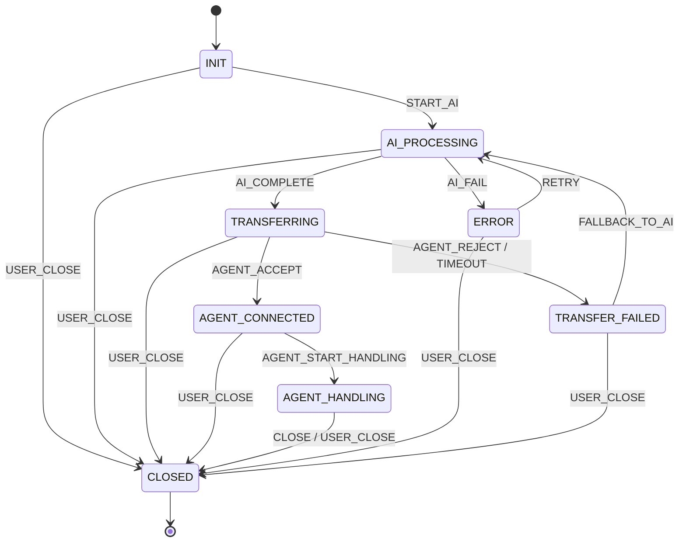

# State Machine Development Guidelines

> Best practices for designing, implementing, and testing state machines in CBOL messaging system. Based on the custom lightweight state machine design (stateless engine, table-driven, zero external dependencies).

## Core Design Principles

### Stateless Engine (Mandatory)

```java
// ✅ Good - stateless engine (only stores transition rules, current state injected)
public class StateMachine<S, E, C> {
    // Only stores transition rules (immutable after build)
    private final Map<StateEventPair<S, E>, Transition<S, E, C>> transitions = new ConcurrentHashMap<>();

    // Current state is injected by caller, NOT stored in engine
    public S fire(S currentState, E event, C context) {
        Transition<S, E, C> transition = transitions.get(new StateEventPair<>(currentState, event));
        if (transition == null) {
            throw new IllegalStateTransitionException(currentState, event);
        }
        return transition.execute(currentState, event, context);
    }
}

// Usage: caller manages state persistence
public class ConversationService {
    private final StateMachine<ConversationState, ConversationEvent, ConversationContext> stateMachine;
    private final ConversationRepository repository;

    public void handleEvent(Long conversationId, ConversationEvent event) {
        Conversation conversation = repository.findById(conversationId).orElseThrow();
        ConversationState newState = stateMachine.fire(conversation.getState(), event, buildContext(conversation));
        conversation.setState(newState);
        repository.save(conversation);
    }
}

// ❌ Bad - stateful engine (stores current state, not thread-safe, not scalable)
public class StatefulStateMachine<S, E> {
    private S currentState;  // stored in engine = bad!
    public void fire(E event) {
        // uses this.currentState
    }
}
// Problems: one instance per entity (memory), not thread-safe, can't scale horizontally
```

### Table-Driven Transitions (O(1) Lookup)

```java
// ✅ Good - ConcurrentHashMap for O(1) transition lookup
public class StateMachineBuilder<S, E, C> {
    private final Map<StateEventPair<S, E>, Transition<S, E, C>> transitions = new ConcurrentHashMap<>();

    public StateMachineBuilder<S, E, C> transition(S from, E event, S to) {
        transitions.put(new StateEventPair<>(from, event),
            Transition.<S, E, C>builder().from(from).event(event).to(to).build());
        return this;
    }

    public StateMachineBuilder<S, E, C> transition(S from, E event, S to,
                                                      Consumer<C> action) {
        transitions.put(new StateEventPair<>(from, event),
            Transition.<S, E, C>builder().from(from).event(event).to(to).action(action).build());
        return this;
    }

    public StateMachine<S, E, C> build() {
        return new StateMachine<>(Collections.unmodifiableMap(transitions));
    }
}

// ❌ Bad - if-else chain (O(n), hard to maintain)
public ConversationState handleEvent(ConversationState state, ConversationEvent event) {
    if (state == INIT && event == START_AI) return AI_PROCESSING;
    else if (state == AI_PROCESSING && event == AI_COMPLETE) return TRANSFERRING;
    else if (state == AI_PROCESSING && event == AI_FAIL) return ERROR;
    // ... 50 more lines
    else throw new IllegalStateException();
}
```

### Zero External Dependencies

```java
// ✅ Good - no external dependencies, pure Java
// pom.xml: no spring-statemachine, no cola-statemachine dependencies
<dependency>
    <!-- none needed -->
</dependency>

// State machine uses only:
// - java.util.Map / ConcurrentHashMap
// - java.util.function.Consumer / Function
// - java.util.Objects
// - Custom exceptions

// ❌ Bad - heavy external dependencies
<dependency>
    <groupId>org.springframework.statemachine</groupId>
    <artifactId>spring-statemachine-core</artifactId>
    <!-- 10+ transitive dependencies, complex API, overkill for our use case -->
</dependency>
```

## State Machine Definition

### Conversation State Machine (CBOL)

```java
// ✅ Good - declarative state machine definition
@Configuration
public class ConversationStateMachineConfig {

    @Bean
    public StateMachine<ConversationState, ConversationEvent, ConversationContext> conversationStateMachine() {
        return StateMachineBuilder.<ConversationState, ConversationEvent, ConversationContext>create()
            // INIT → AI_PROCESSING
            .transition(INIT, START_AI, AI_PROCESSING, ctx -> {
                ctx.getAiService().process(ctx.getConversationId());
            })
            // AI_PROCESSING → TRANSFERRING
            .transition(AI_PROCESSING, AI_COMPLETE, TRANSFERRING, ctx -> {
                ctx.getTransferService().initiate(ctx.getConversationId(), ctx.getAgentId());
            })
            // AI_PROCESSING → ERROR
            .transition(AI_PROCESSING, AI_FAIL, ERROR, ctx -> {
                ctx.getNotificationService().notifyError(ctx.getConversationId(), ctx.getError());
            })
            // TRANSFERRING → AGENT_CONNECTED
            .transition(TRANSFERRING, AGENT_ACCEPT, AGENT_CONNECTED, ctx -> {
                ctx.getSessionService().bindAgent(ctx.getConversationId(), ctx.getAgentId());
            })
            // TRANSFERRING → TRANSFER_FAILED
            .transition(TRANSFERRING, AGENT_REJECT, TRANSFER_FAILED, ctx -> {
                ctx.getAiService().reprocess(ctx.getConversationId());
            })
            // TRANSFERRING → TRANSFER_TIMEOUT
            .transition(TRANSFERRING, TIMEOUT, TRANSFER_FAILED, ctx -> {
                ctx.getAiService().reprocess(ctx.getConversationId());
            })
            // AGENT_CONNECTED → AGENT_HANDLING
            .transition(AGENT_CONNECTED, AGENT_START_HANDLING, AGENT_HANDLING)
            // AGENT_HANDLING → CLOSED
            .transition(AGENT_HANDLING, CLOSE, CLOSED, ctx -> {
                ctx.getArchiveService().archive(ctx.getConversationId());
            })
            // Any → CLOSED (user closes)
            .transition(INIT, USER_CLOSE, CLOSED)
            .transition(AI_PROCESSING, USER_CLOSE, CLOSED)
            .transition(TRANSFERRING, USER_CLOSE, CLOSED)
            .transition(AGENT_CONNECTED, USER_CLOSE, CLOSED)
            .transition(AGENT_HANDLING, USER_CLOSE, CLOSED)
            // ERROR → AI_PROCESSING (retry)
            .transition(ERROR, RETRY, AI_PROCESSING, ctx -> {
                ctx.getAiService().process(ctx.getConversationId());
            })
            // TRANSFER_FAILED → AI_PROCESSING (fallback to AI)
            .transition(TRANSFER_FAILED, FALLBACK_TO_AI, AI_PROCESSING, ctx -> {
                ctx.getAiService().process(ctx.getConversationId());
            })
            .build();
    }
}
```

### State & Event Enums

```java
// ✅ Good - explicit state enum with descriptions
public enum ConversationState {
    INIT("Initial state, conversation created"),
    AI_PROCESSING("AI is processing the message"),
    TRANSFERRING("Transferring to human agent"),
    AGENT_CONNECTED("Human agent connected, waiting to start handling"),
    AGENT_HANDLING("Human agent is handling the conversation"),
    TRANSFER_FAILED("Transfer to agent failed"),
    CLOSED("Conversation closed"),
    ERROR("Error occurred"),
    TIMEOUT("Operation timed out");

    private final String description;
    ConversationState(String description) { this.description = description; }
    public String getDescription() { return description; }
}

// ✅ Good - explicit event enum
public enum ConversationEvent {
    START_AI,
    AI_COMPLETE,
    AI_FAIL,
    AGENT_ACCEPT,
    AGENT_REJECT,
    AGENT_START_HANDLING,
    CLOSE,
    USER_CLOSE,
    TIMEOUT,
    RETRY,
    FALLBACK_TO_AI
}
```

### Context Object

```java
// ✅ Good - immutable context for transition actions
@Value
@Builder
public class ConversationContext {
    Long conversationId;
    Long userId;
    Long agentId;
    String error;

    // Service references (or use a service locator)
    AiService aiService;
    TransferService transferService;
    SessionService sessionService;
    NotificationService notificationService;
    ArchiveService archiveService;
}

// ❌ Bad - mutable context, everything in one map
public class ConversationContext {
    public Map<String, Object> data = new HashMap<>(); // untyped, mutable
    public Map<String, Object> services = new HashMap<>(); // untyped
}
```

## Transition Actions

### Action Best Practices

```java
// ✅ Good - actions are side-effect operations, not state changes
.transition(AI_PROCESSING, AI_COMPLETE, TRANSFERRING, ctx -> {
    // Action: initiate transfer (side effect)
    // State change (AI_PROCESSING → TRANSFERRING) is handled by engine
    ctx.getTransferService().initiate(ctx.getConversationId(), ctx.getAgentId());
})

// ✅ Good - actions should be idempotent (can be retried safely)
public void initiate(Long conversationId, Long agentId) {
    // Check if already initiated (idempotency)
    if (transferRepository.existsByConversationIdAndStatus(conversationId, "INITIATED")) {
        return;
    }
    transferRepository.save(Transfer.builder()
        .conversationId(conversationId)
        .agentId(agentId)
        .status("INITIATED")
        .build());
    // notify agent
}

// ❌ Bad - action changes state directly (bypasses engine)
.transition(AI_PROCESSING, AI_COMPLETE, TRANSFERRING, ctx -> {
    Conversation conv = ctx.getRepository().findById(ctx.getConversationId());
    conv.setState(TRANSFERRING);  // ❌ state change in action!
    ctx.getRepository().save(conv);
})
```

### Guard Conditions

```java
// ✅ Good - guard conditions before transition
public class GuardedTransition<S, E, C> implements Transition<S, E, C> {
    private final Predicate<C> guard;
    private final Transition<S, E, C> delegate;

    @Override
    public S execute(S from, E event, C context) {
        if (!guard.test(context)) {
            throw new GuardConditionFailedException(from, event);
        }
        return delegate.execute(from, event, context);
    }
}

// Usage
.transitionWithGuard(AGENT_CONNECTED, AGENT_START_HANDLING, AGENT_HANDLING,
    ctx -> ctx.getAgentId() != null,  // guard: agent must be assigned
    ctx -> { /* action */ })

// ❌ Bad - no guards, invalid transitions can happen
.transition(AGENT_CONNECTED, AGENT_START_HANDLING, AGENT_HANDLING)
// Can fire even if no agent is assigned!
```

## Testing State Machines

### Unit Tests

```java
// ✅ Good - exhaustive state transition tests
@ExtendWith(MockitoExtension.class)
class ConversationStateMachineTest {

    private StateMachine<ConversationState, ConversationEvent, ConversationContext> stateMachine;

    @BeforeEach
    void setUp() {
        stateMachine = new ConversationStateMachineConfig().conversationStateMachine();
    }

    @Test
    @DisplayName("INIT + START_AI → AI_PROCESSING")
    void initToAiProcessing() {
        ConversationState result = stateMachine.fire(INIT, START_AI, mockContext());
        assertThat(result).isEqualTo(AI_PROCESSING);
    }

    @Test
    @DisplayName("AI_PROCESSING + AI_COMPLETE → TRANSFERRING")
    void aiProcessingToTransferring() {
        ConversationState result = stateMachine.fire(AI_PROCESSING, AI_COMPLETE, mockContext());
        assertThat(result).isEqualTo(TRANSFERRING);
    }

    @Test
    @DisplayName("AI_PROCESSING + AI_FAIL → ERROR")
    void aiProcessingToError() {
        ConversationState result = stateMachine.fire(AI_PROCESSING, AI_FAIL, mockContext());
        assertThat(result).isEqualTo(ERROR);
    }

    @Test
    @DisplayName("Invalid transition throws exception")
    void invalidTransitionThrows() {
        assertThatThrownBy(() -> stateMachine.fire(INIT, CLOSE, mockContext()))
            .isInstanceOf(IllegalStateTransitionException.class)
            .hasMessageContaining("INIT")
            .hasMessageContaining("CLOSE");
    }

    @Test
    @DisplayName("All states have at least one outgoing transition")
    void allStatesHaveOutgoingTransitions() {
        for (ConversationState state : ConversationState.values()) {
            boolean hasOutgoing = Arrays.stream(ConversationEvent.values())
                .anyMatch(event -> {
                    try {
                        stateMachine.fire(state, event, mockContext());
                        return true;
                    } catch (IllegalStateTransitionException e) {
                        return false;
                    }
                });
            assertThat(hasOutgoing)
                .withFailMessage("State %s has no outgoing transitions", state)
                .isTrue();
        }
    }

    @Test
    @DisplayName("Action is executed on valid transition")
    void actionExecutedOnTransition() {
        AiService mockAiService = mock(AiService.class);
        ConversationContext ctx = ConversationContext.builder()
            .conversationId(1L)
            .aiService(mockAiService)
            .build();

        stateMachine.fire(INIT, START_AI, ctx);

        verify(mockAiService).process(1L);
    }
}
```

### Integration Tests

```java
// ✅ Good - integration test with real service
@SpringBootTest
class ConversationStateMachineIntegrationTest {

    @Autowired
    private StateMachine<ConversationState, ConversationEvent, ConversationContext> stateMachine;

    @Autowired
    private ConversationRepository conversationRepository;

    @Test
    @DisplayName("Full conversation lifecycle: INIT → AI → TRANSFER → AGENT → CLOSED")
    void fullConversationLifecycle() {
        // Given
        Conversation conversation = conversationRepository.save(Conversation.builder()
            .state(INIT)
            .userId(1L)
            .build());

        // When + Then
        fireAndVerify(conversation, START_AI, AI_PROCESSING);
        fireAndVerify(conversation, AI_COMPLETE, TRANSFERRING);
        fireAndVerify(conversation, AGENT_ACCEPT, AGENT_CONNECTED);
        fireAndVerify(conversation, AGENT_START_HANDLING, AGENT_HANDLING);
        fireAndVerify(conversation, CLOSE, CLOSED);
    }

    private void fireAndVerify(Conversation conversation, ConversationEvent event,
                                ConversationState expectedState) {
        ConversationState newState = stateMachine.fire(conversation.getState(), event,
            ConversationContext.builder().conversationId(conversation.getId()).build());
        assertThat(newState).isEqualTo(expectedState);
        conversation.setState(newState);
        conversationRepository.save(conversation);
    }
}
```

## Visualization & Documentation

### State Diagram (Mermaid)



### Transition Table

| From State | Event | To State | Action | Guard |
|-----------|-------|----------|--------|-------|
| INIT | START_AI | AI_PROCESSING | AI process | - |
| INIT | USER_CLOSE | CLOSED | - | - |
| AI_PROCESSING | AI_COMPLETE | TRANSFERRING | Initiate transfer | - |
| AI_PROCESSING | AI_FAIL | ERROR | Notify error | - |
| AI_PROCESSING | USER_CLOSE | CLOSED | - | - |
| TRANSFERRING | AGENT_ACCEPT | AGENT_CONNECTED | Bind agent | - |
| TRANSFERRING | AGENT_REJECT | TRANSFER_FAILED | Reprocess AI | - |
| TRANSFERRING | TIMEOUT | TRANSFER_FAILED | Reprocess AI | - |
| TRANSFERRING | USER_CLOSE | CLOSED | - | - |
| AGENT_CONNECTED | AGENT_START_HANDLING | AGENT_HANDLING | - | agentId != null |
| AGENT_CONNECTED | USER_CLOSE | CLOSED | - | - |
| AGENT_HANDLING | CLOSE | CLOSED | Archive | - |
| AGENT_HANDLING | USER_CLOSE | CLOSED | - | - |
| ERROR | RETRY | AI_PROCESSING | AI process | retryCount < 3 |
| ERROR | USER_CLOSE | CLOSED | - | - |
| TRANSFER_FAILED | FALLBACK_TO_AI | AI_PROCESSING | AI process | - |
| TRANSFER_FAILED | USER_CLOSE | CLOSED | - | - |

## Anti-Patterns

| Anti-Pattern | Problem | Solution |
|-------------|---------|---------|
| Stateful engine (stores current state) | Not thread-safe, can't scale, memory per entity | Stateless engine, caller manages state |
| if-else chain for transitions | O(n) lookup, hard to maintain, error-prone | Table-driven (Map) O(1) lookup |
| Actions change state directly | Bypasses engine, inconsistent state | Engine handles state change, actions only side effects |
| No guard conditions | Invalid transitions can fire | Guard predicates before transition |
| No idempotency on actions | Retry causes duplicate side effects | Check existing state before action |
| No transition table/documentation | Hard to understand, review, debug | Mermaid diagram + transition table in docs |
| Testing only happy path | Invalid transitions not caught | Test all states + events + invalid transitions |
| Giant state machine (20+ states) | Complex, hard to reason about | Split into sub-state machines or use hierarchical states |
| Using Spring StateMachine for simple cases | Heavy dependency, complex API, overkill | Custom lightweight state machine (our design) |
| Mutable context object | Race conditions, unexpected state changes | Immutable context (Lombok @Value) |
| No max retry limit | Infinite retry on ERROR state | Guard: retryCount < maxRetries |
| State stored only in memory | Lost on restart | Persist state in DB, load before firing event |

## References

- CBOL State Machine Design: `01-CBOL-Domain-Knowledge/state-machine/`
- COLA StateMachine (design reference): https://github.com/alibaba/COLA/tree/master/cola-components/cola-component-statemachine
- Spring StateMachine (alternative, heavier): https://spring.io/projects/spring-statemachine
- State Machine Design Patterns: https://refactoring.guru/design-patterns/state
- Mermaid State Diagram: https://mermaid.js.org/syntax/stateDiagram.html
