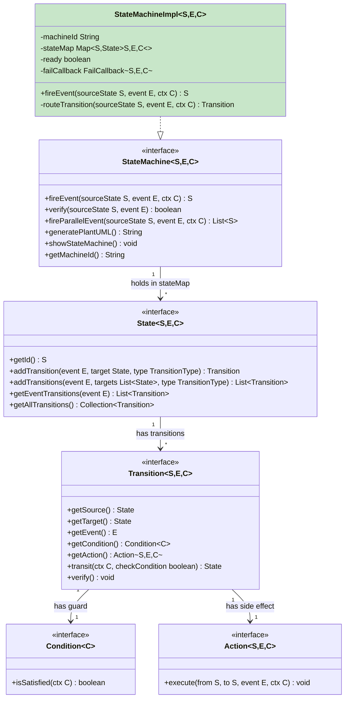
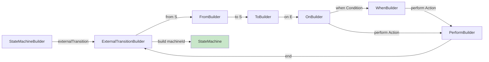
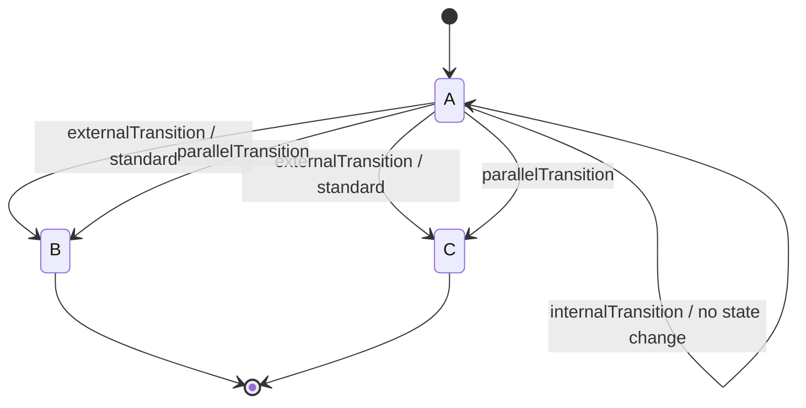
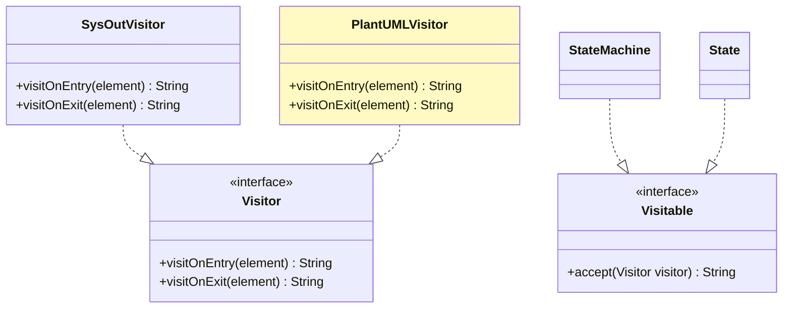

# COLA StateMachine — The Stateless Minimalist

> Deep source-code analysis of Alibaba COLA's state machine component — the philosophical foundation for CBOL's custom state machine.
>
> **Repository**: [alibaba/COLA](https://github.com/alibaba/COLA) — `cola-component-statemachine`
> **Author**: Frank Zhang (Alibaba)
> **License**: GPL-2.0
> **Dependencies**: Zero external dependencies

---

## 1. Architecture Overview

COLA's architecture is elegantly simple — only 4 core interfaces and ~1500 total LOC.



### Data Flow

```mermaid
flowchart LR
    A[Caller] -->|fireEvent currentState, event, ctx| B[StateMachineImpl]
    B -->|getState sourceStateId| C{stateMap<br/>ConcurrentHashMap O(1)}
    C -->|State| D[routeTransition]
    D -->|getEventTransitions event| E[List of Transition]
    E -->|iterate: check guard condition| F{guard satisfied?}
    F -->|Yes| G[Matching Transition]
    F -->|No, unguarded fallback| G
    G -->|transit ctx| H[execute Action]
    H -->|return target State| I[targetState.getId]
    I -->|return to caller| A

    style B fill:#c8e6c9
    style C fill:#fff9c4
    style G fill:#bbdefb
```

---

## 2. Core Source Code Analysis

### 2.1 `StateMachineImpl.fireEvent()` — The Heart

This is the single most important method in COLA — only **10 lines of core logic**:

```java
@Override
public S fireEvent(S sourceStateId, E event, C ctx) {
    isReady();                                    // 1. Guard: machine must be built
    Transition<S,E,C> transition =
        routeTransition(sourceStateId, event, ctx);  // 2. Route: find matching transition

    if (transition == null) {
        Debugger.debug("There is no Transition for " + event);
        failCallback.onFail(sourceStateId, event, ctx);  // 3. Fail: no transition found
        return sourceStateId;                              //    → stay in current state
    }
    return transition.transit(ctx, false).getId();  // 4. Transit: execute action, return target
}
```

**Key observations**:
1. **No state stored** — `sourceStateId` is injected by the caller. The machine itself is stateless.
2. **Fail-safe** — if no transition matches, the `failCallback` is invoked and the current state is returned (no exception thrown).
3. **Single responsibility** — this method only routes and delegates; the actual transition logic is in `Transition.transit()`.

### 2.2 `routeTransition()` — Guard Routing Logic

```java
private Transition<S,E,C> routeTransition(S sourceStateId, E event, C ctx) {
    State sourceState = getState(sourceStateId);
    List<Transition<S,E,C>> transitions = sourceState.getEventTransitions(event);

    if (transitions == null || transitions.size() == 0) return null;

    Transition<S,E,C> transit = null;
    for (Transition<S,E,C> transition : transitions) {
        if (transition.getCondition() == null) {
            transit = transition;                          // unguarded = default fallback
        } else if (transition.getCondition().isSatisfied(ctx)) {
            transit = transition;                          // guarded = first match wins
            break;
        }
    }
    return transit;
}
```

**Critical design insight — the routing algorithm**:

```mermaid
flowchart TD
    A[Get transitions for event] --> B{Any transitions?}
    B -->|No| C[return null]
    B -->|Yes| D[Iterate transitions]
    D --> E{Transition has<br/>guard condition?}
    E -->|No (unguarded)| F[Assign as fallback<br/>continue loop]
    E -->|Yes (guarded)| G{Guard satisfied?}
    G -->|Yes| H[Assign and BREAK<br/>first match wins]
    G -->|No| F
    F --> D
    H --> I[Return matched transition]

    style H fill:#c8e6c9
    style F fill:#fff9c4
```

**Order matters**: Guarded transitions should be defined **before** unguarded ones. If an unguarded transition is defined first, it gets assigned as fallback, then if a later guarded transition matches, it breaks and wins. If no guarded transition matches, the last unguarded transition in the list is returned.

### 2.3 The Stateless Design — Explained

From the source code comment in `StateMachineImpl.java`:

> *"For performance consideration, the state machine is made 'stateless' on purpose. Once it's built, it can be shared by multi-thread. One side effect is since the state machine is stateless, we can not get current state from State Machine."*

This is the single most important design decision in COLA:

```mermaid
flowchart TB
    subgraph Stateful["Stateful Approach (Spring Statemachine)"]
        SM1[StateMachine Instance 1<br/>holds current state]
        SM2[StateMachine Instance 2<br/>holds current state]
        SMN[StateMachine Instance N<br/>holds current state]
    end

    subgraph Stateless["Stateless Approach (COLA)"]
        Shared[Shared StateMachine Engine<br/>NO current state]
        DB1[(Conversation 1 state<br/>in MongoDB)]
        DB2[(Conversation 2 state<br/>in MongoDB)]
        DBN[(Conversation N state<br/>in MongoDB)]
    end

    Stateful -->|O(N) instances<br/>synchronization needed| Problem1[Memory overhead<br/>Thread contention]
    Stateless -->|O(1) shared engine<br/>thread-safe| Benefit1[No memory overhead<br/>No synchronization]

    style Shared fill:#c8e6c9
    style Problem1 fill:#ffcdd2
    style Benefit1 fill:#c8e6c9
```

| Aspect | Stateful (Spring Statemachine) | Stateless (COLA) |
|--------|--------------------------------|------------------|
| **Current state** | Stored in machine instance | Injected by caller per `fireEvent()` |
| **Thread safety** | Needs synchronization per instance | Fully thread-safe — no mutable state |
| **Sharing** | One instance per conversation | One shared instance for all conversations |
| **Memory** | O(conversations) instances | O(1) — single shared engine |
| **Persistence** | Machine handles persistence | Caller persists state in DB/Redis |
| **Recovery** | Machine restores from snapshot | Caller loads state, injects into engine |

**For CBOL (high-concurrency IM)**: Stateless is the clear winner. We have potentially millions of concurrent conversations — a stateful machine per conversation would be a memory and synchronization disaster.

### 2.4 Builder API — Step Builder Pattern

COLA uses a **step-builder pattern** (also called "fluent builder with phases") that enforces API correctness at compile time:



```java
StateMachineBuilder<States, Events, Context> builder =
    StateMachineBuilderFactory.create();

builder.externalTransition()
    .from(States.INIT)
    .to(States.AI_PROCESSING)
    .on(Events.USER_MESSAGE)
    .when(ctx -> ctx.isValid())           // guard condition (optional)
    .perform((from, to, event, ctx) -> {  // action (optional)
        log.info("Transitioning from {} to {}", from, to);
    });

StateMachine<States, Events, Context> machine = builder.build("conversation-machine");

// Usage — current state injected by caller
States nextState = machine.fireEvent(currentState, Events.USER_MESSAGE, context);
```

**Compile-time enforcement**: You can't skip `from` or `to` — the compiler won't allow it because each builder phase only exposes the next valid method.

### 2.5 Transition Types

COLA supports 4 transition types (from `StateMachineBuilder` interface):

| Type | Method | Semantics | Mermaid |
|------|--------|-----------|---------|
| **External** | `externalTransition()` | Exit source, enter target (standard) | `A --event--> B` |
| **External (multi-source)** | `externalTransitions()` | Multiple source states → same target | `A --event--> C`<br/>`B --event--> C` |
| **Parallel** | `externalParallelTransition()` | One event triggers multiple transitions | `A --event--> B`<br/>`A --event--> C` |
| **Internal** | `internalTransition()` | No state change, action executed | `A --event/action--> A` |



### 2.6 Visitor Pattern for Visualization

COLA implements the **Visitor pattern** (`Visitable` interface) to generate state machine diagrams:



```java
public interface StateMachine<S,E,C> extends Visitable {
    void showStateMachine();      // prints to console via SysOutVisitor
    String generatePlantUML();    // generates PlantUML via PlantUMLVisitor
}
```

**Clean separation**: The state machine structure is traversed by a visitor, and different visitors produce different outputs (console text, PlantUML, potentially Mermaid).

---

## 3. Strengths

| Strength | Detail |
|----------|--------|
| **Zero dependencies** | No external libraries — pure JDK |
| **Stateless by design** | Thread-safe, shareable, minimal memory |
| **O(1) transition lookup** | ConcurrentHashMap for state → transitions |
| **Compile-time API safety** | Step-builder prevents invalid transition definitions |
| **Minimal codebase** | ~1500 LOC total — easy to understand, audit, and extend |
| **Fail-safe** | No transition → fail callback + stay in current state (no exception) |
| **Visitor for visualization** | PlantUML generation built-in |

---

## 4. Limitations

| Limitation | Impact | Mitigation |
|------------|--------|------------|
| **No transition history/audit** | Can't trace who changed what state when | Add declarative listeners (squirrel pattern) |
| **No persistence support** | Caller must handle state storage | Handle at business layer (MongoDB) |
| **No design-time validation** | Unreachable states / missing transitions not caught | Add build-time validator |
| **No hierarchical/composite states** | Flat FSM only — transition duplication | Use parallel decomposition (XState pattern) |
| **No parallel regions** | Can't model independent concerns concurrently | Maintain separate state machines per concern |
| **No history states** | Re-entering a state resets to initial | Track sub-state in context |
| **No retry/resume** | Failed transitions aren't retried | Add sub-step checkpoints (Hypercell pattern) |
| **PlantUML only** | No Mermaid generation | Add MermaidVisitor |

---

## 5. CBOL Takeaways

### Already Adopted ✅

- [x] Stateless engine design (current state injected by caller)
- [x] Table-driven O(1) lookup (ConcurrentHashMap)
- [x] Zero external dependencies
- [x] Generic type-safe `<S, E, C>`
- [x] Fluent step-builder API
- [x] Guard conditions (`Condition<C>`)
- [x] Action callbacks (`Action<S,E,C>`)
- [x] Fail callback for no-transition scenarios

### Could Borrow 📋

- [ ] **Mermaid generation via Visitor pattern** — add a `MermaidVisitor` to auto-generate state diagrams from transition definitions
- [ ] **Parallel transitions** — for scenarios where one event triggers multiple independent state changes
- [ ] **Internal transitions** — for actions that don't change state (logging, metrics within a state)
- [ ] **Multi-source transitions** — `externalTransitions()` for when multiple states transition to the same target

### Should Improve ❌

- [ ] Add transition history/audit log via `TransitionListener`
- [ ] Add `StateRepository` SPI for pluggable persistence
- [ ] Add design-time validation (unreachable states, missing transitions, duplicate transitions)
- [ ] Consider hierarchical state support for complex sub-flows

---

## 6. Key Source Files Reference

| File | Path | Purpose |
|------|------|---------|
| `StateMachine.java` | `com.alibaba.cola.statemachine.StateMachine` | Core interface |
| `StateMachineImpl.java` | `com.alibaba.cola.statemachine.impl.StateMachineImpl` | Stateless engine implementation |
| `State.java` | `com.alibaba.cola.statemachine.State` | State interface |
| `Transition.java` | `com.alibaba.cola.statemachine.Transition` | Transition interface |
| `Condition.java` | `com.alibaba.cola.statemachine.Condition` | Guard predicate |
| `Action.java` | `com.alibaba.cola.statemachine.Action` | Side effect callback |
| `StateMachineBuilder.java` | `com.alibaba.cola.statemachine.builder.StateMachineBuilder` | Step-builder entry point |
| `PlantUMLVisitor.java` | `com.alibaba.cola.statemachine.impl.PlantUMLVisitor` | PlantUML generation |

---

*COLA StateMachine Deep Analysis — v1.0.0 — 2026-08-26*
