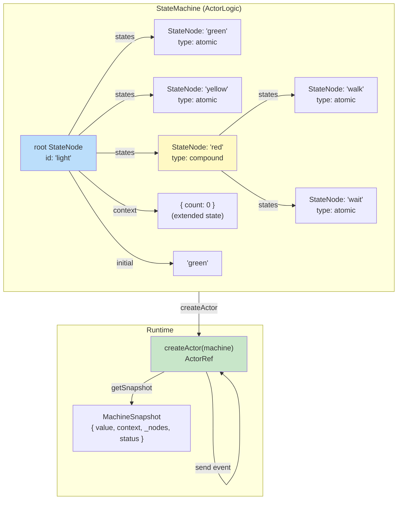
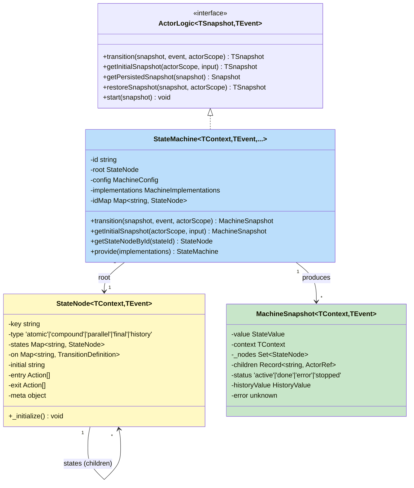
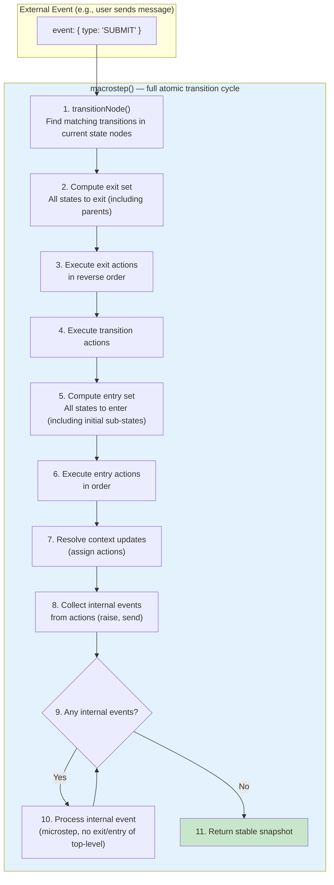
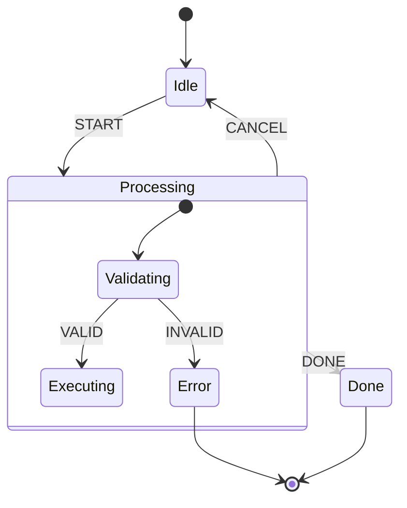
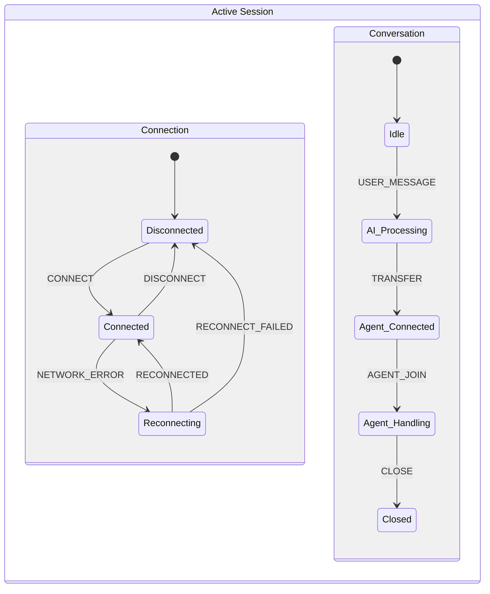
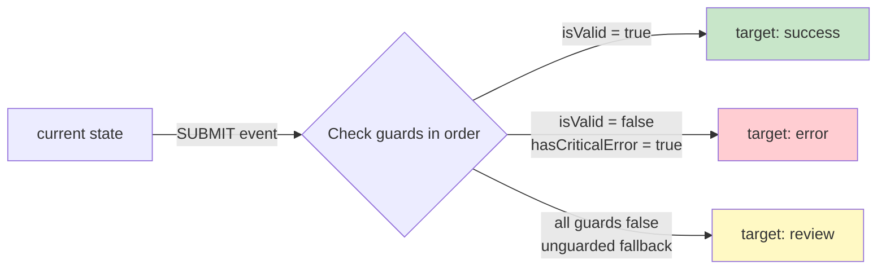
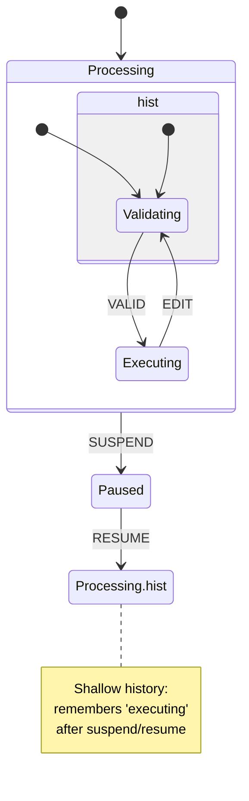
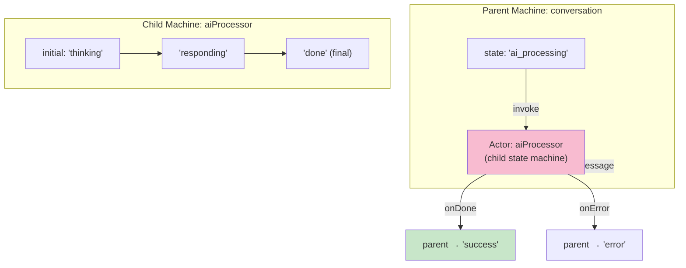
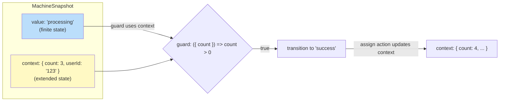

# XState — The SCXML Gold Standard

> Deep analysis of XState v5 — the most sophisticated state machine library in existence. While TypeScript, its design philosophy represents the state of the art in state machine theory.
>
> **Repository**: [statelyai/xstate](https://github.com/statelyai/xstate)
> **Stars**: ~29.5k
> **License**: MIT
> **Language**: TypeScript
> **Standard**: Implements SCXML (W3C State Chart XML)
> **Dependencies**: Zero runtime dependencies

---

## 1. Architecture Overview

XState's fundamental data structure is a **tree of `StateNode` objects**, not a flat map. This tree structure enables hierarchical states, parallel regions, and the full statechart specification.



### Core Class Hierarchy



---

## 2. The Transition Algorithm — Microsteps and Macrosteps

XState's transition logic is more complex than COLA's because it handles hierarchical states, parallel regions, and internal events.



### Core Method: `StateMachine.transition()`

```typescript
public transition(snapshot, event, actorScope): MachineSnapshot {
    return macrostep(snapshot, event, actorScope, []).snapshot;
}
```

**Two-level semantics**:

| Level | Function | What it does |
|-------|----------|-------------|
| **Microstep** | `transitionNode()` | Single transition: exit source states, execute actions, enter target states |
| **Macrostep** | `macrostep()` | Process event + all internal events generated by actions, until stable |

**Why macrosteps matter**: When a transition's action raises an internal event (via `raise()`), that event is processed in the same macrostep. This means a single external event can cause multiple state changes in one atomic operation. Essential for complex statecharts, overkill for simple FSMs.

---

## 3. Five Advanced Statechart Concepts

XState implements the full SCXML specification. These are the 5 most important concepts beyond basic FSM.

### 3.1 Hierarchical (Compound) States

A state can contain sub-states. When in the parent state, you're also in exactly one sub-state.



```typescript
const machine = createMachine({
  initial: 'idle',
  states: {
    idle: { on: { START: 'processing' } },
    processing: {           // COMPOUND state
      initial: 'validating',
      states: {
        validating: { on: { VALID: 'executing', INVALID: '#error' } },
        executing: { on: { DONE: '#done' } },
      },
      on: { CANCEL: 'idle' }  // transition from parent applies to ALL sub-states
    },
    done: { id: 'done', type: 'final' },
    error: { id: 'error', type: 'final' }
  }
});
```

**Key benefit**: `CANCEL` works from both `processing.validating` and `processing.executing` — defined once on the parent. This **eliminates transition duplication**.

**For CBOL**: Group related sub-states (e.g., `AGENT_HANDLING` has sub-states `typing`, `sending`, `awaiting_response`) to reduce transition duplication.

### 3.2 Parallel (Orthogonal) Regions

A state can contain multiple independent sub-state machines that run concurrently.



```typescript
const machine = createMachine({
  type: 'parallel',          // PARALLEL state
  states: {
    connection: {            // Region 1: connection status
      initial: 'disconnected',
      states: {
        disconnected: { on: { CONNECT: 'connected' } },
        connected: { on: { DISCONNECT: 'disconnected', NETWORK_ERROR: 'reconnecting' } },
        reconnecting: { on: { RECONNECTED: 'connected', RECONNECT_FAILED: 'disconnected' } }
      }
    },
    conversation: {          // Region 2: conversation status
      initial: 'idle',
      states: {
        idle: { on: { USER_MESSAGE: 'ai_processing' } },
        ai_processing: { on: { TRANSFER: 'agent_connected' } },
        agent_connected: { on: { AGENT_JOIN: 'agent_handling' } },
        agent_handling: { on: { CLOSE: 'closed' } },
        closed: { type: 'final' }
      }
    }
  }
});
// State value: { connection: 'connected', conversation: 'ai_processing' }
```

**For CBOL**: This is **directly applicable**. A WebSocket connection has independent concerns:
- Connection state (connected / reconnecting / disconnected)
- Conversation state (idle / AI processing / agent connected / closed)
- Presence state (online / away / offline)

Instead of one God state machine with combinatorial states (e.g., `CONNECTED_AI_PROCESSING_ONLINE`), use parallel regions.

### 3.3 Guards (Conditional Transitions)

Transitions can have guard predicates. The first transition whose guard returns true is taken.



```typescript
on: {
  SUBMIT: [
    { target: 'success', guard: 'isValid' },           // guarded
    { target: 'error', guard: 'hasCriticalError' },     // guarded
    { target: 'review' }                                  // unguarded fallback
  ]
}
```

This is the same pattern as COLA's `routeTransition()` — guarded first, unguarded fallback. XState formalizes it as an array of transition definitions with explicit ordering.

### 3.4 History Pseudo-States

When re-entering a compound state, history states remember the previous sub-state.



```typescript
processing: {
  initial: 'validating',
  states: {
    validating: { ... },
    executing: { ... },
    hist: { type: 'history', history: 'shallow' }  // or 'deep'
  },
  on: {
    SUSPEND: 'paused',
    RESUME: 'processing.hist'  // re-enter the PREVIOUS sub-state
  }
}
```

| History Type | Remembers | Use When |
|-------------|-----------|----------|
| **Shallow** | Only the immediate sub-state | Simple nesting (1 level) |
| **Deep** | Entire nested configuration (all levels) | Complex multi-level nesting |

**For CBOL**: Useful for conversation pause/resume. If a user pauses a conversation mid-AI-processing, resuming should return to the exact sub-state, not reset to the initial.

### 3.5 Actor Model (Invoked Actors)

A state can invoke other state machines as child actors. This is the most powerful XState concept and the #1 source of architectural confusion.



```typescript
processing: {
  invoke: {
    src: 'aiProcessingMachine',  // child state machine definition
    id: 'ai-processor',
    onDone: {
      target: 'success',
      actions: assign({ result: (_, e) => e.data })
    },
    onError: {
      target: 'error',
      actions: assign({ error: (_, e) => e.data })
    }
  }
}
```

**Compound states vs invoked actors** (the #1 XState architectural mistake):

| Aspect | Compound State | Invoked Actor |
|--------|---------------|---------------|
| **Lifecycle** | Tied to parent — enters/exits with parent | Independent — can outlive parent, spawned/destroyed explicitly |
| **Communication** | Internal events only | Send/receive messages via actor system |
| **State visibility** | Parent can see sub-state | Parent only sees done/error, not internal state |
| **Use when** | Sub-flow is part of parent's lifecycle | Sub-flow is independent, may run concurrently, may need to communicate |

---

## 4. Context (Extended State)

Unlike basic FSMs where all information is encoded in the state, XState separates:
- **Finite state** — the current state node (e.g., `processing`)
- **Extended state (context)** — arbitrary data (e.g., `{ userId, messageCount, retryCount }`)



```typescript
const machine = createMachine({
  context: { count: 0, maxRetries: 3 },
  initial: 'idle',
  states: {
    idle: {
      on: {
        INCREMENT: {
          actions: assign({ count: (ctx) => ctx.count + 1 })  // update context
        },
        SUBMIT: {
          target: 'processing',
          guard: ({ count }) => count > 0  // guard uses context
        }
      }
    }
  }
});
```

This is equivalent to COLA's `C` (context) generic parameter. XState formalizes context updates via `assign()` actions and makes context a first-class citizen of the snapshot.

---

## 5. Strengths

| Strength | Detail |
|----------|--------|
| **Full SCXML compliance** | Implements the W3C statechart standard — hierarchical, parallel, history, guards, actions |
| **Actor model** | Invoked actors for independent sub-flows with message-based communication |
| **Zero runtime dependencies** | Pure TypeScript, no external libs |
| **Excellent visualizer** | XState Visualizer (web) for real-time state diagram visualization |
| **Type-safe** | Full TypeScript type inference for states, events, context, guards, actions |
| **Macrostep semantics** | Internal events processed atomically — no intermediate inconsistent states |
| **Mature ecosystem** | 29.5k stars, used by many production systems (Chakra UI, etc.) |
| **Snapshot persistence** | `getPersistedSnapshot()` / `restoreSnapshot()` for state serialization |

---

## 6. Limitations

| Limitation | Impact | Mitigation |
|------------|--------|------------|
| **TypeScript only** | Can't use directly in Java | Borrow design patterns, not code |
| **Steep learning curve** | Actor model + statechart concepts are complex | Start with flat FSM, add features incrementally |
| **Verbose config** | Machine definitions can be long | Use `setup()` for shared implementations |
| **Overkill for simple flows** | Full statechart is unnecessary for basic state transitions | Use COLA-style minimal FSM for simple cases |
| **Macrostep complexity** | Internal event chains can be hard to debug | Use XState Visualizer for tracing |
| **No built-in distributed support** | Actors are in-process only | Add distributed layer separately (Hypercell pattern) |

---

## 7. CBOL Takeaways

### High-Value Patterns to Adopt 📋

1. **Parallel decomposition** — split connection state, conversation state, and presence state into independent orthogonal regions instead of one combinatorial FSM
2. **Hierarchical states** — group related sub-states (e.g., `AGENT_HANDLING` has sub-states `typing`, `sending`, `awaiting_response`) to eliminate transition duplication
3. **History pseudo-states** — for pause/resume scenarios, remember the previous sub-state instead of resetting
4. **Context separation** — clearly separate finite state (enum) from extended state (context data)
5. **Macrostep semantics** — when an action raises an internal event, process it atomically in the same transition cycle

### Medium-Value Patterns 📋

6. **Final states with output** — terminal states can carry output data (e.g., `CLOSED` carries `closeReason`, `closeTimestamp`)
7. **Actor model for sub-flows** — AI processing could be an invoked actor that communicates via messages
8. **StateNode tree traversal** — for validation and visualization, traverse the state tree rather than a flat map

### Overkill for CBOL ❌

- Full SCXML compliance — we don't need all SCXML features
- Actor system with message passing — too complex for our use case
- Macrosteps with internal event chains — simple FSM transitions suffice
- TypeScript-specific type inference magic

---

## 8. Key Source Files Reference

| File | Path | Purpose |
|------|------|---------|
| `createMachine.ts` | `packages/core/src/createMachine.ts` | Factory function, entry point |
| `StateMachine.ts` | `packages/core/src/StateMachine.ts` | Core class, implements ActorLogic |
| `StateNode.ts` | `packages/core/src/StateNode.ts` | State node (tree structure) |
| `stateUtils.ts` | `packages/core/src/stateUtils.ts` | transitionNode, macrostep, microstep |
| `State.ts` | `packages/core/src/State.ts` | MachineSnapshot, createMachineSnapshot |
| `types.ts` | `packages/core/src/types.ts` | All type definitions |

---

*XState Deep Analysis — v1.0.0 — 2026-08-26*
