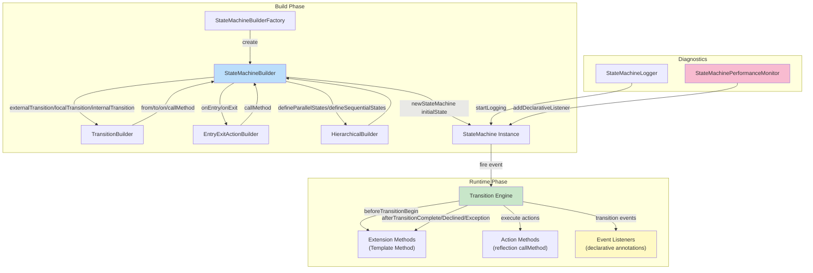
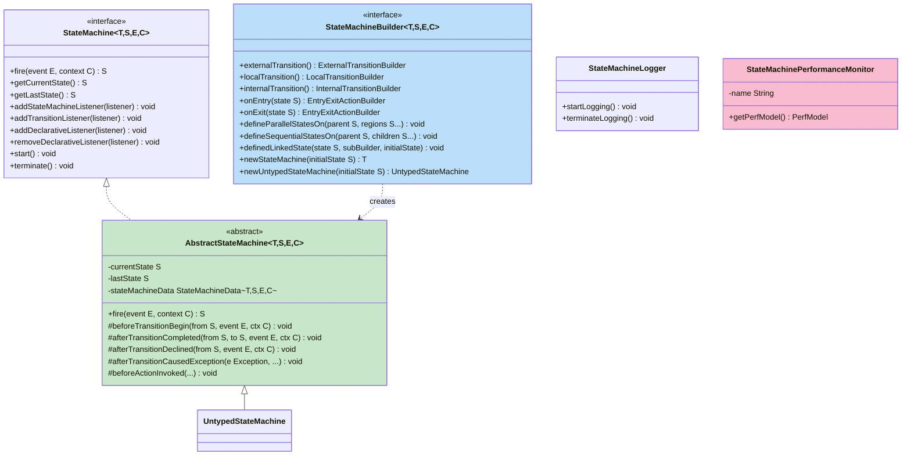
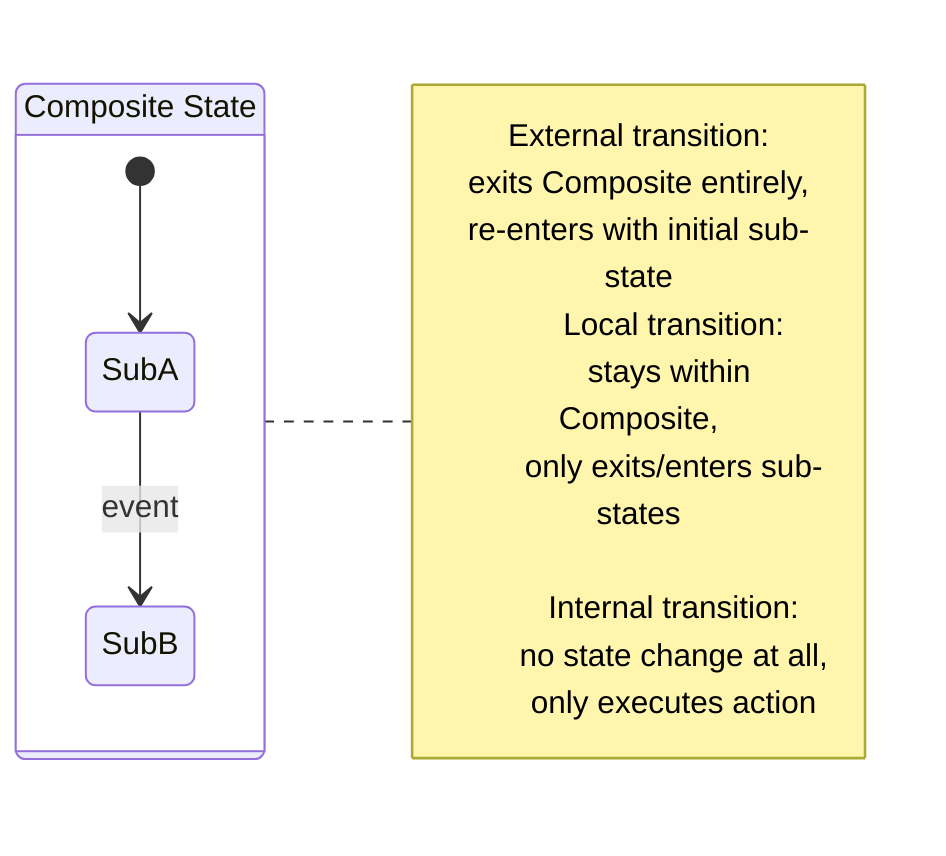
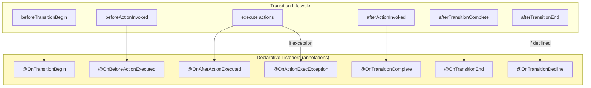
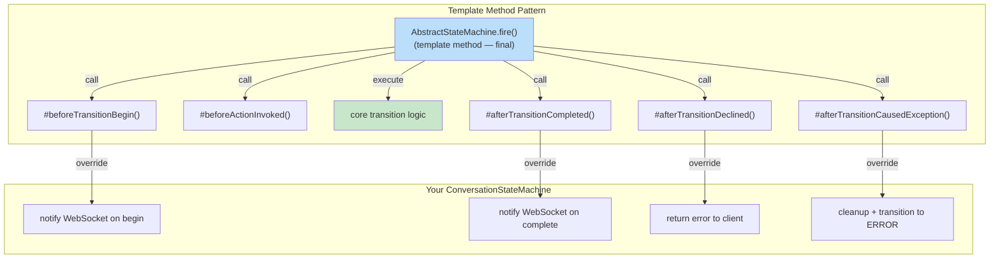
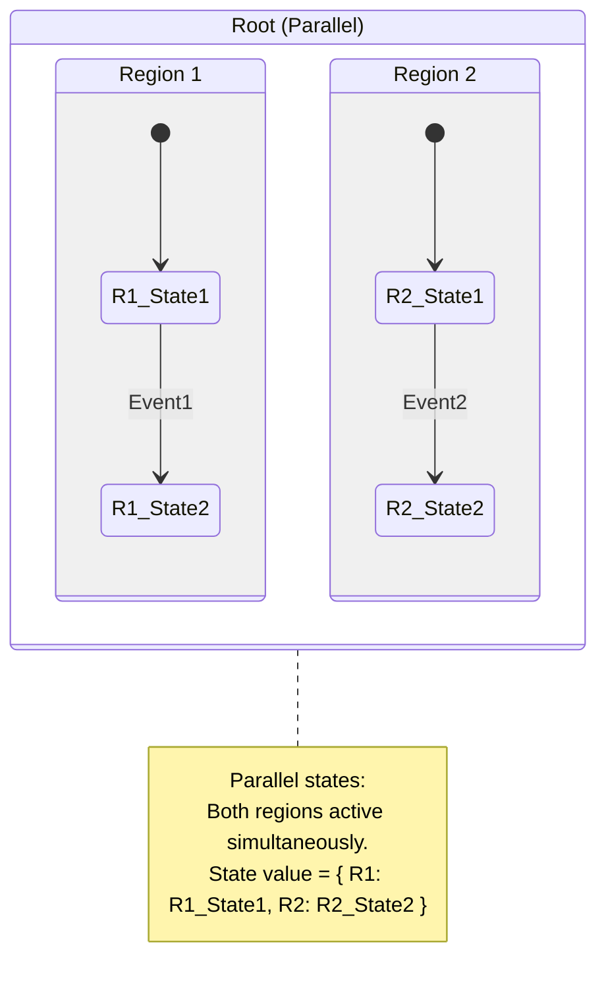

# squirrel-foundation — The Enterprise Diagnosable Machine

> Deep analysis of squirrel-foundation — a lightweight, highly flexible, diagnosable, type-safe Java state machine for enterprise usage.
>
> **Repository**: [hekailiang/squirrel](https://github.com/hekailiang/squirrel)
> **Stars**: ~1.5k
> **License**: Apache-2.0
> **Language**：Java
> **Tagline**: "small, agile, smart, alert and cute"

---

## 1. Architecture Overview

squirrel sits between COLA (minimal) and Spring Statemachine (full-featured). Its standout features are full UML compliance, declarative listeners via annotations, and built-in diagnostics.



### Core Class Hierarchy



---

## 2. Three UML Transition Types

squirrel implements all three UML-specified transition types — this is a key differentiator from COLA (which only has External + Internal).



| Type | Keyword | Exit Source? | Enter Target? | Use When |
|------|---------|-------------|---------------|----------|
| **External** | `externalTransition()` | ✅ Yes (including composite parent) | ✅ Yes | Standard state change |
| **Local** | `localTransition()` | ❌ No (composite parent stays) | ✅ Sub-state only | Transition within a composite state without exiting/re-entering the parent |
| **Internal** | `internalTransition()` | ❌ No | ❌ No | Action without state change (logging, metrics) |

**Local transition is the interesting one**: In a hierarchical state machine, an external transition from `SubA` to `SubB` (both inside `Composite`) would exit and re-enter `Composite` (triggering parent exit/entry actions). A local transition avoids this — it only exits `SubA` and enters `SubB`, without touching `Composite`.

```java
// External: exits Composite, re-enters with initial sub-state
builder.externalTransition().from(MyState.SubA).to(MyState.SubB).on(MyEvent.EVENT);

// Local: stays in Composite, only transitions between sub-states
builder.localTransition().from(MyState.SubA).to(MyState.SubB).on(MyEvent.EVENT);

// Internal: no state change, only executes action
builder.internalTransition().within(MyState.SubA).on(MyEvent.EVENT).callMethod("doSomething");
```

---

## 3. Declarative Listeners — The Killer Feature

squirrel's most elegant design is the **declarative event listener via annotations**. This is the single most valuable pattern for CBOL.



### Annotation Listener Example

```java
static class AuditModule {
    @OnTransitionBegin
    @ListenerOrder(10)  // control execution order
    public void transitionBegin(TestEvent event) {
        auditLog.info("Transition began: {}", event);
    }

    @OnTransitionBegin(when = "event.name().equals(\"toB\")")  // MVEL condition
    public void transitionBeginConditional() {
        // only for specific events
    }

    @OnTransitionComplete
    public void transitionComplete(String from, String to, TestEvent event, Integer context) {
        auditLog.info("Transition: {} → {} on {}", from, to, event);
    }

    @OnTransitionDecline
    public void transitionDeclined(String from, TestEvent event, Integer context) {
        auditLog.warn("Transition declined: {} on {}", from, event);
    }

    @OnActionExecException
    public void onActionExecException(Action<?,?,?,?> action, TransitionException e) {
        errorLog.error("Action failed: {}", action, e);
    }

    @OnTransitionBegin
    @AsyncExecute  // asynchronous dispatch (non-blocking)
    public void asyncNotification(TestEvent event) {
        notificationService.send(event);
    }
}

fsm.addDeclarativeListener(new AuditModule());
```

### Why This Is Brilliant

| Benefit | Explanation |
|---------|-------------|
| **Separation of concerns** | Audit/metrics/logging logic lives in a separate module, not in the state machine or action code |
| **Non-invasive** | The listener module doesn't implement any interface — just annotated methods |
| **Type-safe parameters** | Method parameters are automatically inferred and injected (from, to, event, context, stateMachine) |
| **Conditional execution** | MVEL expressions filter when the listener fires (`when = "event.name().equals('toB')"`) |
| **Ordered execution** | `@ListenerOrder` controls invocation sequence |
| **Async support** | `@AsyncExecute` dispatches to a separate thread for non-blocking notifications |

### CBOL Application

Our conversation state machine needs:
- **Audit logging** — who changed what state when (for compliance and debugging)
- **Metrics** — transition count, latency, failure rate (for monitoring)
- **Notifications** — state change events to WebSocket clients (for real-time updates)
- **Error handling** — transition exceptions → cleanup + alert (for resilience)

All of these can be declarative listeners, keeping the core state machine logic clean.

---

## 4. State Machine Diagnostics

squirrel provides two built-in diagnostic tools.

### 4.1 StateMachineLogger

```java
StateMachineLogger fsmLogger = new StateMachineLogger(stateMachine);
fsmLogger.startLogging();

stateMachine.fire(Event.B2A, 1);
```

**Console output**:

```
HierachicalStateMachine: Transition from "B2a" on "B2A" with context "1" begin.
Before execute method call action "leftB2a" (1 of 6).
Before execute method call action "exitB2" (2 of 6).
Before execute method call action "exitB" (3 of 6).
Before execute method call action "entryA" (4 of 6).
Before execute method call action "entryA1" (5 of 6).
Before execute method call action "rightA1" (6 of 6).
HierachicalStateMachine: Transition from "B2a" to "A1" on "B2A" complete which took 2ms.
```

The logger shows:
- Transition begin/complete with timing
- Each action in sequence with index (1 of 6)
- Entry/exit actions for hierarchical states (exitB2, exitB, entryA, entryA1)

### 4.2 StateMachinePerformanceMonitor

```java
StateMachinePerformanceMonitor perfMonitor =
    new StateMachinePerformanceMonitor("Conversation FSM");
fsm.addDeclarativeListener(perfMonitor);

// After 10000 transitions:
```

**Output**:

```
========================== Conversation FSM ==========================
Total Transition Invoked: 40000
Total Transition Failed: 0
Total Transition Declained: 0
Average Transition Comsumed: 0.0004ms
Transition Key           Invoked   Avg Time   Max Time   Min Time
INIT--{MSG, ctx}->AI    10000     0.0007ms   5ms        0ms
AI--{DONE, ctx}->AGENT  10000     0.0001ms   1ms        0ms
AGENT--{CLOSE}->CLOSED  10000     0.0009ms   7ms        0ms
CLOSED--{REOPEN}->INIT  10000     0.0000ms   1ms        0ms
Total Action Invoked: 40000
Total Action Failed: 0
Average Action Execution Comsumed: 0.0000ms
```

**For CBOL**: Performance monitoring is essential for an IM system. We need to know:
- Average transition latency (should be <1ms for in-memory state machine)
- Transition failure rate
- Declined transition rate (invalid state changes — important for IM clients that may send events out of order)
- Per-transition-key breakdown (which transitions are slow)

---

## 5. Extension Methods (Template Method Pattern)

squirrel provides protected extension methods in `AbstractStateMachine` that you can override:



```java
public class ConversationStateMachine extends AbstractStateMachine<...> {
    @Override
    protected void beforeTransitionBegin(S fromState, E event, C context) {
        // pre-transition hook
    }

    @Override
    protected void afterTransitionCompleted(S fromState, S toState, E event, C context) {
        // post-success hook — e.g., notify WebSocket clients
        websocketService.notifyStateChange(context.getSessionId(), toState);
    }

    @Override
    protected void afterTransitionDeclined(S fromState, E event, C context) {
        // invalid transition hook — e.g., log warning, return error to client
        log.warn("Invalid transition: {} from {}", event, fromState);
        context.setError("Invalid operation in current state");
    }

    @Override
    protected void afterTransitionCausedException(Exception e, S from, S to, E event, C ctx) {
        // exception hook — e.g., cleanup, alert, transition to ERROR state
        errorHandler.handle(e, ctx);
        fire(Events.ERROR, ctx);  // transition to ERROR state
    }
}
```

This is the **Template Method pattern** — the base class defines the transition algorithm skeleton, and subclasses override specific hook methods. This is cleaner than listeners for logic that's **intrinsic to the state machine** (not cross-cutting concerns like audit).

**When to use extension methods vs declarative listeners**:

| Concern | Extension Method | Declarative Listener |
|---------|-----------------|----------------------|
| Intrinsic state machine logic (WebSocket notify on state change) | ✅ Preferred | ❌ Overkill |
| Cross-cutting concerns (audit, metrics, logging) | ❌ Mixing concerns | ✅ Preferred |
| Error handling that changes state (transition to ERROR) | ✅ Preferred | ❌ Can't change state |
| Optional/removable functionality (debug logging) | ❌ Hard to remove | ✅ Preferred (add/remove listener) |

---

## 6. Hierarchical and Parallel States

squirrel supports both hierarchical (sequential) and parallel (orthogonal) states.



```java
// Define parallel regions on Root
builder.defineParallelStatesOn(MyState.Root, MyState.Region1, MyState.Region2);

// Define sequential (hierarchical) sub-states within Region1
builder.defineSequentialStatesOn(MyState.Region1, MyState.State11, MyState.State12);
builder.externalTransition().from(MyState.State11).to(MyState.State12).on(MyEvent.Event1);

// Define sequential sub-states within Region2
builder.defineSequentialStatesOn(MyState.Region2, MyState.State21, MyState.State22);
builder.externalTransition().from(MyState.State21).to(MyState.State22).on(MyEvent.Event2);
```

**For CBOL**: Parallel states are directly applicable — connection state and conversation state can be independent parallel regions within a "Session" root state.

---

## 7. Strengths

| Strength | Detail |
|----------|--------|
| **Full UML compliance** | All 3 transition types (External, Local, Internal), hierarchical + parallel states |
| **Declarative listeners** | Annotation-based, non-invasive, type-safe, conditional, ordered, async |
| **Built-in diagnostics** | StateMachineLogger + StateMachinePerformanceMonitor out of the box |
| **Extension methods** | Template Method pattern for intrinsic logic hooks |
| **Type-safe** | 4 generic parameters `<T,S,E,C>` (state machine type, state, event, context) |
| **Fluent + declarative** | Both fluent API and annotation-based transition definitions |
| **Linked states (submachine)** | Reuse a sub-state machine definition in multiple parent states |
| **Timed states** | Delay or periodically trigger events after state entry (ScheduledExecutorService) |
| **JMX support** | Remote monitoring and configuration at runtime (deprecated since 0.3.9) |

---

## 8. Limitations

| Limitation | Impact | Mitigation |
|------------|--------|------------|
| **Stateful design** | One instance per workflow, not shareable | Use stateless pattern (COLA) for core engine |
| **Reflection-based actions** | `callMethod("methodName")` uses reflection — not compile-time safe | Use functional interfaces instead |
| **MVEL for conditions** | MVEL expressions in annotations — not type-checked at compile time | Use Java predicate lambdas |
| **No built-in persistence** | State serialization is manual (ObjectSerializableSupport) | Add persistence layer (Hypercell pattern) |
| **No distributed support** | No distributed locking or multi-replica coordination | Add distributed layer separately |
| **No retry/resume** | Failed transitions aren't retried | Add sub-step checkpoints (Hypercell pattern) |
| **No Mermaid/PlantUML** | No built-in diagram generation | Add Visitor for diagram generation (COLA pattern) |
| **Project maintenance** | Last release 2020, relatively inactive | Use patterns, not the library itself |

---

## 9. CBOL Takeaways

### High-Value Patterns to Adopt 📋

1. **Declarative listeners via annotations** — for audit, metrics, notifications, error handling. This is the single most valuable pattern from squirrel.
2. **Performance monitor** — built-in transition latency/failure tracking with per-transition-key breakdown
3. **Extension methods (Template Method)** — for intrinsic state machine logic (WebSocket notifications on state change, ERROR transition on exception)
4. **Local transitions** — for hierarchical state machines, avoid unnecessary parent exit/re-entry
5. **Transition declined handling** — explicit hook for invalid transition attempts (important for IM — clients may send events in wrong order)

### Medium-Value Patterns 📋

6. **StateMachineLogger** — debug-mode transition tracing with action sequence
7. **MVEL conditional listeners** — filter listener execution by event/state/context (we'd use Java predicates instead)
8. **@AsyncExecute** — asynchronous listener dispatch for non-blocking notifications
9. **Linked states (submachine references)** — reuse a sub-state machine definition in multiple parent states

### Overkill for CBOL ❌

- JMX remote monitoring (deprecated anyway)
- Full UML compliance with all edge cases
- Timed states with ScheduledExecutorService (we handle timeouts at the business layer)
- Reflection-based `callMethod` actions (we'd use functional interfaces)

---

## 10. Key Source Files Reference

| File | Path | Purpose |
|------|------|---------|
| `StateMachine.java` | `org.squirrelframework.foundation.fsm.StateMachine` | Core interface |
| `AbstractStateMachine.java` | `org.squirrelframework.foundation.fsm.impl.AbstractStateMachine` | Base implementation with extension methods |
| `StateMachineBuilder.java` | `org.squirrelframework.foundation.fsm.StateMachineBuilder` | Builder interface |
| `StateMachineBuilderFactory.java` | `org.squirrelframework.foundation.fsm.StateMachineBuilderFactory` | Factory for creating builders |
| `StateMachineLogger.java` | `org.squirrelframework.foundation.fsm.StateMachineLogger` | Debug logging |
| `StateMachinePerformanceMonitor.java` | `org.squirrelframework.foundation.fsm.StateMachinePerformanceMonitor` | Performance monitoring |
| `TransitionType.java` | `org.squirrelframework.foundation.fsm.TransitionType` | EXTERNAL, LOCAL, INTERNAL enum |

---

*squirrel-foundation Deep Analysis — v1.0.0 — 2026-08-26*
