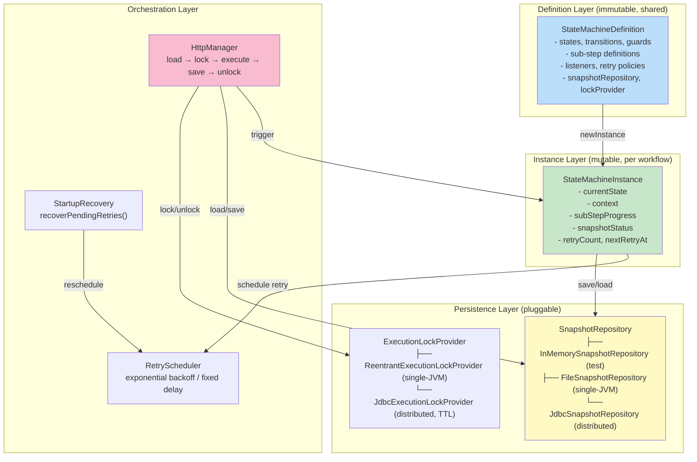
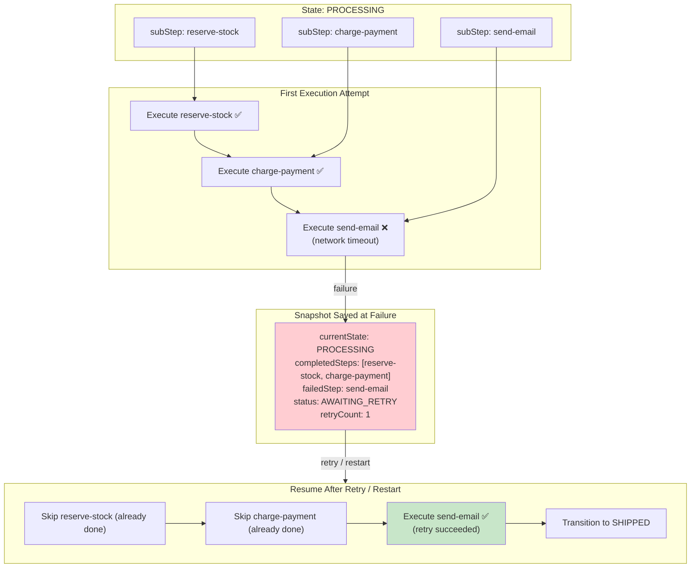
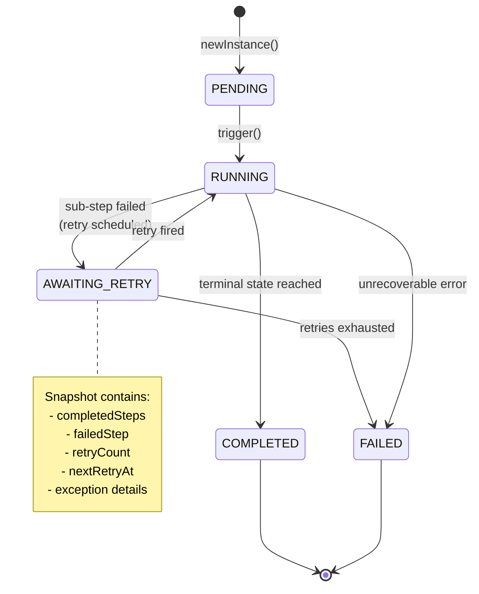
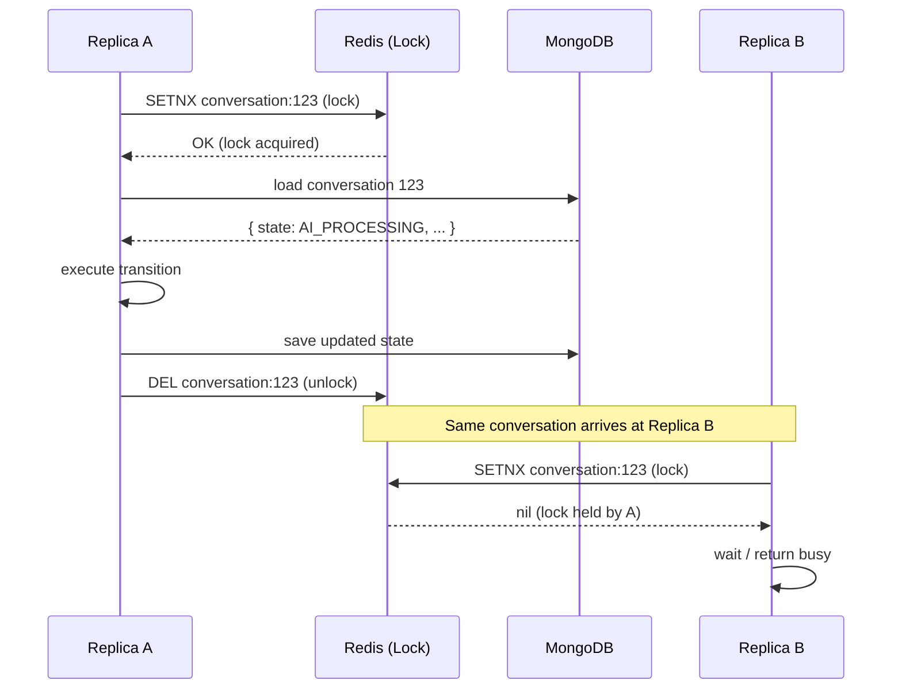
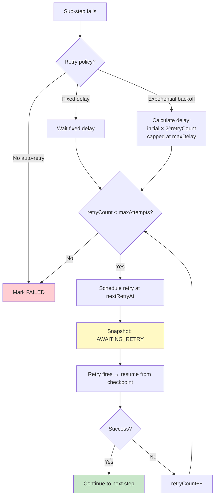
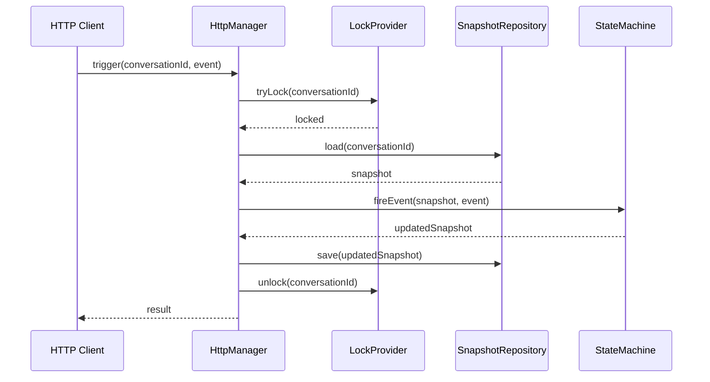

# Hypercell FSM — The Distributed Resumable Workflow

> Deep analysis of Hypercell FSM Library — a lightweight, production-ready Java finite state machine for building stateful, resumable workflows in distributed systems.
>
> **Repository**: [Hypercell-IT-Solutions/fsm-library](https://github.com/Hypercell-IT-Solutions/fsm-library)
> **Version**: 1.0.0-RC6
> **License**: Apache-2.0
> **Language**: Java 17
> **Focus**: Distributed, resumable workflows with failure recovery

---

## 1. Architecture Overview

Hypercell sits in the sweet spot between too-heavy BPM engines (Camunda, Activiti) and too-simple FSM libraries (COLA, stateless4j). It's built specifically for distributed Java microservices.



### Module Structure

```
fsm-library/
├── fsm-core/                       Core library (Java 17, SLF4J logging)
│   └── src/main/java/io/hypercell/fsm/
│       ├── StateMachine.java       entry point (static factories)
│       ├── builder/                fluent DSL
│       ├── core/                   public interfaces (definitions, instances, managers)
│       ├── execution/              runtime engine (internal)
│       ├── exception/              typed exceptions
│       ├── failure/                failure dispositions & policies
│       ├── listener/               event bus & lifecycle callbacks
│       ├── lock/                   per-execution mutual exclusion
│       ├── manager/                HTTP request orchestration
│       ├── resume/                 snapshots & persistence
│       ├── retry/                  retry policies & scheduling
│       └── scope/                  per-execution ambient state (MDC, tracing)
│
├── fsm-jdbc/                       JDBC persistence
│   ├── JdbcSnapshotRepository      distributed snapshots with optimistic locking
│   └── JdbcExecutionLockProvider   distributed per-execution lock (TTL takeover)
│
├── fsm-spring-boot-starter-jdbc/   Spring Boot autoconfiguration
│
└── fsm-examples/                   Runnable examples
    ├── SynchronousWorkflowExample
    ├── HttpManagerExample
    └── FileSnapshotRetryExample
```

---

## 2. The Killer Feature: Sub-Step Tracking with Checkpoints

This is Hypercell's most innovative feature and the most relevant for CBOL's long-running conversation flows.



### Definition

```java
StateMachineDefinition<OrderContext> machine = StateMachine.<OrderContext>define("order-workflow")
    .initial("PENDING")
    .snapshotRepository(StateMachine.inMemoryRepository())
    .listener(StateMachine.loggingListener("[ORDER]"))
    .state("PENDING")
        .on("APPROVE").to("PROCESSING").end()
        .on("CANCEL").to("CANCELLED").end()
    .and()
    .state("PROCESSING")
        .subStep("reserve-stock",  ctx -> reserveStock(ctx))
        .subStep("charge-payment", ctx -> chargePayment(ctx))
        .subStep("send-email",     ctx -> sendConfirmation(ctx))
        .on("COMPLETE").to("SHIPPED").end()
    .and()
    .state("SHIPPED").terminal().and()
    .state("CANCELLED").terminal().and()
    .build();
```

### Execution Flow

```java
StateMachineInstance<OrderContext> instance = machine.newInstance(new OrderContext(orderId));
instance.trigger("APPROVE");     // PENDING → PROCESSING (runs all 3 sub-steps)
instance.trigger("COMPLETE");    // PROCESSING → SHIPPED (terminal)
```

When `trigger("APPROVE")` fires and transitions to `PROCESSING`:
1. Execute `reserve-stock` → mark as **completed** in snapshot
2. Execute `charge-payment` → mark as **completed**
3. If `send-email` **fails** → snapshot saved with first 2 steps completed, `send-email` marked failed
4. On **resume** (after retry or restart) → skip completed steps, only execute `send-email`

**For CBOL**: This is exactly what we need for conversation flows that span multiple services and may fail mid-way:
- AI processing (call AI service, may timeout)
- Agent transfer (find agent, connect, may fail if no agent available)
- Message forwarding (forward to multiple nodes, some may fail)

If a step fails, we shouldn't re-execute already-completed steps (e.g., don't charge payment twice).

---

## 3. Snapshot-Based Persistence

Hypercell's persistence model is based on **snapshots** — a complete record of the workflow's current state that can be saved and restored.



### Snapshot Status

```java
public enum SnapshotStatus {
    PENDING,        // created, not yet started
    RUNNING,        // currently executing
    AWAITING_RETRY, // failed, waiting for retry
    COMPLETED,      // terminal state reached
    FAILED          // permanently failed (retries exhausted)
}
```

### Snapshot Contents

Each snapshot contains:
- `currentState` — current state identifier
- `context` — user-defined context data (serializable)
- `subStepProgress` — `Map<String, SubStepStatus>` (completed/failed/pending)
- `snapshotStatus` — PENDING / RUNNING / AWAITING_RETRY / COMPLETED / FAILED
- `retryCount` — number of retries attempted
- `nextRetryAt` — timestamp for next retry
- `failureDetails` — exception, root cause, failed step

### Pluggable Repositories

| Repository | Use Case | Concurrency |
|-----------|----------|-------------|
| `InMemorySnapshotRepository` | Testing, single-request | None (in-memory map) |
| `FileSnapshotRepository` | Single-JVM deployment, persistence across restarts | File-level locking |
| `JdbcSnapshotRepository` | Distributed multi-replica deployment | **Optimistic locking** (version column) |

**For CBOL**: We'd implement a `MongoSnapshotRepository` (since we use MongoDB) with optimistic locking via a version field.

---

## 4. Distributed Execution Locking

For multi-replica deployments, Hypercell provides **per-execution locking** to prevent two service replicas from processing the same workflow simultaneously.



### Lock Provider SPI

```java
public interface ExecutionLockProvider {
    boolean tryLock(String executionId);
    void unlock(String executionId);
}

// Default: single-JVM ReentrantLock
public class ReentrantExecutionLockProvider implements ExecutionLockProvider { ... }

// Distributed: JDBC-based with TTL stale-lock takeover
public class JdbcExecutionLockProvider implements ExecutionLockProvider {
    // Uses fsm_execution_locks table:
    // - execution_id (primary key)
    // - locked_at (timestamp)
    // - lock_owner (replica ID)
    // TTL takeover: if lock older than TTL, another replica can take it over
}
```

### TTL Stale-Lock Takeover

If a replica crashes while holding a lock, the lock would be held forever. Hypercell solves this with **TTL-based stale lock takeover**:
- Each lock has a `locked_at` timestamp
- If a lock is older than the configured TTL, another replica can take it over
- This handles crashed replicas gracefully

**For CBOL**: We'd use **Redis-based distributed locks** (simpler than JDBC for our Redis-centric architecture), with TTL-based stale lock takeover via Redis key expiration.

---

## 5. Automatic Retry with Exponential Backoff



### Retry Policies

```java
.state("PROCESSING")
    .subStep("call-ai-service", ctx -> aiService.process(ctx))
    .retry(RetryPolicy.exponential()
        .maxAttempts(3)
        .initialDelay(Duration.ofSeconds(1))
        .maxDelay(Duration.ofSeconds(30))
        .multiplier(2.0))
```

| Policy | Delay Calculation | Use When |
|--------|-------------------|----------|
| **Exponential backoff** | `initialDelay × 2^retryCount` (capped at maxDelay) | Network calls, rate-limited APIs, transient failures |
| **Fixed delay** | Constant delay between attempts | Known recovery time (e.g., wait for cache to expire) |
| **No auto-retry** | Fail immediately | Non-retryable errors (e.g., invalid input, permission denied) |

### Startup Recovery

```java
// After service restart, reschedule all in-flight retries
manager.recoverPendingRetries();
```

This scans the snapshot repository for all instances with status `AWAITING_RETRY` and reschedules their retries. Essential for Kubernetes deployments with rolling restarts — if a pod crashes while waiting for a retry, the retry is rescheduled when the pod comes back up (or another pod takes over).

**For CBOL**: Critical for our IM system. AI service calls, agent transfers, and message forwarding can all fail transiently. Exponential backoff retry with startup recovery ensures these flows eventually complete, even across service restarts.

---

## 6. HttpManager — Load → Execute → Save Pattern

For HTTP-driven workflows, Hypercell provides a manager that handles the full cycle in one call.



### Usage

```java
HttpManager<OrderContext> manager = HttpManager.builder(machine)
    .contextLoader(orderId -> orderRepository.findById(orderId))
    .contextSaver((orderId, ctx) -> orderRepository.save(ctx))
    .build();

// One call handles: lock → load → execute → save → unlock
manager.trigger(orderId, "APPROVE");
```

**For CBOL**: This is exactly the pattern we should use for conversation state changes triggered by WebSocket messages or HTTP API calls:
1. Lock conversation (distributed lock via Redis)
2. Load conversation state from MongoDB
3. Execute state machine transition (with sub-steps and retry)
4. Save new state to MongoDB
5. Unlock

---

## 7. Strengths

| Strength | Detail |
|----------|--------|
| **Sub-step checkpoints** | Granular named work units; completed steps skipped on resume — no double-execution |
| **Snapshot persistence** | Full state + context + progress saved; pluggable repositories (InMemory/File/JDBC) |
| **Distributed locking** | Per-execution locking with TTL stale-lock takeover; prevents dual processing |
| **Automatic retry** | Exponential backoff / fixed delay / no-retry; pluggable retry policies |
| **Startup recovery** | `recoverPendingRetries()` reschedules in-flight retries after restart |
| **HttpManager** | Load → lock → execute → save → unlock in one call; ideal for HTTP-driven workflows |
| **Java 17 modern** | Records, sealed classes, modern Java features |
| **Spring Boot starter** | Zero-config autoconfiguration for JDBC persistence |
| **Pluggable everything** | SnapshotRepository, ExecutionLockProvider, RetryPolicy all SPI |
| **Event listeners** | Lifecycle hooks for observability, auditing, metrics |
| **Exception root cause** | `getRootCause()` for targeted error handling |

---

## 8. Limitations

| Limitation | Impact | Mitigation |
|------------|--------|------------|
| **No hierarchical/parallel states** | Flat FSM only | Combine with XState design patterns (parallel decomposition) |
| **JDBC-centric persistence** | Built-in repos are JDBC; we use MongoDB | Implement MongoSnapshotRepository |
| **No Mermaid/PlantUML** | No built-in diagram generation | Add Visitor for diagram generation (COLA pattern) |
| **No declarative listeners** | Listeners are functional, not annotation-based | Add annotation-based listeners (squirrel pattern) |
| **Relatively new** | 1.0.0-RC6, less battle-tested | Use patterns, not the library itself (for now) |
| **No design-time validation** | Unreachable states not caught at build time | Add build-time validator |
| **No performance monitor** | No built-in latency tracking | Add performance monitor (squirrel pattern) |

---

## 9. CBOL Takeaways

### High-Value Patterns to Adopt 📋

1. **Sub-step tracking with checkpoint-based resumability** — for long-running conversation flows (AI processing, agent transfer, message forwarding). If a step fails, resume from the last completed checkpoint, not from the beginning.
2. **Snapshot-based persistence with status tracking** — PENDING / RUNNING / AWAITING_RETRY / COMPLETED / FAILED. Gives us full observability into every conversation's lifecycle.
3. **Distributed execution locking** — prevent dual processing of the same conversation across service replicas. Use Redis-based locks (simpler than JDBC for our architecture).
4. **Automatic retry with exponential backoff** — for AI service calls, agent transfer, external API calls. Configurable per state/sub-step.
5. **Startup recovery** — reschedule in-flight retries after service restart. Essential for Kubernetes rolling restarts.
6. **Load → Execute → Save pattern** — encapsulate the full state change cycle in one manager call, with locking and persistence handled automatically.

### Medium-Value Patterns 📋

7. **Pluggable SnapshotRepository SPI** — InMemory for testing, MongoDB for production (implement MongoSnapshotRepository)
8. **State validation helpers** — `isInitialState()`, `isTerminal()` without hardcoding state names
9. **Exception root cause tracking** — `getRootCause()` for targeted error handling and recovery
10. **Event listeners for observability** — lifecycle hooks for metrics, auditing, tracing (MDC)

### Overkill for CBOL ❌

- JDBC persistence (we use MongoDB)
- Full Spring Boot autoconfiguration (we'll wire it ourselves)
- File-based persistence (not needed for distributed deployment)

---

## 10. Key Source Files Reference

| File | Path | Purpose |
|------|------|---------|
| `StateMachine.java` | `io.hypercell.fsm.StateMachine` | Entry point, static factories |
| `StateMachineDefinition.java` | `io.hypercell.fsm.core.StateMachineDefinition` | Immutable definition |
| `StateMachineInstance.java` | `io.hypercell.fsm.core.StateMachineInstance` | Mutable runtime instance |
| `HttpManager.java` | `io.hypercell.fsm.manager.HttpManager` | Load-execute-save orchestration |
| `SnapshotRepository.java` | `io.hypercell.fsm.resume.SnapshotRepository` | Persistence SPI |
| `ExecutionLockProvider.java` | `io.hypercell.fsm.lock.ExecutionLockProvider` | Distributed lock SPI |
| `RetryPolicy.java` | `io.hypercell.fsm.retry.RetryPolicy` | Retry policy SPI |
| `SnapshotStatus.java` | `io.hypercell.fsm.resume.SnapshotStatus` | PENDING/RUNNING/AWAITING_RETRY/COMPLETED/FAILED |

---

*Hypercell FSM Deep Analysis — v1.0.0 — 2026-08-26*
