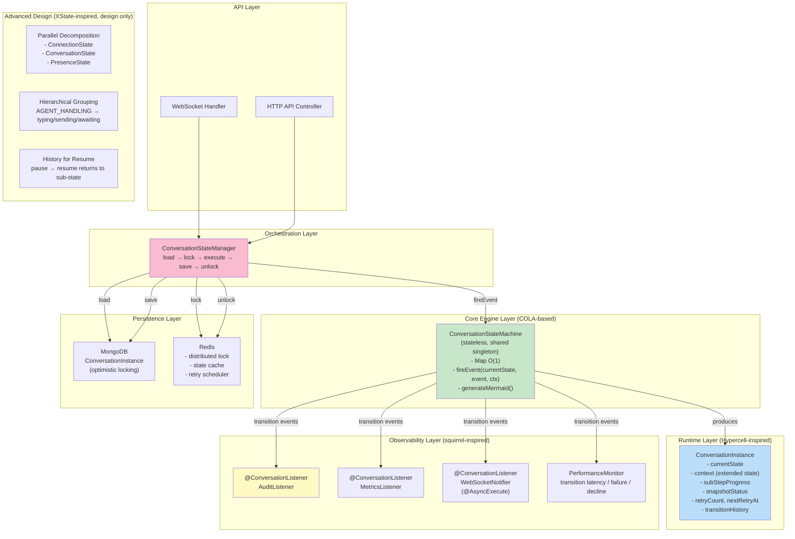
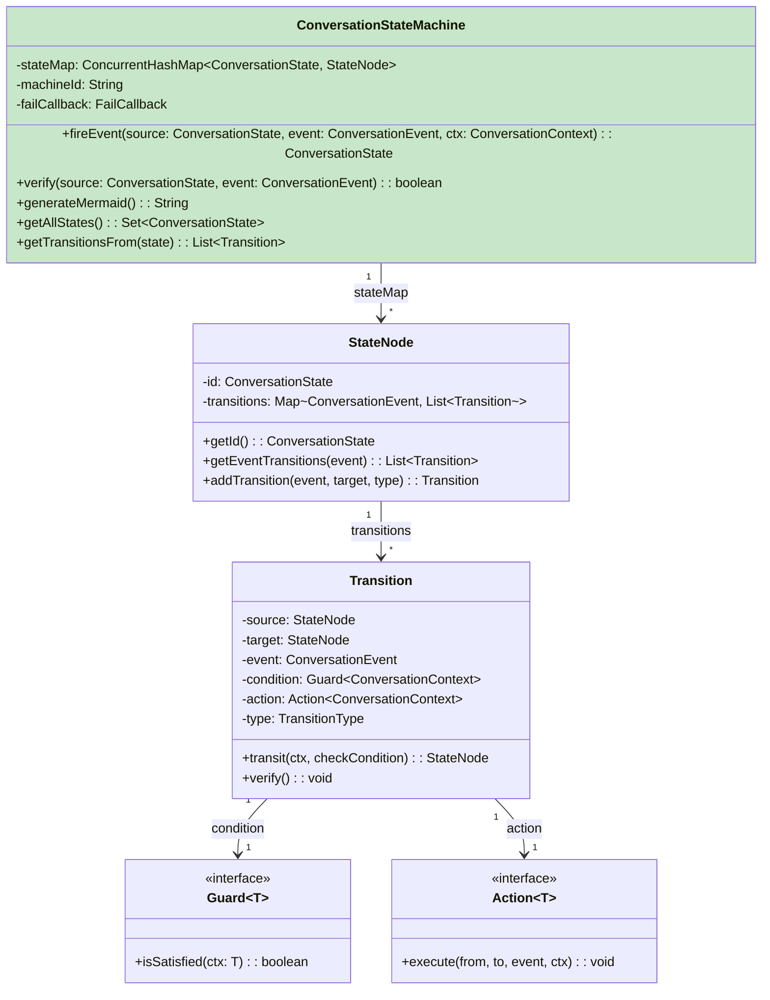
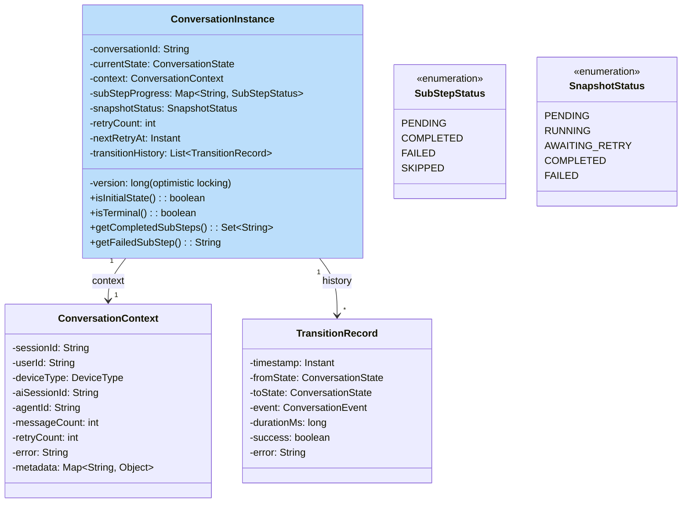
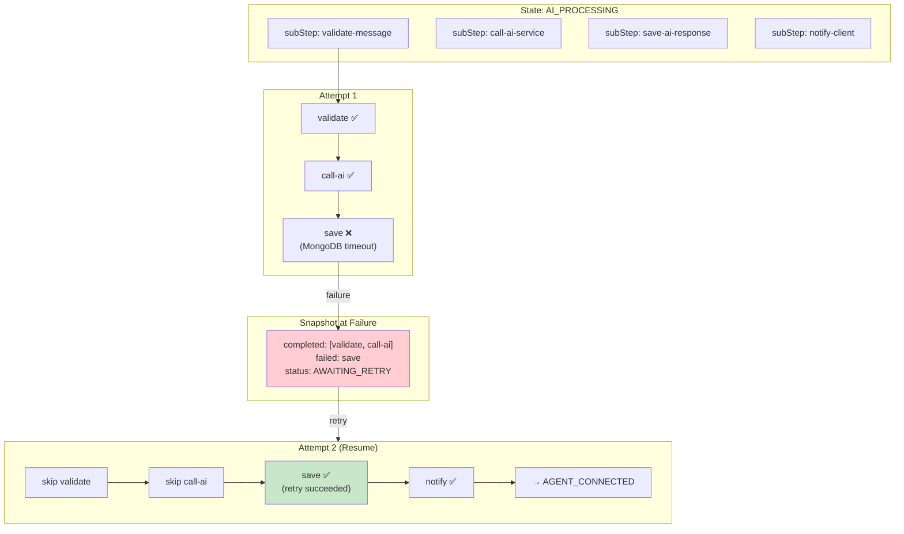
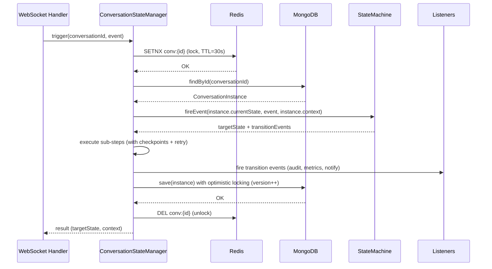
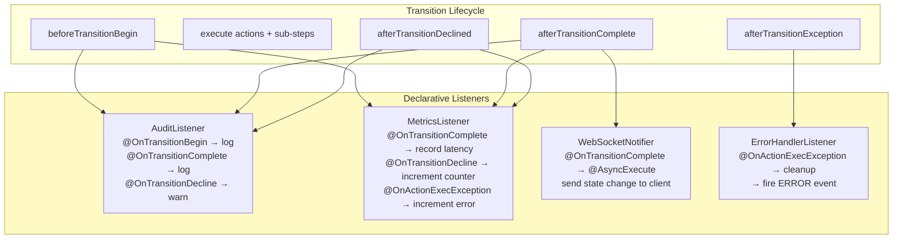
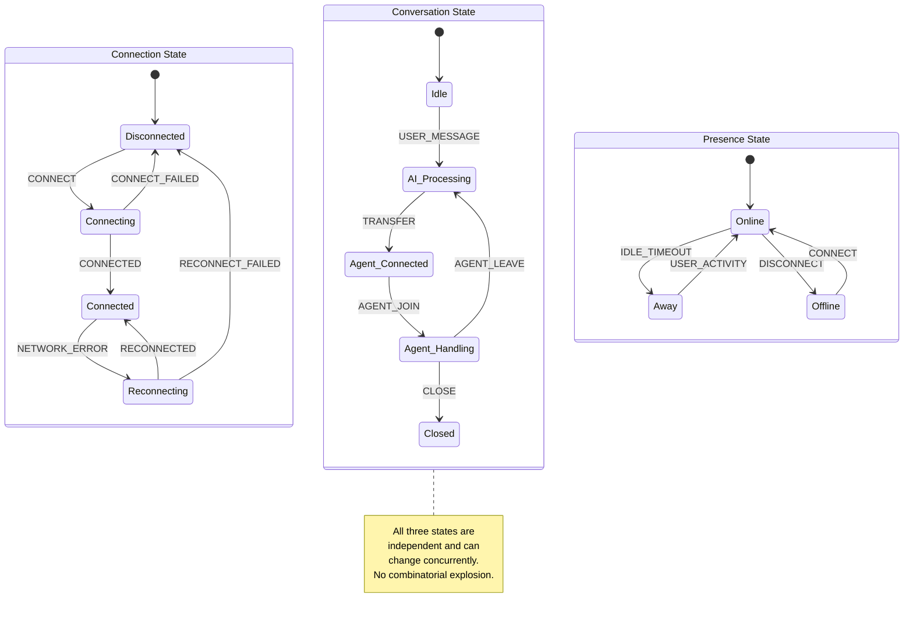
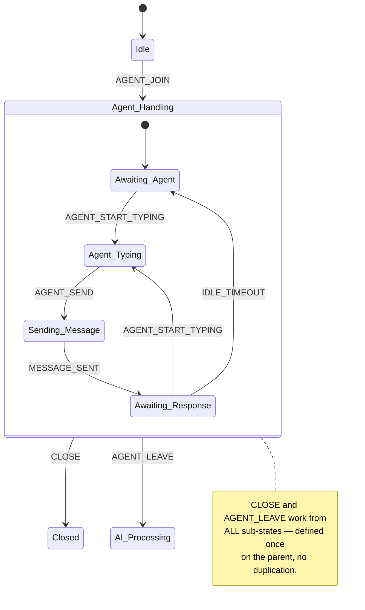
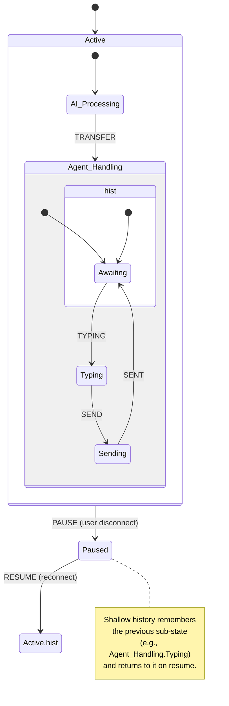
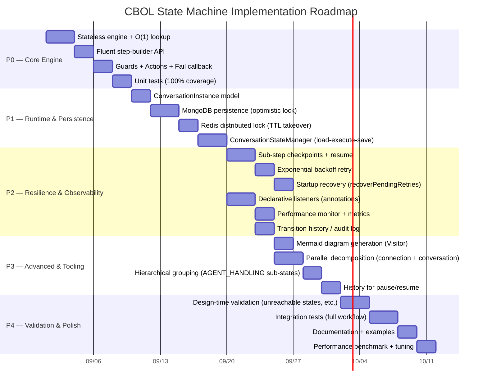

# CBOL Recommended State Machine Architecture

> Synthesis of COLA, XState, squirrel-foundation, and Hypercell FSM best practices into a recommended architecture for CBOL's conversation state machine.
>
> **Last updated**: 2026-08-26
> **Philosophy**: COLA core + Hypercell runtime + squirrel observability + XState design patterns

---

## 1. Architecture Overview



---

## 2. Core Engine (COLA-based)

### 2.1 Design

The core engine is **stateless** — it only stores transition rules, not current state. A single shared instance serves all conversations.



### 2.2 Key Decisions

| Decision | Choice | Rationale |
|----------|--------|-----------|
| **Statefulness** | Stateless | Thread-safe, shareable, minimal memory — essential for millions of concurrent conversations |
| **Lookup** | ConcurrentHashMap O(1) | Fast transition lookup, no locks for reads |
| **Dependencies** | Zero | No external libs — pure JDK, easy to audit and maintain |
| **Generic types** | `<S, E, C>` | Type-safe state, event, context |
| **Builder** | Step-builder (phased) | Compile-time API correctness — can't skip from/to |
| **Fail behavior** | Fail callback + stay in current state | No exceptions for invalid transitions — graceful degradation |

---

## 3. Runtime Layer (Hypercell-inspired)

### 3.1 ConversationInstance

Each conversation has a mutable instance persisted in MongoDB.



### 3.2 Sub-Step Checkpoint Pattern

For states that involve multiple service calls (e.g., AI processing, agent transfer), track each sub-step individually.



### 3.3 ConversationStateManager

The manager encapsulates the full load → lock → execute → save → unlock cycle.



---

## 4. Observability Layer (squirrel-inspired)

### 4.1 Declarative Listeners

Cross-cutting concerns (audit, metrics, notifications) are implemented as declarative listeners with annotations.



### 4.2 Extension Methods (Intrinsic Logic)

Logic that's intrinsic to the state machine (not cross-cutting) uses the Template Method pattern via extension methods.

```java
public class ConversationStateMachine extends AbstractStateMachine<...> {
    @Override
    protected void afterTransitionCompleted(from, to, event, ctx) {
        // Intrinsic: notify WebSocket client of state change
        websocketService.notifyStateChange(ctx.getSessionId(), to);
    }

    @Override
    protected void afterTransitionDeclined(from, event, ctx) {
        // Intrinsic: return error to client (invalid operation in current state)
        websocketService.sendError(ctx.getSessionId(),
            "Invalid operation: " + event + " in state " + from);
    }

    @Override
    protected void afterTransitionCausedException(e, from, to, event, ctx) {
        // Intrinsic: cleanup + transition to ERROR state
        cleanup(ctx);
        fire(ConversationEvent.ERROR, ctx);
    }
}
```

### 4.3 Performance Monitor

Built-in performance tracking for every transition:

| Metric | Description | Alert Threshold |
|--------|-------------|-----------------|
| `transition.count` | Total transitions per type | — |
| `transition.latency.p50` | Median transition latency | > 1ms |
| `transition.latency.p99` | P99 transition latency | > 10ms |
| `transition.failure.rate` | Failed transition rate | > 1% |
| `transition.decline.rate` | Declined (invalid) transition rate | > 5% |
| `substep.retry.count` | Sub-step retry count | > 3 per conversation |

---

## 5. Advanced Design (XState-inspired, design only)

### 5.1 Parallel Decomposition

Instead of one God state machine, maintain independent state for separate concerns.



### 5.2 Hierarchical Grouping

Within complex states, use conceptual sub-states to reduce transition duplication.



### 5.3 History for Resume

When a conversation is paused (user disconnects) and resumed, return to the previous sub-state instead of resetting.



---

## 6. Implementation Priority Roadmap



### Priority Summary

| Phase | Features | Source | Estimate |
|-------|----------|--------|----------|
| **P0 (Core)** | Stateless engine, O(1) lookup, fluent builder, guards, actions, fail callback | COLA | ~9 days |
| **P1 (Persistence)** | ConversationInstance, MongoDB persistence, Redis distributed lock, StateManager | Hypercell | ~10 days |
| **P2 (Resilience + Observability)** | Sub-step checkpoints, retry, startup recovery, declarative listeners, performance monitor, audit log | Hypercell + squirrel | ~14 days |
| **P3 (Advanced)** | Mermaid generation, parallel decomposition, hierarchical grouping, history | COLA + XState | ~9 days |
| **P4 (Validation)** | Design-time validation, integration tests, docs, benchmarks | leeoades/FunctionalStateMachine | ~10 days |
| **Total** | | | **~52 days** |

---

## 7. Key Design Principles

1. **Stateless core, stateful instance** — Engine is shared and stateless; each conversation's state lives in a persisted instance
2. **Checkpoint everything** — Every sub-step is tracked; failures resume from the last completed checkpoint
3. **Lock before execute** — Distributed lock prevents dual processing; TTL takeover handles crashed replicas
4. **Observe everything** — Declarative listeners for audit, metrics, notifications; transition history for debugging
5. **Retry with backoff** — Transient failures get exponential backoff retry; non-retryable errors fail fast
6. **Recover from restart** — In-flight retries are rescheduled after service restart
7. **Separate concerns** — Intrinsic logic in extension methods; cross-cutting concerns in declarative listeners
8. **Design for scale** — Parallel decomposition avoids combinatorial state explosion; hierarchical grouping reduces transition duplication

---

*CBOL Recommended Architecture — v1.0.0 — 2026-08-26*
*Synthesis of COLA (core) + Hypercell (runtime) + squirrel (observability) + XState (design patterns)*
