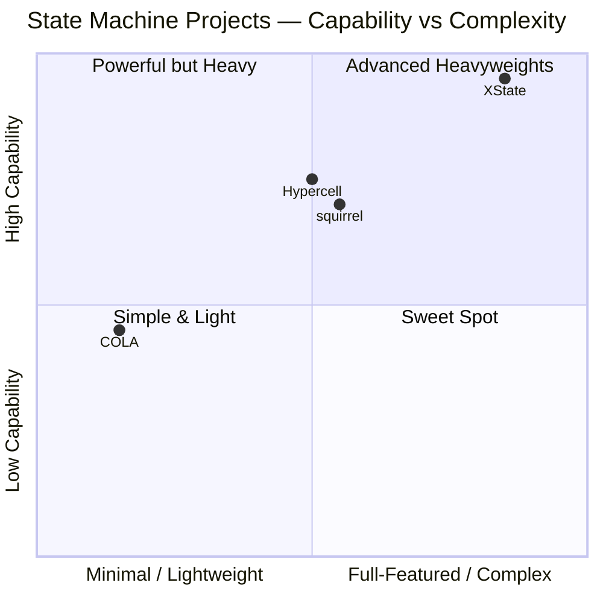
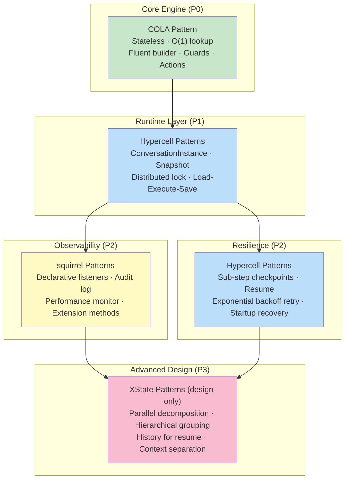

# State Machine Deep Analysis

> Source-code-level analysis of the best state machine projects, with architecture diagrams (Mermaid), comparative analysis, and actionable recommendations for CBOL.
>
> **Last updated**: 2026-08-26

## Document Index

| # | Document | Project | Focus |
|---|----------|---------|-------|
| 01 | [COLA StateMachine](./01-cola-statemachine.md) | alibaba/COLA | Stateless minimalist, O(1) lookup, zero-dep |
| 02 | [XState](./02-xstate.md) | statelyai/xstate | SCXML gold standard, statecharts + actor model |
| 03 | [squirrel-foundation](./03-squirrel-foundation.md) | hekailiang/squirrel | Enterprise diagnosable, declarative listeners, UML |
| 04 | [Hypercell FSM](./04-hypercell-fsm.md) | Hypercell-IT-Solutions/fsm-library | Distributed resumable, sub-step checkpoints, retry |
| 05 | [Comparative Analysis](./05-comparative-analysis.md) | All 4 | Architecture/API/performance/fit comparison |
| 06 | [CBOL Recommended Architecture](./06-cbol-recommended-architecture.md) | — | Synthesis: recommended design + roadmap |

## Quick Comparison

## CBOL Fit Scorecard

| Criterion | Weight | COLA | XState | squirrel | Hypercell |
|-----------|--------|------|--------|----------|-----------|
| High concurrency (stateless) | 30% | 10/10 | 5/10 | 5/10 | 6/10 |
| Java ecosystem | 20% | 10/10 | 0/10 | 10/10 | 10/10 |
| Distributed / resumable | 20% | 3/10 | 5/10 | 4/10 | 10/10 |
| Diagnosability | 10% | 4/10 | 8/10 | 10/10 | 8/10 |
| Advanced patterns | 10% | 2/10 | 10/10 | 8/10 | 2/10 |
| Lightweight / zero-dep | 10% | 10/10 | 9/10 | 6/10 | 5/10 |
| **Weighted score** | 100% | **7.3** | **5.9** | **6.5** | **7.0** |

## Recommended Synthesis

---

*State Machine Deep Analysis — v1.0.0 — 2026-08-26*
