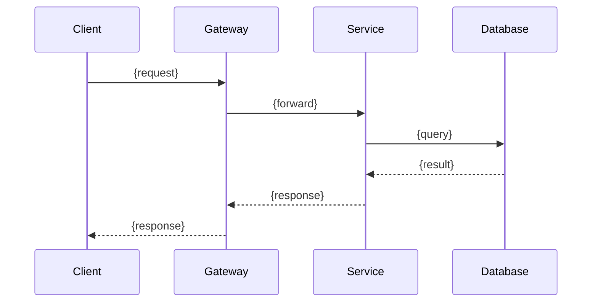

# SDD Generator

> Skill for Stage 2 of the ticket-to-deploy workflow: generate a Software Design Document (SDD) from requirements, injecting knowledge from the CBOL knowledge base.

## Purpose

Generate a comprehensive SDD for a CBOL ticket, based on the structured ticket output from Stage 0 and requirements analysis from Stage 1. The SDD must follow team conventions, reference relevant knowledge base documents, and be detailed enough to drive implementation in Stage 3.

## Input

| Parameter | Required | Description |
|-----------|----------|-------------|
| `jira_key` | Yes | Jira issue key, e.g. `CBOL-123` |
| `requirements_doc` | No | Path to requirements doc (default: `docs/operations/{KEY}/01-requirements-v{N}.md`) |
| `ticket_doc` | No | Path to ticket doc (default: `docs/operations/{KEY}/00-ticket.md`) |

## Output

1. **SDD document**: `design/sdd/{JIRA-KEY}.md`
2. **Operation log**: `docs/operations/{JIRA-KEY}/02-sdd-v{N}.md`

## SDD Template

```markdown
# SDD: {Ticket Summary} ({JIRA-KEY})

## 1. Requirements Understanding & Scope

### 1.1 Background
{Why this ticket exists, business context}

### 1.2 Goals
{What this feature/fix aims to achieve}

### 1.3 Non-Goals
{What is explicitly OUT of scope for this ticket}

### 1.4 Acceptance Criteria
{From ticket, refined}
1. {criterion}
...

### 1.5 Scope Boundaries
{System boundaries: what this change touches, what it doesn't}

## 2. Domain Model

### 2.1 Domain Entities
{Entities involved, their attributes and relationships}
- **{Entity}**: {attributes} — {relationships}

### 2.2 State Machine (if applicable)
{State transitions, reference 01-CBOL-Domain-Knowledge/state-machine/}
```
[State diagram or table]
```

### 2.3 Domain Rules
{Business rules, invariants}

## 3. Architecture Design

### 3.1 Component Impact
{Which components/modules are affected}
| Component | Change Type | Description |
|-----------|------------|-------------|
| {module} | New/Modify/Remove | {description} |

### 3.2 Architecture Pattern
{Pattern used, reference 02-Chat-Domain-Knowledge/architecture-patterns/}
- Pattern: {pattern name}
- Rationale: {why this pattern}
- Alternatives considered: {alternatives + why rejected}

### 3.3 Sequence Diagrams
{Key flows, Mermaid sequence diagrams}


## 4. Interface Design

### 4.1 REST API
{New/modified REST endpoints}
| Method | Path | Description | Request Body | Response |
|--------|------|-------------|-------------|----------|
| {GET/POST/PUT/DELETE} | {path} | {desc} | {schema} | {schema} |

### 4.2 WebSocket Events
{New/modified WebSocket events, reference 02/networking/}
| Event | Direction | Payload | Description |
|-------|-----------|---------|-------------|
| {event} | S→C/C→S | {schema} | {desc} |

### 4.3 Internal Interfaces
{Service-to-service, method signatures}

## 5. Data Model

### 5.1 Database Schema Changes
{New/modified tables, reference 02/storage-design/}
```sql
-- DDL
CREATE TABLE ... (
  ...
);
```

### 5.2 Index Design
{New indexes, reference Turms index design principles from 02/storage-design/message-storage.md}
| Table | Index | Type | Purpose |
|-------|-------|------|---------|
| {table} | {columns} | {B-tree/Hashed/Composite} | {purpose} |

### 5.3 Cache Design
{Redis keys, TTL, reference 02/data-structures/}
| Key Pattern | TTL | Purpose |
|------------|-----|---------|
| `cbol:{entity}:{id}` | {ttl} | {purpose} |

### 5.4 Migration Plan
{Data migration steps, backward compatibility}

## 6. Concurrency & Performance Design

### 6.1 Thread Model
{Thread pools, async patterns, reference 02/concurrency/ and 04/concurrency-guidelines.md}

### 6.2 Locking Strategy
{Locks, CAS, atomic operations, reference Turms lock-free design}

### 6.3 Performance Targets
{Latency, throughput targets}
| Metric | Target | Measurement |
|--------|--------|------------|
| {metric} | {target} | {how to measure} |

## 7. Security Design

### 7.1 Authentication & Authorization
{Auth changes, RBAC, reference 04/security-guidelines.md}

### 7.2 Input Validation
{Validation rules, sanitization}

### 7.3 Data Protection
{Encryption, masking, PII handling}

### 7.4 Rate Limiting
{Rate limits, reference Turms API rate limiting}

## 8. Error Handling & Logging

### 8.1 Error Codes
{New error codes, error responses}
| Code | HTTP Status | Message | Retryable |
|------|------------|---------|-----------|
| {code} | {status} | {message} | {yes/no} |

### 8.2 Exception Handling
{Exception hierarchy, reference 04/exception-and-logging.md}

### 8.3 Logging
{Log levels, key log points, structured logging fields}
| Point | Level | Fields |
|-------|-------|--------|
| {point} | {DEBUG/INFO/WARN/ERROR} | {fields} |

## 9. Test Strategy

### 9.1 Unit Tests
{Key units to test, test cases}
| Class/Method | Test Cases |
|-------------|-----------|
| {class} | {cases} |

### 9.2 Integration Tests
{Integration scenarios}

### 9.3 Edge Cases & Boundary Conditions
{Edge cases to cover}

### 9.4 Performance Tests
{If applicable}

## 10. Deployment & Configuration

### 10.1 Configuration Changes
{New config keys, defaults, reference 01/configuration/}
| Key | Default | Description |
|-----|---------|-------------|
| {key} | {default} | {desc} |

### 10.2 Deployment Impact
{Rolling update, backward compatibility, feature flags}

### 10.3 Rollback Plan
{How to rollback if issues}

## 11. Risks & Trade-offs

### 11.1 Technical Risks
| Risk | Likelihood | Impact | Mitigation |
|------|-----------|--------|------------|
| {risk} | {H/M/L} | {H/M/L} | {mitigation} |

### 11.2 Trade-offs
{Key design trade-offs, alternatives considered}
| Decision | Choice | Alternative | Trade-off |
|----------|--------|------------|-----------|
| {decision} | {choice} | {alternative} | {trade-off} |

## 12. References

### 12.1 Knowledge Base References
{Documents referenced from this knowledge base}
- `01-CBOL-Domain-Knowledge/...`
- `02-Chat-Domain-Knowledge/...`
- `03-Design-Guidelines/...`
- `04-Coding-Guidelines/...`

### 12.2 External References
{External docs, specs, open source projects}

### 12.3 Related Tickets
{Linked Jira tickets}
```

## Workflow

1. **Read inputs**: ticket doc + requirements doc
2. **Knowledge base retrieval**:
   - Read `01-CBOL-Domain-Knowledge/README.md` to identify domain area
   - Read relevant `01-CBOL-Domain-Knowledge/` subdirectories
   - Search `02-Chat-Domain-Knowledge/` by keywords from ticket
   - Read `03-Design-Guidelines/` (all documents)
   - Read relevant `04-Coding-Guidelines/` documents
3. **Generate SDD** following the template above
4. **Cross-reference**: ensure every design decision references a knowledge base doc or explains why no reference applies
5. **Write SDD** to `design/sdd/{JIRA-KEY}.md`
6. **Write operation log** to `docs/operations/{JIRA-KEY}/02-sdd-v{N}.md`
7. **Present summary** for Gate 2 human review

## Knowledge Injection Checklist

Before generating, the skill MUST have read:

- [ ] `01-CBOL-Domain-Knowledge/README.md`
- [ ] Relevant `01-CBOL-Domain-Knowledge/` subdirectories (domain-model, state-machine, api-definitions, etc.)
- [ ] `03-Design-Guidelines/design-principles.md`
- [ ] `03-Design-Guidelines/api-design-guidelines.md`
- [ ] `03-Design-Guidelines/architecture-principles.md`
- [ ] Relevant `02-Chat-Domain-Knowledge/` documents (by keyword match)
- [ ] `02-Chat-Domain-Knowledge/storage-design/message-storage.md` (if data changes)
- [ ] `02-Chat-Domain-Knowledge/networking/websocket-protocol.md` (if WS changes)
- [ ] `02-Chat-Domain-Knowledge/concurrency/README.md` (if concurrency changes)

## Quality Gates for SDD

The SDD is considered ready for review if ALL are true:
- [ ] Every acceptance criterion from the ticket has a corresponding design section
- [ ] Every new API endpoint has request/response schema defined
- [ ] Every database change has DDL + index design + migration plan
- [ ] Every concurrency-sensitive operation has locking strategy defined
- [ ] Security considerations are addressed (auth, validation, rate limiting)
- [ ] Error codes and logging are defined
- [ ] Test strategy covers unit + integration + edge cases
- [ ] Risks and trade-offs are documented
- [ ] At least 3 knowledge base documents are referenced

If any fail, the skill should note the gap in the operation log and flag for human attention.

## Usage

```
/sdd-generator jira_key=CBOL-123
```

## Related Skills

- `workflow-ticket-to-deploy` — Orchestrator that invokes this skill at Stage 2
- `jira-ticket-fetcher` — Provides structured ticket input
- `code-analyzer` — Used in Stage 3/4 to verify implementation against SDD

## References

- SDD best practices: https://en.wikipedia.org/wiki/Software_design_description
- OpenSpec (SDD framework): https://lmmartinb.com/sdd-openspec/
- Forge (reference): https://github.com/forge-sdlc/forge (PRD + Behavioral Spec generation)
- ai-coding-workflow (reference): https://github.com/wenttt/ai-coding-workflow (design-in-Issues pattern)
