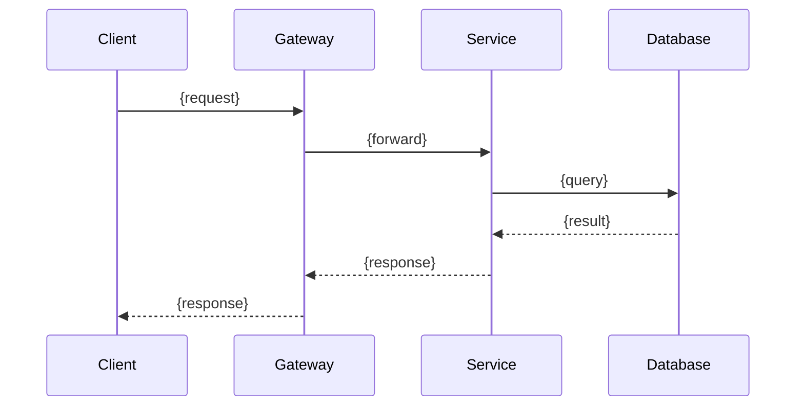

# SDD: {Ticket Summary} ({JIRA-KEY})

## 1. Requirements Understanding & Scope

### 1.1 Background
{Why this ticket exists, business context}

### 1.2 Goals
{What this feature/fix aims to achieve}

### 1.3 Non-Goals
{What is explicitly OUT of scope for this ticket}

### 1.4 Acceptance Criteria
{From ticket, refined}
1. {criterion}
2. {criterion}

### 1.5 Scope Boundaries
{System boundaries: what this change touches, what it doesn't}

## 2. Domain Model

### 2.1 Domain Entities
{Entities involved, their attributes and relationships}
- **{Entity}**: {attributes} — {relationships}

### 2.2 State Machine (if applicable)
{State transitions, reference 01-CBOL-Domain-Knowledge/state-machine/}
```
[State diagram or table]
```

### 2.3 Domain Rules
{Business rules, invariants}

## 3. Architecture Design

### 3.1 Component Impact
{Which components/modules are affected}
| Component | Change Type | Description |
|-----------|------------|-------------|
| {module} | New/Modify/Remove | {description} |

### 3.2 Architecture Pattern
{Pattern used, reference 02-Chat-Domain-Knowledge/architecture-patterns/}
- Pattern: {pattern name}
- Rationale: {why this pattern}
- Alternatives considered: {alternatives + why rejected}

### 3.3 Sequence Diagrams
{Key flows, Mermaid sequence diagrams}


## 4. Interface Design

### 4.1 REST API
{New/modified REST endpoints}
| Method | Path | Description | Request Body | Response |
|--------|------|-------------|-------------|----------|
| {GET/POST/PUT/DELETE} | {path} | {desc} | {schema} | {schema} |

### 4.2 WebSocket Events
{New/modified WebSocket events, reference 02/networking/}
| Event | Direction | Payload | Description |
|-------|-----------|---------|-------------|
| {event} | S→C/C→S | {schema} | {desc} |

### 4.3 Internal Interfaces
{Service-to-service, method signatures}

## 5. Data Model

### 5.1 Database Schema Changes
{New/modified tables, reference 02/storage-design/}
```sql
-- DDL
CREATE TABLE ... (
  ...
);
```

### 5.2 Index Design
{New indexes, reference Turms index design principles}
| Table | Index | Type | Purpose |
|-------|-------|------|---------|
| {table} | {columns} | {B-tree/Hashed/Composite} | {purpose} |

### 5.3 Cache Design
{Redis keys, TTL, reference 02/data-structures/}
| Key Pattern | TTL | Purpose |
|------------|-----|---------|
| `cbol:{entity}:{id}` | {ttl} | {purpose} |

### 5.4 Migration Plan
{Data migration steps, backward compatibility}

## 6. Concurrency & Performance Design

### 6.1 Thread Model
{Thread pools, async patterns, reference 02/concurrency/}

### 6.2 Locking Strategy
{Locks, CAS, atomic operations, reference Turms lock-free design}

### 6.3 Performance Targets
{Latency, throughput targets}
| Metric | Target | Measurement |
|--------|--------|------------|
| {metric} | {target} | {how to measure} |

## 7. Security Design

### 7.1 Authentication & Authorization
{Auth changes, RBAC, reference 04/security-guidelines.md}

### 7.2 Input Validation
{Validation rules, sanitization}

### 7.3 Data Protection
{Encryption, masking, PII handling}

### 7.4 Rate Limiting
{Rate limits, reference Turms API rate limiting}

## 8. Error Handling & Logging

### 8.1 Error Codes
{New error codes, error responses}
| Code | HTTP Status | Message | Retryable |
|------|------------|---------|-----------|
| {code} | {status} | {message} | {yes/no} |

### 8.2 Exception Handling
{Exception hierarchy, reference 04/exception-and-logging.md}

### 8.3 Logging
{Log levels, key log points, structured logging fields}
| Point | Level | Fields |
|-------|-------|--------|
| {point} | {DEBUG/INFO/WARN/ERROR} | {fields} |

## 9. Test Strategy

### 9.1 Unit Tests
{Key units to test, test cases}
| Class/Method | Test Cases |
|-------------|-----------|
| {class} | {cases} |

### 9.2 Integration Tests
{Integration scenarios}

### 9.3 Edge Cases & Boundary Conditions
{Edge cases to cover}

### 9.4 Performance Tests
{If applicable}

## 10. Deployment & Configuration

### 10.1 Configuration Changes
{New config keys, defaults, reference 01/configuration/}
| Key | Default | Description |
|-----|---------|-------------|
| {key} | {default} | {desc} |

### 10.2 Deployment Impact
{Rolling update, backward compatibility, feature flags}

### 10.3 Rollback Plan
{How to rollback if issues}

## 11. Risks & Trade-offs

### 11.1 Technical Risks
| Risk | Likelihood | Impact | Mitigation |
|------|-----------|--------|------------|
| {risk} | {H/M/L} | {H/M/L} | {mitigation} |

### 11.2 Trade-offs
{Key design trade-offs, alternatives considered}
| Decision | Choice | Alternative | Trade-off |
|----------|--------|------------|-----------|
| {decision} | {choice} | {alternative} | {trade-off} |

## 12. References

### 12.1 Knowledge Base References
{Documents referenced from this knowledge base}
- `01-CBOL-Domain-Knowledge/...`
- `02-Chat-Domain-Knowledge/...`
- `03-Design-Guidelines/...`
- `04-Coding-Guidelines/...`

### 12.2 External References
{External docs, specs, open source projects}

### 12.3 Related Tickets
{Linked Jira tickets}
