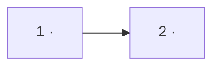

# Roadmap — <repo>

> **A decomposition, not a promise.** The overall idea broken into incremental steps: what each
> step is, where it comes from, what it depends on, and in which order — and parallel lanes — we
> walk them. **No dates** (except shipped history), **no scores** — order is the prioritization.
> The *solution* for any step lives in its `docs/features/<slug>/` spec, not here.

## Steps

<!-- instruction: the idea decomposed into vertical, buildable increments. One ROW each.
Source = the section of the idea-brief/PRD/canon that justifies the step (no anchor → no step).
Size per _shared/size-matrix.md. Depends on = step ids with a defensible one-line reason (kept in
the graph section). Status ∈ idea | spec'd | building | shipped — specify/ship keep it current. -->

| # | Step | Source | Size | Depends on | Status |
|---|---|---|:---:|:---:|---|
| 1 | <increment — what the user can do after it> | <doc §> | S | — | idea |
| 2 | <increment> | <doc §> | M | 1 | idea |

## Dependency graph

<!-- instruction: mermaid flowchart of the step ids; every edge labeled with its one-line reason
(data model / UI zone / auth precondition / …). Presented in prose in the terminal, written here. -->

## Execution path

<!-- instruction: waves that respect the graph — wave N holds only steps whose deps are in
earlier waves; steps inside one wave are conflict-safe (different modules / UI zones), so they
can run as parallel lanes (e.g. git worktrees). Zone names the code area that makes it safe. -->

| Wave | Steps | Zone per step (why parallel-safe) | Unlocks |
|:---:|---|---|---|
| 1 | 1 | <module/zone> | 2, 3 |
| 2 | 2 ∥ 3 | 2: <zone> · 3: <zone> (disjoint) | 4 |

## Shipped

<!-- instruction: history — the only place dates are allowed. -->

| Step | Shipped | Link |
|---|---|---|
| <step> | <YYYY-MM-DD> | <PR/changelog> |
