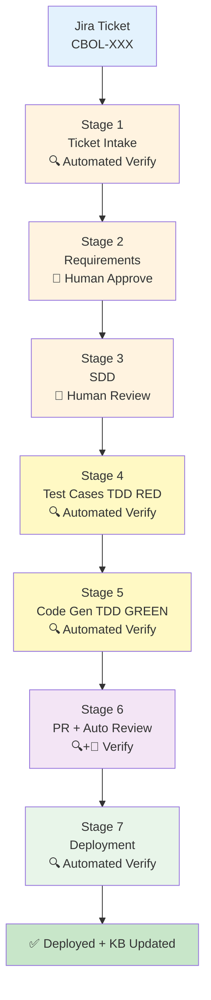
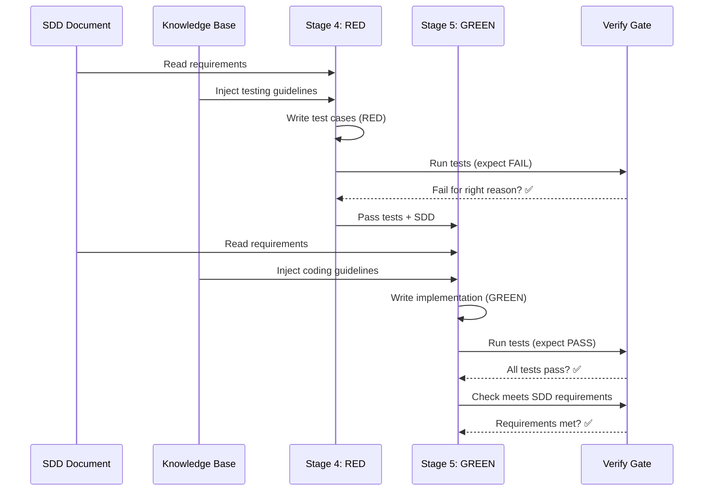
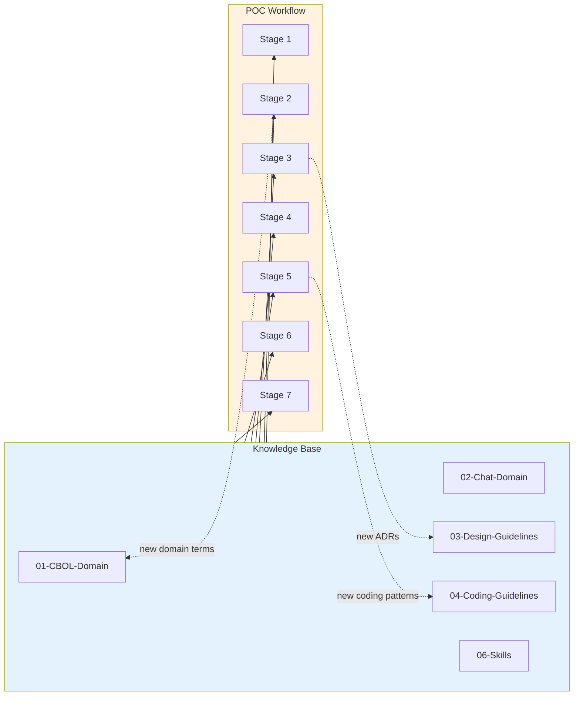

# POC Workflow

> Proof-of-Concept AI-driven development workflow for CBOL Messaging Hub. Jira ticket → requirements → SDD → test cases (TDD) → code → PR review → deployment. Every stage has mandatory verification gates. Knowledge base is read at every stage and updated when new patterns are discovered.

## Pipeline Overview



## Key Features

| Feature | Description |
|---------|-------------|
| **7-stage pipeline** | Ticket → Requirements → SDD → Tests → Code → PR → Deploy |
| **Verify gates** | Every stage has mandatory verify checks before progression |
| **TDD enforced** | Tests (RED) written and proven failing before code (GREEN) |
| **Human-in-the-loop** | Stages 2 (requirements) and 3 (SDD) require human approval |
| **Knowledge base integration** | KB read at every stage; new patterns written back (Stages 2, 3, 5) |
| **3-strike escalation** | Any stage fails 3 times → STOP and escalate to human |
| **State persistence** | Pipeline state saved after every stage, resumable from breakpoint |
| **Operation logs** | Every stage writes structured operation log with commands + output + exit codes |
| **OpenCode compatible** | Command + skill for running in OpenCode |
| **Mermaid diagrams** | Architecture, flow, state diagrams throughout |

## Directory Structure

```
poc-workflow/
├── README.md                          # This file
├── workflow-spec.md                   # Full pipeline specification (17KB)
├── jira-ticket-spec.md                # Jira ticket format specification
├── verify-checklist.md                # Comprehensive verify gate checklists (12KB)
├── knowledge-integration.md           # KB read/write protocol (8KB)
├── stages/
│   ├── 01-ticket-intake.md            # Stage 1: Fetch + validate Jira ticket
│   ├── 02-requirements.md             # Stage 2: Generate requirements doc (human approve)
│   ├── 03-sdd.md                      # Stage 3: Generate SDD (human review)
│   ├── 04-test-cases.md               # Stage 4: TDD RED phase (write failing tests)
│   ├── 05-code-generation.md          # Stage 5: TDD GREEN phase (write passing code)
│   ├── 06-pr-review.md                # Stage 6: Create PR + auto review
│   └── 07-deployment.md               # Stage 7: Auto deploy + post-deploy verify
└── opencode/
    ├── commands/
    │   └── poc-workflow.md            # OpenCode /poc-workflow command
    └── skills/
        └── poc-pipeline/
            └── SKILL.md                # OpenCode POC pipeline skill (10KB)
```

## Quick Start

### Prerequisites

1. Jira API credentials configured in `.ai-workflow/config.yaml`
2. Knowledge base directories exist (`01-` through `06-`)
3. Git repository initialized with remote
4. OpenCode installed (for command/skill execution)

### Run in OpenCode

```bash
# Full pipeline from Jira ticket
/poc-workflow jira_key=CBOL-123

# Start from specific stage
/poc-workflow jira_key=CBOL-123 stage=3

# Resume from saved state
/poc-workflow jira_key=CBOL-123 resume=true
```

### Run with Skill

```bash
# The poc-pipeline skill will be triggered by:
# "run poc workflow", "poc pipeline", "jira to deploy"
```

## Pipeline Stages Detail

| Stage | Name | Input | Output | Verify | KB Access |
|-------|------|-------|--------|--------|-----------|
| 1 | Ticket Intake | Jira key | Normalized ticket JSON | Automated | Read |
| 2 | Requirements | Ticket + KB | Requirements doc | Human approve | Read + Write |
| 3 | SDD | Req + KB + codebase | SDD document | Human review | Read + Write |
| 4 | Test Cases (TDD) | SDD + KB | Test files (RED) | Automated | Read |
| 5 | Code Generation (TDD) | SDD + tests + KB | Code (GREEN) | Automated | Read + Write |
| 6 | PR + Auto Review | Code + tests | PR + review report | Auto + Human | Read |
| 7 | Deployment | Merged PR | Deployed service | Automated | Read |

## TDD Enforcement (Stages 4-5)



**RED Rules (Stage 4)**:
- ✅ Write tests FIRST
- ✅ Tests MUST fail (run to confirm)
- ✅ Failure MUST be assertion failure (not compile error)
- ❌ NO production code

**GREEN Rules (Stage 5)**:
- ✅ Write MINIMAL code to pass tests
- ✅ Do NOT modify tests
- ✅ All tests MUST pass
- ✅ Coverage >= 80% line / 70% branch
- ❌ NO code outside SDD scope

## Knowledge Base Integration



**Read at every stage**: Relevant KB docs injected as context before each stage.

**Write back at Stages 2, 3, 5**:
- Stage 2 → New domain terms → `01-CBOL-Domain-Knowledge/glossary/`
- Stage 3 → New ADRs → `03-Design-Guidelines/06-design-process/adr/`
- Stage 5 → New coding patterns → `04-Coding-Guidelines/`

## Verify Gates

Every stage has mandatory verify checks. See [`verify-checklist.md`](./verify-checklist.md) for full checklist.

| Gate | Type | Key Criteria |
|------|------|-------------|
| 1: Ticket Valid | Automated | All mandatory fields present, valid type, domain label, FRs + ACs |
| 2: Requirements Approved | Human | Doc generated, all FRs/ACs captured, human explicitly approves |
| 3: SDD Reviewed | Human | Architecture diagram, data model, API design, implementation plan, human approves |
| 4: RED Confirmed | Automated | Tests exist, fail for right reason (assertion, not compile), no production code |
| 5: GREEN + Reqs Met | Automated | All tests pass, coverage >= 80%/70%, code quality, security, requirements met |
| 6: Review PASS | Auto + Human | PR created, CI pass, auto review PASS, human approves |
| 7: Deploy Healthy | Automated | Deployment complete, health check PASS, smoke tests PASS, monitoring normal |

## Escalation Protocol

If any stage fails verify 3 times:

1. **STOP** pipeline
2. **Save** current state
3. **Create** escalation ticket in Jira
4. **Notify** human with:
   - Pipeline ID and Jira key
   - Stage that failed
   - Last 3 verify reports
   - Suggested resolutions
5. **Wait** for human intervention
6. **Resume** from saved state

## State Management

Pipeline state saved in `docs/operations/{JIRA_KEY}/pipeline-state.json`:

```json
{
  "pipeline_id": "CBOL-123-20260821-abc123",
  "jira_key": "CBOL-123",
  "current_stage": 3,
  "status": "in_progress",
  "stages": {
    "1_ticket_intake": { "status": "completed", "verify_passed": true },
    "2_requirements": { "status": "completed", "verify_passed": true },
    "3_sdd": { "status": "in_progress", "verify_passed": false }
  }
}
```

Resume with `resume=true` argument.

## Operation Logs

Every stage writes structured operation log to `docs/operations/{JIRA_KEY}/0{STAGE}-*/operation-log.md`:

- KB docs read
- KB search queries
- Steps executed (command + output + exit code)
- KB updates written
- Artifacts produced
- Verify gate results

## References

- [Workflow Specification](./workflow-spec.md) — Full pipeline specification
- [Jira Ticket Spec](./jira-ticket-spec.md) — Ticket format specification
- [Stage Documents](./stages/) — Detailed stage-by-stage docs
- [Verify Checklist](./verify-checklist.md) — Comprehensive verify gate checklists
- [Knowledge Integration](./knowledge-integration.md) — KB read/write protocol
- [OpenCode Command](./opencode/commands/poc-workflow.md) — `/poc-workflow` command
- [OpenCode Skill](./opencode/skills/poc-pipeline/SKILL.md) — POC pipeline skill

### Related Documents

- [CBOL Ticket-to-Deploy Pipeline](../ticket-to-deploy-workflow.md) — Full pipeline specification
- [Reference Workflows](../reference-workflows.md) — 10 reference projects comparison
- [Best Practices](../best-practices.md) — Synthesized best practices
- [Reference Analysis](../reference-analysis/) — Deep per-project analysis

---

*POC Workflow v1.0.0 — 2026-08-21*
*CBOL Refactor (Self-Development) — AI Messaging Hub*
