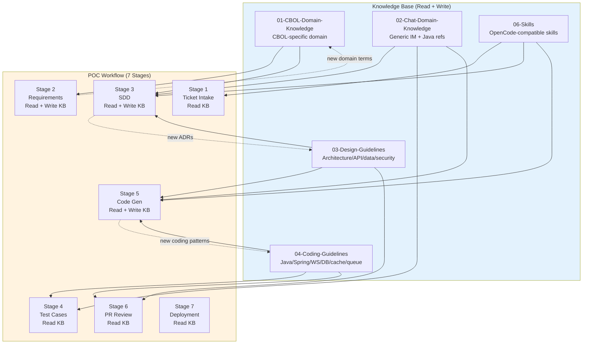

# Knowledge Base Integration

> How the POC workflow reads from and writes to the knowledge base at every stage. Bidirectional KB integration ensures the workflow learns from experience.

## Integration Overview



## Read Protocol

### When to Read KB

1. **Before every stage starts** — Read relevant KB docs as context
2. **When encountering unknown concepts** — Search KB for definitions/patterns
3. **When making design decisions** — Read design guidelines and ADRs
4. **When writing code** — Read coding standards and conventions
5. **When reviewing** — Read quality and security checklists

### How to Read KB

1. **Identify relevant docs** — Based on:
   - Ticket labels (domain labels map to KB directories)
   - Current stage (each stage has mandatory KB docs)
   - Keywords in ticket/requirements/SDD
2. **Search KB** — Use keyword search across all KB directories
3. **Read docs** — Read full content of relevant docs
4. **Extract key points** — Summarize key constraints, patterns, conventions
5. **Inject into context** — Use extracted knowledge in current stage work

### Stage-Specific Mandatory Reads

| Stage | Mandatory KB Docs |
|-------|-------------------|
| 1 | `06-Skills/02-code-analysis/` (ticket parser), `jira-ticket-spec.md` |
| 2 | `01-CBOL-Domain-Knowledge/README.md`, `02-Chat-Domain-Knowledge/` (search by label), `03-Design-Guidelines/06-design-process/sdd-template.md` |
| 3 | `03-Design-Guidelines/` (ALL), `01-CBOL-Domain-Knowledge/state-machine/`, `02-Chat-Domain-Knowledge/websocket/`, `06-Skills/02-code-analysis/architecture-analyzer/` |
| 4 | `04-Coding-Guidelines/07-testing/` (ALL), `02-Chat-Domain-Knowledge/` (test patterns), `03-Design-Guidelines/05-reliability/` |
| 5 | `04-Coding-Guidelines/` (ALL relevant), `03-Design-Guidelines/` (ALL), `01-CBOL-Domain-Knowledge/` (domain logic), `02-Chat-Domain-Knowledge/` (IM patterns) |
| 6 | `04-Coding-Guidelines/06-quality-ops/`, `04-Coding-Guidelines/05-security/`, `03-Design-Guidelines/04-security-design/`, `03-Design-Guidelines/05-reliability/` |
| 7 | `03-Design-Guidelines/05-reliability/` (ALL), `04-Coding-Guidelines/` (deployment-related) |

## Write Protocol

### When to Write KB

1. **New domain terms discovered** — Stage 2 (requirements)
2. **New ADRs created** — Stage 3 (SDD)
3. **New coding patterns discovered** — Stage 5 (code generation)
4. **New testing patterns discovered** — Stage 4 (test cases)
5. **New deployment patterns discovered** — Stage 7 (deployment)
6. **Errors/mistakes learned from** — Any stage (after escalation/resolution)

### How to Write KB

1. **Identify new knowledge** — Determine what is genuinely new (not already in KB)
2. **Determine target directory** — Map new knowledge to appropriate KB directory
3. **Draft document** — Follow existing format/conventions in target directory
4. **Verify quality** — Ensure doc is accurate, complete, follows conventions
5. **Commit separately** — KB updates committed separately from code changes
6. **Reference in operation log** — Pipeline operation log references KB update commit

### Write Targets by Stage

| Stage | Write Target | What to Write |
|-------|-------------|---------------|
| 2 | `01-CBOL-Domain-Knowledge/glossary/` | New domain terms, definitions |
| 3 | `03-Design-Guidelines/06-design-process/adr/` | New ADRs (Architecture Decision Records) |
| 4 | `04-Coding-Guidelines/07-testing/` | New testing patterns, test strategies |
| 5 | `04-Coding-Guidelines/` (relevant subdir) | New coding patterns, conventions |
| 6 | `04-Coding-Guidelines/06-quality-ops/` | New quality rules, review checklists |
| 7 | `03-Design-Guidelines/05-reliability/` | New deployment, observability patterns |

### KB Write Rules

1. ✅ **Only write genuinely new knowledge** — Don't duplicate existing docs
2. ✅ **Follow existing format** — Match conventions of target directory
3. ✅ **Commit separately** — KB updates in separate commits from code
4. ✅ **Reference in operation log** — Pipeline log references KB update commit
5. ✅ **Keep concise** — KB docs should be focused, not overly verbose
6. ❌ **Don't write incomplete docs** — Draft fully before committing
7. ❌ **Don't modify existing docs without review** — Changes to existing KB docs need human review
8. ❌ **Don't write secrets/sensitive info** — KB is committed to git

## KB Search Protocol

### Keyword Search

When searching KB for relevant docs:

1. **Extract keywords** — From ticket, requirements, SDD, or current task
2. **Search across all KB dirs** — Use `grep` or similar:
   ```bash
   grep -r "keyword" 01-CBOL-Domain-Knowledge/ 02-Chat-Domain-Knowledge/ 03-Design-Guidelines/ 04-Coding-Guidelines/
   ```
3. **Read matching docs** — Read full content of docs with keyword matches
4. **Follow references** — If doc references other docs, read those too
5. **Summarize findings** — Extract key points for current stage

### Label-Based Search

Ticket domain labels directly map to KB directories:

| Ticket Label | KB Directory |
|--------------|-------------|
| `message-reception` | `01-CBOL-Domain-Knowledge/message-reception/` |
| `message-management` | `01-CBOL-Domain-Knowledge/message-management/` |
| `message-forwarding` | `01-CBOL-Domain-Knowledge/message-forwarding/` |
| `websocket` | `02-Chat-Domain-Knowledge/websocket/` |
| `state-machine` | `01-CBOL-Domain-Knowledge/state-machine/` |
| `ai-processing` | `01-CBOL-Domain-Knowledge/ai-processing/` |
| `agent-transfer` | `01-CBOL-Domain-Knowledge/agent-transfer/` |
| `database` | `03-Design-Guidelines/03-data-design/` |
| `api` | `03-Design-Guidelines/02-api-design/` |
| `security` | `03-Design-Guidelines/04-security-design/` |
| `performance` | `03-Design-Guidelines/05-reliability/` |

## KB Injection Log Format

Every stage records KB injection in its operation log:

```markdown
## KB Docs Read
- `01-CBOL-Domain-Knowledge/README.md` — Domain context
- `02-Chat-Domain-Knowledge/websocket/websocket-protocol.md` — WebSocket design
- `03-Design-Guidelines/02-api-design/rest-api-guidelines.md` — API standards
- `04-Coding-Guidelines/01-java/java-coding-standards.md` — Java conventions

## KB Search Queries
- "message forwarding pattern" → 3 docs found
- "websocket reconnection" → 2 docs found

## KB Updates Written
- `01-CBOL-Domain-Knowledge/glossary/message-routing.md` — New term: message routing
- Commit: `abc1234`
```

## KB Quality Assurance

### Before Writing to KB

- [ ] Is this genuinely new knowledge? (search KB first)
- [ ] Does it follow existing format? (read similar docs)
- [ ] Is it accurate and complete? (verify against sources)
- [ ] Is it concise and focused? (avoid verbosity)
- [ ] No secrets/sensitive info? (security check)

### After Writing to KB

- [ ] Doc committed separately from code
- [ ] Operation log references KB update commit
- [ ] Doc is discoverable (proper location, naming)
- [ ] Doc follows directory naming convention (kebab-case, English)
- [ ] Doc has proper header/metadata

---

*Knowledge Base Integration v1.0.0 — 2026-08-21*
