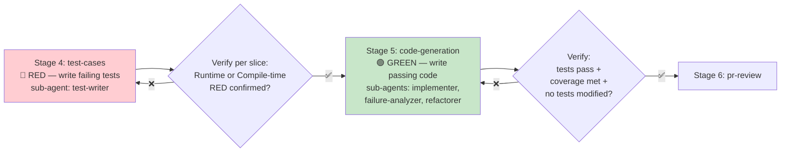

# POC Workflow Skills

> 7 independently executable OpenCode skills for the POC workflow. Each skill corresponds to one pipeline stage and can be run separately or orchestrated by the poc-pipeline skill.
>
> **v2.0.0** — Optimized with GitHub best practices: standardized frontmatter with `allowed-tools`, CRITICAL rules sections, interactive checkpoints, sub-agent isolation patterns, find-then-verify review pipeline, confidence scoring, dry-run-by-default deployment, and progress persistence.

## Skill Index

| # | Skill | Stage | Description | Verify Type | KB Access | Key v2.0 Features | File |
|---|-------|-------|-------------|-------------|-----------|-------------------|------|
| 1 | `ticket-intake` | Stage 1 | Fetch and validate Jira ticket, normalize to JSON | Automated | Read | MCP-first dual-path, interactive checkpoints | [SKILL.md](./ticket-intake/SKILL.md) |
| 2 | `requirements` | Stage 2 | Generate requirements doc from ticket + KB, human approval | Human | Read + Write | Socratic questioning (depth dial), human approval enforcement | [SKILL.md](./requirements/SKILL.md) |
| 3 | `sdd` | Stage 3 | Generate SDD with architecture diagrams, data model, API, ADRs, human review | Human | Read + Write | Research-before-design, ADRs, human review enforcement | [SKILL.md](./sdd/SKILL.md) |
| 4 | `test-cases` | Stage 4 | TDD RED phase — write failing tests, verify they fail for right reason | Automated | Read | Sub-agent isolation, per-slice progress, Runtime+Compile RED validation | [SKILL.md](./test-cases/SKILL.md) |
| 5 | `code-generation` | Stage 5 | TDD GREEN phase — write code to pass tests, verify coverage + requirements | Automated | Read + Write | Implementer/failure-analyzer/refactorer pattern, strict no-test-modification | [SKILL.md](./code-generation/SKILL.md) |
| 6 | `pr-review` | Stage 6 | Create PR, auto review (5 axes), human approval | Auto + Human | Read | Find-then-verify pipeline, confidence scoring (>=0.7), severity classification | [SKILL.md](./pr-review/SKILL.md) |
| 7 | `deployment` | Stage 7 | Auto deploy, health check, smoke tests, rollback if needed | Automated | Read | Dry-run by default, staging→production, automatic rollback, 10min monitoring | [SKILL.md](./deployment/SKILL.md) |

## Orchestration Skill

The [poc-pipeline skill](./poc-pipeline/SKILL.md) orchestrates all 7 skills into a complete pipeline. Use it when you want to run the full workflow from Jira ticket to deployment.

## v2.0 Optimization Summary

All 7 skills were optimized based on GitHub best practices from leading skill projects:

### 1. Standardized Frontmatter
- Added `allowed-tools` with precise tool scoping (e.g., `Bash(mvn:*)` instead of bare `Bash`)
- Standard fields only: `name`, `description`, `allowed-tools`
- Security signal + discoverability signal — Claude prefers skills whose tool surface matches the request

### 2. CRITICAL Rules Section
- Every skill has a `## CRITICAL RULES` section at the top
- Non-negotiable rules that must be followed
- Examples: "NEVER modify tests", "DRY-RUN BY DEFAULT", "HUMAN APPROVAL REQUIRED"

### 3. Interactive Checkpoints
- After every major step, skill asks user for confirmation before proceeding
- Options: [Continue] [View details] [Stop]
- Prevents the skill from running off without user awareness
- Reference: [or-ituran/claude-tdd-skill](https://github.com/or-ituran/claude-tdd-skill) interactive TDD workflow

### 4. Sub-Agent Isolation Pattern (Skills 4-5)
- TDD skills use sub-agent pattern: test-writer, implementer, failure-analyzer, refactorer
- Each sub-agent has a focused responsibility
- Main orchestrator only manages flow, progress, and user prompts
- Reference: [or-ituran/claude-tdd-skill](https://github.com/or-ituran/claude-tdd-skill) architecture

### 5. Progress Persistence (Skills 4-5)
- TDD progress saved to `tdd-progress.md` / `implementation-progress.md`
- Per-slice tracking with status, files, verification
- Resume from any point
- Reference: [or-ituran/claude-tdd-skill](https://github.com/or-ituran/claude-tdd-skill) progress.md format

### 6. Find-Then-Verify Review Pipeline (Skill 6)
- Phase 1: FIND — scan for potential issues across 5 axes
- Phase 2: VERIFY — validate each finding, read context, check KB
- Only report verified findings with confidence >= 0.7
- Reduces false positives significantly
- Reference: [gthimmes/code-reviewer](https://github.com/gthimmes/code-reviewer)

### 7. Confidence Scoring (Skill 6)
- Every finding carries confidence score 0.0-1.0
- Threshold: >= 0.7 (adjustable)
- Severity: CRITICAL (block), MAJOR (should fix), MINOR (consider)
- Reference: [gthimmes/code-reviewer](https://github.com/gthimmes/code-reviewer), [anthropics/claude-code](https://github.com/anthropics/claude-code)

### 8. Dry-Run by Default (Skill 7)
- Deployment skill NEVER deploys unless `--no-dry-run` explicitly passed
- Default mode shows deployment plan only
- Safety boundary for production operations
- Reference: [Kevinweisl/claude-skills-cicd](https://github.com/Kevinweisl/claude-skills-cicd) build-and-release

### 9. MCP-First Dual-Path (Skill 1)
- Jira ticket fetch tries MCP first (Atlassian MCP / Jira MCP)
- Falls back to REST API if MCP unavailable
- More robust, works in more environments
- Reference: [illarion/claude-jira-skill](https://github.com/illarion/claude-jira-skill), [Lumyk/jira-planner-skill](https://github.com/Lumyk/jira-planner-skill)

### 10. Runtime + Compile-Time RED Validation (Skill 4)
- Runtime RED: test compiles, executes, fails with assertion
- Compile-time RED: test references missing class/method, compile failure is intended
- Both are valid TDD RED states
- Reference: [doodooms/everything-copilot tdd-workflow](https://github.com/doodooms/everything-copilot)

## Usage

### Run a Single Skill

In OpenCode, trigger a skill by name or keyword:

```bash
# By name
/use-skill ticket-intake jira_key=CBOL-123

# By trigger keyword
"fetch jira ticket CBOL-123" → triggers ticket-intake skill
"generate requirements for CBOL-123" → triggers requirements skill
"design SDD for CBOL-123" → triggers sdd skill
"write tests first for CBOL-123" → triggers test-cases skill
"implement code for CBOL-123" → triggers code-generation skill
"create PR for CBOL-123" → triggers pr-review skill
"deploy CBOL-123" → triggers deployment skill (dry-run by default)
"deploy CBOL-123 --no-dry-run" → triggers deployment skill (live)
```

### Run Full Pipeline

```bash
# Use orchestration skill
/use-skill poc-pipeline jira_key=CBOL-123

# Or use command
/poc-workflow jira_key=CBOL-123
```

### Resume from Specific Stage

```bash
# Run from Stage 3 (SDD)
/poc-workflow jira_key=CBOL-123 stage=3

# Or run single skill
/use-skill sdd jira_key=CBOL-123
```

## Skill Structure (v2.0)

Each skill follows this standardized structure:

```
skill-name/
└── SKILL.md
    ├── Frontmatter
    │   ├── name (kebab-case, <=64 chars)
    │   ├── description (when to use, what it does)
    │   └── allowed-tools (precise scoping, e.g. Bash(mvn:*))
    ├── CRITICAL RULES (non-negotiable, must-follow)
    ├── References (GitHub projects + POC docs)
    ├── Prerequisites
    ├── Execution Steps
    │   ├── Detailed steps with commands
    │   ├── Interactive checkpoints after major steps
    │   └── Evidence requirements (command + output + exit code)
    ├── Verify Gate (criteria table with method + evidence)
    ├── KB Injection (read/write mapping)
    ├── Error Handling (error → resolution table)
    └── Output Artifacts
```

## Verify Gates

Every skill has a mandatory verify gate. Pipeline cannot proceed until verify PASS:

| Gate | Type | Key Criteria |
|------|------|-------------|
| 1: Ticket Valid | Automated | All mandatory fields, valid type, domain label, FRs + ACs, MCP/REST fetch evidence |
| 2: Requirements Approved | Human | Doc generated, all FRs/ACs captured, Socratic questions asked (if ambiguous), human explicitly approves |
| 3: SDD Reviewed | Human | Architecture diagram, data model, API, state machine, ADRs, research-before-design, human approves |
| 4: RED Confirmed | Automated | Tests exist, fail for right reason (Runtime or Compile-time RED), no production code, per-slice verified |
| 5: GREEN + Reqs Met | Automated | All tests pass, coverage >= 80%/70%, no test modification, code quality, security, requirements met |
| 6: Review PASS | Auto + Human | PR created, 5-axis find-then-verify review, confidence >=0.7, no CRITICAL issues, human approves |
| 7: Deploy Healthy | Automated | Dry-run respected, staging→production, health check, smoke tests, 10min monitoring, rollback ready |

## Knowledge Base Integration

Each skill reads from and may write to the knowledge base:

| Skill | Reads | Writes |
|-------|-------|--------|
| ticket-intake | `06-Skills/`, `jira-ticket-spec.md` | — |
| requirements | `01-CBOL-Domain-Knowledge/`, `02-Chat-Domain-Knowledge/`, `03-Design-Guidelines/` | New domain terms → `01-CBOL-Domain-Knowledge/glossary/` |
| sdd | `03-Design-Guidelines/` (ALL), `01-CBOL-Domain-Knowledge/`, `02-Chat-Domain-Knowledge/`, `04-Coding-Guidelines/` | New ADRs → `03-Design-Guidelines/06-design-process/adr/` |
| test-cases | `04-Coding-Guidelines/09-testing/`, `02-Chat-Domain-Knowledge/` | — |
| code-generation | `04-Coding-Guidelines/` (ALL), `03-Design-Guidelines/` (ALL), `01-`, `02-` | New coding patterns → `04-Coding-Guidelines/` |
| pr-review | `04-Coding-Guidelines/` (ALL for review criteria), `03-Design-Guidelines/`, `AGENTS.md` | New review patterns → `04-Coding-Guidelines/` |
| deployment | `03-Design-Guidelines/`, `04-Coding-Guidelines/security/`, `AGENTS.md` | Deployment patterns → `03-Design-Guidelines/` |

## TDD Enforcement (Skills 4-5)

Skills 4 (test-cases) and 5 (code-generation) enforce strict TDD with sub-agent isolation:



**RED Rules (Skill 4)**:
- Write tests FIRST — no production code
- Tests MUST fail (Runtime RED: assertion failure; or Compile-time RED: missing class/method)
- Each test traces to SDD requirement
- One slice at a time, per-slice RED verification
- Progress persisted in `tdd-progress.md`

**GREEN Rules (Skill 5)**:
- Write MINIMAL code to pass tests (YAGNI)
- Do NOT modify tests from Skill 4 — NEVER
- All tests MUST pass
- Coverage >= 80% line / 70% branch
- Refactor only when GREEN, one change at a time
- If tests expect behavior different from SDD → STOP, report discrepancy

## Reference Projects

Each skill was optimized based on these GitHub projects:

| Skill | Primary References |
|-------|-------------------|
| ticket-intake | [illarion/claude-jira-skill](https://github.com/illarion/claude-jira-skill), [rui-branco/jira-mcp](https://github.com/rui-branco/jira-mcp), [Lumyk/jira-planner-skill](https://github.com/Lumyk/jira-planner-skill) |
| requirements | [genkovich/sdd](https://github.com/genkovich/sdd) (Socratic specify), [codemachine0121/sdd-skill](https://github.com/codemachine0121/sdd-skill) |
| sdd | [genkovich/sdd](https://github.com/genkovich/sdd) (design engine), [gotalab/cc-sdd](https://github.com/gotalab/cc-sdd), [codemachine0121/sdd-skill](https://github.com/codemachine0121/sdd-skill) |
| test-cases | [or-ituran/claude-tdd-skill](https://github.com/or-ituran/claude-tdd-skill), [Upsolve-Labs/upstack](https://github.com/Upsolve-Labs/upstack), [aliev/strict-tdd](https://github.com/aliev/strict-tdd), [doodooms/everything-copilot](https://github.com/doodooms/everything-copilot) |
| code-generation | [or-ituran/claude-tdd-skill](https://github.com/or-ituran/claude-tdd-skill) (implementer/refactorer), [genkovich/sdd](https://github.com/genkovich/sdd) (implement engine), [hugo-bluecorn/claude-code-tdd-workflow](https://github.com/hugo-bluecorn/claude-code-tdd-workflow) |
| pr-review | [gthimmes/code-reviewer](https://github.com/gthimmes/code-reviewer) (5-axis, find-then-verify, confidence), [fanioz/claude-code-pr-automation](https://github.com/fanioz/claude-code-pr-automation), [anthropics/claude-code](https://github.com/anthropics/claude-code) (code-review plugin), [chanmuzi/git-claw](https://github.com/chanmuzi/git-claw) |
| deployment | [Kevinweisl/claude-skills-cicd](https://github.com/Kevinweisl/claude-skills-cicd) (dry-run, disable-model-invocation), [Streamlinity/claude-skills-deploy](https://github.com/Streamlinity/claude-skills-deploy), [claudecode-lab CI/CD setup](https://claudecode-lab.com/en/blog/claude-code-ci-cd-setup/), [Jackela/claude-ci-skills](https://github.com/Jackela/claude-ci-skills) |

## Skill Quality Checklist (v2.0)

Every skill passes this quality checklist:

- [x] Standard frontmatter: `name`, `description`, `allowed-tools`
- [x] `allowed-tools` precisely scoped (not bare `Bash`)
- [x] `## CRITICAL RULES` section with non-negotiable rules
- [x] Interactive checkpoints after major steps
- [x] Evidence requirements (command + output + exit code)
- [x] Verify gate with criteria table (method + evidence)
- [x] KB injection mapping (read + write)
- [x] Error handling table (error → resolution)
- [x] Output artifacts list
- [x] References to GitHub projects + POC docs
- [x] Follows project conventions (English, kebab-case)
- [x] No secrets in skill content
- [x] Human approval enforced where required (Stages 2, 3, 6, 7 production)

---

*POC Workflow Skills v2.0.0 — 2026-08-24*
*Optimized with GitHub best practices from 15+ reference projects*
