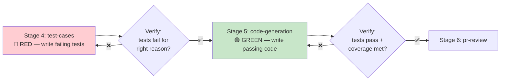

# POC Workflow Skills

> 7 independently executable OpenCode skills for the POC workflow. Each skill corresponds to one pipeline stage and can be run separately or orchestrated by the poc-pipeline skill.

## Skill Index

| # | Skill | Stage | Description | Verify Type | KB Access | File |
|---|-------|-------|-------------|-------------|-----------|------|
| 1 | `ticket-intake` | Stage 1 | Fetch and validate Jira ticket, normalize to JSON | Automated | Read | [SKILL.md](./ticket-intake/SKILL.md) |
| 2 | `requirements` | Stage 2 | Generate requirements doc from ticket + KB, human approval | Human | Read + Write | [SKILL.md](./requirements/SKILL.md) |
| 3 | `sdd` | Stage 3 | Generate SDD with architecture diagrams, data model, API, ADRs, human review | Human | Read + Write | [SKILL.md](./sdd/SKILL.md) |
| 4 | `test-cases` | Stage 4 | TDD RED phase — write failing tests, verify they fail for right reason | Automated | Read | [SKILL.md](./test-cases/SKILL.md) |
| 5 | `code-generation` | Stage 5 | TDD GREEN phase — write code to pass tests, verify coverage + requirements | Automated | Read + Write | [SKILL.md](./code-generation/SKILL.md) |
| 6 | `pr-review` | Stage 6 | Create PR, auto review (5 axes), human approval | Auto + Human | Read | [SKILL.md](./pr-review/SKILL.md) |
| 7 | `deployment` | Stage 7 | Auto deploy, health check, smoke tests, rollback if needed | Automated | Read | [SKILL.md](./deployment/SKILL.md) |

## Orchestration Skill

The [poc-pipeline skill](../skills/poc-pipeline/SKILL.md) orchestrates all 7 skills into a complete pipeline. Use it when you want to run the full workflow from Jira ticket to deployment.

## Usage

### Run a Single Skill

In OpenCode, trigger a skill by name or keyword:

```bash
# By name
/use-skill ticket-intake jira_key=CBOL-123

# By trigger keyword
"fetch jira ticket CBOL-123" → triggers ticket-intake skill
"generate requirements for CBOL-123" → triggers requirements skill
"write tests first for CBOL-123" → triggers test-cases skill
"implement code for CBOL-123" → triggers code-generation skill
"create PR for CBOL-123" → triggers pr-review skill
"deploy CBOL-123" → triggers deployment skill
```

### Run Full Pipeline

```bash
# Use orchestration skill
/use-skill poc-pipeline jira_key=CBOL-123

# Or use command
/poc-workflow jira_key=CBOL-123
```

### Resume from Specific Stage

```bash
# Run from Stage 3 (SDD)
/poc-workflow jira_key=CBOL-123 stage=3

# Or run single skill
/use-skill sdd jira_key=CBOL-123
```

## Skill Structure

Each skill follows this structure:

```
skill-name/
└── SKILL.md
    ├── Frontmatter (name, description, version, tags, triggers, arguments)
    ├── References (GitHub projects, POC docs)
    ├── Prerequisites
    ├── Execution Steps (detailed, with commands)
    ├── Verify Gate (criteria table)
    ├── KB Injection (read/write)
    ├── Error Handling
    └── Output Artifacts
```

## Verify Gates

Every skill has a mandatory verify gate. Pipeline cannot proceed until verify PASS:

| Gate | Type | Key Criteria |
|------|------|-------------|
| 1: Ticket Valid | Automated | All mandatory fields, valid type, domain label, FRs + ACs |
| 2: Requirements Approved | Human | Doc generated, all FRs/ACs captured, human explicitly approves |
| 3: SDD Reviewed | Human | Architecture diagram, data model, API, implementation plan, human approves |
| 4: RED Confirmed | Automated | Tests exist, fail for right reason (assertion, not compile), no production code |
| 5: GREEN + Reqs Met | Automated | All tests pass, coverage >= 80%/70%, code quality, security, requirements met |
| 6: Review PASS | Auto + Human | PR created, CI pass, auto review PASS, human approves |
| 7: Deploy Healthy | Automated | Deployment complete, health check PASS, smoke tests PASS, monitoring normal |

## Knowledge Base Integration

Each skill reads from and may write to the knowledge base:

| Skill | Reads | Writes |
|-------|-------|--------|
| ticket-intake | `06-Skills/`, `jira-ticket-spec.md` | — |
| requirements | `01-CBOL-Domain-Knowledge/`, `02-Chat-Domain-Knowledge/`, `03-Design-Guidelines/` | New domain terms → `01-CBOL-Domain-Knowledge/glossary/` |
| sdd | `03-Design-Guidelines/` (ALL), `01-CBOL-Domain-Knowledge/`, `02-Chat-Domain-Knowledge/` | New ADRs → `03-Design-Guidelines/06-design-process/adr/` |
| test-cases | `04-Coding-Guidelines/07-testing/`, `02-Chat-Domain-Knowledge/` | — |
| code-generation | `04-Coding-Guidelines/` (ALL), `03-Design-Guidelines/` (ALL), `01-`, `02-` | New coding patterns → `04-Coding-Guidelines/` |
| pr-review | `04-Coding-Guidelines/06-quality-ops/`, `05-security/`, `03-Design-Guidelines/04-security-design/` | — |
| deployment | `03-Design-Guidelines/05-reliability/` (ALL) | — |

## TDD Enforcement (Skills 4-5)

Skills 4 (test-cases) and 5 (code-generation) enforce strict TDD:



**RED Rules (Skill 4)**:
- Write tests FIRST — no production code
- Tests MUST fail (assertion failure, not compile error)
- Each test traces to SDD requirement

**GREEN Rules (Skill 5)**:
- Write MINIMAL code to pass tests
- Do NOT modify tests from Skill 4
- All tests MUST pass
- Coverage >= 80% line / 70% branch

## References

Each skill references GitHub projects and POC documentation. See individual skill files for details.

Key reference projects:
- [genkovich/sdd](https://github.com/genkovich/sdd) — 19 atomic skills, TDD engine
- [illarion/claude-jira-skill](https://github.com/illarion/claude-jira-skill) — Jira integration
- [fanioz/claude-code-pr-automation](https://github.com/fanioz/claude-code-pr-automation) — PR review
- [gthimmes/code-reviewer](https://github.com/gthimmes/code-reviewer) — 5-axis review
- [Upsolve-Labs/upstack](https://github.com/Upsolve-Labs/upstack) — RED/GREEN execution
- [Kevinweisl/claude-skills-cicd](https://github.com/Kevinweisl/claude-skills-cicd) — CI/CD skills

---

*POC Workflow Skills v1.0.0 — 2026-08-21*
