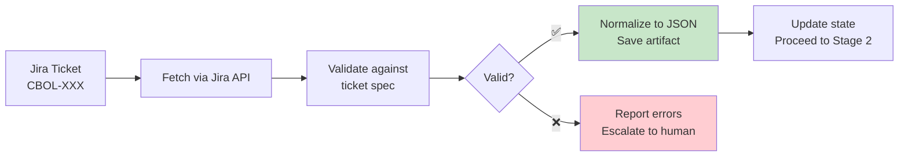

# Stage 1: Ticket Intake

> Fetch Jira ticket, validate against ticket spec, normalize into structured JSON.

## Overview



## Input

- Jira ticket key (e.g., `CBOL-123`)
- Jira API credentials (from `.ai-workflow/config.yaml`)

## Output

- `docs/operations/{KEY}/01-ticket-intake/ticket.json` — Normalized ticket
- `docs/operations/{KEY}/01-ticket-intake/verify-report.md` — Validation report
- `docs/operations/{KEY}/01-ticket-intake/operation-log.md` — Operation log

## KB Injection

| KB Doc | Purpose |
|--------|---------|
| `06-Skills/02-code-analysis/` | Ticket parsing patterns |
| `07-Workflows/poc-workflow/jira-ticket-spec.md` | Ticket validation spec |

## Execution Steps

1. **Fetch ticket** — Call Jira API to get ticket details
   ```bash
   curl -s -u "$JIRA_EMAIL:$JIRA_API_TOKEN" \
     "https://$JIRA_DOMAIN.atlassian.net/rest/api/3/issue/$JIRA_KEY" \
     -o ticket-raw.json
   ```

2. **Parse ticket** — Extract fields into normalized structure

3. **Validate** — Check against `jira-ticket-spec.md`:
   - All mandatory fields present
   - Valid issue type
   - At least one domain label
   - Description follows template
   - For Story/Task: has FRs + ACs

4. **Save artifacts** — Write normalized JSON + validation report

5. **Update state** — Mark Stage 1 complete in `pipeline-state.json`

## Verify Gate

| Criteria | Method | Evidence |
|----------|--------|----------|
| Ticket fetched successfully | API response status 200 | `curl` output + exit code 0 |
| All mandatory fields present | Field validation script | Validation report JSON |
| Valid issue type | Type in allowed list | Validation report |
| At least one domain label | Label check | Validation report |
| Description follows template | Template pattern match | Validation report |
| For Story/Task: FRs + ACs present | Count check | Validation report |

**Verify PASS** → Proceed to Stage 2
**Verify FAIL** → Report errors, retry (max 3), then escalate

## Normalized Ticket JSON Structure

```json
{
  "key": "CBOL-123",
  "type": "Story",
  "priority": "High",
  "summary": "Implement message forwarding between users",
  "description": "## Overview\n...",
  "labels": ["message-forwarding", "websocket"],
  "components": ["message-service"],
  "assignee": "john.doe",
  "functional_requirements": [
    {"id": "FR-001", "description": "..."}
  ],
  "non_functional_requirements": [
    {"id": "NFR-001", "description": "..."}
  ],
  "acceptance_criteria": [
    {"id": "AC-001", "scenario": "...", "given": "...", "when": "...", "then": "..."}
  ],
  "dependencies": ["CBOL-100"],
  "out_of_scope": ["..."],
  "references": ["..."]
}
```

---

*Stage 1 v1.0.0 — 2026-08-21*
