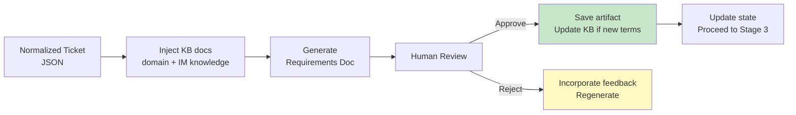

# Stage 2: Requirements

> Generate requirements document from Jira ticket + knowledge base. Human approval required before proceeding.

## Overview



## Input

- Normalized ticket JSON from Stage 1
- Knowledge base docs (domain-specific)

## Output

- `docs/operations/{KEY}/02-requirements/requirements.md` — Requirements document
- `docs/operations/{KEY}/02-requirements/human-approval.md` — Human approval record
- `docs/operations/{KEY}/02-requirements/verify-report.md` — Verify report
- `docs/operations/{KEY}/02-requirements/operation-log.md` — Operation log
- Potential KB updates: new domain terms → `01-CBOL-Domain-Knowledge/glossary/`

## KB Injection

| KB Doc | Purpose |
|--------|---------|
| `01-CBOL-Domain-Knowledge/README.md` | CBOL domain context |
| `01-CBOL-Domain-Knowledge/` (search by ticket labels) | Domain-specific knowledge |
| `02-Chat-Domain-Knowledge/` (search by keyword) | Generic IM patterns |
| `03-Design-Guidelines/06-design-process/sdd-template.md` | Requirements format |

## Execution Steps

1. **Read ticket** — Parse normalized ticket JSON
2. **Inject KB** — Read relevant KB docs based on ticket labels
3. **Generate requirements doc** — Structure:
   - Executive summary
   - Functional requirements (FR-001, FR-002, ...)
   - Non-functional requirements (NFR-001, ...)
   - User stories
   - Acceptance criteria (Given/When/Then)
   - Dependencies
   - Out of scope
   - Open questions
4. **Identify new domain terms** — If ticket introduces new concepts not in KB, draft glossary entries
5. **Save artifacts** — Write requirements doc
6. **Request human approval** — Present doc to human for review
7. **Incorporate feedback** — If rejected, update and re-request
8. **Update KB** — If approved and new terms identified, write to KB

## Verify Gate (Human Approval)

| Criteria | Method | Evidence |
|----------|--------|----------|
| Requirements doc generated | File exists | `ls` output |
| All FRs from ticket captured | FR count match | Comparison report |
| All ACs from ticket captured | AC count match | Comparison report |
| KB docs referenced | KB injection log | Operation log |
| Human approval obtained | Approval record | `human-approval.md` with approver + date |
| New domain terms added to KB (if any) | KB commit | Git log |

**Verify PASS** → Human explicitly approves (LGTM / Approved comment)
**Verify FAIL** → Human requests changes → regenerate → re-request (max 2 rejections, then escalate)

## Requirements Doc Template

```markdown
# Requirements — {Ticket Key}: {Summary}

**Ticket**: [{KEY}]({JIRA_URL})
**Type**: {Story/Task/Bug}
**Priority**: {High/Medium/Low}
**Generated**: {date}
**Approved By**: {name} on {date}

## Executive Summary
{2-3 paragraph summary}

## Functional Requirements

### FR-001: {Title}
**Description**: {detailed description}
**Source**: Ticket FR-001
**Priority**: Must/Should/Could

### FR-002: {Title}
...

## Non-Functional Requirements

### NFR-001: {Title}
**Description**: {performance/security/scalability}
**Metric**: {quantifiable target}

## User Stories
- As a {role}, I want to {action}, so that {benefit}

## Acceptance Criteria

### AC-001: {Scenario}
- **Given** {precondition}
- **When** {action}
- **Then** {expected result}

## Dependencies
- {CBOL-XXX}

## Out of Scope
- {explicit exclusions}

## Open Questions
- {question} — {owner}

## KB References
- `01-CBOL-Domain-Knowledge/...`
- `02-Chat-Domain-Knowledge/...`
```

---

*Stage 2 v1.0.0 — 2026-08-21*
