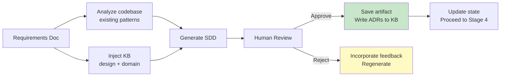

# Stage 3: SDD (Software Design Document)

> Generate SDD from requirements + KB + codebase analysis. Human review required before proceeding.

## Overview



## Input

- Approved requirements doc from Stage 2
- Codebase (existing patterns, architecture)
- Knowledge base (design guidelines, domain knowledge)

## Output

- `docs/operations/{KEY}/03-sdd/sdd.md` — SDD document
- `docs/operations/{KEY}/03-sdd/human-review.md` — Human review record
- `docs/operations/{KEY}/03-sdd/verify-report.md` — Verify report
- `docs/operations/{KEY}/03-sdd/operation-log.md` — Operation log
- Potential KB updates: new ADRs → `03-Design-Guidelines/06-design-process/adr/`

## KB Injection

| KB Doc | Purpose |
|--------|---------|
| `03-Design-Guidelines/` (all) | Architecture, API, data, security, reliability patterns |
| `01-CBOL-Domain-Knowledge/state-machine/` | State machine design |
| `02-Chat-Domain-Knowledge/websocket/` | WebSocket design patterns |
| `02-Chat-Domain-Knowledge/` (search by keyword) | IM architecture references |
| `06-Skills/02-code-analysis/architecture-analyzer/` | Codebase analysis skill |

## Execution Steps

1. **Read requirements** — Parse approved requirements doc
2. **Analyze codebase** — Use architecture-analyzer skill to understand existing patterns
3. **Inject KB** — Read all relevant design guidelines and domain knowledge
4. **Generate SDD** — Structure (see template below):
   - Context and goals
   - Architecture overview (with Mermaid diagrams)
   - Component design
   - Data model
   - API design
   - State machine design (if applicable)
   - WebSocket protocol design (if applicable)
   - Security considerations
   - Performance considerations
   - Implementation plan (task breakdown)
   - Testing strategy
   - ADRs (Architecture Decision Records)
5. **Identify new ADRs** — If design introduces new patterns, draft ADRs
6. **Save artifacts** — Write SDD
7. **Request human review** — Present SDD for review
8. **Incorporate feedback** — If rejected, update and re-request
9. **Update KB** — If approved and new ADRs, write to KB

## Verify Gate (Human Review)

| Criteria | Method | Evidence |
|----------|--------|----------|
| SDD generated | File exists | `ls` output |
| Architecture diagram included | Mermaid diagram present | SDD content check |
| All FRs addressed in design | FR-to-component mapping | Traceability matrix |
| Data model defined | Schema/ER diagram present | SDD content check |
| API design defined | Endpoints/contracts present | SDD content check |
| Implementation plan included | Task breakdown present | SDD content check |
| Testing strategy defined | Test approach present | SDD content check |
| KB docs referenced | KB injection log | Operation log |
| Human review approval obtained | Review record | `human-review.md` with reviewer + date |
| New ADRs added to KB (if any) | KB commit | Git log |

**Verify PASS** → Human explicitly approves SDD
**Verify FAIL** → Human requests changes → regenerate → re-request (max 2 rejections, then escalate)

## SDD Template

```markdown
# SDD — {Ticket Key}: {Summary}

**Ticket**: [{KEY}]({JIRA_URL})
**Requirements**: [requirements.md](../02-requirements/requirements.md)
**Generated**: {date}
**Reviewed By**: {name} on {date}

## 1. Context and Goals
{what we're building and why}

## 2. Architecture Overview
```mermaid
flowchart TB
    {architecture diagram}
```

## 3. Component Design
### 3.1 {Component Name}
- **Responsibility**: ...
- **Interfaces**: ...
- **Dependencies**: ...

## 4. Data Model
### 4.1 Entities
| Entity | Fields | Type |
|--------|--------|------|
| ... | ... | ... |

```mermaid
erDiagram
    {ER diagram}
```

## 5. API Design
### 5.1 REST Endpoints
| Method | Path | Description |
|--------|------|-------------|
| ... | ... | ... |

### 5.2 WebSocket Events (if applicable)
| Event | Direction | Payload |
|-------|-----------|---------|
| ... | ... | ... |

## 6. State Machine (if applicable)
```mermaid
stateDiagram-v2
    {state diagram}
```

## 7. Security Considerations
- Auth: ...
- Input validation: ...
- Data protection: ...

## 8. Performance Considerations
- Expected load: ...
- Caching strategy: ...
- Scaling approach: ...

## 9. Implementation Plan
| Task | Description | Estimate | Depends On |
|------|-------------|----------|------------|
| T001 | ... | 0.5d | — |
| T002 | ... | 1d | T001 |

## 10. Testing Strategy
- Unit tests: ...
- Integration tests: ...
- E2E tests: ...
- Coverage target: >= 80% line, >= 70% branch

## 11. ADRs
### ADR-001: {Title}
- **Status**: Accepted
- **Context**: ...
- **Decision**: ...
- **Consequences**: ...

## 12. KB References
- `03-Design-Guidelines/...`
- `01-CBOL-Domain-Knowledge/...`
```

---

*Stage 3 v1.0.0 — 2026-08-21*
