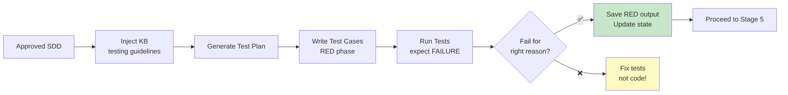

# Stage 4: Test Cases (TDD — RED Phase)

> Generate test cases from SDD + KB + codebase. Tests MUST fail for the right reason before code generation.

## Overview



## Input

- Approved SDD from Stage 3
- Codebase (existing test patterns, test framework)
- Knowledge base (testing guidelines)

## Output

- `docs/operations/{KEY}/04-test-cases/test-plan.md` — Test plan
- Test files in `src/test/` (or equivalent)
- `docs/operations/{KEY}/04-test-cases/red-test-output.txt` — RED phase test output
- `docs/operations/{KEY}/04-test-cases/verify-report.md` — Verify report
- `docs/operations/{KEY}/04-test-cases/operation-log.md` — Operation log

## KB Injection

| KB Doc | Purpose |
|--------|---------|
| `04-Coding-Guidelines/07-testing/unit-testing-guidelines.md` | Unit test standards |
| `04-Coding-Guidelines/07-testing/` (all) | Testing best practices |
| `02-Chat-Domain-Knowledge/` (test patterns) | IM-specific test patterns |
| `03-Design-Guidelines/05-reliability/` | Test strategy patterns |

## Execution Steps

1. **Read SDD** — Parse approved SDD, extract implementation plan tasks
2. **Inject KB** — Read testing guidelines and existing test patterns
3. **Analyze existing tests** — Understand test framework, conventions, naming
4. **Generate test plan** — Map each FR/AC to test cases:
   - Unit tests (per component/method)
   - Integration tests (per API endpoint/WebSocket event)
   - Edge cases and boundary conditions
   - Error handling tests
5. **Write test cases** — For each task in implementation plan:
   - Write test class/method
   - Follow naming convention: `test{Method}_{Scenario}_{ExpectedResult}`
   - Use Arrange-Act-Assert pattern
   - Each test traces to a specific SDD requirement
6. **Run tests (RED)** — Execute tests, expect them to FAIL
   ```bash
   mvn test -Dtest={TestClass}
   ```
7. **Verify RED** — Confirm tests fail for the RIGHT reason:
   - ✅ Assertion failure (expected behavior not implemented)
   - ❌ Compile error (test references non-existent class/method — fix test)
   - ❌ Test passes (implementation already exists — check scope)
8. **Save artifacts** — Write test plan, save RED output
9. **Update state** — Mark Stage 4 complete

## Verify Gate (Automated)

| Criteria | Method | Evidence |
|----------|--------|----------|
| Test plan generated | File exists | `ls` output |
| Test cases written | Test files exist | `find src/test -name "*{KEY}*"` output |
| Each test traces to SDD req | Traceability matrix | Test plan content |
| Tests run and FAIL | `mvn test` exit code != 0 | Test output |
| Failure is for right reason | Output analysis (assertion failure, not compile error) | RED output file |
| Test naming follows convention | Naming check | Lint/ review |
| Coverage target defined | >= 80% line, >= 70% branch | Test plan |
| KB docs referenced | KB injection log | Operation log |

**Verify PASS** → Tests exist AND fail for right reason
**Verify FAIL** → Fix tests (NOT code), re-run (max 3 retries)

## TDD Rules (Strict)

1. ❌ **NO production code** before tests exist and fail
2. ❌ **NO modifying tests** to make them pass (that's cheating)
3. ✅ Tests MUST fail for an assertion reason (not compile error)
4. ✅ Each test MUST trace to a specific SDD requirement
5. ✅ Test naming MUST follow project convention
6. ✅ Coverage MUST target >= 80% line, >= 70% branch
7. ✅ Edge cases and error paths MUST be tested

## Test Plan Template

```markdown
# Test Plan — {Ticket Key}

**SDD**: [sdd.md](../03-sdd/sdd.md)
**Generated**: {date}

## Coverage Target
- Line coverage: >= 80%
- Branch coverage: >= 70%

## Test Traceability Matrix

| Test ID | SDD Requirement | Test Type | Test Class | Priority |
|---------|-----------------|-----------|------------|----------|
| T001 | FR-001 | Unit | MessageForwarderTest | High |
| T002 | FR-001 | Integration | MessageForwardingIT | High |
| T003 | FR-002 | Unit | ... | Medium |

## Unit Tests

### {ComponentName}Test
- `testForwardMessage_ValidMessage_MessageDelivered` — FR-001
- `testForwardMessage_InvalidRecipient_ThrowsException` — FR-001, error handling
- ...

## Integration Tests
...

## Edge Cases
- Empty message body
- Very long message (> 10MB)
- Concurrent forwarding
- Network failure during forwarding
- ...

## Error Handling Tests
- Invalid recipient
- Permission denied
- Rate limit exceeded
- Service unavailable
- ...
```

---

*Stage 4 v1.0.0 — 2026-08-21*
