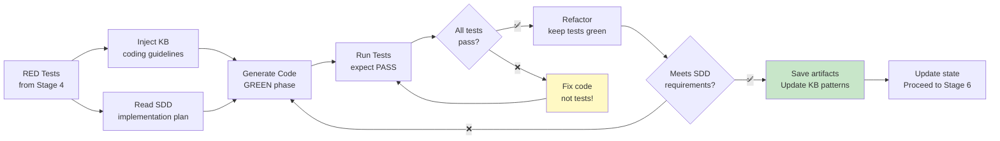

# Stage 5: Code Generation (TDD — GREEN Phase)

> Generate implementation code from SDD + tests + KB. All tests MUST pass and code MUST meet SDD requirements.

## Overview



## Input

- Failing tests (RED) from Stage 4
- Approved SDD from Stage 3
- Codebase (existing patterns, conventions)
- Knowledge base (coding guidelines)

## Output

- Implementation code in `src/main/` (or equivalent)
- `docs/operations/{KEY}/05-code-generation/implementation-summary.md`
- `docs/operations/{KEY}/05-code-generation/green-test-output.txt` — GREEN phase test output
- `docs/operations/{KEY}/05-code-generation/coverage-report.xml` — Coverage report
- `docs/operations/{KEY}/05-code-generation/verify-report.md` — Verify report
- `docs/operations/{KEY}/05-code-generation/operation-log.md` — Operation log
- Potential KB updates: new coding patterns → `04-Coding-Guidelines/`

## KB Injection

| KB Doc | Purpose |
|--------|---------|
| `04-Coding-Guidelines/` (all relevant) | Java, Spring, WebSocket, DB, cache, queue standards |
| `03-Design-Guidelines/` (architecture decisions) | Design patterns to follow |
| `01-CBOL-Domain-Knowledge/` (domain logic) | Domain-specific implementation patterns |
| `02-Chat-Domain-Knowledge/` (IM patterns) | IM-specific implementation references |
| `06-Skills/01-ai-development-pipeline/` | Pipeline skills |

## Execution Steps

1. **Read SDD** — Parse implementation plan tasks
2. **Read tests** — Understand what needs to be implemented (RED tests)
3. **Inject KB** — Read all relevant coding guidelines
4. **Analyze existing code** — Understand patterns, conventions, dependencies
5. **Generate code (GREEN)** — For each task in implementation plan:
   - Write minimal code to make tests pass
   - Follow `04-Coding-Guidelines/` standards
   - Follow `03-Design-Guidelines/` architecture decisions
   - No code outside SDD scope
6. **Run tests (GREEN)** — Execute tests, expect them to PASS
   ```bash
   mvn test
   ```
7. **Refactor** — If tests pass, refactor for quality (keep tests green)
8. **Check coverage** — Run coverage report
   ```bash
   mvn jacoco:report
   ```
9. **Verify requirements** — Check code meets all SDD requirements
10. **Save artifacts** — Write implementation summary, save GREEN output, coverage report
11. **Update KB** — If new patterns discovered, write to KB
12. **Commit** — Conventional commit format
13. **Update state** — Mark Stage 5 complete

## Verify Gate (Automated)

| Criteria | Method | Evidence |
|----------|--------|----------|
| All tests pass | `mvn test` exit code 0 | GREEN test output |
| No test modifications | Git diff shows no test changes from Stage 4 | `git diff --stat` |
| Coverage >= 80% line | JaCoCo report | Coverage report XML |
| Coverage >= 70% branch | JaCoCo report | Coverage report XML |
| Code follows coding guidelines | Lint/format check | Lint output |
| Code follows design guidelines | Architecture review | Implementation summary |
| All SDD requirements met | Traceability check | Requirements mapping |
| No code outside SDD scope | Diff scope check | Git diff analysis |
| KB docs referenced | KB injection log | Operation log |
| Conventional commit format | Commit message check | Git log |

**Verify PASS** → All tests pass + coverage met + requirements met
**Verify FAIL** → Fix code (NOT tests), re-run (max 3 retries)

## GREEN Phase Rules

1. ✅ Write MINIMAL code to make tests pass
2. ✅ Follow `04-Coding-Guidelines/` (all relevant docs)
3. ✅ Follow `03-Design-Guidelines/` (architecture decisions)
4. ❌ **NO modifying tests** to make them pass
5. ❌ **NO code outside SDD scope**
6. ✅ After GREEN, REFACTOR for quality (keep tests green)
7. ✅ Commit with conventional commit format
8. ✅ Each commit should be a complete, working unit

## Implementation Summary Template

```markdown
# Implementation Summary — {Ticket Key}

**SDD**: [sdd.md](../03-sdd/sdd.md)
**Test Plan**: [test-plan.md](../04-test-cases/test-plan.md)
**Generated**: {date}

## Tasks Completed

| Task ID | Description | Files Changed | Tests Added | Status |
|---------|-------------|---------------|-------------|--------|
| T001 | ... | `src/...` | 5 | ✅ |
| T002 | ... | `src/...` | 3 | ✅ |

## Test Results
- Total tests: {N}
- Passed: {N}
- Failed: 0
- Skipped: {N}

## Coverage
- Line coverage: {X}% (target: >= 80%)
- Branch coverage: {X}% (target: >= 70%)

## Files Changed
```
{git diff --stat output}
```

## KB References
- `04-Coding-Guidelines/...`
- `03-Design-Guidelines/...`

## KB Updates
- `04-Coding-Guidelines/...` — Added new pattern for {description}
```

---

*Stage 5 v1.0.0 — 2026-08-21*
