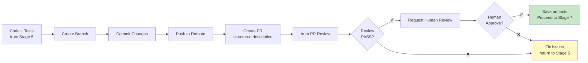

# Stage 6: PR + Auto Review

> Create Pull Request with structured description, run automated PR review, human approval required.

## Overview



## Input

- Implementation code + tests from Stage 5
- SDD + requirements docs
- Knowledge base (quality, security guidelines)

## Output

- Pull Request on GitHub
- `docs/operations/{KEY}/06-pr-review/pr-description.md` — PR description
- `docs/operations/{KEY}/06-pr-review/auto-review-report.md` — Auto review report
- `docs/operations/{KEY}/06-pr-review/verify-report.md` — Verify report
- `docs/operations/{KEY}/06-pr-review/operation-log.md` — Operation log

## KB Injection

| KB Doc | Purpose |
|--------|---------|
| `04-Coding-Guidelines/06-quality-ops/` | Quality gates, SonarQube rules |
| `04-Coding-Guidelines/05-security/` | Security review checklist |
| `03-Design-Guidelines/04-security-design/` | Security architecture review |
| `03-Design-Guidelines/05-reliability/` | Reliability review |
| `04-Coding-Guidelines/07-testing/` | Test quality review |

## Execution Steps

1. **Create branch** — Feature branch from main
   ```bash
   git checkout -b feat/CBOL-XXX-{short-desc}
   ```

2. **Commit changes** — Conventional commit format
   ```bash
   git add -A
   git commit -m "feat(scope): description (CBOL-XXX)"
   ```

3. **Push to remote**
   ```bash
   git push origin feat/CBOL-XXX-{short-desc}
   ```

4. **Create PR** — With structured description (see template below)
   - Title: `feat(scope): description (CBOL-XXX)`
   - Body: PR template with artifact links, test results, coverage

5. **Run auto PR review** — Check against review checklist:
   - Code quality (complexity, duplication, naming)
   - Security (OWASP Top 10, input validation, auth)
   - Test quality (coverage, edge cases, test naming)
   - Architecture (follows design guidelines, separation of concerns)
   - Documentation (README, inline docs, API docs)
   - Performance (no obvious bottlenecks, N+1 queries)

6. **Run CI checks** — Wait for CI to pass (tests, lint, build)

7. **Request human review** — Assign reviewers, request review

8. **Incorporate feedback** — If human requests changes, fix and push

9. **Save artifacts** — Write PR description, auto review report

## Verify Gate (Automated + Human)

| Criteria | Method | Evidence |
|----------|--------|----------|
| PR created | GitHub API response | PR URL |
| PR description follows template | Template pattern match | PR body content |
| CI checks pass | GitHub Checks API | CI status |
| Auto review PASS | Review checklist | Auto review report |
| No critical/blocker Sonar issues | SonarQube API | Sonar report |
| No security vulnerabilities | Security scan | Security report |
| Coverage >= 80% line / 70% branch | Coverage report | Coverage XML |
| All tests pass | CI test results | Test report |
| Human approval obtained | PR review status | GitHub review approval |
| KB docs referenced | KB injection log | Operation log |

**Verify PASS** → Auto review PASS + CI pass + human approves
**Verify FAIL** → Fix issues, push updates, re-run review (max 3 cycles)

## Auto Review Checklist

### Code Quality
- [ ] No methods > 50 lines
- [ ] No classes > 500 lines
- [ ] Cyclomatic complexity < 10 per method
- [ ] No code duplication > 3 lines
- [ ] Naming follows conventions (see `04-Coding-Guidelines/`)
- [ ] No commented-out code
- [ ] No TODO/FIXME without ticket reference

### Security
- [ ] No hardcoded secrets/credentials
- [ ] Input validation on all external inputs
- [ ] SQL queries use parameterized statements
- [ ] Authentication/authorization checks present
- [ ] No sensitive data in logs
- [ ] CSRF protection on state-changing endpoints
- [ ] XSS prevention on user-facing output

### Test Quality
- [ ] Coverage >= 80% line, >= 70% branch
- [ ] Edge cases tested
- [ ] Error paths tested
- [ ] Test naming follows convention
- [ ] Tests are independent (no shared state)
- [ ] No flaky tests

### Architecture
- [ ] Follows approved SDD
- [ ] Separation of concerns maintained
- [ ] No circular dependencies
- [ ] Dependency injection used
- [ ] No god classes/objects

### Documentation
- [ ] Public methods have Javadoc
- [ ] Complex logic has inline comments
- [ ] README updated (if applicable)
- [ ] API docs updated (if applicable)

## PR Description Template

```markdown
## {Ticket Key}: {Summary}

**Jira**: [{KEY}]({JIRA_URL})
**Type**: {Story/Task/Bug}
**Priority**: {High/Medium/Low}

## Summary
{2-3 sentence summary of changes}

## Changes Made
- {change 1}
- {change 2}
- ...

## Artifacts
- [Requirements](../02-requirements/requirements.md)
- [SDD](../03-sdd/sdd.md)
- [Test Plan](../04-test-cases/test-plan.md)
- [Implementation Summary](../05-code-generation/implementation-summary.md)

## Test Results
- Total: {N} tests
- Passed: {N}
- Failed: 0
- Coverage: {X}% line / {Y}% branch

## Screenshots / Demo (if applicable)
{screenshots or demo links}

## Checklist
- [ ] All tests pass
- [ ] Coverage >= 80% line / 70% branch
- [ ] No Sonar critical/blocker issues
- [ ] Security guidelines followed
- [ ] Coding guidelines followed
- [ ] Documentation updated
- [ ] KB updated (if new patterns)

## Reviewers
@{reviewer1} @{reviewer2}
```

---

*Stage 6 v1.0.0 — 2026-08-21*
