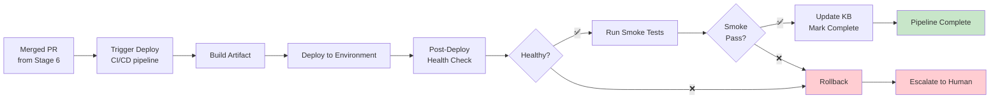

# Stage 7: Deployment

> Auto-deploy merged PR, run post-deployment verification, update knowledge base.

## Overview



## Input

- Merged PR from Stage 6
- Deployment configuration
- Knowledge base (reliability, observability guidelines)

## Output

- Deployed service
- `docs/operations/{KEY}/07-deployment/deploy-log.txt` — Deployment log
- `docs/operations/{KEY}/07-deployment/health-check-output.txt` — Health check output
- `docs/operations/{KEY}/07-deployment/smoke-test-output.txt` — Smoke test output
- `docs/operations/{KEY}/07-deployment/verify-report.md` — Verify report
- `docs/operations/{KEY}/07-deployment/operation-log.md` — Operation log
- Updated `pipeline-state.json` — Pipeline marked complete

## KB Injection

| KB Doc | Purpose |
|--------|---------|
| `03-Design-Guidelines/05-reliability/high-availability.md` | HA patterns |
| `03-Design-Guidelines/05-reliability/observability-design.md` | Monitoring, logging |
| `03-Design-Guidelines/05-reliability/resilience-patterns.md` | Resilience, rollback |
| `04-Coding-Guidelines/` (deployment-related) | Deploy standards |

## Execution Steps

1. **Trigger deployment** — CI/CD pipeline triggered by merge to main
   ```bash
   # GitHub Actions / Jenkins / ArgoCD etc.
   ```

2. **Build artifact** — Build deployable artifact
   ```bash
   mvn clean package -DskipTests
   docker build -t {image}:{tag} .
   ```

3. **Deploy to environment** — Deploy to staging/prod
   ```bash
   kubectl apply -f k8s/deployment.yaml
   # or
   docker-compose up -d
   ```

4. **Wait for rollout** — Wait for deployment to complete
   ```bash
   kubectl rollout status deployment/{name}
   ```

5. **Health check** — Verify service is healthy
   ```bash
   curl -s http://{host}/actuator/health
   # Expected: {"status":"UP"}
   ```

6. **Smoke tests** — Run basic functionality tests
   ```bash
   # Test key endpoints / WebSocket connections
   curl -s http://{host}/api/messages | jq .
   ```

7. **Monitor** — Check logs, metrics for errors
   ```bash
   kubectl logs deployment/{name} --tail=100
   ```

8. **Rollback if needed** — If health check or smoke tests fail
   ```bash
   kubectl rollout undo deployment/{name}
   ```

9. **Update KB** — If deployment reveals new patterns, write to KB

10. **Mark pipeline complete** — Update `pipeline-state.json`

## Verify Gate (Automated)

| Criteria | Method | Evidence |
|----------|--------|----------|
| Deployment triggered | CI/CD pipeline started | Deploy log |
| Build successful | Build exit code 0 | Build log |
| Deployment rollout complete | `kubectl rollout status` | Deploy log |
| Health check PASS | `/actuator/health` returns UP | Health check output |
| Smoke tests PASS | All smoke tests pass | Smoke test output |
| No error logs | Log scan for ERROR/FATAL | Log output |
| Metrics normal | CPU/memory/response time within range | Metrics dashboard |
| Rollback ready (if needed) | Previous version available | Deploy config |
| KB docs referenced | KB injection log | Operation log |
| Pipeline state updated | `pipeline-state.json` marked complete | State file |

**Verify PASS** → Health check PASS + smoke tests PASS + no errors
**Verify FAIL** → Rollback + escalate to human (max 3 deploy retries)

## Deployment Checklist

### Pre-Deploy
- [ ] PR merged to main
- [ ] CI checks all pass
- [ ] Build artifact created
- [ ] Deployment config validated
- [ ] Rollback plan ready
- [ ] Monitoring dashboards ready

### Deploy
- [ ] Deployment triggered
- [ ] Rollout in progress
- [ ] Rollout complete

### Post-Deploy
- [ ] Health check PASS
- [ ] Smoke tests PASS
- [ ] No error logs
- [ ] Metrics normal
- [ ] Key functionality verified
- [ ] Documentation updated
- [ ] KB updated (if new patterns)

### Rollback Triggers
- Health check fails
- Smoke tests fail
- Error rate > 1%
- Response time > 2x baseline
- CPU/memory > 90%
- Data corruption detected

## Smoke Test Examples

```bash
#!/bin/bash
# smoke-test.sh — Basic functionality verification

set -e

BASE_URL="${1:-http://localhost:8080}"
PASS=0
FAIL=0

check() {
  local name="$1"
  local cmd="$2"
  if eval "$cmd"; then
    echo "✅ PASS: $name"
    PASS=$((PASS+1))
  else
    echo "❌ FAIL: $name"
    FAIL=$((FAIL+1))
  fi
}

# Health check
check "Health endpoint" "curl -sf $BASE_URL/actuator/health | grep -q '\"status\":\"UP\"'"

# API endpoints
check "Messages API" "curl -sf $BASE_URL/api/messages | jq -e ."

# WebSocket connection (if applicable)
# check "WebSocket connect" "wscat -c ws://$BASE_URL/ws -x 'ping' | grep -q pong"

echo ""
echo "Results: $PASS passed, $FAIL failed"
[ $FAIL -eq 0 ]
```

---

*Stage 7 v1.0.0 — 2026-08-21*
