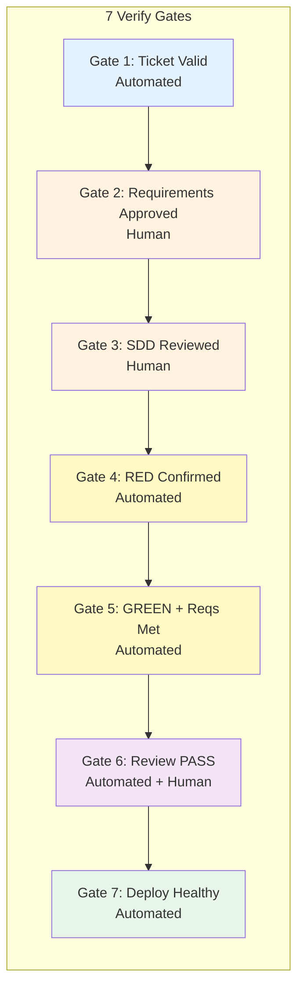

# Verify Gate Checklist

> Comprehensive checklist for all 7 pipeline stages. Every stage MUST pass its verify gate before proceeding.

## Verify Gate Overview

## Gate 1: Ticket Valid (Stage 1 — Automated)

### Mandatory Checks
- [ ] Ticket fetched successfully (API response 200)
- [ ] `summary` field present and non-empty
- [ ] `description` field present and non-empty
- [ ] `issuetype` is one of: Story, Task, Bug, Spike, Chore
- [ ] `priority` is one of: Highest, High, Medium, Low, Lowest
- [ ] At least one domain label present (from `jira-ticket-spec.md` Section 4.1)
- [ ] `assignee` field present
- [ ] `components` field present

### Type-Specific Checks
#### For Story/Task
- [ ] Description follows template (Overview, User Story, Requirements, Acceptance Criteria)
- [ ] At least 1 Functional Requirement (FR-001, ...)
- [ ] At least 1 Acceptance Criteria scenario (Given/When/Then)

#### For Bug
- [ ] Description follows bug template (Overview, Environment, Steps to Reproduce, Expected, Actual)
- [ ] Steps to Reproduce present
- [ ] Expected Behavior present
- [ ] Actual Behavior present

### Evidence Required
- `ticket.json` — Normalized ticket
- `verify-report.md` — Validation report with pass/fail per check
- `operation-log.md` — Step-by-step log with commands + output + exit codes

### Pass Criteria
All mandatory checks ✅ + all type-specific checks ✅

---

## Gate 2: Requirements Approved (Stage 2 — Human)

### Automated Checks
- [ ] Requirements doc generated (`requirements.md` exists)
- [ ] All FRs from ticket captured in requirements doc
- [ ] All ACs from ticket captured in requirements doc
- [ ] KB docs injected (at least 3 relevant KB docs referenced)
- [ ] Requirements doc follows template (Executive Summary, FRs, NFRs, User Stories, ACs, Dependencies, Out of Scope, Open Questions)

### Human Approval Checks
- [ ] Human has reviewed requirements doc
- [ ] Human explicitly approves (LGTM / Approved comment / signature)
- [ ] Approval recorded in `human-approval.md` with:
  - Approver name
  - Approval date
  - Approval comment (optional)
- [ ] Any open questions resolved or explicitly deferred

### KB Update Checks (if applicable)
- [ ] New domain terms identified
- [ ] Glossary entries drafted in `01-CBOL-Domain-Knowledge/glossary/`
- [ ] KB updates committed separately

### Evidence Required
- `requirements.md` — Generated requirements doc
- `human-approval.md` — Human approval record
- `verify-report.md` — Verify report
- `operation-log.md` — Operation log

### Pass Criteria
All automated checks ✅ + human explicitly approves ✅

---

## Gate 3: SDD Reviewed (Stage 3 — Human)

### Automated Checks
- [ ] SDD generated (`sdd.md` exists)
- [ ] Architecture diagram included (Mermaid flowchart)
- [ ] Component design section present
- [ ] Data model defined (entities + ER diagram)
- [ ] API design defined (endpoints / WebSocket events)
- [ ] State machine design included (if applicable to ticket)
- [ ] WebSocket protocol design included (if applicable)
- [ ] Security considerations section present
- [ ] Performance considerations section present
- [ ] Implementation plan included (task breakdown table)
- [ ] Testing strategy defined
- [ ] ADRs section present (if new design decisions)
- [ ] All FRs from requirements addressed in design (traceability matrix)
- [ ] KB docs injected (at least 5 relevant KB docs referenced)
- [ ] Codebase analysis performed (existing patterns understood)

### Human Review Checks
- [ ] Human has reviewed SDD
- [ ] Human explicitly approves (LGTM / Approved comment)
- [ ] Review recorded in `human-review.md` with:
  - Reviewer name
  - Review date
  - Review comments (optional)
  - Approval status
- [ ] Any review feedback incorporated

### KB Update Checks (if applicable)
- [ ] New ADRs identified
- [ ] ADRs written to `03-Design-Guidelines/06-design-process/adr/`
- [ ] KB updates committed separately

### Evidence Required
- `sdd.md` — Generated SDD
- `human-review.md` — Human review record
- `verify-report.md` — Verify report
- `operation-log.md` — Operation log

### Pass Criteria
All automated checks ✅ + human explicitly approves ✅

---

## Gate 4: RED Confirmed (Stage 4 — Automated)

### Test Generation Checks
- [ ] Test plan generated (`test-plan.md` exists)
- [ ] Test cases written (test files exist in `src/test/`)
- [ ] Each test traces to a specific SDD requirement (traceability matrix)
- [ ] Test naming follows convention (`test{Method}_{Scenario}_{ExpectedResult}`)
- [ ] Tests use Arrange-Act-Assert pattern
- [ ] Edge cases and boundary conditions covered
- [ ] Error handling paths covered
- [ ] Unit tests present (per component/method)
- [ ] Integration tests present (per API endpoint/WebSocket event)

### RED Verification Checks
- [ ] Tests run and FAIL (exit code != 0)
- [ ] Failure is for the RIGHT reason:
  - ✅ Assertion failure (expected behavior not implemented)
  - ❌ Compile error (test references non-existent class — fix test, not code)
  - ❌ Test passes (implementation already exists — check scope)
- [ ] No production code written yet (git diff shows only test files)
- [ ] No test modifications from original generation (tests are as written)

### Coverage Target Checks
- [ ] Coverage target defined in test plan (>= 80% line, >= 70% branch)
- [ ] Test plan estimates coverage will meet target after implementation

### Evidence Required
- `test-plan.md` — Test plan with traceability matrix
- Test files in `src/test/`
- `red-test-output.txt` — RED phase test output showing failures
- `verify-report.md` — Verify report
- `operation-log.md` — Operation log

### Pass Criteria
All test generation checks ✅ + tests fail for right reason ✅ + no production code ✅

---

## Gate 5: GREEN + Requirements Met (Stage 5 — Automated)

### Test Passing Checks
- [ ] All tests pass (exit code 0)
- [ ] No test modifications from Stage 4 (git diff shows no test changes)
- [ ] No skipped tests without justification
- [ ] No flaky tests (run 3x, all pass)

### Coverage Checks
- [ ] Line coverage >= 80% (JaCoCo report)
- [ ] Branch coverage >= 70% (JaCoCo report)
- [ ] Coverage report generated and saved

### Code Quality Checks
- [ ] Code follows `04-Coding-Guidelines/` (all relevant docs)
- [ ] Code follows `03-Design-Guidelines/` (architecture decisions)
- [ ] No methods > 50 lines
- [ ] No classes > 500 lines
- [ ] Cyclomatic complexity < 10 per method
- [ ] No code duplication > 3 lines
- [ ] Naming follows conventions
- [ ] No commented-out code
- [ ] No TODO/FIXME without ticket reference
- [ ] Lint/format checks pass

### Security Checks
- [ ] No hardcoded secrets/credentials
- [ ] Input validation on all external inputs
- [ ] SQL queries use parameterized statements
- [ ] Authentication/authorization checks present
- [ ] No sensitive data in logs

### Requirements Traceability Checks
- [ ] All SDD requirements implemented (traceability matrix)
- [ ] All FRs from requirements doc addressed
- [ ] All ACs from requirements doc satisfied
- [ ] No code outside SDD scope (git diff scope check)

### Commit Checks
- [ ] Conventional commit format (`{type}({scope}): {subject} (CBOL-XXX)`)
- [ ] Each commit is a complete, working unit
- [ ] Commit message references Jira ticket

### KB Update Checks (if applicable)
- [ ] New coding patterns identified
- [ ] Patterns written to `04-Coding-Guidelines/`
- [ ] KB updates committed separately

### Evidence Required
- Implementation code in `src/main/`
- `green-test-output.txt` — GREEN phase test output
- `coverage-report.xml` — Coverage report
- `implementation-summary.md` — Implementation summary
- `verify-report.md` — Verify report
- `operation-log.md` — Operation log

### Pass Criteria
All tests pass ✅ + coverage met ✅ + code quality ✅ + security ✅ + requirements met ✅

---

## Gate 6: Review PASS (Stage 6 — Automated + Human)

### PR Creation Checks
- [ ] Feature branch created (`feat/CBOL-XXX-{desc}`)
- [ ] Changes committed with conventional format
- [ ] Branch pushed to remote
- [ ] PR created on GitHub
- [ ] PR title follows format: `{type}({scope}): {description} (CBOL-XXX)`
- [ ] PR description follows template (artifact links, test results, coverage)
- [ ] PR linked to Jira ticket

### CI Checks
- [ ] All CI checks pass (tests, lint, build)
- [ ] No CI failures
- [ ] Build successful

### Auto Review Checks
- [ ] Code quality review PASS (see checklist in `06-pr-review.md`)
- [ ] Security review PASS (OWASP Top 10, input validation, auth)
- [ ] Test quality review PASS (coverage, edge cases, naming)
- [ ] Architecture review PASS (follows design guidelines, separation of concerns)
- [ ] Documentation review PASS (Javadoc, inline comments, README)
- [ ] Performance review PASS (no obvious bottlenecks, N+1 queries)
- [ ] No SonarQube critical/blocker issues
- [ ] No security vulnerabilities detected

### Human Review Checks
- [ ] Human reviewers assigned
- [ ] Human has reviewed PR
- [ ] Human explicitly approves (GitHub review: Approve)
- [ ] Any review comments addressed
- [ ] No unresolved review comments

### Evidence Required
- PR URL
- `pr-description.md` — PR description
- `auto-review-report.md` — Auto review report
- CI check results
- GitHub review approval
- `verify-report.md` — Verify report
- `operation-log.md` — Operation log

### Pass Criteria
PR created ✅ + CI pass ✅ + auto review PASS ✅ + human approves ✅

---

## Gate 7: Deploy Healthy (Stage 7 — Automated)

### Deployment Checks
- [ ] Deployment triggered by merge to main
- [ ] Build artifact created successfully
- [ ] Deployment config validated
- [ ] Deployment rollout complete
- [ ] Rollback plan ready (previous version available)

### Health Check Checks
- [ ] Health endpoint returns UP (`/actuator/health`)
- [ ] All dependencies healthy (DB, Redis, external services)
- [ ] No crash loops (pod restart count = 0)
- [ ] Service responds to requests

### Smoke Test Checks
- [ ] Smoke tests run
- [ ] All smoke tests pass
- [ ] Key API endpoints respond correctly
- [ ] WebSocket connections work (if applicable)
- [ ] Core functionality verified

### Monitoring Checks
- [ ] No ERROR/FATAL logs
- [ ] Error rate < 1%
- [ ] Response time within baseline (< 2x baseline)
- [ ] CPU usage < 90%
- [ ] Memory usage < 90%
- [ ] Metrics dashboards showing normal operation

### Rollback Checks (if rollback triggered)
- [ ] Rollback executed successfully
- [ ] Previous version healthy
- [ ] Incident reported
- [ ] Human notified

### Pipeline Completion Checks
- [ ] `pipeline-state.json` updated to `completed`
- [ ] All operation logs saved
- [ ] All artifacts saved
- [ ] KB updates committed (if any)
- [ ] Jira ticket status updated (if applicable)

### Evidence Required
- `deploy-log.txt` — Deployment log
- `health-check-output.txt` — Health check output
- `smoke-test-output.txt` — Smoke test output
- Monitoring dashboard screenshots (optional)
- `verify-report.md` — Verify report
- `operation-log.md` — Operation log
- Updated `pipeline-state.json`

### Pass Criteria
Deployment complete ✅ + health check PASS ✅ + smoke tests PASS ✅ + monitoring normal ✅

---

## Escalation Triggers (Any Gate)

If any of the following occur, STOP and escalate to human:

1. Any gate fails verify 3 times (3-strike rule)
2. Human rejects requirements 2 times
3. Human rejects SDD 2 times
4. Tests cannot be made to fail for right reason after 3 attempts
5. Code cannot pass tests after 3 refactor cycles
6. Auto review finds critical security vulnerability
7. Deployment health check fails 3 times
8. Smoke tests fail 3 times
9. Rollback fails
10. Any unexpected error that blocks progression

---

*Verify Checklist v1.0.0 — 2026-08-21*
