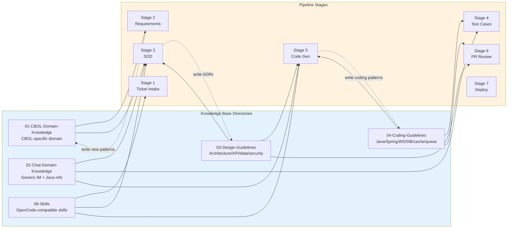
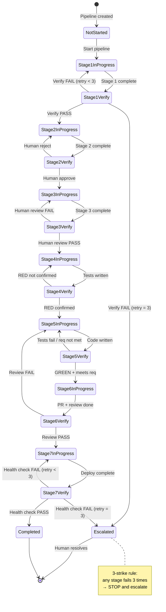
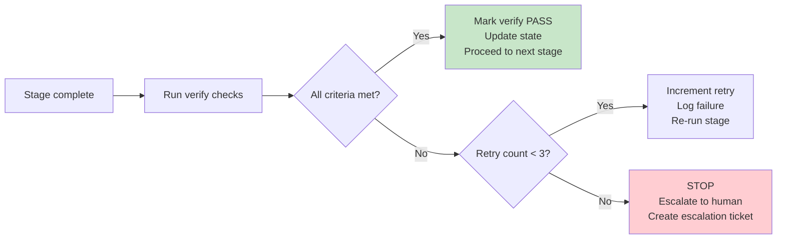
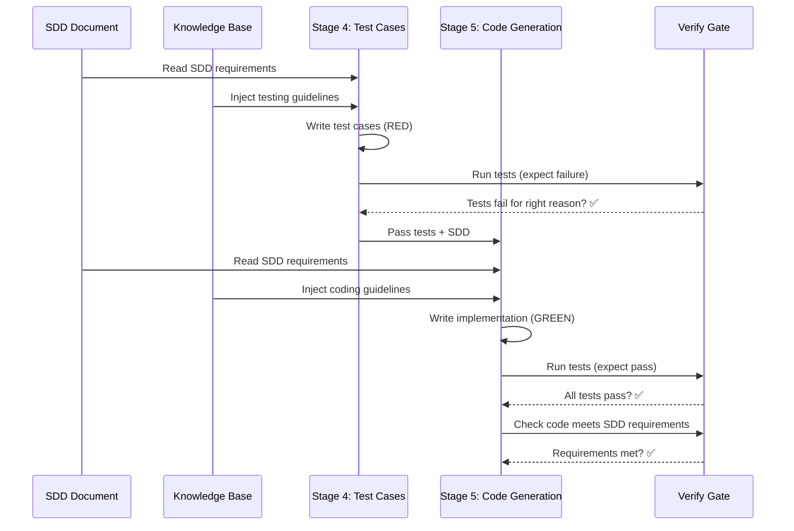

# POC Workflow Specification

> Proof-of-Concept AI-driven development workflow for CBOL Messaging Hub. Jira ticket → requirements → SDD → test cases (TDD) → code → PR review → deployment. Every stage has mandatory verification gates. Knowledge base is read at every stage and updated when new patterns are discovered.

## 1. Workflow Overview

### 1.1 High-Level Flow

```mermaid
flowchart TB
    subgraph Input["Input Source"]
        J[Jira Ticket<br/>CBOL-XXX]
    end

    subgraph Stage1["Stage 1: Ticket Intake"]
        S1[Fetch ticket<br/>validate spec]
        V1{Verify:<br/>ticket valid?}
    end

    subgraph Stage2["Stage 2: Requirements"]
        S2[Generate req doc<br/>+ KB injection]
        V2{Verify:<br/>human approve?}
    end

    subgraph Stage3["Stage 3: SDD"]
        S3[Generate SDD<br/>+ KB + codebase]
        V3{Verify:<br/>human review?}
    end

    subgraph Stage4["Stage 4: Test Cases (TDD)"]
        S4[Generate test cases<br/>RED phase]
        V4{Verify:<br/>tests fail for<br/>right reason?}
    end

    subgraph Stage5["Stage 5: Code Generation"]
        S5[Generate code<br/>GREEN phase]
        V5{Verify:<br/>tests pass +<br/>meets req?}
    end

    subgraph Stage6["Stage 6: PR + Auto Review"]
        S6[Create PR<br/>auto PR review]
        V6{Verify:<br/>review PASS?}
    end

    subgraph Stage7["Stage 7: Deployment"]
        S7[Auto deploy<br/>post-deploy verify]
        V7{Verify:<br/>deploy healthy?}
    end

    subgraph Output["Output"]
        D[Deployed +<br/>KB updated]
    end

    J --> S1 --> V1
    V1 -->|✅| S2
    V1 -->|❌| J
    S2 --> V2
    V2 -->|✅| S3
    V2 -->|❌| S2
    S3 --> V3
    V3 -->|✅| S4
    V3 -->|❌| S3
    S4 --> V4
    V4 -->|✅| S5
    V4 -->|❌| S4
    S5 --> V5
    V5 -->|✅| S6
    V5 -->|❌| S5
    S6 --> V6
    V6 -->|✅| S7
    V6 -->|❌| S5
    S7 --> V7
    V7 -->|✅| D
    V7 -->|❌| S7

    style Input fill:#e3f2fd
    style Output fill:#c8e6c9
    style Stage1 fill:#fff3e0
    style Stage2 fill:#fff3e0
    style Stage3 fill:#fff3e0
    style Stage4 fill:#fff9c4
    style Stage5 fill:#fff9c4
    style Stage6 fill:#f3e5f5
    style Stage7 fill:#e8f5e9
```



### 1.2 Stage Summary

| Stage | Name | Input | Output | Verify Gate | KB Access |
|-------|------|-------|--------|-------------|-----------|
| 1 | Ticket Intake | Jira ticket key | Normalized ticket JSON | Ticket valid per spec | Read |
| 2 | Requirements | Ticket + KB | Requirements doc | Human approval | Read + Write |
| 3 | SDD | Req doc + KB + codebase | SDD document | Human review approval | Read + Write |
| 4 | Test Cases (TDD) | SDD + KB + codebase | Test files (RED) | Tests fail for right reason | Read |
| 5 | Code Generation | SDD + tests + KB | Implementation code (GREEN) | Tests pass + meets req | Read + Write |
| 6 | PR + Auto Review | Code + tests + SDD | PR + review report | Auto review PASS | Read |
| 7 | Deployment | Merged PR | Deployed service | Post-deploy health check | Read |

### 1.3 Core Principles

1. **Verify before progression** — Every stage MUST pass its verify gate before next stage starts
2. **Knowledge base first** — Every stage reads relevant KB docs before acting; new patterns are written back
3. **Human-in-the-loop** — Stages 2 (requirements) and 3 (SDD) require explicit human approval
4. **TDD enforced** — Test cases (Stage 4) MUST be written and proven failing before code (Stage 5)
5. **Evidence over claims** — Every verify gate needs `command + output + exit code`
6. **3-strike escalation** — Any stage fails 3 times → STOP and escalate to human
7. **State persistence** — Pipeline state saved after every stage, resumable from breakpoint
8. **KB bidirectional** — Read KB for context; write new patterns/discoveries back to KB

---

## 2. Knowledge Base Integration

### 2.1 KB Directory Mapping



### 2.2 Stage-Specific KB Injection

| Stage | KB Docs to Read (mandatory) | KB Write-back |
|-------|------------------------------|---------------|
| 1 | `06-Skills/02-code-analysis/` (ticket parser) | None |
| 2 | `01-CBOL-Domain-Knowledge/README.md`, `02-Chat-Domain-Knowledge/` (search by keyword) | New domain terms → `01-CBOL-Domain-Knowledge/glossary/` |
| 3 | `03-Design-Guidelines/` (all), `01-CBOL-Domain-Knowledge/state-machine/`, `02-Chat-Domain-Knowledge/websocket/` | New ADR → `03-Design-Guidelines/06-design-process/adr/` |
| 4 | `04-Coding-Guidelines/07-testing/`, `02-Chat-Domain-Knowledge/` (test patterns) | None |
| 5 | `04-Coding-Guidelines/` (all relevant), `03-Design-Guidelines/`, `06-Skills/01-ai-development-pipeline/` | New coding patterns → `04-Coding-Guidelines/` |
| 6 | `04-Coding-Guidelines/06-quality-ops/`, `03-Design-Guidelines/04-security-design/` | None |
| 7 | `03-Design-Guidelines/05-reliability/`, `04-Coding-Guidelines/` | None |

### 2.3 KB Update Protocol

When a stage discovers a new pattern, convention, or domain knowledge:

1. **Identify** — Determine which KB directory the new knowledge belongs to
2. **Draft** — Create/update the relevant KB document
3. **Verify** — Ensure the new KB doc follows existing format and conventions
4. **Commit** — KB updates are committed separately from code changes
5. **Reference** — Pipeline operation log references the KB update commit

---

## 3. State Management

### 3.1 State File Structure

```json
{
  "pipeline_id": "CBOL-123-20260821-abc123",
  "jira_key": "CBOL-123",
  "started_at": "2026-08-21T10:00:00Z",
  "updated_at": "2026-08-21T10:30:00Z",
  "current_stage": 3,
  "status": "in_progress",
  "stages": {
    "1_ticket_intake": {
      "status": "completed",
      "started_at": "2026-08-21T10:00:00Z",
      "completed_at": "2026-08-21T10:05:00Z",
      "retry_count": 0,
      "verify_passed": true,
      "artifacts": ["docs/operations/CBOL-123/01-ticket.json"],
      "kb_updates": []
    },
    "2_requirements": {
      "status": "completed",
      "started_at": "2026-08-21T10:05:00Z",
      "completed_at": "2026-08-21T10:20:00Z",
      "retry_count": 1,
      "verify_passed": true,
      "artifacts": ["docs/operations/CBOL-123/02-requirements.md"],
      "kb_updates": ["01-CBOL-Domain-Knowledge/glossary/new-term.md"]
    },
    "3_sdd": {
      "status": "in_progress",
      "started_at": "2026-08-21T10:20:00Z",
      "completed_at": null,
      "retry_count": 0,
      "verify_passed": false,
      "artifacts": [],
      "kb_updates": []
    }
  },
  "escalation": {
    "escalated": false,
    "reason": null,
    "escalated_at": null
  }
}
```

### 3.2 State Transitions



---

## 4. Verify Gates Detail

### 4.1 Verify Gate Matrix

| Stage | Verify Type | Criteria | Evidence Required |
|-------|-------------|----------|-------------------|
| 1 | Automated | Ticket matches Jira spec (all mandatory fields present) | Parsed JSON + field validation output |
| 2 | Human | Requirements doc approved by human | Approval comment / signature in doc |
| 3 | Human | SDD reviewed and approved by human | Review approval / LGTM comment |
| 4 | Automated | Tests exist AND fail for the right reason (not compile error) | `mvn test` output showing expected failures |
| 5 | Automated | All tests pass + code meets SDD requirements | `mvn test` output + coverage report |
| 6 | Automated + Human | Auto review PASS + human approves PR | Review report + PR approval |
| 7 | Automated | Deployment healthy + smoke tests pass | Deploy log + health check output |

### 4.2 Verify Gate Flow



---

## 5. TDD Enforcement (Stages 4-5)

### 5.1 TDD Cycle



### 5.2 RED Phase Rules (Stage 4)

1. Tests MUST be written before any production code
2. Tests MUST fail when run (proving they test something real)
3. Failure MUST be for the right reason (assertion failure, NOT compile error)
4. Each test MUST trace to a specific SDD requirement
5. Test naming MUST follow `04-Coding-Guidelines/07-testing/unit-testing-guidelines.md`
6. Test coverage MUST target >= 80% line, >= 70% branch

### 5.3 GREEN Phase Rules (Stage 5)

1. Code MUST make all RED tests pass
2. Code MUST follow `04-Coding-Guidelines/` (all relevant docs)
3. Code MUST follow `03-Design-Guidelines/` (architecture decisions)
4. No production code outside the scope of approved SDD
5. After tests pass, REFACTOR if needed (keep tests green)
6. Commit with conventional commit format

---

## 6. Operation Logs

### 6.1 Log Directory Structure

```
docs/operations/
└── CBOL-123/
    ├── pipeline-state.json          # Current pipeline state
    ├── 01-ticket-intake/
    │   ├── ticket.json              # Normalized ticket
    │   ├── verify-report.md         # Verify gate report
    │   └── operation-log.md         # Step-by-step log
    ├── 02-requirements/
    │   ├── requirements.md          # Generated requirements doc
    │   ├── human-approval.md        # Human approval record
    │   ├── verify-report.md
    │   └── operation-log.md
    ├── 03-sdd/
    │   ├── sdd.md                   # Generated SDD
    │   ├── human-review.md          # Human review record
    │   ├── verify-report.md
    │   └── operation-log.md
    ├── 04-test-cases/
    │   ├── test-plan.md             # Test plan
    │   ├── red-test-output.txt      # RED phase test output
    │   ├── verify-report.md
    │   └── operation-log.md
    ├── 05-code-generation/
    │   ├── implementation-summary.md
    │   ├── green-test-output.txt    # GREEN phase test output
    │   ├── coverage-report.xml
    │   ├── verify-report.md
    │   └── operation-log.md
    ├── 06-pr-review/
    │   ├── pr-description.md
    │   ├── auto-review-report.md
    │   ├── verify-report.md
    │   └── operation-log.md
    └── 07-deployment/
        ├── deploy-log.txt
        ├── health-check-output.txt
        ├── verify-report.md
        └── operation-log.md
```

### 6.2 Operation Log Format

```markdown
# Operation Log — Stage {N}: {Stage Name}

**Pipeline ID**: CBOL-123-20260821-abc123
**Jira Key**: CBOL-123
**Started At**: 2026-08-21T10:00:00Z
**Completed At**: 2026-08-21T10:05:00Z
**Retry Count**: 0

## KB Docs Read
- `01-CBOL-Domain-Knowledge/README.md`
- `02-Chat-Domain-Knowledge/websocket/websocket-protocol.md`

## Steps Executed

### Step 1: {Description}
- **Command**: `{command}`
- **Output**: `{output summary}`
- **Exit Code**: 0

### Step 2: {Description}
...

## KB Updates Written
- `01-CBOL-Domain-Knowledge/glossary/new-term.md` — Added new domain term

## Artifacts Produced
- `docs/operations/CBOL-123/01-ticket-intake/ticket.json`

## Verify Gate
- **Status**: PASS / FAIL
- **Criteria Met**: [list]
- **Evidence**: [command + output + exit code]
```

---

## 7. Escalation Protocol

### 7.1 Escalation Triggers

1. Any stage fails verify gate 3 times (3-strike rule)
2. Human rejects requirements or SDD 2 times (indicates fundamental misunderstanding)
3. KB injection reveals conflicting guidance that cannot be resolved
4. Code generation produces code that cannot pass tests after 3 refactor cycles
5. Deployment health check fails 3 times
6. Any unexpected error that blocks progression

### 7.2 Escalation Actions

1. **STOP** the pipeline immediately
2. **Save** current state to `pipeline-state.json`
3. **Create** escalation ticket in Jira (type: `Escalation`, linked to original ticket)
4. **Notify** human with:
   - Pipeline ID and Jira key
   - Stage that failed
   - Last 3 verify reports
   - Suggested resolution options
5. **Wait** for human intervention
6. **Resume** from saved state after human resolves

---

## 8. Configuration

### 8.1 Pipeline Config (`.ai-workflow/poc-config.yaml`)

```yaml
pipeline:
  name: poc-workflow
  version: 1.0.0
  description: "POC AI-driven development workflow"

jira:
  base_url: "https://your-domain.atlassian.net"
  project_key: "CBOL"
  ticket_spec: "07-Workflows/poc-workflow/jira-ticket-spec.md"
  required_fields:
    - summary
    - description
    - issuetype
    - priority
    - labels

knowledge_base:
  base_path: "."
  directories:
    - "01-CBOL-Domain-Knowledge"
    - "02-Chat-Domain-Knowledge"
    - "03-Design-Guidelines"
    - "04-Coding-Guidelines"
    - "06-Skills"
  write_back_enabled: true

stages:
  ticket_intake:
    enabled: true
    verify_type: automated
  requirements:
    enabled: true
    verify_type: human
    output_path: "docs/operations/{KEY}/02-requirements/requirements.md"
  sdd:
    enabled: true
    verify_type: human
    output_path: "docs/operations/{KEY}/03-sdd/sdd.md"
  test_cases:
    enabled: true
    verify_type: automated
    tdd_enforced: true
  code_generation:
    enabled: true
    verify_type: automated
    coverage_threshold:
      line: 80
      branch: 70
  pr_review:
    enabled: true
    verify_type: automated_and_human
    auto_review_enabled: true
  deployment:
    enabled: true
    verify_type: automated
    smoke_test_enabled: true

escalation:
  max_retries: 3
  create_escalation_ticket: true
  notify_human: true

operation_logs:
  base_path: "docs/operations"
  include_command_output: true
  include_kb_updates: true

state:
  file_path: "docs/operations/{KEY}/pipeline-state.json"
  save_after_each_stage: true
```

---

## 9. References

- [CBOL Ticket-to-Deploy Pipeline](../ticket-to-deploy-workflow.md) — Full pipeline specification
- [Reference Workflows Comparison](../reference-workflows.md) — 10 reference projects
- [Best Practices](../best-practices.md) — Synthesized best practices
- [Reference Analysis](../reference-analysis/) — Deep per-project analysis
- [Jira Ticket Spec](./jira-ticket-spec.md) — Jira ticket specification
- [Stage Documents](./stages/) — Detailed stage-by-stage documentation
- [Verify Checklist](./verify-checklist.md) — Stage verify gate checklists
- [Knowledge Integration](./knowledge-integration.md) — KB integration details

---

*POC Workflow v1.0.0 — 2026-08-21*
