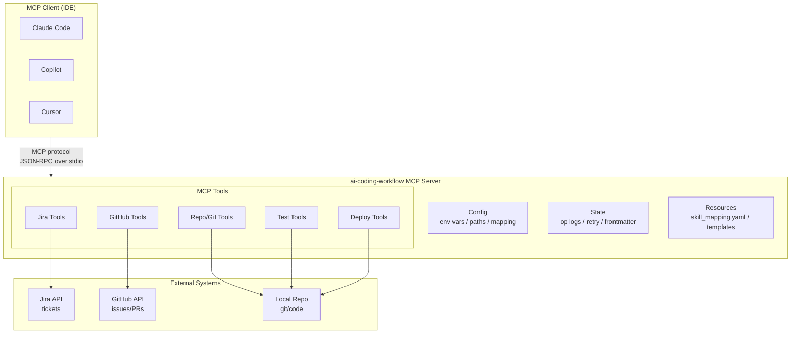

# Reference Analysis: wenttt/ai-coding-workflow

> Deep analysis of the AI Coding Workflow MCP Server project — a pull-based, skill-orchestrated, multi-project AI development pipeline.

## 1. Project Basic Info

| Field | Value |
|-------|-------|
| **Repository** | https://github.com/wenttt/ai-coding-workflow |
| **Stars** | ~1,200 (as of 2026-08) |
| **Language** | Python (100%) |
| **Tool** | MCP Server + Claude Code / GitHub Copilot / Cursor / any MCP client |
| **Last Update** | May 18, 2026 |
| **Commits** | 7 |
| **Contributors** | 2 (wenttt, claude) |
| **License** | Not specified |
| **Status** | Day-1 scope complete, production-ready for cross-cutting tools |

---

## 2. Project Background & Goals

### Problem Statement
AI coding agents (Claude Code, Copilot, Cursor) are powerful but untethered. Without a structured pipeline, they:
- Jump straight to coding without design
- Don't follow team conventions
- Lose context between sessions
- Can't work across multiple projects/repos
- Don't leave audit trails

### Solution
An MCP (Model Context Protocol) server that provides the **data plumbing and orchestration**, while the IDE Copilot does the LLM work, and custom skills do the procedural work. Humans and teams do the judgment.

### Core Philosophy
> "This server provides the data plumbing and orchestration. The IDE Copilot does the LLM work. Skills do the procedural work. You and your team do the judgment."

### Design Principles (Non-Negotiable)
1. **Pull-based, not webhook-driven** — Agent reads GitHub state when invoked, not the other way around
2. **One step per invocation** — Human stays in the loop. No long-running daemons
3. **Operation logs are first-class** — Every step writes structured operation log
4. **Rejection loops are main flow, not error handling**
5. **3-strike escalation** — Auto-retry 3 times, then escalate to human
6. **Skills are bash-free** — All shell operations go through MCP tools
7. **Brownfield + Greenfield are first-class branches**
8. **Skill mapping is configurable** — Each team can fork skill_mapping.yaml

---

## 3. Architecture Deep Dive

### 3.0 Mermaid Architecture Overview



### 3.0.1 Pipeline Flow


### 3.1 High-Level Architecture

```
┌─────────────────────────────────────────────────────────────────┐
│                        MCP Client (IDE)                          │
│  Claude Code / Copilot / Cursor / any MCP-compatible agent      │
└──────────────────────────────┬──────────────────────────────────┘
                               │ MCP protocol (JSON-RPC over stdio)
                               ▼
┌─────────────────────────────────────────────────────────────────┐
│                    ai-coding-workflow MCP Server                 │
│                                                                   │
│  ┌─────────────┐  ┌─────────────┐  ┌─────────────────────────┐  │
│  │   Config    │  │    State    │  │      Tools (MCP)        │  │
│  │  - env vars │  │  - op logs  │  │  - Jira tools           │  │
│  │  - paths    │  │  - retry    │  │  - GitHub tools         │  │
│  │  - mapping  │  │  - frontmatter│ │  - repo/git tools       │  │
│  └─────────────┘  └─────────────┘  │  - test tools           │  │
│                                      │  - deploy tools         │  │
│                                      └─────────────────────────┘  │
│  ┌─────────────────────────────────────────────────────────────┐  │
│  │                     Resources                                │  │
│  │  - skill_mapping.yaml (stage → skill routing, forkable)    │  │
│  │  - templates/ (design doc templates: brownfield + greenfield)│
│  │  - project_mapping.example.yaml (multi-project config)      │  │
│  └─────────────────────────────────────────────────────────────┘  │
└─────────────────────────────────────────────────────────────────┘
                               │
                               ▼
┌──────────────┐  ┌──────────────┐  ┌──────────────┐
│   Jira API   │  │  GitHub API  │  │  Local Repo  │
│  (tickets)   │  │  (issues/PRs)│  │  (git/code)  │
└──────────────┘  └──────────────┘  └──────────────┘
```

### 3.2 Project Structure

```
ai-coding-workflow/
├── src/ai_coding_workflow/
│   ├── server.py              # MCP server entry point
│   ├── config.py              # Environment + paths
│   ├── state/                 # Operation logs, retry tracking, frontmatter
│   ├── tools/                 # MCP tools (Jira, GitHub, repo, git, tests, etc.)
│   └── resources/
│       ├── skill_mapping.yaml # stage → skill routing (forkable)
│       └── templates/         # Design doc templates (brownfield + greenfield)
├── .claude/skills/            # MCP-aware custom skills (bash-free)
├── docs/                      # Architecture + protocol docs
│   ├── ARCHITECTURE.md        # Why pull-based, why skill-orchestrated
│   ├── SKILL_ORCHESTRATION.md # How skill_mapping.yaml routes stages
│   ├── OPERATION_LOG_SCHEMA.md # The single most important contract
│   ├── INSTALL.md             # IDE-specific setup
│   ├── ROADMAP.md             # Day-1 vs later
│   └── origin-design.md       # Historical conception record
├── examples/                  # Full pipeline walkthroughs
├── templates/                 # Copilot instructions, .roorules
├── tests/
├── .env.example
├── pyproject.toml
└── README.md
```

### 3.3 Pipeline Stages

```
Jira ticket
    │
    ▼
[Stage 1: Design] mcp-design-brownfield / mcp-design-greenfield
    │
    │ (publishes a GitHub Issue with the design markdown)
    ▼
[Human review on GitHub Issue]
    │
    │ Issue closed `completed` (or comments → mcp-design-revise → loop, max 3)
    ▼
[Stage 2: Implementation] mcp-implement-{backend,frontend,db}
    │
    │ (creates feat/{KEY}-* branch with code)
    ▼
[Stage 3: Self review] mcp-self-review
    │
    ▼
[Stage 4: Test] mcp-test-write → mcp-test-run (max 3 retries)
    │
    ▼
[Code PR opened] (PR body has `Closes #<design-issue>`)
    │
    │ human review (or rejected → loop, max 3)
    ▼
[Stage 5: Deploy] mcp-deploy
    │
    ▼
[Stage 6: Doc update] mcp-doc-update
    │
    ▼
[Jira closed]
```

**Key architectural decision**: Design discussion lives in **GitHub Issues** (lightweight, no branches), code lives in **PRs** (with branch isolation for parallel team development).

### 3.4 Skill Orchestration

The `skill_mapping.yaml` maps pipeline stages to custom skills. Each team can fork this file to use their own skills.

```yaml
# skill_mapping.yaml (conceptual)
stages:
  design:
    brownfield: mcp-design-brownfield
    greenfield: mcp-design-greenfield
    revise: mcp-design-revise
  implementation:
    backend: mcp-implement-backend
    frontend: mcp-implement-frontend
    db: mcp-implement-db
  self_review: mcp-self-review
  test:
    write: mcp-test-write
    run: mcp-test-run
  deploy: mcp-deploy
  doc_update: mcp-doc-update
```

Skills are **bash-free** — all shell operations go through MCP tools that run in the server's process. This provides a security boundary and consistent behavior across IDEs.

### 3.5 Multi-Project & Cross-Project Support

#### Multiple Projects
- `list_my_tickets()` returns tickets across ALL Jira projects
- Each ticket tagged with which repo + workspace it belongs to
- Pipeline checks workspace match and tells you to switch VS Code window if needed

#### Cross-Project Tickets (single feature spanning frontend + backend)
- Handled with **contract-first design**
- `cross_project.md` template requires explicit Contract section (OpenAPI / Protobuf / GraphQL)
- Both sides implement against this contract
- Implementation order: typically backend first (producer), then frontend (consumer)
- Per-repo Stage 2 runs
- Final Stage 4.5 cross-repo integration test

Configured via `PROJECT_MAPPING_PATH` env var pointing at `project_mapping.yaml`.

---

## 4. Core Features Deep Dive

### 4.1 Pull-Based Pipeline

**What it is**: The agent reads GitHub/Jira state when invoked by the human. It does NOT run as a daemon that reacts to webhooks.

**Why**:
- Human stays in control — pipeline only runs when you say so
- No long-running processes to maintain
- No webhook infrastructure needed
- Works with any MCP client (no vendor lock-in)

**How it works**:
1. Human says "Start working on JIRA-123" in IDE
2. MCP client calls server tools to fetch ticket, check state, read operation logs
3. Agent executes one stage, writes operation log, stops
4. Human reviews, then says "continue" for next stage

### 4.2 Operation Logs (First-Class Artifact)

**The single most important contract in the project.**

Every step writes `docs/operations/{KEY}/{NN}-{stage}-v{N}.md` with:

```markdown
# {Stage Name} — {JIRA-KEY} (v{N})

## Did
{What was done}

## Impact
{Files changed, components, risk}

## Could Not
{What was NOT done and why}

## Engineering Decisions
{Key decisions + trade-offs}

## Evidence
- Command: `{command}`
- Output: {summary}
- Exit code: {0/1}

## Next
{Handoff to next stage}
```

**Why it matters**:
- Audit trail of entire pipeline
- Enables debugging (what was done, what failed)
- Provides context for next stage
- Human can review without reading all code
- Versioned (v1, v2, v3) to track revisions

### 4.3 Rejection Loops (Main Flow, Not Error Handling)

**What it is**: When a human rejects a design (GitHub Issue comment) or PR, the pipeline loops back to revise — this is treated as the normal flow, not an exception.

**Design stage rejection loop**:
1. Human comments on design Issue with feedback
2. `mcp-design-revise` skill reads comments, updates design
3. Updated design posted as new comment (or Issue updated)
4. Human reviews again
5. Max 3 loops → escalate to human

**PR rejection loop**:
1. Human requests changes on PR
2. Agent reads review comments, fixes code
3. Pushes fixes, re-requests review
4. Max 3 loops → escalate

**Why this is main flow**: Rejection and revision are how good software gets built. Treating them as exceptions means they're handled poorly. Making them first-class means the pipeline is designed to handle them well.

### 4.4 3-Strike Escalation

**What it is**: Any stage that fails 3 times automatically stops and escalates to a human.

**Triggers**:
- 3 failed test runs (Stage 4)
- 3 design revision loops (Stage 1)
- 3 PR revision loops (Stage 5)
- Any stage that can't proceed

**Escalation output**:
- What was tried (3 attempts with results)
- Root cause (best guess)
- Recommended next steps
- Links to state and logs

**Why**: Prevents infinite loops, wasted compute, and frustration. Some problems need human judgment, not more retries.

### 4.5 Brownfield + Greenfield Detection

**What it is**: Stage 1 (Design) automatically detects whether the project is brownfield (existing codebase) or greenfield (new project) and dispatches to the appropriate design skill.

**Brownfield design** (`mcp-design-brownfield`):
- Analyzes existing codebase structure
- Identifies existing patterns and conventions
- Designs feature to fit existing architecture
- References existing modules and services

**Greenfield design** (`mcp-design-greenfield`):
- Designs from scratch
- Establishes project structure
- Sets conventions and patterns
- Creates foundation documents

**Why**: Designing for an existing codebase is fundamentally different from designing a new one. The pipeline handles both natively.

### 4.6 Copilot Instructions Auto-Load

**What it is**: A `templates/.github/copilot-instructions.md` file that you drop into your team's repo. GitHub Copilot automatically loads this file, so it learns the pipeline without multi-step prompts.

**Result**: Once set up, the user just says one sentence ("start working on JIRA-123") and Copilot drives the entire pipeline.

---

## 5. Configuration & Usage

### 5.1 Installation

```bash
# 1. Install
pip install -e .

# 2. Set credentials
cp .env.example .env
# edit .env with Jira + GitHub credentials

# 3. Drop Copilot instructions into team repo
cp templates/.github/copilot-instructions.md <your-team-repo>/.github/copilot-instructions.md

# 4. Configure IDE to use this MCP server (see docs/INSTALL.md)

# 5. In IDE Agent (Agent mode):
# "Start working on JIRA-123"  (natural language)
# /ai-coding-workflow:pipeline jira_key=JIRA-123  (slash command)
# /ai-coding-workflow:my_tickets  (list my assigned tickets)
```

### 5.2 Environment Variables (.env.example)

```env
# Jira Configuration
JIRA_BASE_URL=https://your-domain.atlassian.net
JIRA_EMAIL=your-email@company.com
JIRA_API_TOKEN=your-jira-api-token

# GitHub Configuration
GITHUB_TOKEN=your-github-token
GITHUB_OWNER=your-org
# GITHUB_ENTERPRISE_URL=https://github.your-company.com (optional)

# Project Mapping
PROJECT_MAPPING_PATH=./project_mapping.yaml

# Operation Logs
OPERATIONS_LOG_DIR=./docs/operations
```

### 5.3 Project Mapping (project_mapping.yaml)

```yaml
projects:
  - jira_project_key: PROJA
    jira_project_name: Project A Backend
    github_owner: your-org
    github_repo: project-a-backend
    default_branch: main
    workspace: project-a-backend
    vscode_workspace: project-a.code-workspace

  - jira_project_key: PROJF
    jira_project_name: Project F Frontend
    github_owner: your-org
    github_repo: project-f-frontend
    default_branch: main
    workspace: project-f-frontend

cross_project:
  contract_first: true
  contract_types: [openapi, protobuf, graphql]
  implementation_order: [backend, frontend, integration]
```

---

## 6. Pros & Cons Analysis

### 6.1 Strengths

| Strength | Description | Impact |
|----------|-------------|--------|
| **MCP Server architecture** | Works with any MCP-compatible agent (Claude, Copilot, Cursor) | High portability, no vendor lock-in |
| **Pull-based pipeline** | Human stays in control, no daemons | Safe, predictable, easy to debug |
| **Operation logs first-class** | Every step leaves structured audit trail | Accountability, debugging, context |
| **Design in Issues, code in PRs** | Clean separation of design discussion and implementation | Parallel team development, clear review flow |
| **Multi-project support** | Works across multiple Jira projects + GitHub repos | Enterprise-ready |
| **Cross-project contract-first** | Handles features spanning multiple repos | Real-world team workflows |
| **Rejection loops as main flow** | Revision is designed for, not an afterthought | Better quality software |
| **3-strike escalation** | Prevents infinite loops | Safe, human-in-the-loop |
| **Configurable skill mapping** | Teams can use their own skills | Customizable, extensible |
| **Brownfield + greenfield** | Handles both existing and new projects | Broad applicability |
| **Copilot auto-load instructions** | One sentence triggers full pipeline | Low friction, easy adoption |
| **Bash-free skills** | All shell ops through MCP tools | Security boundary, consistent behavior |

### 6.2 Weaknesses

| Weakness | Description | Impact |
|----------|-------------|--------|
| **Young project (7 commits)** | Relatively new, may have rough edges | Production risk, limited battle-testing |
| **Python-only server** | MCP server in Python, requires Python environment | Setup complexity for non-Python teams |
| **Day-1 scope only** | Stages 2, 4, 5 have skills + tools but "real-world coverage hardens with usage" | Some stages may be less mature |
| **No built-in knowledge base** | No structured KB injection like CBOL has | Agent may not follow team conventions consistently |
| **GitHub Issue for design** | Design as GitHub Issue may not fit all teams' workflows | Some teams prefer Confluence/Notion for design |
| **One step per invocation** | Requires human to say "continue" between stages | More manual intervention than fully automated |
| **No SDD template** | Design skill generates design, but no standardized SDD template | Design quality may vary |
| **Limited testing infrastructure** | Test write + run skills, but no coverage enforcement | Quality gates may be weak |
| **No state persistence file** | Operation logs serve as state, but no structured state JSON | Resuming may require parsing logs |
| **Small community** | ~1.2k stars, 2 contributors | Limited support, fewer examples |

### 6.3 Opportunities

| Opportunity | Description |
|-------------|-------------|
| **Add knowledge base injection** | Integrate structured KB (like CBOL's) into design/implementation stages |
| **Add SDD template** | Standardize design output with a comprehensive SDD template |
| **Add structured state file** | JSON state file for reliable resume (like CBOL has) |
| **Add quality gates** | Coverage thresholds, SonarQube integration, security scanning |
| **Add deployment automation** | More robust deploy stage with CI/CD integration |
| **Add OpenCode support** | Explicit OpenCode compatibility (currently MCP-generic) |
| **Larger community** | More contributors, more examples, more battle-testing |

### 6.4 Threats

| Threat | Description |
|--------|-------------|
| **GitHub Copilot native agent** | GitHub's built-in coding agent may make this redundant |
| **MCP standard evolution** | MCP protocol changes may break compatibility |
| **Project abandonment** | Young project could be abandoned |
| **Security concerns** | MCP server with Jira/GitHub credentials is a high-value target |

---

## 7. Lessons for CBOL

### 7.1 What CBOL Already Adopted

| Pattern | CBOL Implementation | Source |
|---------|-------------------|--------|
| Operation logs | `docs/operations/{KEY}/{NN}-{stage}-v{N}.md` | ai-coding-workflow |
| 3-strike escalation | Max 3 revision loops at every gate | ai-coding-workflow |
| Pull-based approval gates | 6 human approval gates | ai-coding-workflow |
| Multi-project support | `project_mapping.yaml` with cross-project contract-first | ai-coding-workflow |
| Rejection loops as main flow | Revision loops at Gates 1, 2, 4, 5 | ai-coding-workflow |
| Stage-specific skill mapping | `workflow-ticket-to-deploy` orchestrates 7 skills | ai-coding-workflow skill_mapping.yaml |
| Design before code | Stage 2 (SDD) must pass Gate 2 before Stage 3 | ai-coding-workflow Stage 1 → Stage 2 |

### 7.2 What CBOL Does Better

| Feature | CBOL | ai-coding-workflow |
|---------|------|---------------------|
| **Structured state file** | JSON state file with per-stage status, version, retry counts | Operation logs only (no structured state) |
| **Anti-drift checks** | Pre-stage verification (previous stage complete, approved, evidence exists) | Not explicitly documented |
| **Knowledge base injection** | Stage-specific KB doc injection (01/02/03/04 directories) | No structured KB |
| **SDD template** | 14-section standardized SDD template | Design skill generates, no standard template |
| **TDD enforcement** | RED→GREEN→REFACTOR→COMMIT per task, max 50 cycles | Test write + run, no TDD cycle enforcement |
| **Quality gates** | Coverage >= 80%/70%, SonarQube, security scan | No explicit quality gates |
| **Custom state machine** | Domain-specific lightweight state machine | N/A (generic pipeline) |
| **OpenCode native** | `.opencode/` config, commands, skill junctions | MCP-generic (works with OpenCode via MCP) |

### 7.3 What CBOL Could Learn

| Pattern | Description | CBOL Action |
|---------|-------------|-------------|
| **MCP Server exposure** | Expose pipeline stages as MCP tools for broader agent compatibility | Consider adding MCP server wrapper for CBOL pipeline |
| **Design in Issues** | Use GitHub Issues for design discussion (lightweight, no branches) | Consider adding design Issue creation to Stage 2 |
| **PR body links design issue** | `Closes #<design-issue>` in PR body creates traceability | Add design doc link to PR template |
| **Brownfield/greenfield detection** | Auto-detect project type and dispatch to appropriate design skill | Add brownfield/greenfield detection to Stage 2 |
| **Copilot auto-load instructions** | `.github/copilot-instructions.md` for zero-friction onboarding | Add Copilot instructions template to CBOL |
| **Configurable skill mapping** | `skill_mapping.yaml` that teams can fork | Consider externalizing skill mapping to config |
| **Cross-project integration test stage** | Stage 4.5 for cross-repo integration testing | Add integration test stage for cross-project tickets |

---

## 8. Key Code & Config Examples

### 8.1 MCP Server Entry Point (conceptual)

```python
# src/ai_coding_workflow/server.py (conceptual)
from mcp.server import Server
from mcp.server.stdio import stdio_server

server = Server("ai-coding-workflow")

@server.list_tools()
async def list_tools():
    return [
        Tool(name="list_my_tickets", description="List my assigned Jira tickets across all projects"),
        Tool(name="pipeline_start", description="Start or resume pipeline for a Jira ticket"),
        Tool(name="pipeline_status", description="Get current pipeline status for a ticket"),
        Tool(name="operation_log_write", description="Write an operation log for a stage"),
        Tool(name="operation_log_read", description="Read operation logs for a ticket"),
        Tool(name="retry_count_get", description="Get retry count for a stage"),
        Tool(name="retry_count_increment", description="Increment retry count for a stage"),
        # ... Jira tools, GitHub tools, repo tools, test tools, deploy tools
    ]

async def main():
    async with stdio_server() as (read_stream, write_stream):
        await server.run(read_stream, write_stream, server.create_initialization_options())
```

### 8.2 Operation Log Frontmatter

```yaml
---
stage: design
stage_number: 1
jira_key: JIRA-123
version: 2
status: completed
timestamp: 2026-05-10T14:30:00Z
duration_seconds: 450
evidence_command: "mcp-design-brownfield --issue JIRA-123"
evidence_exit_code: 0
next_stage: implementation
---
```

### 8.3 Skill Mapping (conceptual)

```yaml
# resources/skill_mapping.yaml
version: "1.0"
pipeline:
  stage1_design:
    detection: auto  # brownfield/greenfield auto-detect
    brownfield: mcp-design-brownfield
    greenfield: mcp-design-greenfield
    revise: mcp-design-revise
    max_revisions: 3
  stage2_implementation:
    backend: mcp-implement-backend
    frontend: mcp-implement-frontend
    db: mcp-implement-db
  stage3_self_review:
    skill: mcp-self-review
  stage4_test:
    write: mcp-test-write
    run: mcp-test-run
    max_retries: 3
  stage5_deploy:
    skill: mcp-deploy
  stage6_doc_update:
    skill: mcp-doc-update
```

---

## 9. References

- **Repository**: https://github.com/wenttt/ai-coding-workflow
- **README**: https://github.com/wenttt/ai-coding-workflow/blob/main/README.md
- **Architecture Doc**: https://github.com/wenttt/ai-coding-workflow/blob/main/docs/ARCHITECTURE.md
- **Skill Orchestration**: https://github.com/wenttt/ai-coding-workflow/blob/main/docs/SKILL_ORCHESTRATION.md
- **Operation Log Schema**: https://github.com/wenttt/ai-coding-workflow/blob/main/docs/OPERATION_LOG_SCHEMA.md
- **Installation Guide**: https://github.com/wenttt/ai-coding-workflow/blob/main/docs/INSTALL.md
- **Roadmap**: https://github.com/wenttt/ai-coding-workflow/blob/main/docs/ROADMAP.md
- **MCP Specification**: https://modelcontextprotocol.io/
- **CBOL Pipeline**: `../ticket-to-deploy-workflow.md`
- **CBOL Comparison**: `../reference-workflows.md`

---

*Analysis date: 2026-08-21*
*Analyst: CBOL Knowledge Base AI*
*Project version at analysis: Day-1 scope (May 2026)*
