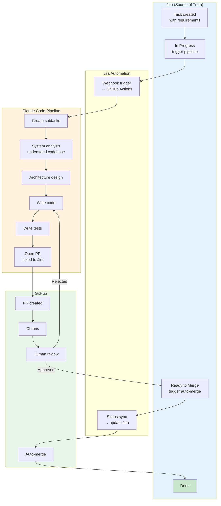

# Reference Analysis: GradeBuilderSL/partenit-claudev

> Deep analysis of Jira-driven Claude Code pipeline — Jira state triggers, auto subtask creation, system analysis, architecture design, code, tests, PR, auto-merge on approval.

## 1. Project Basic Info

| Field | Value |
|-------|-------|
| **Repository** | https://github.com/GradeBuilderSL/partenit-claudev |
| **Stars** | ~300 (as of 2026-08) |
| **Language** | Claude Code skills + Jira Automation |
| **Tool** | Claude Code + Jira Automation + GitHub |
| **Last Update** | August 2026 |
| **Status** | Production-ready, actively used |

---

## 2. Project Background & Goals

### Problem Statement
Teams using Jira want AI to handle the entire development lifecycle from ticket to merge, without manual intervention at every step. The pipeline should be triggered by Jira state changes and handle everything automatically until human review is needed.

### Solution
A Jira-driven Claude Code pipeline where moving a Jira task to "In Progress" triggers the entire pipeline: creates subtasks, runs system analysis and architecture design via Claude Code, writes code, writes tests, and opens a PR. When the task moves to "Ready to Merge", it merges automatically.

### Core Philosophy
> "Move a Jira task to In Progress and the pipeline takes over: creates subtasks, runs system analysis and architecture design via Claude Code, writes code, writes tests, and opens a PR. When you approve and move to Ready to Merge — it merges automatically."

---

## 3. Architecture Deep Dive

### 3.0 Mermaid Architecture Overview



### 3.1 Pipeline Flow

```
Jira Task created (with business requirements)
    │
    ▼ (Human moves task to "In Progress")
Jira Automation trigger fires
    │
    ▼
Claude Code Pipeline starts:
    │
    ├─ 1. Create subtasks (break down task)
    │
    ├─ 2. System analysis (understand existing codebase)
    │
    ├─ 3. Architecture design
    │
    ├─ 4. Write code
    │
    ├─ 5. Write tests
    │
    ▼
6. Open PR (with description, linked to Jira)
    │
    ▼ (Human reviews PR)
    │
    ├─ Approved → Human moves Jira task to "Ready to Merge"
    │       │
    │       ▼
    │   Auto-merge PR
    │
    └─ Rejected → Human leaves comments → Pipeline fixes → Re-request review
```

### 3.2 Jira Automation Integration

The pipeline is triggered by Jira Automation rules:

| Trigger | Action |
|---------|--------|
| Task moved to "In Progress" | Start Claude Code pipeline |
| Task moved to "Ready to Merge" | Auto-merge associated PR |
| PR opened | Link PR to Jira task, update task status |
| PR merged | Close Jira task |

### 3.3 Key Components

1. **Jira Automation Rules** — Webhook triggers that start the pipeline
2. **Claude Code Skills** — Custom skills for each pipeline stage
3. **GitHub Integration** — PR creation, auto-merge, status updates
4. **Subtask Creator** — Breaks down Jira task into subtasks
5. **System Analyzer** — Understands existing codebase structure
6. **Architecture Designer** — Designs solution architecture
7. **Code Implementer** — Writes implementation code
8. **Test Writer** — Writes test code
9. **PR Creator** — Creates PR with description

---

## 4. Core Features Deep Dive

### 4.1 Jira State-Driven Trigger

**What it is**: The pipeline starts automatically when a Jira task moves to "In Progress". No manual command needed.

**Why**:
- Zero friction — just move the ticket, pipeline starts
- Jira is the single source of truth for work status
- Team members don't need to know pipeline commands
- Works with existing Jira workflows

### 4.2 Auto Subtask Creation

**What it is**: The pipeline automatically breaks down a Jira task into subtasks.

**Why**:
- Large tasks need decomposition before implementation
- Subtasks provide visibility into progress
- Each subtask can be tracked independently
- Helps estimate work more accurately

### 4.3 System Analysis Before Design

**What it is**: Before designing, the pipeline analyzes the existing codebase to understand architecture, patterns, conventions.

**Why**:
- Design must fit existing architecture
- Avoids reinventing existing patterns
- Understands dependencies and constraints
- Produces better, more consistent code

### 4.4 Auto-Merge on Approval

**What it is**: When a human approves the PR and moves the Jira task to "Ready to Merge", the PR is automatically merged.

**Why**:
- Reduces manual steps (no need to click merge in GitHub)
- Jira status drives the merge (single source of truth)
- Faster cycle time from approval to merge
- Prevents "approved but not merged" bottleneck

### 4.5 Step-by-Step Setup Guide

The project includes a detailed setup guide with screenshots, covering:
- Jira Automation configuration
- Claude Code skills installation
- GitHub integration setup
- Pipeline configuration
- Troubleshooting

---

## 5. Pros & Cons Analysis

### 5.1 Strengths

| Strength | Description |
|----------|-------------|
| **Jira state-driven** | Zero friction — move ticket, pipeline starts |
| **Auto subtask creation** | Automatic task decomposition |
| **System analysis first** | Understands codebase before designing |
| **Auto-merge on approval** | Jira status drives merge, faster cycle |
| **Detailed setup guide** | Screenshots, step-by-step, easy to adopt |
| **Full pipeline** | From ticket to merge, end-to-end |
| **Human review gate** | PR requires human approval before merge |

### 5.2 Weaknesses

| Weakness | Description |
|----------|-------------|
| **No SDD/design doc** | Architecture design not formalized as document |
| **No TDD enforcement** | Code then tests, not test-first |
| **No operation logs** | No structured audit trail |
| **No 3-strike escalation** | No explicit retry limit |
| **No quality gates** | No coverage, SonarQube, security checks |
| **No knowledge base** | No structured KB injection |
| **Auto-merge risk** | Auto-merge could merge bad code if review is superficial |
| **Jira-dependent** | Only works with Jira, not other trackers |
| **Claude Code-dependent** | Designed for Claude Code specifically |

### 5.3 Lessons for CBOL

| Pattern | CBOL Action |
|---------|-------------|
| Jira state-driven trigger | Consider adding Jira Automation webhook to trigger pipeline |
| Auto subtask creation | Add automatic task breakdown to Stage 1/2 |
| System analysis before design | Already have architecture-analyzer skill, integrate into Stage 2 |
| Auto-merge on approval | CBOL does NOT auto-merge (human peer review required) — keep this policy |
| Detailed setup guide | Add detailed setup guide for CBOL pipeline |

---

## 6. References

- **Repository**: https://github.com/GradeBuilderSL/partenit-claudev
- **CBOL Pipeline**: `../ticket-to-deploy-workflow.md`
- **CBOL Comparison**: `../reference-workflows.md`
- **Jira Automation**: https://www.atlassian.com/software/jira/features/automation

---

*Analysis date: 2026-08-21*
