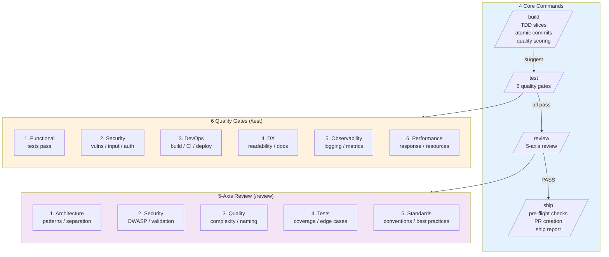
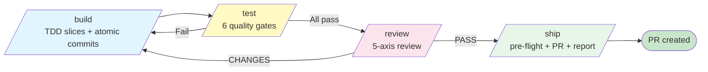

# Reference Analysis: shgandla/ai-agents

> Deep analysis of multi-agent AI development system — /build /test /review /ship commands, 6 quality gates, 5-axis review, command chaining.

## 1. Project Basic Info

| Field | Value |
|-------|-------|
| **Repository** | https://github.com/shgandla/ai-agents |
| **Stars** | ~200 (as of 2026-08) |
| **Language** | Markdown agents + skills |
| **Tool** | Multi-agent system (Claude Code compatible) |
| **Last Update** | August 2026 |
| **Status** | Active development |

---

## 2. Project Background & Goals

### Problem Statement
AI coding needs a structured multi-agent system with clear commands for each phase of development, quality gates at every stage, and comprehensive review dimensions.

### Solution
A multi-agent system with 4 core commands that chain together: `/build`, `/test`, `/review`, `/ship`. Each command has specialized agents and quality gates.

---

## 3. Architecture Deep Dive

### 3.0 Mermaid Architecture Overview

### 3.1 Command Flow

### 3.2 6 Quality Gates (/test)

| Gate | Dimension | Checks |
|------|-----------|--------|
| 1 | Functional | All tests pass, features work as specified |
| 2 | Security | No vulnerabilities, input validation, auth checks, secret scanning |
| 3 | DevOps | Build succeeds, CI passes, deployment config valid |
| 4 | Developer Experience (DX) | Code readable, well-documented, follows conventions |
| 5 | Observability | Logging, metrics, tracing, error handling |
| 6 | Performance | Response time, resource usage, no obvious bottlenecks |

### 3.3 5-Axis Review (/review)

| Axis | Focus |
|------|-------|
| 1 | Architecture | Design patterns, separation of concerns, scalability, modularity |
| 2 | Security | OWASP Top 10, input validation, auth, data protection |
| 3 | Quality | Code complexity, duplication, naming, consistency |
| 4 | Tests | Coverage, test quality, edge cases, test maintainability |
| 5 | Standards | Project conventions, language best practices, framework guidelines |

---

## 4. Core Features Deep Dive

### 4.1 Command Chaining

Each command chains to the next. After `/build` completes, it suggests running `/test`. After `/test` passes, it suggests `/review`. This creates a natural pipeline without strict enforcement.

### 4.2 TDD Slices with Atomic Commits

`/build` breaks work into TDD slices, each with an atomic commit. This ensures:
- Each commit is a complete, working unit
- Easy to rollback individual changes
- Clear git history
- Each slice has passing tests

### 4.3 Code Quality Scoring

`/build` includes code quality scoring, providing a numeric score for the implementation. This gives immediate feedback on code quality.

### 4.4 Pre-Flight Checks

`/ship` runs pre-flight checks before creating the PR:
- All tests pass
- No linting errors
- No security vulnerabilities
- Documentation updated
- Branch is up to date with main
- No merge conflicts

### 4.5 Ship Report

`/ship` produces a ship report summarizing:
- What was built
- Quality gates passed
- Review findings
- Files changed
- Risk assessment
- PR link

---

## 5. Pros & Cons Analysis

### 5.1 Strengths

| Strength | Description |
|----------|-------------|
| **Clear commands** | /build, /test, /review, /ship — easy to remember and use |
| **Command chaining** | Natural pipeline flow without strict enforcement |
| **6 quality gates** | Comprehensive testing across functional, security, DevOps, DX, observability, performance |
| **5-axis review** | Multi-dimensional review covering architecture, security, quality, tests, standards |
| **TDD with atomic commits** | Each slice is a complete, working unit with passing tests |
| **Code quality scoring** | Numeric score provides immediate feedback |
| **Pre-flight checks** | Ensures PR is ready before creation |
| **Ship report** | Comprehensive summary of what was built |

### 5.2 Weaknesses

| Weakness | Description |
|----------|-------------|
| **No design phase** | Jumps straight to build, no SDD/design stage |
| **No requirements phase** | No structured requirements gathering |
| **No Jira/tracker integration** | Manual ticket management |
| **No operation logs** | No structured audit trail |
| **No 3-strike escalation** | No explicit retry limit |
| **No knowledge base** | No structured KB injection |
| **No deployment** | /ship creates PR, doesn't deploy |
| **No state persistence** | No state file for resuming |
| **Smaller project** | Less battle-tested, fewer contributors |

### 5.3 Lessons for CBOL

| Pattern | CBOL Action |
|---------|-------------|
| 6 quality gates | CBOL already has quality gates, could expand to 6 dimensions |
| 5-axis review | CBOL Gate 5 peer review could use 5-axis checklist |
| Command chaining | CBOL already has pipeline stages, could add natural chaining suggestions |
| Code quality scoring | Consider adding numeric quality score at Gate 3 |
| Ship report | CBOL Stage 6 could produce a deployment report |
| Pre-flight checks | CBOL Gate 5 could have explicit pre-flight checklist |

---

## 6. References

- **Repository**: https://github.com/shgandla/ai-agents
- **CBOL Pipeline**: `../ticket-to-deploy-workflow.md`
- **CBOL Comparison**: `../reference-workflows.md`

---

*Analysis date: 2026-08-21*
