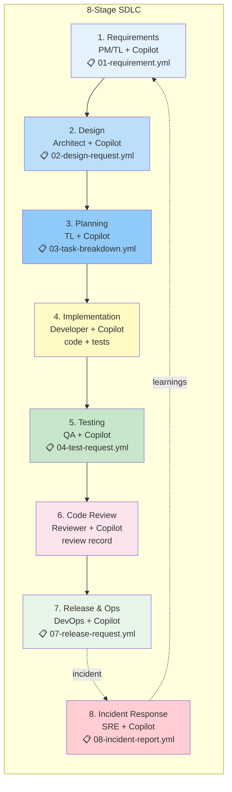
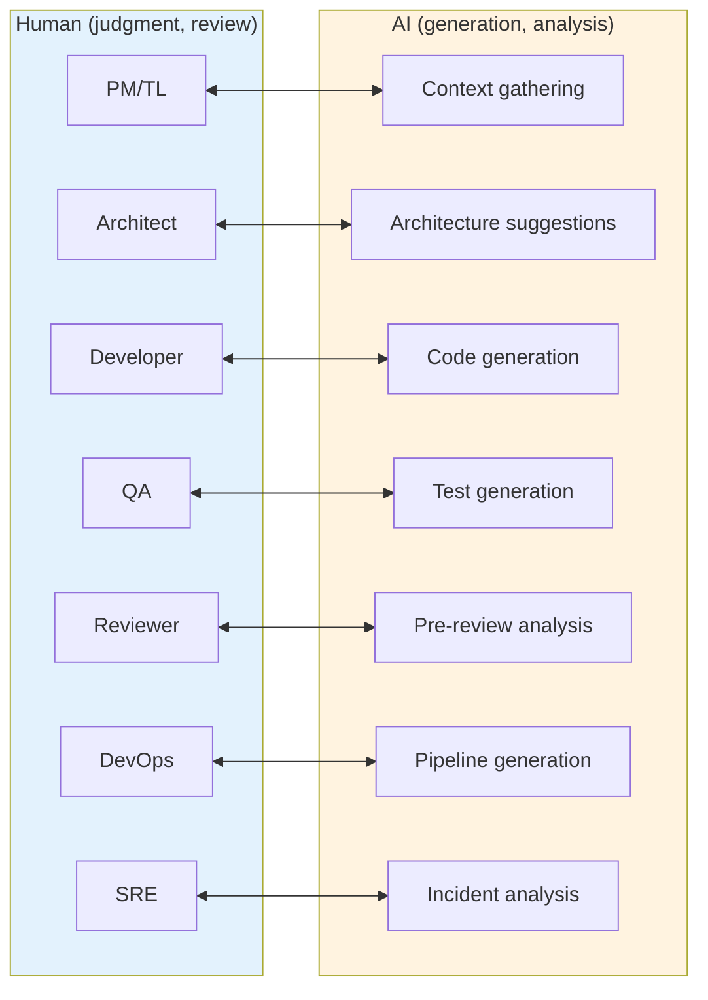

# Reference Analysis: grammy-jiang/agentic-dev-template

> Deep analysis of 8-stage agentic development template with issue templates, Copilot support, and per-stage output artifacts.

## 1. Project Basic Info

| Field | Value |
|-------|-------|
| **Repository** | https://github.com/grammy-jiang/agentic-dev-template |
| **Stars** | ~150 (as of 2026-08) |
| **Language** | Markdown templates + YAML issue forms |
| **Tool** | Template repository (GitHub Copilot, Claude Code compatible) |
| **Last Update** | August 2026 |
| **Status** | Active development |

---

## 2. Project Background & Goals

### Problem Statement
Teams need a reusable template for agentic development that defines clear stages, output artifacts, and issue templates for each phase. The template should work with GitHub Copilot and other AI agents.

### Solution
An 8-stage agentic development template with:
- Clear stage definitions with traditional roles and Copilot support
- Key output artifacts for each stage
- GitHub issue templates for each stage
- Recommended workflow steps

---

## 3. Architecture Deep Dive

### 3.0 Mermaid Architecture Overview

### 3.0.1 Role + AI Support Mapping

### 3.1 8-Stage Workflow

| Stage | Traditional Role | Copilot Support | Key Output | Issue Template |
|-------|-----------------|-----------------|------------|----------------|
| 1. Requirements | PM/TL | Context gathering, requirement analysis | Requirements doc | 📋 01-requirement.yml |
| 2. Design | Architect | Architecture suggestions, design patterns | Design doc | 📋 02-design-request.yml |
| 3. Planning | TL | Task breakdown, estimation | Task list | 📋 03-task-breakdown.yml |
| 4. Implementation | Developer | Code generation, refactoring | Code + tests | — |
| 5. Testing | QA | Test generation, test execution | Test report | 📋 04-test-request.yml |
| 6. Code Review | Reviewer | Pre-review analysis, suggestions | Review record | — |
| 7. Release & Ops | DevOps | Pipeline generation, runbooks | CI/CD + docs | 📋 07-release-request.yml |
| 8. Incident Response | SRE | Incident analysis, remediation | Incident report | 📋 08-incident-report.yml |

### 3.2 Recommended Workflow Steps

1. **Requirements Stage** — Gather and document requirements
2. **Design Stage** — Create architecture and design documents
3. **Planning Stage** — Break down into tasks, estimate
4. **Implementation Stage** — Write code with TDD
5. **Testing Stage** — Run tests, verify quality
6. **Code Review Stage** — Review code, address feedback
7. **Release Stage** — Deploy, monitor
8. **Incident Response** — Handle incidents, learn from them

---

## 4. Core Features Deep Dive

### 4.1 Issue Templates

Each stage has a GitHub issue template (YAML issue form) that guides the user through creating a well-structured issue. This ensures:
- Consistent issue format
- All necessary information captured
- AI agents have structured input to work with
- Easy to track progress per stage

### 4.2 Traditional Role + Copilot Support Mapping

Each stage maps both a traditional human role and how Copilot can support that role. This helps teams understand:
- Who is responsible for each stage
- How AI can assist (not replace) the human
- What the human should focus on (judgment, review)
- What AI can automate (generation, analysis)

### 4.3 Key Output Artifacts

Each stage has defined key output artifacts. This ensures:
- Clear definition of "done" for each stage
- Tangible deliverables for review
- Traceability from requirements to code
- Documentation for future maintenance

### 4.4 Template Repository Structure

The project is a GitHub template repository that can be used to bootstrap new projects. This provides:
- Consistent project structure
- Pre-configured issue templates
- Standard workflow definitions
- Easy onboarding for new projects

---

## 5. Pros & Cons Analysis

### 5.1 Strengths

| Strength | Description |
|----------|-------------|
| **8 clear stages** | Complete SDLC coverage from requirements to incident response |
| **Issue templates** | Structured input for each stage, consistent format |
| **Role + AI mapping** | Clear understanding of human vs AI responsibilities |
| **Output artifacts** | Tangible deliverables define "done" for each stage |
| **Template repository** | Easy to bootstrap new projects |
| **GitHub native** | Works with GitHub issues, Copilot, Actions |
| **Incident response** | Includes post-deployment incident handling (rare in other projects) |

### 5.2 Weaknesses

| Weakness | Description |
|----------|-------------|
| **No automation** | Template only, no pipeline automation |
| **No Jira integration** | GitHub issues only |
| **No operation logs** | No structured audit trail |
| **No quality gates** | No automated quality checks |
| **No knowledge base** | No structured KB injection |
| **No state persistence** | No state file for resuming |
| **Template only** | Requires significant setup and customization |
| **Smaller community** | Less battle-tested |

### 5.3 Lessons for CBOL

| Pattern | CBOL Action |
|---------|-------------|
| 8-stage SDLC | CBOL has 7 stages, could add incident response stage |
| Issue templates | CBOL could add GitHub issue templates for each pipeline stage |
| Role + AI mapping | CBOL AGENTS.md could clarify human vs AI responsibilities per stage |
| Output artifacts per stage | CBOL already has operation logs, could formalize artifact definitions |
| Template repository | CBOL knowledge base could be used as a template for new projects |
| Incident response | CBOL could add post-deployment monitoring and incident handling |

---

## 6. References

- **Repository**: https://github.com/grammy-jiang/agentic-dev-template
- **CBOL Pipeline**: `../ticket-to-deploy-workflow.md`
- **CBOL Comparison**: `../reference-workflows.md`
- **GitHub Issue Forms**: https://docs.github.com/en/communities/using-templates-to-encourage-useful-issues-and-pull-requests/syntax-for-githubs-form-schema

---

*Analysis date: 2026-08-21*
