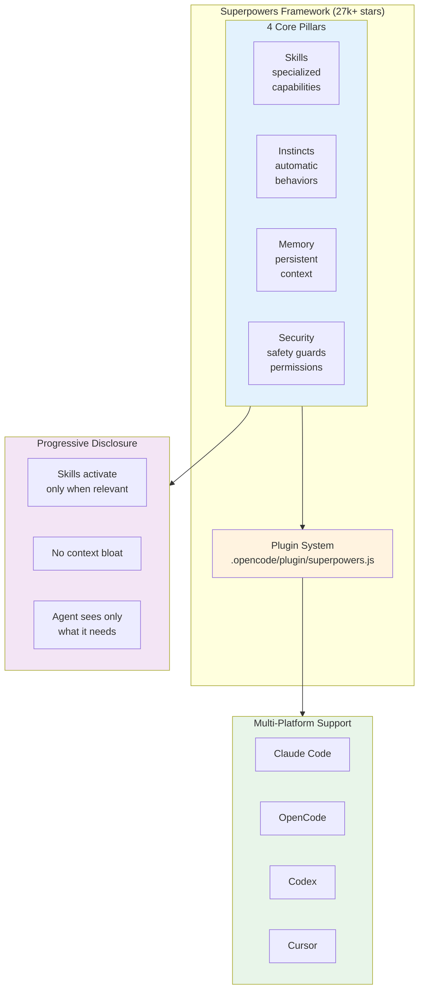
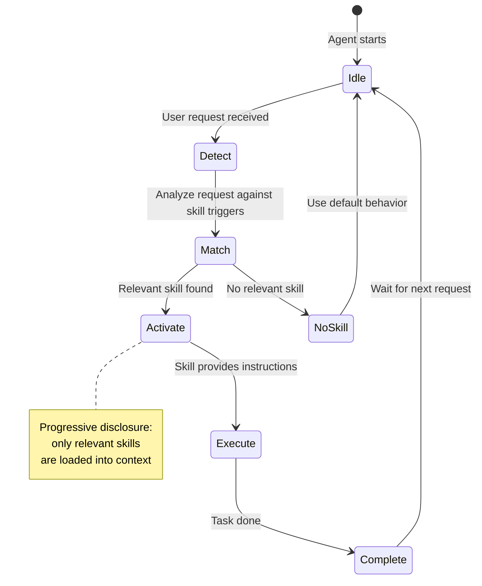

# Reference Analysis: obra/superpowers

> Deep analysis of the most popular agentic framework (27k+ stars) — skills, instincts, memory, security, multi-platform support (Claude Code, OpenCode, Codex, Cursor).

## 1. Project Basic Info

| Field | Value |
|-------|-------|
| **Repository** | https://github.com/obra/superpowers |
| **Stars** | ~27,000+ (as of 2026-08) |
| **Language** | JavaScript plugin + Markdown skills |
| **Tool** | Multi-platform (Claude Code, OpenCode, Codex, Cursor) |
| **Last Update** | Active (2026) |
| **Status** | Mature, widely adopted |
| **Plugin** | `.opencode/plugin/superpowers.js` |

---

## 2. Project Background & Goals

### Problem Statement
AI coding agents need a comprehensive framework of reusable capabilities — skills, instincts, memory, and security — that works across multiple AI coding tools. No single tool should lock users in.

### Solution
Superpowers is an agentic framework that provides:
- **Skills** — Specialized capabilities for specific tasks
- **Instincts** — Automatic behaviors that trigger without explicit invocation
- **Memory** — Persistent context across sessions
- **Security** — Built-in safety guards
- **Multi-platform** — Works on Claude Code, OpenCode, Codex, Cursor

### Core Philosophy
> "Performance optimization system with skills, instincts, memory, security. Works across Claude Code, Codex, Gemini CLI, Cursor."

---

## 3. Architecture Deep Dive

### 3.0 Mermaid Architecture Overview



### 3.0.1 Skill Activation Flow



### 3.1 Core Components

```
┌─────────────────────────────────────────────────────────┐
│                    Superpowers Framework                  │
├─────────────┬─────────────┬───────────┬─────────────────┤
│   Skills    │  Instincts  │  Memory   │    Security     │
│             │             │           │                 │
│ Specialized │ Automatic   │ Persistent│ Safety guards   │
│ capabilities│ behaviors   │ context   │ & permissions   │
│ (task-      │ (trigger    │ (across   │ (sandboxing,   │
│  specific)  │  without    │  sessions)│  secret         │
│             │  explicit   │           │  protection)    │
│             │  call)      │           │                 │
└─────────────┴─────────────┴───────────┴─────────────────┘
                         │
                         ▼
              ┌─────────────────────┐
              │   Plugin System     │
              │ (.opencode/plugin/  │
              │  superpowers.js)    │
              └─────────────────────┘
                         │
        ┌────────────────┼────────────────┐
        ▼                ▼                ▼
  ┌──────────┐    ┌──────────┐    ┌──────────┐
  │ Claude   │    │ OpenCode │    │  Codex   │
  │ Code     │    │          │    │          │
  └──────────┘    └──────────┘    └──────────┘
```

### 3.2 Progressive Disclosure

Skills activate only when relevant. This prevents context bloat and ensures the agent only sees capabilities it needs for the current task.

### 3.3 Multi-Platform Support

Superpowers works natively on multiple AI coding tools:
- **Claude Code** — Primary platform
- **OpenCode** — Via `.opencode/plugin/` directory
- **Codex** — Via conversion scripts
- **Cursor** — Via `.cursor/rules/` directory

Installation for OpenCode:
```bash
git clone https://github.com/obra/superpowers ~/.config/opencode/superpowers
mkdir -p ~/.config/opencode/plugin
ln -s ~/.config/opencode/superpowers/.opencode/plugin/superpowers.js \
      ~/.config/opencode/plugin/superpowers.js
# Restart OpenCode
```

---

## 4. Core Features Deep Dive

### 4.1 Skills

Specialized, reusable capabilities for specific tasks. Each skill:
- Has a clear trigger condition
- Provides step-by-step instructions
- Can reference other skills and shared resources
- Is composable (skills can call other skills)

### 4.2 Instincts

Automatic behaviors that trigger without explicit user invocation. Examples:
- Auto-read project configuration files
- Auto-detect project type and adjust behavior
- Auto-summarize long contexts
- Auto-check for security issues
- Auto-format code

### 4.3 Memory

Persistent context across sessions:
- Project memory — project-specific knowledge that persists
- User preferences — learned user preferences
- Task history — history of completed tasks
- Learned patterns — patterns learned from previous work

### 4.4 Security

Built-in safety guards:
- Sandboxing — isolate potentially dangerous operations
- Secret protection — prevent secrets from being logged or committed
- Permission system — control what the agent can do
- Audit logging — track agent actions

### 4.5 Plugin System

JavaScript plugin for deep integration with the host tool:
- `.opencode/plugin/superpowers.js` — OpenCode plugin
- Provides hooks for various agent lifecycle events
- Can modify agent behavior programmatically
- Enables features not possible with Markdown skills alone

---

## 5. Pros & Cons Analysis

### 5.1 Strengths

| Strength | Description |
|----------|-------------|
| **27k+ stars** | Most popular agentic framework, large community |
| **Multi-platform** | Works on Claude Code, OpenCode, Codex, Cursor |
| **Comprehensive** | Skills + instincts + memory + security |
| **Progressive disclosure** | Skills activate only when relevant, no context bloat |
| **Plugin system** | JavaScript plugin for deep integration |
| **Mature** | Well-tested, widely adopted, actively maintained |
| **Cross-platform conversion** | Scripts to convert between platforms |

### 5.2 Weaknesses

| Weakness | Description |
|----------|-------------|
| **Complex setup** | Plugin, skills, memory, configuration — steep learning curve |
| **Large context** | Even with progressive disclosure, can be context-heavy |
| **Opinionated** | Specific way of doing things, may not fit all workflows |
| **JavaScript plugin** | Requires JS knowledge for deep customization |
| **No pipeline** | Capability framework, not a development pipeline |
| **No Jira/tracker** | No integration with issue trackers |
| **Overkill for simple tasks** | May be too much for simple projects |

### 5.3 Lessons for CBOL

| Pattern | CBOL Action |
|---------|-------------|
| Progressive disclosure | CBOL already has stage-specific KB injection, could expand to skills |
| Instincts | Consider adding automatic behaviors (auto-read AGENTS.md, auto-check state) |
| Memory | Consider adding persistent memory across pipeline runs (learned patterns, common mistakes) |
| Multi-platform | CBOL skills are OpenCode-compatible, consider Claude Code/Codex compatibility |
| Plugin system | Consider adding OpenCode plugin for deeper integration |
| Security guards | CBOL already has security guidelines, could add automatic security checks |
| Skill composition | CBOL skills could be more composable (skills calling other skills) |

---

## 6. References

- **Repository**: https://github.com/obra/superpowers
- **CBOL Pipeline**: `../ticket-to-deploy-workflow.md`
- **CBOL Comparison**: `../reference-workflows.md`
- **OpenCode Plugin System**: https://opencode.ai/docs/plugins

---

*Analysis date: 2026-08-21*
