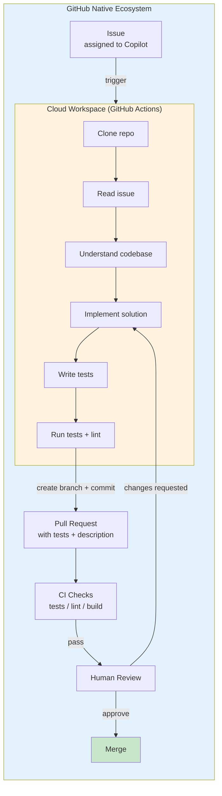
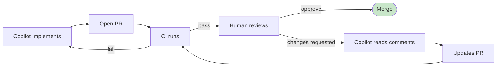

# Reference Analysis: GitHub Copilot Coding Agent

> Deep analysis of the industry-standard AI coding agent — cloud workspace via GitHub Actions, assign issue → implement → PR with tests → human review.

## 1. Project Basic Info

| Field | Value |
|-------|-------|
| **Product** | GitHub Copilot Coding Agent |
| **Provider** | GitHub (Microsoft) |
| **Platform** | GitHub Cloud (GitHub Actions runner) |
| **Integration** | Native GitHub Issues + Pull Requests + Actions |
| **Status** | Generally Available (2025+) |
| **Industry position** | Industry standard, most widely adopted AI coding agent |

---

## 2. Project Background & Goals

### Problem Statement
Developers spend time on repetitive coding tasks. GitHub wants to provide an AI agent that can take an issue, implement the solution, and open a PR — all in the cloud, without local setup.

### Solution
GitHub Copilot Coding Agent runs in a cloud workspace (GitHub Actions runner) and:
1. Takes a GitHub issue as input
2. Implements the solution in a cloud workspace
3. Writes tests
4. Opens a Pull Request
5. Human reviews and merges

### Core Philosophy
> "Assign an issue to Copilot, it implements the solution in a cloud workspace and opens a PR. Human reviews and merges."

---

## 3. Architecture Deep Dive

### 3.0 Mermaid Architecture Overview



### 3.0.1 Iterative Review Loop



### 3.1 Pipeline Flow

```
GitHub Issue created/assigned to Copilot
    │
    ▼
GitHub Actions workflow triggered
    │
    ▼
Cloud workspace provisioned (GitHub Actions runner)
    │
    ├─ 1. Clone repository
    ├─ 2. Read issue description and comments
    ├─ 3. Understand codebase context
    ├─ 4. Implement solution
    ├─ 5. Write tests
    ├─ 6. Run tests (verify they pass)
    ├─ 7. Run linters/formatters
    │
    ▼
8. Create branch + commit changes
    │
    ▼
9. Open Pull Request (with description, linked to issue)
    │
    ▼
CI runs (tests, lint, build)
    │
    ▼
Human reviews PR
    │
    ├─ Approved → Merge
    └─ Changes requested → Copilot updates PR (iterative)
```

### 3.2 Cloud Workspace

The agent runs in a GitHub Actions runner:
- Isolated environment per task
- Full repository access
- Can run build, test, lint commands
- No local setup required
- Scales automatically

### 3.3 Key Components

1. **Issue Parser** — Reads issue description, comments, labels
2. **Codebase Analyzer** — Understands repository structure, patterns
3. **Implementer** — Writes implementation code
4. **Test Writer** — Writes test code
5. **Verifier** — Runs tests, linters, build to verify
6. **PR Creator** — Creates branch, commits, opens PR
7. **Iteration Engine** — Handles review feedback, updates PR

---

## 4. Core Features Deep Dive

### 4.1 Issue-Driven Trigger

Assign an issue to Copilot (or add a specific label/comment) and the agent starts automatically. No manual command needed.

### 4.2 Cloud Execution

Everything runs in GitHub Actions:
- No local environment needed
- Consistent, reproducible environment
- Can run full test suite
- No resource constraints on developer machine
- Secure isolation per task

### 4.3 PR with Tests

The agent always opens a PR with:
- Implementation code
- Test code
- PR description linking to the issue
- Summary of changes
- Test results

### 4.4 Iterative Review

When a human requests changes:
- Copilot reads review comments
- Updates the PR
- Re-runs tests
- Re-requests review
- Can iterate multiple times

### 4.5 GitHub Native Integration

Deep integration with GitHub:
- Issues (input)
- Pull Requests (output)
- Actions (execution)
- Checks (CI/CD)
- Code review (human-in-the-loop)
- Branch protection (enforce rules)

---

## 5. Pros & Cons Analysis

### 5.1 Strengths

| Strength | Description |
|----------|-------------|
| **Industry standard** | Most widely adopted, battle-tested |
| **Zero setup** | Cloud execution, no local environment needed |
| **GitHub native** | Deep integration with Issues, PRs, Actions |
| **Issue-driven** | Assign issue, agent starts automatically |
| **Always includes tests** | PR always has test code |
| **Iterative review** | Handles review feedback, updates PR |
| **Secure isolation** | Each task runs in isolated Actions runner |
| **Scalable** | Cloud infrastructure scales automatically |
| **Human review gate** | Human must approve before merge |

### 5.2 Weaknesses

| Weakness | Description |
|----------|-------------|
| **No design phase** | Jumps from issue to implementation, no SDD |
| **No requirements phase** | Relies on issue description being complete |
| **No knowledge base** | No team-specific conventions injection |
| **No operation logs** | Limited audit trail |
| **No 3-strike escalation** | May iterate indefinitely |
| **No quality gates** | Relies on CI, no custom quality checks |
| **GitHub-only** | Only works with GitHub, not other platforms |
| **Cost** | Cloud execution costs money (Actions minutes) |
| **Limited customization** | Less flexible than custom pipelines |
| **Black box** | Less transparent about agent reasoning |

### 5.3 Lessons for CBOL

| Pattern | CBOL Action |
|---------|-------------|
| Issue-driven trigger | CBOL already has Jira-driven pipeline, could add GitHub issue trigger |
| Cloud execution | CBOL runs locally via OpenCode, could consider cloud execution option |
| Always includes tests | CBOL TDD already enforces tests, could add test verification gate |
| Iterative review | CBOL already has review → fix → re-review loop |
| PR description template | CBOL already has PR template with artifact links |
| Human review gate | CBOL already has 6 human approval gates |
| GitHub native integration | CBOL could add deeper GitHub integration (auto-link PR to Jira) |

---

## 6. References

- **GitHub Copilot Coding Agent**: https://github.com/features/copilot/coding-agent
- **GitHub Actions**: https://github.com/features/actions
- **CBOL Pipeline**: `../ticket-to-deploy-workflow.md`
- **CBOL Comparison**: `../reference-workflows.md`

---

*Analysis date: 2026-08-21*
