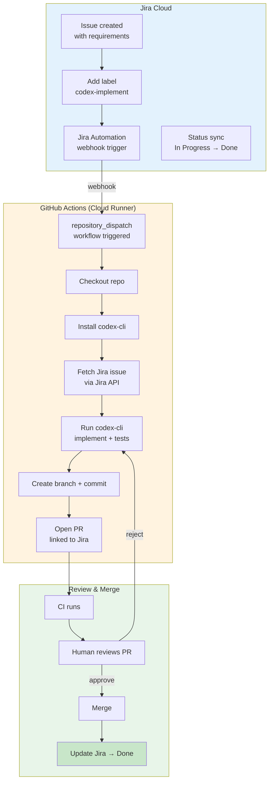
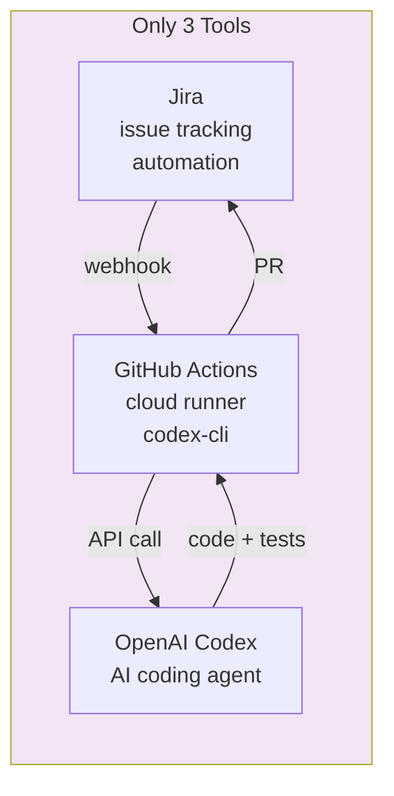

# Reference Analysis: OpenAI Codex + Jira Integration

> Deep analysis of Jira-label-triggered Codex pipeline — label Jira issue → GitHub Action → codex-cli → PR. Minimal, elegant, Jira-native.

## 1. Project Basic Info

| Field | Value |
|-------|-------|
| **Product** | OpenAI Codex CLI + Jira Automation + GitHub Actions |
| **Provider** | OpenAI (Codex) + Atlassian (Jira) + GitHub (Actions) |
| **Platform** | GitHub Actions (cloud) + Jira Cloud |
| **Integration** | Jira label/comment → GitHub Action → codex-cli → PR |
| **Status** | Community pattern (2025+) |
| **Industry position** | Emerging pattern for Jira + AI integration |

---

## 2. Project Background & Goals

### Problem Statement
Teams using Jira want AI to implement tickets automatically. The solution should be minimal, use existing tools (Jira, GitHub, Codex CLI), and require minimal custom code.

### Solution
A Jira-label-triggered pipeline:
1. Add a label (e.g., `codex-implement`) to a Jira issue
2. Jira Automation triggers a GitHub Action via webhook
3. GitHub Action runs `codex-cli` in a cloud runner
4. `codex-cli` reads the Jira issue, implements the solution
5. Opens a PR linked to the Jira issue

### Core Philosophy
> "Label a Jira issue, GitHub Action runs codex-cli, PR is opened. Minimal, elegant, Jira-native."

---

## 3. Architecture Deep Dive

### 3.0 Mermaid Architecture Overview



### 3.0.1 Minimal Stack Architecture



### 3.1 Pipeline Flow

```
Jira Issue created with business requirements
    │
    ▼ (Human adds label "codex-implement" or comments "/codex")
Jira Automation rule fires
    │
    ├─ Trigger: Issue labeled with "codex-implement"
    ├─ Action: Send webhook to GitHub Actions
    │   (payload: issue key, summary, description, assignee)
    │
    ▼
GitHub Actions workflow triggered (repository_dispatch)
    │
    ├─ 1. Checkout repository
    ├─ 2. Install codex-cli
    ├─ 3. Authenticate with OpenAI API key
    ├─ 4. Fetch Jira issue details (via Jira API)
    ├─ 5. Run codex-cli with Jira issue as prompt
    │   ├─ Read codebase context
    │   ├─ Implement solution
    │   ├─ Write tests
    │   └─ Run tests (verify pass)
    ├─ 6. Create branch + commit
    │
    ▼
7. Open PR (with description, linked to Jira)
    │
    ▼
CI runs (tests, lint, build)
    │
    ▼
Human reviews PR
    │
    ├─ Approved → Merge → Update Jira status to "Done"
    └─ Changes requested → Update Jira → Re-run pipeline
```

### 3.2 Jira Automation Configuration

```yaml
# Jira Automation Rule (conceptual)
trigger:
  type: issue_labeled
  label: codex-implement

conditions:
  - issue_type: in [Story, Task, Bug]
  - status: in [To Do, Ready for Development]

actions:
  - type: send_webhook
    url: https://api.github.com/repos/{org}/{repo}/dispatches
    headers:
      Authorization: token ${GITHUB_TOKEN}
      Accept: application/vnd.github.everest-preview+json
    body: |
      {
        "event_type": "codex-implement",
        "client_payload": {
          "jira_key": "{{issue.key}}",
          "jira_summary": "{{issue.summary}}",
          "jira_description": "{{issue.description}}",
          "jira_assignee": "{{issue.assignee.emailAddress}}"
        }
      }
  - type: transition_issue
    status: In Progress
  - type: add_comment
    body: "🤖 Codex implementation started. PR will be linked shortly."
```

### 3.3 GitHub Actions Workflow

```yaml
# .github/workflows/codex-implement.yml
name: Codex Implement

on:
  repository_dispatch:
    types: [codex-implement]

jobs:
  implement:
    runs-on: ubuntu-latest
    steps:
      - name: Checkout
        uses: actions/checkout@v4

      - name: Setup Node.js
        uses: actions/setup-node@v4
        with:
          node-version: '20'

      - name: Install codex-cli
        run: npm install -g @openai/codex-cli

      - name: Fetch Jira issue
        id: jira
        run: |
          curl -s -u "${{ secrets.JIRA_EMAIL }}:${{ secrets.JIRA_API_TOKEN }}" \
            "https://${{ secrets.JIRA_DOMAIN }}.atlassian.net/rest/api/3/issue/${{ github.event.client_payload.jira_key }}" \
            | jq '{key: .key, summary: .fields.summary, description: .fields.description, type: .fields.issuetype.name}' > jira-issue.json

      - name: Run codex-cli
        env:
          OPENAI_API_KEY: ${{ secrets.OPENAI_API_KEY }}
        run: |
          JIRA_KEY="${{ github.event.client_payload.jira_key }}"
          BRANCH="feat/codex-${JIRA_KEY,,}"
          git checkout -b "$BRANCH"

          codex exec "Implement the following Jira issue:
          Key: $JIRA_KEY
          Summary: $(jq -r .summary jira-issue.json)
          Description: $(jq -r .description jira-issue.json)

          Requirements:
          1. Read the codebase to understand existing patterns
          2. Implement the solution following project conventions
          3. Write comprehensive tests
          4. Run tests to verify they pass
          5. Do not modify files unrelated to this issue"

      - name: Commit and push
        run: |
          git config user.name "codex-bot"
          git config user.email "codex-bot@users.noreply.github.com"
          git add -A
          git commit -m "feat: implement ${{ github.event.client_payload.jira_key }} (codex)"
          git push origin HEAD

      - name: Create PR
        uses: peter-evans/create-pull-request@v6
        with:
          title: "feat: ${{ github.event.client_payload.jira_key }} - ${{ github.event.client_payload.jira_summary }}"
          body: |
            ## Jira Issue
            [${{ github.event.client_payload.jira_key }}](https://${{ secrets.JIRA_DOMAIN }}.atlassian.net/browse/${{ github.event.client_payload.jira_key }})

            ## Summary
            ${{ github.event.client_payload.jira_summary }}

            ## Implementation
            Automated implementation by OpenAI Codex.

            ## Checklist
            - [ ] Tests pass
            - [ ] Code follows project conventions
            - [ ] Documentation updated (if needed)
          labels: codex, automated
```

### 3.4 Key Components

1. **Jira Automation** — Label/comment trigger, webhook to GitHub
2. **GitHub Actions** — Cloud runner, codex-cli execution
3. **codex-cli** — OpenAI's command-line AI coding agent
4. **Jira API** — Fetch issue details for context
5. **PR Creator** — Create PR with Jira link

---

## 4. Core Features Deep Dive

### 4.1 Jira Label Trigger

Add a label (e.g., `codex-implement`) to a Jira issue and the pipeline starts. Zero friction, Jira-native.

### 4.2 Minimal Custom Code

The entire pipeline is:
- 1 Jira Automation rule (no code)
- 1 GitHub Actions workflow (YAML)
- No custom application code
- Uses existing tools (Jira, GitHub, codex-cli)

### 4.3 Cloud Execution

Everything runs in GitHub Actions:
- No local environment
- Consistent, reproducible
- Can run full test suite
- Secure isolation

### 4.4 Jira Status Sync

The pipeline can update Jira status:
- On trigger: move to "In Progress"
- On PR open: add comment with PR link
- On merge: move to "Done"
- On failure: move back to "To Do" with error comment

### 4.5 PR Linked to Jira

PR description includes:
- Jira issue key and link
- Issue summary
- Implementation notes
- Checklist for review

---

## 5. Pros & Cons Analysis

### 5.1 Strengths

| Strength | Description |
|----------|-------------|
| **Minimal** | 1 Jira rule + 1 GitHub Action, no custom code |
| **Jira-native** | Label trigger, status sync, no external tool |
| **Elegant** | Simple, clean, easy to understand |
| **Cloud execution** | GitHub Actions, no local setup |
| **PR with Jira link** | Automatic linking, traceability |
| **Low maintenance** | Few moving parts, easy to maintain |
| **Cost-effective** | Uses existing tools, minimal infrastructure |
| **Human review gate** | Human must approve PR before merge |

### 5.2 Weaknesses

| Weakness | Description |
|----------|-------------|
| **No design phase** | Jumps from issue to implementation, no SDD |
| **No requirements phase** | Relies on issue description being complete |
| **No TDD enforcement** | codex-cli may write code then tests, not test-first |
| **No quality gates** | Relies on CI, no custom quality checks |
| **No knowledge base** | No team-specific conventions injection |
| **No operation logs** | Limited audit trail (GitHub Actions logs only) |
| **No 3-strike escalation** | May fail silently or iterate indefinitely |
| **No review automation** | Only human review, no auto-review |
| **codex-cli limitations** | May not handle complex tasks well |
| **Jira + GitHub + OpenAI** | Three dependencies, all must be configured |
| **Secret management** | Jira API token, OpenAI API key, GitHub token |

### 5.3 Lessons for CBOL

| Pattern | CBOL Action |
|---------|-------------|
| Jira label trigger | CBOL already has Jira-driven pipeline, could add label-based trigger |
| Minimal custom code | CBOL is more complex (full pipeline), but could simplify for small tasks |
| Jira status sync | CBOL already updates Jira status, could add more granular sync |
| PR with Jira link | CBOL already has PR template with artifact links |
| Cloud execution option | CBOL runs locally via OpenCode, could add GitHub Actions option |
| Human review gate | CBOL already has 6 human approval gates |
| repository_dispatch trigger | CBOL could add GitHub Actions webhook trigger for Jira |

---

## 6. References

- **OpenAI Codex CLI**: https://github.com/openai/codex
- **Jira Automation**: https://www.atlassian.com/software/jira/features/automation
- **GitHub Actions**: https://github.com/features/actions
- **CBOL Pipeline**: `../ticket-to-deploy-workflow.md`
- **CBOL Comparison**: `../reference-workflows.md`

---

*Analysis date: 2026-08-21*
