# Reference Analysis — AI Development Workflows

> Deep, per-project analysis of 10 reference AI development workflows. Each document covers project background, architecture, core features, configuration, pros/cons, and lessons for CBOL.

## Ecosystem Overview

```mermaid
flowchart TB
    subgraph FullPipeline["Full Pipeline Projects"]
        direction TB
        P1[wenttt/ai-coding-workflow<br/>~2k stars<br/>MCP Server, pull-based]
        P2[genkovich/sdd<br/>~800 stars<br/>19 skills, TDD engine]
        P3[stel1os/ai-sdd-sop<br/>~500 stars<br/>5 roles, document stack]
        P4[shgandla/ai-agents<br/>~200 stars<br/>4 commands, 6 gates]
        P5[agentic-dev-template<br/>~150 stars<br/>8-stage SDLC]
    end

    subgraph JiraIntegrated["Jira-Integrated Projects"]
        direction TB
        J1[partenit-claudev<br/>~300 stars<br/>Jira state-driven, auto-merge]
        J2[OpenAI Codex + Jira<br/>N/A<br/>label-triggered, minimal]
    end

    subgraph AgentFrameworks["Agent Frameworks"]
        direction TB
        A1[obra/superpowers<br/>27k+ stars<br/>skills/instincts/memory/security]
        A2[awesome-claude-code-toolkit<br/>~5k stars<br/>8 orchestration agents]
    end

    subgraph Industry["Industry Standard"]
        direction TB
        I1[GitHub Copilot Coding Agent<br/>N/A<br/>cloud workspace, issue→PR]
    end

    FullPipeline --> CBOL[CBOL Pipeline]
    JiraIntegrated --> CBOL
    AgentFrameworks --> CBOL
    Industry --> CBOL

    style FullPipeline fill:#e3f2fd
    style JiraIntegrated fill:#fff3e0
    style AgentFrameworks fill:#f3e5f5
    style Industry fill:#e8f5e9
    style CBOL fill:#c8e6c9
```

## Analysis Index

| # | Project | Stars | Type | File |
|---|---------|-------|------|------|
| 1 | [wenttt/ai-coding-workflow](https://github.com/wenttt/ai-coding-workflow) | ~2k | Full pipeline (7 stages, 6 gates) | [01-ai-coding-workflow.md](./01-ai-coding-workflow.md) |
| 2 | [genkovich/sdd](https://github.com/genkovich/sdd) | ~800 | 19 atomic skills, TDD engine, Socratic | [02-genkovich-sdd.md](./02-genkovich-sdd.md) |
| 3 | [stel1os/ai-sdd-sop](https://github.com/stel1os/ai-sdd-sop) | ~500 | 5 roles, document stack, SOP v1.4.0 | [03-stel1os-ai-sdd-sop.md](./03-stel1os-ai-sdd-sop.md) |
| 4 | [GradeBuilderSL/partenit-claudev](https://github.com/GradeBuilderSL/partenit-claudev) | ~300 | Jira state-driven, auto-merge | [04-partenit-claudev.md](./04-partenit-claudev.md) |
| 5 | [shgandla/ai-agents](https://github.com/shgandla/ai-agents) | ~200 | /build /test /review /ship, 6 gates | [05-shgandla-ai-agents.md](./05-shgandla-ai-agents.md) |
| 6 | [grammy-jiang/agentic-dev-template](https://github.com/grammy-jiang/agentic-dev-template) | ~150 | 8-stage template, issue forms | [06-agentic-dev-template.md](./06-agentic-dev-template.md) |
| 7 | [obra/superpowers](https://github.com/obra/superpowers) | 27k+ | Agentic framework (skills/instincts/memory/security) | [07-superpowers.md](./07-superpowers.md) |
| 8 | [TheStack-ai/awesome-claude-code-toolkit](https://github.com/TheStack-ai/awesome-claude-code-toolkit) | ~5k | 8 orchestration agents | [08-awesome-claude-code-toolkit.md](./08-awesome-claude-code-toolkit.md) |
| 9 | GitHub Copilot Coding Agent | N/A | Industry standard, cloud workspace | [09-github-copilot-coding-agent.md](./09-github-copilot-coding-agent.md) |
| 10 | OpenAI Codex + Jira | N/A | Label-triggered, minimal, elegant | [10-openai-codex-jira.md](./10-openai-codex-jira.md) |

## Each Analysis Contains

1. **Project Basic Info** — repository, stars, language, tool, status
2. **Background & Goals** — problem statement, solution, core philosophy
3. **Architecture Deep Dive** — pipeline flow, components, data structures
4. **Core Features Deep Dive** — key features with detailed explanation
5. **Configuration & Usage** — installation, setup, usage examples
6. **Pros & Cons Analysis** — strengths, weaknesses, opportunities, threats
7. **Lessons for CBOL** — what CBOL adopted, what CBOL does better, what CBOL could learn
8. **Key Code & Config Examples** — templates, snippets, configurations
9. **References** — links to source and related resources

## How to Use

- **For pipeline design**: Read analyses 1, 2, 3, 5, 6 (full pipeline projects)
- **For Jira integration**: Read analyses 4, 10 (Jira-driven pipelines)
- **For agent frameworks**: Read analyses 7, 8 (multi-agent orchestration)
- **For industry standards**: Read analyses 9, 10 (commercial products)
- **For CBOL improvement**: Read the "Lessons for CBOL" section in each document

## Related Documents

- [Reference Workflows (comparison)](../reference-workflows.md) — side-by-side comparison of all 10 projects
- [CBOL Pipeline](../ticket-to-deploy-workflow.md) — CBOL's ticket-to-deploy workflow
- [Best Practices](../best-practices.md) — synthesized best practices from all references

---

*Last updated: 2026-08-21*
