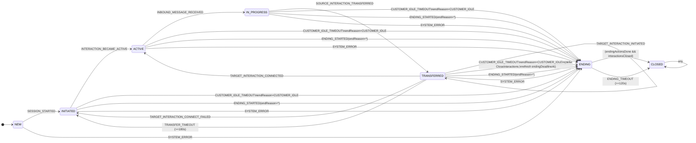
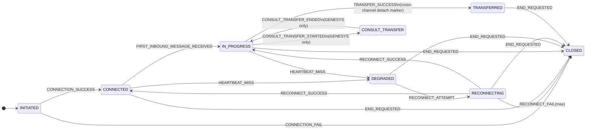
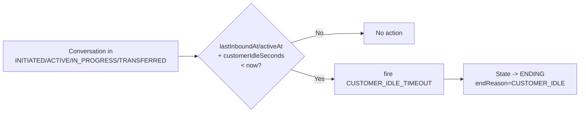
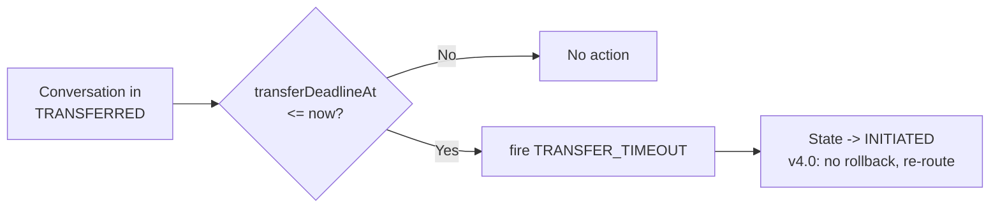
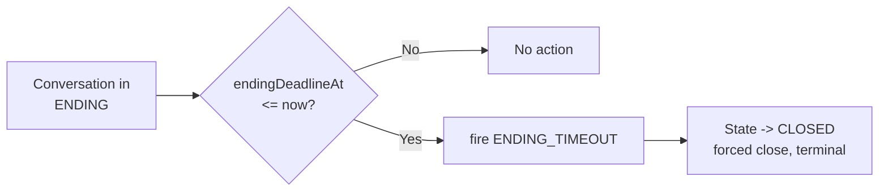
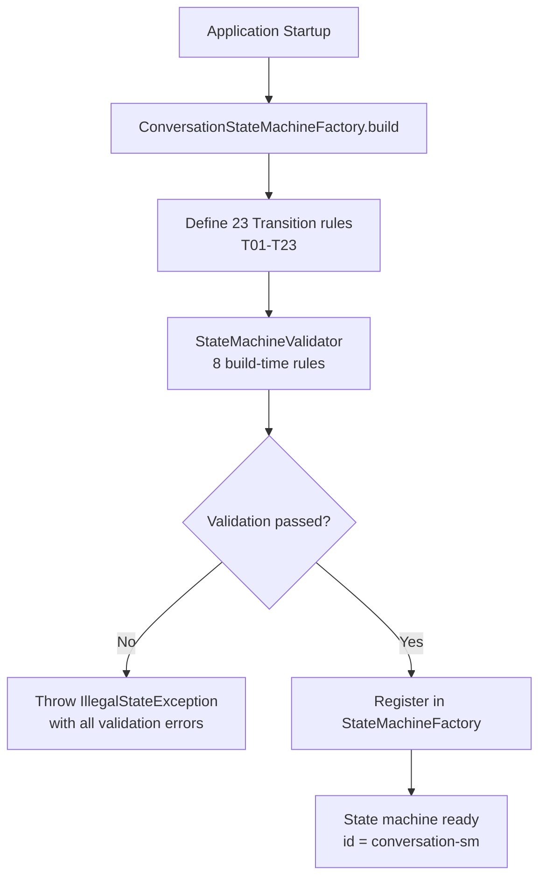

# State Transition Diagrams & Tables

> Version: 4.0 | Last Updated: 2026-09-05
> Aligned with Event-Driven Orchestration Design (v4.0)

## 1. Conversation State Machine

### 1.1 Full State Diagram



> **Survey as field in ENDING**: Survey is no longer a separate state. `SURVEY_SUBMITTED`, `SURVEY_TIMEOUT`, `SURVEY_SKIPPED` are internal transitions within ENDING (ENDING → ENDING). Survey is triggered when entering ENDING if `surveyEligible=true`.

> **Transfer failure no rollback**: When transfer fails or times out, Conversation returns directly to INITIATED (not IN_PROGRESS). This allows re-routing or fallback strategy.

### 1.2 Transition Table

| ID | Source | Event | Target | Guard | Action | Monitor | Note |
|----|--------|-------|--------|-------|--------|---------|------|
| T00 | NEW | SESSION_STARTED | INITIATED | - | SessionStartedAction | - | Initiate downstream assignment |
| T01 | INITIATED | INTERACTION_BECAME_ACTIVE | ACTIVE | - | InteractionBecameActiveAction | - | Set activeAt, send welcome |
| T02 | ACTIVE | INBOUND_MESSAGE_RECEIVED | IN_PROGRESS | - | InboundMessageReceivedAction | - | Set lastInboundAt |
| T03 | INITIATED | DOWNSTREAM_UNAVAILABLE | INITIATED | - | (no action) | - | Notify system unavailable |
| T04 | IN_PROGRESS | SOURCE_INTERACTION_TRANSFERRED | TRANSFERRED | transferEnabled | SourceInteractionTransferredAction | - | Set transferInFlight=true |
| T05 | TRANSFERRED | TARGET_INTERACTION_INITIATED | TRANSFERRED | - | TargetInteractionInitiatedAction | - | Internal, execute ConnectTargetCmd |
| T06 | TRANSFERRED | TARGET_INTERACTION_CONNECTED | ACTIVE | - | TargetInteractionConnectedAction | - | Set transferInFlight=false |
| T07 | TRANSFERRED | TARGET_INTERACTION_CONNECT_FAILED | INITIATED | - | TargetInteractionConnectFailedAction | - | **v4.0: no rollback, re-route** |
| T08 | TRANSFERRED | TRANSFER_TIMEOUT | INITIATED | - | TransferTimeoutAction | TransferMonitor | **v4.0: no rollback, re-route** |
| T09 | INITIATED/ACTIVE/IN_PROGRESS/TRANSFERRED | ENDING_STARTED | ENDING | - | EndingStartedAction | - | Set endReason, trigger ending actions |
| T10 | ANY (except CLOSED) | SYSTEM_ERROR | ENDING | - | SystemErrorAction | - | Set endReason=SYSTEM_ERROR |
| T11 | INITIATED/ACTIVE/IN_PROGRESS/TRANSFERRED | CUSTOMER_IDLE_TIMEOUT | ENDING | - | CustomerIdleTimeoutAction | CustomerIdleMonitor | endReason=CUSTOMER_IDLE |
| T12 | ENDING | ENDING_ACTIONS_COMPLETED | ENDING/CLOSED | - | (no action) | - | Set endingActionsDone=true |
| T13 | ENDING | ALL_INTERACTIONS_ENDED | ENDING/CLOSED | - | (no action) | - | Set interactionsClosed=true |
| T14 | ENDING | ENDING_TIMEOUT | CLOSED | - | EndingTimeoutAction | EndingMonitor | Forced close, record alert |
| T15 | ENDING | SURVEY_SUBMITTED | ENDING | - | (no action) | - | Internal, surveyStatus=SUBMITTED |
| T16 | ENDING | SURVEY_TIMEOUT | ENDING | - | (no action) | - | Internal, surveyStatus=TIMEOUT, endReason=CUSTOMER_IDLE |
| T17 | ENDING | SURVEY_SKIPPED | ENDING | - | (no action) | - | Internal, surveyStatus=SKIPPED |

### 1.3 State Entry/Exit Actions

| State | Entry Action | Exit Action |
|-------|-------------|-------------|
| NEW | (none) | ConversationInitAction (on CONVERSATION_INITIATED) |
| INITIATED | (none) | CustomerConnectAction (on CUSTOMER_CONNECT) |
| IN_PROGRESS | Send welcome message (reserved) | Notify channel (reserved) |
| TRANSFERRED | Initiate transfer request | Cancel pending transfer (reserved) |
| ENDING | Start grace period timer | (none) |
| ERROR | Log error, alert on-call, capture diagnostics | Clear error state |
| CLOSED | Clean up resources, archive conversation | (none, terminal) |

**Note**: Survey-related actions (SurveyStartAction, SurveyCompleteAction) are transition actions within `IN_PROGRESS`, not state entry/exit actions, since survey is an internal sub-phase of `IN_PROGRESS`.

## 2. Interaction State Machine

### 2.1 States

```java
public enum InteractionState {
    CONNECTING,     // Channel establishing connection
    CONNECTED,      // Channel IN_PROGRESS, communication flowing
    RECONNECTING,   // Channel dropped, attempting reconnection
## 2. Interaction State Machine

### 2.1 States (InteractionState)

```java
public enum InteractionState {
    INITIATED,          // Connection initiated, waiting for connection result
    CONNECTED,          // Connection established, ready for messaging
    IN_PROGRESS,        // Active messaging (first inbound received)
    DEGRADED,           // Connection degraded (heartbeat miss, temporary issues)
    RECONNECTING,       // Reconnection in progress
    CONSULT_TRANSFER,   // GENESYS ONLY: consult transfer
    TRANSFERRED,        // Cross-channel source detached marker
    CLOSED              // Channel terminated (terminal)
}
```

### 2.2 Events (InteractionFact)

```java
public enum InteractionFact {
    // connection lifecycle
    CONNECTION_SUCCESS, CONNECTION_FAIL,
    // messaging
    FIRST_INBOUND_MESSAGE_RECEIVED, INBOUND_MESSAGE_RECEIVED, OUTBOUND_MESSAGE_SENT,
    // heartbeat & degradation
    HEARTBEAT_MISS, HEARTBEAT_RESTORED,
    // reconnection
    RECONNECT_ATTEMPT, RECONNECT_SUCCESS, RECONNECT_FAIL,
    // genesys consult transfer (GENESYS ONLY)
    CONSULT_TRANSFER_STARTED, CONSULT_TRANSFER_ENDED,
    // cross-channel transfer (source detach marker)
    TRANSFER_SUCCESS, TRANSFER_FAILED,
    // ending
    END_REQUESTED, INTERACTION_CLOSED,
    // system
    SYSTEM_ERROR,
    // downstream availability
    DOWNSTREAM_UNAVAILABLE
}
```

### 2.3 State Diagram



### 2.4 Transition Table

| ID | Source | Event | Target | Action | Notes |
|----|--------|-------|--------|--------|-------|
| I01 | INITIATED | CONNECTION_SUCCESS | CONNECTED | ConnectionSuccessAction | Channel connected successfully |
| I02 | INITIATED | CONNECTION_FAIL | CLOSED | ConnectionFailAction | Connection failed (network/auth) |
| I03 | CONNECTED | FIRST_INBOUND_MESSAGE_RECEIVED | IN_PROGRESS | FirstInboundMessageReceivedAction | First inbound message, enter active messaging |
| I04 | IN_PROGRESS | INBOUND_MESSAGE_RECEIVED | IN_PROGRESS | (no action) | Internal, update lastInboundAt |
| I05 | IN_PROGRESS | OUTBOUND_MESSAGE_SENT | IN_PROGRESS | (no action) | Internal, audit only |
| I06 | CONNECTED | HEARTBEAT_MISS | DEGRADED | HeartbeatMissAction | Heartbeat missed, enter degraded |
| I07 | IN_PROGRESS | HEARTBEAT_MISS | DEGRADED | HeartbeatMissAction | Heartbeat missed, enter degraded |
| I08 | DEGRADED | HEARTBEAT_RESTORED | CONNECTED | HeartbeatRestoredAction | Heartbeat restored, recover to connected |
| I09 | DEGRADED | RECONNECT_ATTEMPT | RECONNECTING | ReconnectAttemptAction | Initiate reconnection |
| I10 | RECONNECTING | RECONNECT_SUCCESS | CONNECTED | ReconnectSuccessAction | Reconnection successful, recover to connected |
| I11 | RECONNECTING | RECONNECT_SUCCESS | IN_PROGRESS | ReconnectSuccessAction | Reconnection successful, recover to in-progress |
| I12 | RECONNECTING | RECONNECT_FAIL | CLOSED | ReconnectFailAction | Max reconnection retries reached |
| I13 | IN_PROGRESS | CONSULT_TRANSFER_STARTED | CONSULT_TRANSFER | ConsultTransferStartedAction | GENESYS ONLY: consult transfer started |
| I14 | CONSULT_TRANSFER | CONSULT_TRANSFER_ENDED | IN_PROGRESS | ConsultTransferEndedAction | GENESYS ONLY: consult transfer ended |
| I15 | IN_PROGRESS | TRANSFER_SUCCESS | TRANSFERRED | TransferSuccessAction | Cross-channel transfer success, source detached |
| I16 | IN_PROGRESS | TRANSFER_FAILED | IN_PROGRESS | (no action) | Transfer rejected, stay on original channel |
| I17 | CONNECTED | END_REQUESTED | CLOSED | EndRequestedAction | Explicit close |
| I18 | IN_PROGRESS | END_REQUESTED | CLOSED | EndRequestedAction | Explicit close |
| I19 | DEGRADED | END_REQUESTED | CLOSED | EndRequestedAction | Explicit close |
| I20 | RECONNECTING | END_REQUESTED | CLOSED | EndRequestedAction | Explicit close |
| I21 | TRANSFERRED | END_REQUESTED | CLOSED | EndRequestedAction | Explicit close after transfer |
| I22 | ANY | SYSTEM_ERROR | CLOSED | SystemErrorAction | Unrecoverable system error |
| I23 | CONNECTED | DOWNSTREAM_UNAVAILABLE | DEGRADED | DownstreamUnavailableAction | Temporary downstream unavailability |
| I24 | IN_PROGRESS | DOWNSTREAM_UNAVAILABLE | DEGRADED | DownstreamUnavailableAction | Temporary downstream unavailability |

## 3. Monitor Trigger Diagrams

### 3.1 CustomerIdleMonitor



### 3.2 TransferMonitor



### 3.3 EndingMonitor



## 4. Event Classification

### 4.1 By Source

| Category | Events | Source |
|----------|--------|--------|
| Customer-driven | CUSTOMER_CONNECT, CUSTOMER_CLOSE | Customer action via channel |
| Agent-driven | AGENT_ATTACHED, AGENT_CLOSE | Human agent action (reserved) |
| System-driven | TRANSFER_REQUEST, TRANSFER_FAILED, TRANSFER_TIMEOUT | Business logic / integration |
| Monitor-driven | SYS_CUSTOMER_IDLE, SYS_TRANSFER_TIMEOUT, SYS_ENDING_GRACE_TIMEOUT | Scheduled monitors |
| Survey-driven | SURVEY_COMPLETE | Post-conversation survey (reserved) |

### 4.2 By Effect

| Effect | Events |
|--------|--------|
| State advances (normal) | CUSTOMER_CONNECT, TRANSFER_REQUEST, CUSTOMER_CLOSE |
| State resets (v6) | TRANSFER_FAILED, TRANSFER_TIMEOUT, SYS_TRANSFER_TIMEOUT |
| State enters ending | SYS_CUSTOMER_IDLE (from any non-terminal) |
| State terminates | SYS_ENDING_GRACE_TIMEOUT |
| No state change (internal) | (none currently defined) |

## 5. Default Market Configuration

| Parameter | Default | Description |
|-----------|---------|-------------|
| customerIdleSeconds | 300 (5 min) | Customer inactivity before auto-close |
| transferTimeoutSeconds | 180 (3 min) | Max wait for agent connection |
| endingGraceSeconds | 120 (2 min) | Grace period before final closure |
| surveyEnabled | false | Whether to send post-conversation survey |
| transferEnabled | true | Whether human agent transfer is allowed |
| genesysEnabled | false | Whether Genesys integration is IN_PROGRESS |
| fallbackRoutingStrategy | "DROP" | Strategy when transfer fails |

## 6. State Machine Lifecycle

### 6.1 Startup Phase



### 6.2 Event Processing Phase

```mermaid
flowchart TD
    A[ChatEngineStateMachineService.fire] --> B[Load conversation from DB]
    B --> C[Resolve market config]
    C --> D[fireEvent sourceState, event, context]

    D --> E{Transition exists<br/>for source+event?}
    E -->|No| F[Throw StateMachineException<br/>No transition found]
    E -->|Yes| G{Guard satisfied?}

    G -->|No| H[Throw StateMachineException<br/>Guard rejected transition]
    G -->|Yes| I[Execute exit action<br/>best-effort]

    I --> J[Execute transition action]
    J --> K{Action threw exception?}

    K -->|Yes| L[Throw StateMachineException<br/>State remains unchanged (action-first)]
    L --> M[Business layer catches exception]
    M --> N[Business layer can fire SYS_ACTION_FAILED<br/>→ enter ERROR state (optional failover pattern)]
    N --> O{Fail event also failed?}
    O -->|Yes| P[Throw StateMachineException<br/>loop prevention]
    O -->|No| Q[Continue with ERROR state result]

    K -->|No| R[Execute entry action<br/>best-effort]
    Q --> R
    R --> S[Notify listeners<br/>8 callback points]
    S --> T[Return target state (ConversationState)]

    F --> U[Exception propagates to caller]
    H --> U
    P --> U

    T --> V[Caller updates conversation state<br/>optimistic lock + version]
    V --> W{CAS succeeded?}
    W -->|No| X[Retry with backoff<br/>max 3 attempts]
    X --> V
    W -->|Yes| Y[Persist StateTransitionRecord<br/>audit log]
    Y --> Z[Done]
    U --> Z
```

### 6.3 Lifecycle Callbacks

| Phase | Listener Callback | When |
|-------|-------------------|------|
| State machine start | `stateMachineStarted()` | After `start()` called |
| Event received | `eventReceived(event)` | Before transition lookup |
| Transition accepted | `transitionAccepted(transition)` | After guard passes, before actions |
| Transition rejected | `transitionRejected(event, source)` | No transition or guard failed |
| State entered | `stateEntered(state)` | After entry action executes |
| State exited | `stateExited(state)` | After exit action executes |
| Action executed | `actionExecuted(action, result)` | After transition action completes |
| State machine stop | `stateMachineStopped()` | After `stop()` called |
