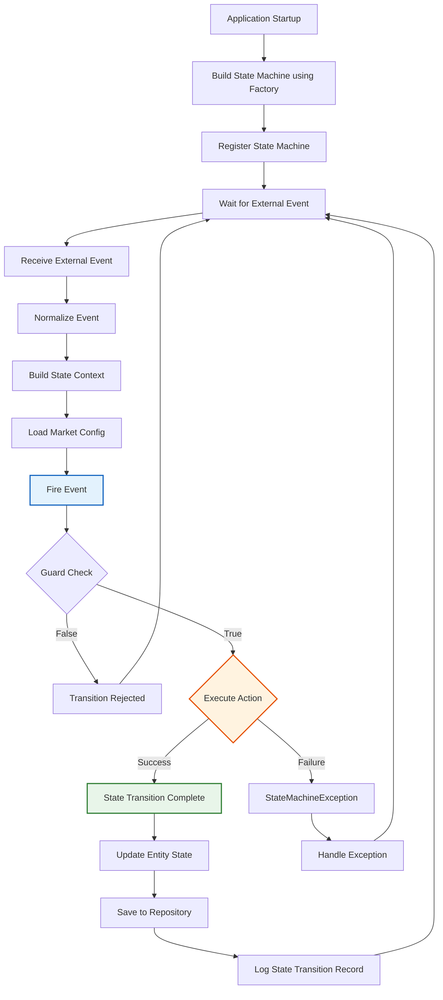

# Usage Guide

> Version: 4.0 | Last Updated: 2026-09-05
> Based on Alibaba COLA StateMachine: https://github.com/alibaba/COLA
> Aligned with Event-Driven Orchestration Design (v4.0)

## 1. Quick Start

### 1.1 Project Structure

This is a multi-module Maven project with three modules:

| Module | ArtifactId | Package | Responsibility |
|--------|-----------|---------|----------------|
| **statemachine-core** | `statemachine-core` | `com.alibaba.cola.statemachine` | Alibaba COLA StateMachine core engine |
| **chat-engine** | `chat-engine` | `com.selfdevelopment.chatengine` | Conversation state machine (business layer) |
| **agent-connector** | `agent-connector` | `com.selfdevelopment.agentconnector` | Interaction state machine (channel layer) |

### 1.2 Add Dependency

Add the appropriate module to your `pom.xml`:

```xml
<!-- Core state machine engine (Alibaba COLA StateMachine, always needed) -->
<dependency>
    <groupId>com.selfdevelopment</groupId>
    <artifactId>statemachine-core</artifactId>
    <version>1.0.0</version>
</dependency>

<!-- Conversation state machine (chat-engine) -->
<dependency>
    <groupId>com.selfdevelopment</groupId>
    <artifactId>chat-engine</artifactId>
    <version>1.0.0</version>
</dependency>

<!-- Interaction state machine (agent-connector) -->
<dependency>
    <groupId>com.selfdevelopment</groupId>
    <artifactId>agent-connector</artifactId>
    <version>1.0.0</version>
</dependency>
```

### 1.3 Build and Register the State Machine

```java
import com.selfdevelopment.chatengine.statemachine.factory.ConversationStateMachineFactory;
import com.alibaba.cola.statemachine.StateMachine;

// Build and register (call once at application startup)
// Factory uses caching pattern to prevent duplicate builds
StateMachine<ConversationState, ConversationFact, CbolStateContext> sm =
        ConversationStateMachineFactory.build();
```

### 1.4 Fire an Event

```java
// Build context
CbolStateContext ctx = CbolStateContext.builder()
        .conversation(conversation)
        .marketConfig(StateMachineMarketConfig.defaultConfig())
        .traceContext(TraceContext.generate())
        .build();

// Fire event and get new state (COLA API returns target state directly)
ConversationState newState = sm.fireEvent(
        ConversationState.NEW,
        ConversationFact.SESSION_STARTED,
        ctx);

// Update conversation state
conversation.setState(newState);
```

### 1.5 State Machine Usage Flow



## 2. COLA Builder DSL

### 2.1 External Transition

Define an external state transition (state changes):

```java
StateMachineBuilder<ConversationState, ConversationFact, CbolStateContext> builder =
        StateMachineBuilderFactory.create();

builder.externalTransition()
        .from(ConversationState.NEW)
        .to(ConversationState.INITIATED)
        .on(ConversationFact.SESSION_STARTED)
        .when(ctx -> ctx.getMarketConfig() != null)  // optional guard
        .perform(new SessionStartedAction());
```

**Builder API order:** `from() → to() → on() → when() → perform()`

### 2.2 Internal Transition

Define an internal transition (state does NOT change, but action executes):

```java
builder.internalTransition()
        .within(ConversationState.ENDING)
        .on(ConversationFact.SURVEY_SUBMITTED)
        .perform(new SurveySubmittedAction());
```

### 2.3 Build and Register

```java
StateMachine<ConversationState, ConversationFact, CbolStateContext> sm =
        builder.build("conversation");
StateMachineFactory.register(sm);
```

### 2.4 Retrieve State Machine

```java
StateMachine<ConversationState, ConversationFact, CbolStateContext> sm =
        StateMachineFactory.get("conversation");
```

## 3. Action Interface

### 3.1 Implement an Action

```java
import com.alibaba.cola.statemachine.Action;

public class InboundMessageReceivedAction
        implements Action<ConversationState, ConversationFact, CbolStateContext> {

    @Override
    public void execute(ConversationState from, ConversationState to,
                        ConversationFact event, CbolStateContext ctx) {
        // Your business logic here
        log.info("Inbound message received: conversationId={}",
                ctx.getConversation().getConversationId());
    }
}
```

### 3.2 Action-First Principle

Actions execute **before** state change. If an action fails, the state does NOT change:

```java
try {
    ConversationState newState = sm.fireEvent(
            ConversationState.ACTIVE,
            ConversationFact.INBOUND_MESSAGE_RECEIVED,
            ctx);
    // State changed successfully
} catch (StateMachineException e) {
    // Action failed or no transition matched
    // State remains ACTIVE
    log.error("Transition failed", e);
}
```

## 4. Condition (Guard) with ConditionalAction

### 4.1 Overview

All Actions in this project implement the `ConditionalAction` interface, which extends COLA's `Action` with a `getCondition()` method. This creates a natural binding between an Action and its execution condition.

**Key features:**
- **Default ALWAYS_TRUE**: `getCondition()` has a default implementation that returns a condition always satisfied
- **Opt-in custom conditions**: Override `getCondition()` only when you need a guard
- **Auto-extracted by Factory**: The state machine factory automatically extracts conditions from Actions
- **COLA native `when()`**: Conditions are evaluated via COLA's native `when()` method

### 4.2 Action with Custom Condition

```java
@Component
@HandlesFact(ConversationFact.SESSION_STARTED)
public class SessionStartedAction implements ConditionalAction<ConversationState, ConversationFact, CbolStateContext> {

    @Override
    public Condition<CbolStateContext> getCondition() {
        return ctx -> {
            if (ctx == null || ctx.conversation() == null) {
                log.warn("SessionStartedAction condition failed: context or conversation is null");
                return false;
            }
            if (ctx.conversation().conversationId() == null || ctx.conversation().conversationId().isBlank()) {
                log.warn("SessionStartedAction condition failed: conversationId is null or blank");
                return false;
            }
            return true;
        };
    }

    @Override
    public void execute(ConversationState from, ConversationState to, ConversationFact event, CbolStateContext ctx) {
        // Action business logic
        log.info("Session started: conversationId={}", ctx.conversation().conversationId());
    }
}
```

### 4.3 Action without Custom Condition (Default)

```java
@Component
@HandlesFact(ConversationFact.INBOUND_MESSAGE_RECEIVED)
public class InboundMessageReceivedAction implements ConditionalAction<ConversationState, ConversationFact, CbolStateContext> {

    // getCondition() is NOT overridden - uses default ALWAYS_TRUE
    // This action will always execute when the transition is triggered

    @Override
    public void execute(ConversationState from, ConversationState to, ConversationFact event, CbolStateContext ctx) {
        // Action business logic
        log.info("Inbound message received: conversationId={}", ctx.conversation().conversationId());
    }
}
```

### 4.4 How It Works in the Factory

The `ConversationStateMachineFactory` automatically extracts conditions from Actions:

```java
// Helper: extract condition from action
Function<ConversationFact, Condition<CbolStateContext>> conditionProvider = fact -> {
    Action<ConversationState, ConversationFact, CbolStateContext> action = actionProvider.apply(fact);
    if (action instanceof ConditionalAction) {
        return ((ConditionalAction<ConversationState, ConversationFact, CbolStateContext>) action).getCondition();
    }
    return ctx -> true; // Fallback for plain Action implementations
};

// Usage in transition definition
builder.externalTransition()
        .from(ConversationState.NEW)
        .to(ConversationState.INITIATED)
        .on(ConversationFact.SESSION_STARTED)
        .when(conditionProvider.apply(ConversationFact.SESSION_STARTED))
        .perform(actionProvider.apply(ConversationFact.SESSION_STARTED));
```

### 4.5 Condition Evaluation Flow

```
fireEvent(from, fact, ctx)
    ↓
Find matching transition
    ↓
Evaluate when(condition)
    ├─ Condition returns TRUE → Execute perform(action) → State changes
    └─ Condition returns FALSE → Skip transition → State stays (returns null)
```

### 4.6 Best Practices

| Do | Don't |
|----|-------|
| Keep conditions simple and fast (no IO) | Put side effects in conditions |
| Log when conditions fail (for debugging) | Use conditions for business logic that should be in actions |
| Use conditions for guard checks (market config, state validation) | Define multiple unconditional transitions for the same (source, event) |
| Override `getCondition()` only when needed | Return `null` from `getCondition()` (use default instead) |

### 4.7 Standalone Condition (Advanced)

For complex conditions that need to be reused across multiple Actions, you can still create standalone Condition classes:

```java
public class SurveyEnabledCondition implements Condition<CbolStateContext> {

    @Override
    public boolean isSatisfied(CbolStateContext ctx) {
        return ctx.marketConfig() != null && ctx.marketConfig().surveyEnabled();
    }
}

// Usage in an Action
@Override
public Condition<CbolStateContext> getCondition() {
    return new SurveyEnabledCondition();
}
```

## 5. Chat Engine Usage

### 5.1 Conversation States

```java
public enum ConversationState {
    NEW,                // Initial state, conversation created, waiting for interaction ready
    INITIATED,          // Current bound interaction ready (InteractionState=CONNECTED)
    ACTIVE,             // Interaction became active, waiting for first inbound message
    IN_PROGRESS,        // Business in progress (first inbound message received)
    TRANSFERRED,        // CBOL cross-channel transfer phase (in-flight)
    ENDING,             // Irreversible: pre-close orchestration (guarantees eventual CLOSED)
    CLOSED              // Final terminal state
}
```

### 5.2 Use ChatEngineStateMachineService

```java
// Initialize (call once at startup)
ConversationStateMachineFactory.build();
ChatEngineStateMachineService service = new ChatEngineStateMachineService();

// Build context
CbolStateContext ctx = buildContext();

// Fire event (returns ConversationState directly)
ConversationState newState = service.fire(ctx, ConversationFact.INTERACTION_BECAME_ACTIVE);
```

### 5.3 Run Chat Engine Demo

```bash
cd 08-Code/state-machine
mvnw.cmd compile -pl chat-engine
java -cp chat-engine/target/classes:statemachine-core/target/classes com.selfdevelopment.chatengine.demo.ChatEngineDemo
```

## 6. Agent Connector Usage

### 6.1 Interaction States

```java
public enum InteractionState {
    INITIATED,          // Connection initiated, waiting for connection result
    CONNECTED,          // Connection established, ready for messaging
    IN_PROGRESS,        // Active messaging (first inbound received)
    DEGRADED,           // Connection degraded (heartbeat miss, temporary issues)
    RECONNECTING,       // Reconnection in progress
    CONSULT_TRANSFER,   // GENESYS ONLY: consult transfer
    TRANSFERRED,        // Cross-channel source detached marker
    CLOSED              // Channel terminated (terminal)
}
```

### 6.2 Use AgentConnectorStateMachineService

```java
// Initialize (call once at startup)
InteractionStateMachineFactory.create();
AgentConnectorStateMachineService service = new AgentConnectorStateMachineService();

// Build context
AgentConnectorStateContext ctx = buildContext();

// Fire event (returns InteractionState directly)
InteractionState newState = service.fire(ctx, InteractionFact.CONNECTION_SUCCESS);
```

### 6.3 Run Agent Connector Demo

```bash
cd 08-Code/state-machine
mvnw.cmd compile -pl agent-connector
java -cp agent-connector/target/classes:statemachine-core/target/classes com.selfdevelopment.agentconnector.demo.AgentConnectorDemo
```

## 7. Multi-Market Configuration

### 7.1 Default Configuration

```java
StateMachineMarketConfig config = StateMachineMarketConfig.defaultConfig();
// customerIdleSeconds=300, transferTimeoutSeconds=120, endingGraceSeconds=30
// surveyEnabled=true, transferEnabled=true, genesysEnabled=true
```

### 7.2 Custom Configuration

```java
StateMachineMarketConfig config = StateMachineMarketConfig.builder()
        .customerIdleSeconds(600)
        .transferTimeoutSeconds(200)
        .endingGraceSeconds(60)
        .surveyEnabled(true)
        .transferEnabled(true)
        .genesysEnabled(false)
        .fallbackRoutingStrategy("DROP")
        .build();
```

### 7.3 Market Config Provider

```java
MarketConfigProvider.InMemoryProvider provider = new MarketConfigProvider.InMemoryProvider();
provider.put("HK", customConfig);

StateMachineMarketConfig cfg = provider.getConfig("HK");
```

## 8. Monitors

### 8.1 Customer Idle Monitor

```java
CustomerIdleMonitor monitor = new CustomerIdleMonitor(service);
long lastActivity = System.currentTimeMillis() - 400 * 1000; // 400s ago
monitor.check(ctx, lastActivity);
// Fires SYS_CUSTOMER_IDLE if idle > customerIdleSeconds
```

### 8.2 Transfer Monitor

```java
TransferMonitor monitor = new TransferMonitor(service);
long transferStart = System.currentTimeMillis() - 200 * 1000; // 200s ago
monitor.check(ctx, transferStart);
// Fires SYS_TRANSFER_TIMEOUT if transfer > transferTimeoutSeconds
// Only active in TRANSFERRED state
```

### 8.3 Ending Grace Monitor

```java
EndingGraceMonitor monitor = new EndingGraceMonitor(service);
long enterEnding = System.currentTimeMillis() - 60 * 1000; // 60s ago
monitor.check(ctx, enterEnding);
// Fires SYS_ENDING_GRACE_TIMEOUT if ending > endingGraceSeconds
// Only active in ENDING state
```

## 9. Trace Context

### 9.1 Generate Trace Context

```java
TraceContext traceContext = TraceContext.generate();
// traceId = UUID, timestamp = current time
```

### 9.2 MDC Propagation

```java
// Set MDC for logging
TraceMdcHelper.set(traceContext);
try {
    // Your code here - all logs will include traceId
} finally {
    TraceMdcHelper.clear();
}
```

### 9.3 Async Action Worker (Reserved)

```java
// ActionWorker is a RESERVED utility class for future use
// Current design uses synchronous action-first transitions
ActionWorker worker = new ActionWorker();
worker.submit(action, from, to, event, ctx);
```

## 10. PlantUML Diagram Generation

```java
StateMachine<ConversationState, ConversationFact, CbolStateContext> sm =
        ConversationStateMachineFactory.build();

String plantUml = sm.generatePlantUML();
System.out.println(plantUml);
```

Output:
```
@startuml
[*] --> NEW
NEW --> INITIATED : CONVERSATION_INITIATED
INITIATED --> IN_PROGRESS : CUSTOMER_CONNECT
IN_PROGRESS --> TRANSFERRED : TRANSFER_REQUEST
IN_PROGRESS --> ENDING : CUSTOMER_CLOSE
@enduml
```

## 11. Testing

### 11.1 Run All Tests

```bash
cd 08-Code/state-machine
mvnw.cmd clean test
```

### 11.2 Run Module Tests

```bash
# Chat engine tests
mvnw.cmd test -pl chat-engine

# Agent connector tests
mvnw.cmd test -pl agent-connector

# Core tests (COLA)
mvnw.cmd test -pl statemachine-core
```

### 11.3 Test Coverage

- statemachine-core: 219 COLA tests
- chat-engine: 36 tests
- agent-connector: (tests to be added)

## 12. Best Practices

### 12.1 State Machine Initialization

```java
// Call once at application startup
@PostConstruct
public void init() {
    ConversationStateMachineFactory.build();
    InteractionStateMachineFactory.create();
}
```

### 12.2 Factory Caching Pattern

COLA StateMachine does NOT allow rebuilding. Use caching pattern:

```java
public static StateMachine<...> build() {
    try {
        StateMachine<...> existing = StateMachineFactory.get(MACHINE_ID);
        if (existing != null) return existing;
    } catch (Exception ignored) {
        // Not built yet
    }
    synchronized (Factory.class) {
        // Double-check + build + register
    }
}
```

### 12.3 Action Exception Handling

The state machine includes a flexible exception handling mechanism that ensures **state transitions continue regardless of Action execution failures**. Exceptions are caught by `ExceptionHandlingAction` and handled by priority-based handlers, without blocking the state change.

#### Built-in Exception Types

```java
// Downstream system connection failure
throw new DownstreamConnectionException("Genesys", "transferCall", "Connection timeout");

// Business rule violation
throw new BusinessException("INVALID_STATE", Map.of("reason", "survey already submitted"));

// Unexpected system error
throw new SystemException("payment-service", "INTERNAL_ERROR", "Null pointer in processor");
```

#### Using Exception Handling (Spring Environment - Recommended)

```java
@Service
@RequiredArgsConstructor
public class MyService {
    private final ConversationActionService actionService;

    public void processEvent(CbolStateContext ctx, ConversationFact fact) {
        // buildWithSpringActions() automatically wraps all Actions with exception handling
        StateMachine<ConversationState, ConversationFact, CbolStateContext> sm =
                actionService.buildWithSpringActions();

        // Exceptions during Action execution will NOT block this state transition
        ConversationState newState = sm.fireEvent(ctx.conversation().state(), fact, ctx);

        log.info("Transition completed: {} -> {} on {}",
                ctx.conversation().state(), newState, fact);
    }
}
```

#### Custom Exception Handler

Developers can add custom exception handlers without modifying existing code:

```java
@Component
public class PaymentFailureHandler implements ActionExceptionHandler {
    @Override
    public boolean canHandle(Throwable ex) {
        return ex instanceof PaymentFailureException;
    }

    @Override
    public void handle(Throwable ex, ConversationState from, ConversationState to,
                       ConversationFact fact, CbolStateContext ctx) {
        // Custom logic: alert, refund, retry, etc.
        log.error("Payment failed, initiating refund: conversationId={}",
                ctx.conversation().conversationId());
    }

    @Override
    public int getPriority() {
        return 200; // Higher priority = checked first
    }
}
```

#### COLA Native Error Handling (Without Exception Wrapper)

If you choose not to use the exception handling wrapper, COLA follows the action-first principle:

```java
try {
    ConversationState newState = sm.fireEvent(source, event, ctx);
} catch (StateMachineException e) {
    // No transition matched or action failed
    // State remains unchanged
    log.error("State transition failed: source={}, event={}", source, event, e);
    throw new BusinessException("Transition failed", e);
}
```

> **Note**: When using `buildWithSpringActions()`, Actions are automatically wrapped with `ExceptionHandlingAction`, so `StateMachineException` from Action failures will not occur — state transitions always continue. `StateMachineException` may still be thrown if no transition matches the given (source, event) pair.

### 12.4 Idempotency

```java
// Use conversationId + event as idempotency key
String idempotencyKey = ctx.getConversation().getConversationId() + ":" + event;
if (processedEvents.contains(idempotencyKey)) {
    return currentState; // Already processed
}
processedEvents.add(idempotencyKey);
```

## 13. Spring Boot Integration

### 13.1 Configuration Class

```java
@Configuration
public class StateMachineConfig {

    @Bean
    public StateMachine<ConversationState, ConversationFact, CbolStateContext> conversationStateMachine() {
        return ConversationStateMachineFactory.build();
    }

    @Bean
    public ChatEngineStateMachineService chatEngineStateMachineService() {
        return new ChatEngineStateMachineService();
    }
}
```

### 13.2 Service Usage

```java
@Service
public class ConversationService {

    @Autowired
    private ChatEngineStateMachineService stateMachineService;

    public Conversation handleEvent(Conversation conversation, ConversationFact event) {
        CbolStateContext ctx = buildContext(conversation);
        ConversationState newState = stateMachineService.fire(ctx, event);
        conversation.setState(newState);
        return conversation;
    }
}
```

## 14. References

- Alibaba COLA GitHub: https://github.com/alibaba/COLA
- COLA StateMachine module: `cola-components/cola-component-statemachine`
- COLA StateMachine tests: `cola-components/cola-component-statemachine/src/test/java/com/alibaba/cola/test/`

---

*Last updated: 2026-09-05 (v3.0 — migrated to Alibaba COLA StateMachine)*
