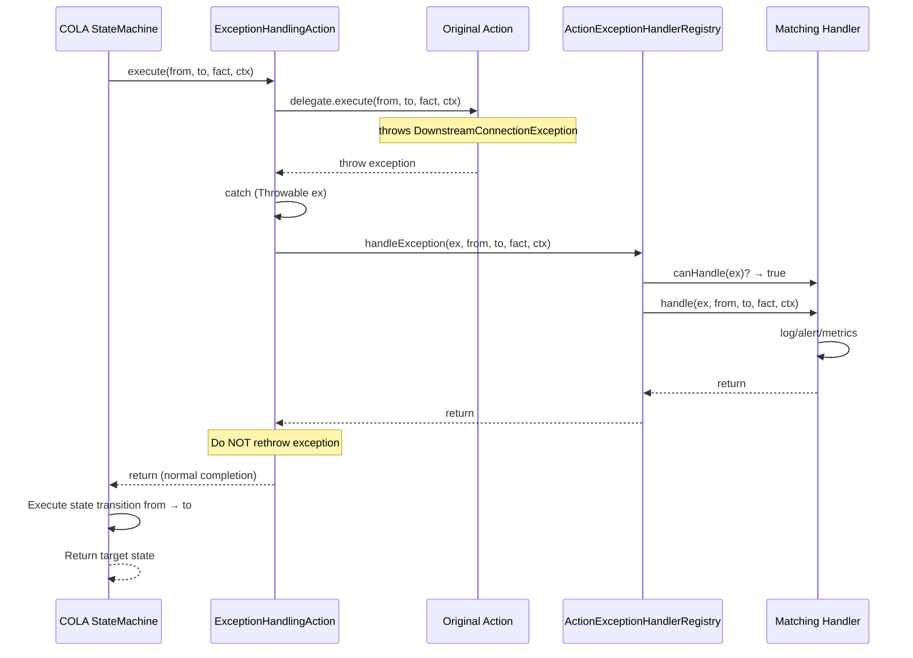

# 05 — Advanced Features

> Production-ready capabilities built on Alibaba COLA StateMachine: multi-market configuration, monitors, trace context, idempotency, observability, PlantUML generation, and extensibility patterns.

---

## 1. Multi-Market Configuration

### Problem

The project deploys to multiple markets (HK, SG, UK, etc.) with similar but slightly different state flows. Each market may have different timeouts, feature toggles, and routing strategies.

### Solution

A `StateMachineMarketConfig` record that captures market-specific behavior as an immutable snapshot. The config is injected into `CbolStateContext` at the start of each state transition.

```java
@Builder
public record StateMachineMarketConfig(
    int customerIdleSeconds,       // Default: 300
    int transferTimeoutSeconds,    // Default: 120
    int endingGraceSeconds,        // Default: 30
    boolean surveyEnabled,         // Default: true
    boolean transferEnabled,       // Default: true
    boolean genesysEnabled,        // Default: true
    String fallbackRoutingStrategy // Default: "DROP"
) {
    public static StateMachineMarketConfig defaultConfig() { ... }
}
```

### Market Config Provider

```java
public interface MarketConfigProvider {
    StateMachineMarketConfig getConfig(String market);

    class InMemoryProvider implements MarketConfigProvider {
        private final ConcurrentHashMap<String, StateMachineMarketConfig> cache = new ConcurrentHashMap<>();

        public void put(String market, StateMachineMarketConfig config) {
            cache.put(market, config);
        }

        @Override
        public StateMachineMarketConfig getConfig(String market) {
            return cache.getOrDefault(market, StateMachineMarketConfig.defaultConfig());
        }
    }
}
```

### Usage in Transition

```java
CbolStateContext ctx = CbolStateContext.builder()
        .conversation(conversation)
        .marketConfig(marketConfigProvider.getConfig("HK"))
        .traceContext(TraceContext.generate())
        .build();

ConversationState newState = sm.fireEvent(
        conversation.state(),
        ConversationFact.INTERACTION_BECAME_ACTIVE,
        ctx);
```

### Design Principles

- **Config as snapshot**: Market config is captured at transition start, not read dynamically during action execution
- **Default-first**: All config fields have sensible defaults; markets only override what differs
- **Immutable**: Config is a record, cannot be mutated during transition
- **Feature toggles**: Boolean fields (surveyEnabled, transferEnabled, genesysEnabled) control which transitions are active

---

## 2. Monitors (Timeout & Health Checks)

### Problem

State machines need to detect and handle timeouts: customer idle, transfer timeout, ending grace period. These are time-based events that should trigger automatic state transitions.

### Solution

Three monitor classes that check elapsed time and fire system events when thresholds are exceeded.

### 2.1 Customer Idle Monitor

```java
public class CustomerIdleMonitor {
    private final ChatEngineStateMachineService service;

    public void check(CbolStateContext ctx, long lastActivityTimestamp) {
        long idleMs = System.currentTimeMillis() - lastActivityTimestamp;
        int threshold = ctx.marketConfig().customerIdleSeconds() * 1000;

        if (idleMs > threshold) {
            service.fire(ctx, ConversationFact.CUSTOMER_IDLE_TIMEOUT);
        }
    }
}
```

### 2.2 Transfer Monitor

```java
public class TransferMonitor {
    private final ChatEngineStateMachineService service;

    public void check(CbolStateContext ctx, long transferStartTimestamp) {
        // Only active in TRANSFERRED state
        if (ctx.conversation().state() != ConversationState.TRANSFERRED) {
            return;
        }

        long elapsedMs = System.currentTimeMillis() - transferStartTimestamp;
        int threshold = ctx.marketConfig().transferTimeoutSeconds() * 1000;

        if (elapsedMs > threshold) {
            service.fire(ctx, ConversationFact.TRANSFER_TIMEOUT);
        }
    }
}
```

### 2.3 Ending Grace Monitor

```java
public class EndingGraceMonitor {
    private final ChatEngineStateMachineService service;

    public void check(CbolStateContext ctx, long enterEndingTimestamp) {
        // Only active in ENDING state
        if (ctx.conversation().state() != ConversationState.ENDING) {
            return;
        }

        long elapsedMs = System.currentTimeMillis() - enterEndingTimestamp;
        int threshold = ctx.marketConfig().endingGraceSeconds() * 1000;

        if (elapsedMs > threshold) {
            service.fire(ctx, ConversationFact.ENDING_TIMEOUT);
        }
    }
}
```

### Monitor Integration Pattern

```java
// Scheduled task (e.g., @Scheduled every 30 seconds)
@Scheduled(fixedDelay = 30000)
public void runMonitors() {
    List<Conversation> activeConversations = repository.findActive();

    for (Conversation conv : activeConversations) {
        CbolStateContext ctx = buildContext(conv);

        customerIdleMonitor.check(ctx, conv.getLastActivityAt());
        transferMonitor.check(ctx, conv.getTransferStartedAt());
        endingGraceMonitor.check(ctx, conv.getEnteredEndingAt());
    }
}
```

---

## 3. Trace Context & Observability

### Problem

In a distributed system, state transitions need to be traceable across services. Each transition should carry a trace ID for logging and debugging.

### Solution

A `TraceContext` record with UUID-based trace ID, plus `TraceMdcHelper` for SLF4J MDC propagation.

### 3.1 Trace Context

```java
public record TraceContext(
    String traceId,
    long timestamp
) {
    public static TraceContext generate() {
        return new TraceContext(UUID.randomUUID().toString(), System.currentTimeMillis());
    }
}
```

### 3.2 MDC Propagation

```java
public class TraceMdcHelper {
    private static final String TRACE_ID_KEY = "traceId";

    public static void set(TraceContext ctx) {
        MDC.put(TRACE_ID_KEY, ctx.traceId());
    }

    public static void clear() {
        MDC.remove(TRACE_ID_KEY);
    }
}
```

### 3.3 Usage in Service

```java
public ConversationState fire(CbolStateContext ctx, ConversationFact fact) {
    TraceMdcHelper.set(ctx.traceContext());
    long start = System.currentTimeMillis();
    try {
        ConversationState from = ctx.conversation().state();
        ConversationState to = convSm.fireEvent(from, fact, ctx);

        log.info("State transition: {} --({})--> {}, conversationId={}, durationMs={}",
                from, fact, to,
                ctx.conversation().conversationId(),
                System.currentTimeMillis() - start);
        return to;
    } finally {
        TraceMdcHelper.clear();
    }
}
```

### 3.4 Audit Logging Pattern

Every state transition should produce an audit log entry with:
- Business ID (conversationId / interactionId)
- From state / To state
- Event / Fact
- Market
- Trace ID
- Duration
- Timestamp

---

## 4. Idempotency

### Problem

In a distributed system, events may be delivered multiple times (at-least-once delivery). The state machine should handle duplicate events gracefully without corrupting state.

### Solution

Use `conversationId + event` as an idempotency key, and check before firing.

```java
public class IdempotentStateMachineService {
    private final Set<String> processedEvents = ConcurrentHashMap.newKeySet();
    private final ChatEngineStateMachineService delegate;

    public ConversationState fire(CbolStateContext ctx, ConversationFact event) {
        String idempotencyKey = ctx.conversation().conversationId() + ":" + event;

        if (processedEvents.contains(idempotencyKey)) {
            log.warn("Duplicate event detected: {}", idempotencyKey);
            return ctx.conversation().state(); // Return current state, no-op
        }

        processedEvents.add(idempotencyKey);
        return delegate.fire(ctx, event);
    }
}
```

### COLA-Level Idempotency

COLA StateMachine itself is idempotent in the sense that:
- If no transition matches `(sourceState, event)`, it throws `StateMachineException`
- The state does NOT change on exception (action-first principle)
- Firing the same event from the same state repeatedly will either succeed repeatedly (if action is idempotent) or fail consistently

**Best practice**: Make your Action implementations idempotent. Use database unique constraints or optimistic locking to prevent duplicate side effects.

---

## 5. PlantUML Diagram Generation

### Problem

State machines can become complex with many states and transitions. Visual documentation helps developers understand the flow.

### Solution

COLA StateMachine has a built-in `generatePlantUML()` method that produces a PlantUML state diagram.

```java
StateMachine<ConversationState, ConversationFact, CbolStateContext> sm =
        ConversationStateMachineFactory.build();

String plantUml = sm.generatePlantUML();
System.out.println(plantUml);
```

### Output Example

```
@startuml
[*] --> NEW
NEW --> INITIATED : CONVERSATION_INITIATED
INITIATED --> IN_PROGRESS : CUSTOMER_CONNECT
IN_PROGRESS --> TRANSFERRED : TRANSFER_REQUEST
IN_PROGRESS --> ENDING : CUSTOMER_CLOSE
TRANSFERRED --> IN_PROGRESS : TRANSFER_FAILED
TRANSFERRED --> ENDING : TRANSFER_COMPLETE
ENDING --> CLOSED : SYS_ENDING_GRACE_TIMEOUT
@enduml
```

### Rendering

Use any PlantUML renderer:
- Online: https://www.plantuml.com/plantuml/
- VS Code: PlantUML extension
- IntelliJ: PlantUML integration plugin

### CI/CD Integration

```bash
# Generate PlantUML and render to PNG in CI
java -jar plantuml.jar -tpng state-machine.puml
```

---

## 6. Factory Caching Pattern

### Problem

COLA StateMachine does NOT allow rebuilding a state machine with the same ID. Attempting to build twice throws:
```
The state machine with id [conversation] is already built, no need to build again
```

### Solution

Use a factory caching pattern with double-checked locking.

```java
public class ConversationStateMachineFactory {
    public static final String MACHINE_ID = "conversation";
    private static volatile StateMachine<ConversationState, ConversationFact, CbolStateContext> instance;

    public static StateMachine<ConversationState, ConversationFact, CbolStateContext> build() {
        // Fast path: check if already built
        try {
            StateMachine<ConversationState, ConversationFact, CbolStateContext> existing =
                    StateMachineFactory.get(MACHINE_ID);
            if (existing != null) {
                return existing;
            }
        } catch (Exception ignored) {
            // Not built yet
        }

        // Slow path: build with synchronization
        synchronized (ConversationStateMachineFactory.class) {
            // Double-check
            try {
                StateMachine<ConversationState, ConversationFact, CbolStateContext> existing =
                        StateMachineFactory.get(MACHINE_ID);
                if (existing != null) {
                    return existing;
                }
            } catch (Exception ignored) {
                // Not built yet
            }

            // Build
            StateMachineBuilder<ConversationState, ConversationFact, CbolStateContext> builder =
                    StateMachineBuilderFactory.create();

            // ... define transitions ...

            StateMachine<ConversationState, ConversationFact, CbolStateContext> sm =
                    builder.build(MACHINE_ID);
            StateMachineFactory.register(sm);
            return sm;
        }
    }
}
```

### Test Isolation

For tests that need a fresh state machine, use a unique machine ID per test class:

```java
class MyTest {
    private static final String TEST_MACHINE_ID = "conversation-test-" + UUID.randomUUID();

    @BeforeEach
    void setUp() {
        // Build with unique ID
    }
}
```

---

## 7. Action Exception Handling Mechanism

### Problem

When an Action throws an exception during a state transition, the default COLA behavior (action-first principle) blocks the state change and throws `StateMachineException`. However, in many production scenarios, we want:
- State transitions to continue regardless of Action execution failures
- Different handling strategies for different exception types (downstream connection, business, system)
- Custom exception handlers that developers can extend
- A fallback handler for unhandled exceptions
- Exceptions to be logged and monitored without blocking the state machine flow

### Solution

A comprehensive exception handling mechanism that wraps Actions with `ExceptionHandlingAction`, which catches all exceptions and delegates to a priority-based `ActionExceptionHandlerRegistry`. **Importantly, exceptions do NOT block state transitions** — state changes continue regardless of Action execution failures.

### 7.1 Package Structure

```
com.selfdevelopment.chatengine.action.exception
├── BusinessException.java              // Exception type definitions
├── DownstreamConnectionException.java
├── SystemException.java
├── handler/                            // Exception handlers
│   ├── ActionExceptionHandler.java          // Interface
│   ├── BusinessExceptionHandler.java
│   ├── DownstreamConnectionExceptionHandler.java
│   ├── FallbackActionExceptionHandler.java
│   └── SystemExceptionHandler.java
├── registry/                           // Handler registry
│   └── ActionExceptionHandlerRegistry.java
└── wrapper/                            // Action wrapper
    └── ExceptionHandlingAction.java
```

### 7.2 Exception Types

Three built-in exception types cover common scenarios:

```java
// Downstream system connection failure (database, MQ, external API, Genesys/Aibot)
public class DownstreamConnectionException extends RuntimeException {
    private final String downstreamSystem;
    private final String operation;
}

// Business rule violation or expected business error
public class BusinessException extends RuntimeException {
    private final String businessCode;
    private final Map<String, Object> businessContext;
}

// Unexpected system error (NPE, OOM, etc.)
public class SystemException extends RuntimeException {
    private final String systemComponent;
    private final String errorCategory;
}
```

### 7.3 Exception Handler Interface

```java
public interface ActionExceptionHandler {
    // Determines if this handler can handle the exception
    boolean canHandle(Throwable ex);

    // Custom handling logic (alert, retry, fallback, metrics, etc.)
    void handle(Throwable ex, ConversationState from, ConversationState to,
                ConversationFact fact, CbolStateContext ctx);

    // Handler priority (higher = checked first), default 0
    default int getPriority() { return 0; }
}
```

### 7.4 Default Exception Handlers

| Handler | Priority | Handles | Behavior |
|---------|----------|---------|----------|
| `DownstreamConnectionExceptionHandler` | 100 | `DownstreamConnectionException` | Logs downstream failure details |
| `BusinessExceptionHandler` | 80 | `BusinessException` | Logs business context and code |
| `SystemExceptionHandler` | 50 | `SystemException` | Logs system error with stack trace |
| `FallbackActionExceptionHandler` | -100 | All exceptions (catch-all) | Logs unhandled exception details |

### 7.5 Exception Handler Registry

Automatically discovers all Spring-managed `ActionExceptionHandler` beans, sorts by priority, and finds the first matching handler for each exception.

```java
@Slf4j
@Component
public class ActionExceptionHandlerRegistry implements InitializingBean {
    private final ApplicationContext applicationContext;
    private final List<ActionExceptionHandler> handlers = new ArrayList<>();
    private ActionExceptionHandler fallbackHandler;

    @Override
    public void afterPropertiesSet() {
        // Auto-discover all handler beans
        var handlerBeans = applicationContext.getBeansOfType(ActionExceptionHandler.class);

        for (var entry : handlerBeans.entrySet()) {
            ActionExceptionHandler handler = entry.getValue();
            if (handler instanceof FallbackActionExceptionHandler) {
                this.fallbackHandler = handler;
            } else {
                handlers.add(handler);
            }
        }

        // Sort by priority (higher first)
        handlers.sort(Comparator.comparingInt(ActionExceptionHandler::getPriority).reversed());

        // Ensure fallback handler exists
        if (fallbackHandler == null) {
            fallbackHandler = new FallbackActionExceptionHandler();
        }
    }

    public void handleException(Throwable ex, ConversationState from, ConversationState to,
                                ConversationFact fact, CbolStateContext ctx) {
        // Find first matching handler by priority
        for (ActionExceptionHandler handler : handlers) {
            if (handler.canHandle(ex)) {
                try {
                    handler.handle(ex, from, to, fact, ctx);
                } catch (Exception handlerEx) {
                    // Never let handler exceptions propagate
                    log.error("Exception handler threw an exception", handlerEx);
                }
                return;
            }
        }

        // Use fallback handler
        try {
            fallbackHandler.handle(ex, from, to, fact, ctx);
        } catch (Exception handlerEx) {
            log.error("Fallback handler threw an exception", handlerEx);
        }
    }
}
```

### 7.6 Exception Handling Action Wrapper

Wraps the original Action with exception handling. Catches ALL exceptions (including Errors), delegates to the registry, and **never rethrows** — state transitions always continue.

```java
@Slf4j
public class ExceptionHandlingAction<S, E, C> implements Action<S, E, C> {
    private final Action<S, E, C> delegate;
    private final ActionExceptionHandlerRegistry exceptionHandlerRegistry;

    @Override
    @SuppressWarnings("unchecked")
    public void execute(S from, S to, E e, C ctx) {
        try {
            delegate.execute(from, to, e, ctx);
        } catch (Throwable ex) {
            // Catch ALL exceptions (including Errors)
            log.warn("Action execution threw an exception: {}", ex.getClass().getSimpleName());

            try {
                exceptionHandlerRegistry.handleException(
                        ex,
                        (ConversationState) from,
                        (ConversationState) to,
                        (ConversationFact) e,
                        (CbolStateContext) ctx
                );
            } catch (Throwable handlerEx) {
                // Last line of defense - never propagate
                log.error("Exception handler registry threw an exception", handlerEx);
            }

            // IMPORTANT: Do NOT rethrow - state transition must continue
            log.debug("State transition continues despite Action exception: {} -> {} on {}",
                    from, to, e);
        }
    }

    // Factory method - idempotent (won't double-wrap)
    public static <S, E, C> Action<S, E, C> wrap(Action<S, E, C> action,
                                                    ActionExceptionHandlerRegistry registry) {
        if (action == null) return null;
        if (action instanceof ExceptionHandlingAction) return action; // Already wrapped
        return new ExceptionHandlingAction<>(action, registry);
    }
}
```

### 7.7 Execution Flow



### 7.8 Custom Exception Handler Example

Developers can add custom exception handlers without modifying existing code:

```java
@Component
public class MyCustomExceptionHandler implements ActionExceptionHandler {
    @Override
    public boolean canHandle(Throwable ex) {
        return ex instanceof MyCustomException;
    }

    @Override
    public void handle(Throwable ex, ConversationState from, ConversationState to,
                       ConversationFact fact, CbolStateContext ctx) {
        // Custom logic: alert, retry, fallback, metrics, etc.
        log.error("Custom exception handled: {}", ex.getMessage());
    }

    @Override
    public int getPriority() {
        return 200; // High priority - checked before default handlers
    }
}
```

### 7.9 Integration with ConversationActionService

The `ConversationActionService` automatically wraps Actions with exception handling:

```java
@Slf4j
@Service
@RequiredArgsConstructor
public class ConversationActionService {
    private final ConversationActionRegistry actionRegistry;
    private final ActionExceptionHandlerRegistry exceptionHandlerRegistry;

    // Spring environment (recommended) - auto-discovery + exception handling
    public StateMachine<ConversationState, ConversationFact, CbolStateContext> buildWithSpringActions() {
        return buildWithRegistry(actionRegistry, exceptionHandlerRegistry);
    }

    // Wrap each Action with exception handling
    private static Action<...> wrapWithExceptionHandling(
            Action<...> action,
            ActionExceptionHandlerRegistry registry) {
        if (action == null) return null;
        if (action instanceof ExceptionHandlingAction) return action;
        return new ExceptionHandlingAction<>(action, registry);
    }
}
```

### 7.10 Key Design Principles

| Principle | Description |
|-----------|-------------|
| **State transition never blocked** | Exceptions are handled, not propagated; state always changes |
| **Open/Closed** | Add new exception handlers without modifying existing code |
| **Priority-based** | More specific handlers (higher priority) checked first |
| **Fallback guaranteed** | Every exception gets handled (at least by fallback handler) |
| **Handler exceptions never propagate** | Last line of defense in wrapper |
| **Auto-discovery** | Spring beans automatically registered |
| **Idempotent wrapping** | Already-wrapped Actions not double-wrapped |
| **Backward compatible** | Original APIs without exception handling preserved |

### 7.11 COLA Action-First Principle (Reference)

For reference, COLA StateMachine follows the **action-first principle** by default:
1. Action executes **before** state change
2. If action succeeds → state changes to target state
3. If action fails → `StateMachineException` is thrown, state remains unchanged

Our exception handling mechanism **overrides this behavior** by catching exceptions in the wrapper, allowing state transitions to continue regardless of Action failures. This is intentional for our use case where Action side effects (notifications, logging, downstream calls) should not block the core state flow.

---

## 8. Extensibility Patterns

### 8.1 Custom Action Composition

Compose multiple actions into one:

```java
public class CompositeAction<S, E, C> implements Action<S, E, C> {
    private final List<Action<S, E, C>> actions;

    @Override
    public void execute(S from, S to, E event, C context) {
        for (Action<S, E, C> action : actions) {
            action.execute(from, to, event, context);
        }
    }
}
```

### 8.2 Action with Retry

Wrap an action with retry logic:

```java
public class RetryAction<S, E, C> implements Action<S, E, C> {
    private final Action<S, E, C> delegate;
    private final int maxRetries;
    private final long backoffMs;

    @Override
    public void execute(S from, S to, E event, C context) {
        int attempts = 0;
        while (true) {
            try {
                delegate.execute(from, to, event, context);
                return;
            } catch (Exception e) {
                if (++attempts >= maxRetries) {
                    throw e;
                }
                try {
                    Thread.sleep(backoffMs * attempts);
                } catch (InterruptedException ie) {
                    Thread.currentThread().interrupt();
                    throw e;
                }
            }
        }
    }
}
```

### 8.3 Async Action Worker (Reserved)

`ActionWorker` is a reserved utility class for future async action execution. Current design uses synchronous action-first transitions.

```java
// RESERVED: For future async action execution
public class ActionWorker {
    private final ExecutorService executor = Executors.newCachedThreadPool();

    public CompletableFuture<Void> submit(
            Action<ConversationState, ConversationFact, CbolStateContext> action,
            ConversationState from, ConversationState to,
            ConversationFact event, CbolStateContext ctx) {
        return CompletableFuture.runAsync(() -> {
            TraceMdcHelper.set(ctx.traceContext());
            try {
                action.execute(from, to, event, ctx);
            } finally {
                TraceMdcHelper.clear();
            }
        }, executor);
    }
}
```

### 8.4 ConditionalAction Pattern

The `ConditionalAction` interface extends COLA's `Action` with a built-in `getCondition()` method, creating a natural binding between an Action and its execution guard condition.

#### 8.4.1 Design Rationale

**Problem:** In traditional state machine usage, conditions and actions are defined separately in the factory, leading to:
- Condition-action mismatch risk (wrong condition paired with wrong action)
- Scattered logic (condition in factory, action in separate class)
- Harder to understand (need to look in two places to understand a transition)

**Solution:** Bind the condition directly to the Action class via interface inheritance.

```
Traditional:                    ConditionalAction:
┌─────────────┐                 ┌──────────────────────┐
│ Factory     │                 │ SessionStartedAction │
│  .when(cond)│  ◄── separate  │  ├─ getCondition()   │
│  .perform(action)             │  └─ execute()        │
└─────────────┘                 └──────────────────────┘
                                      ▲ condition and
                                      │ action together
```

#### 8.4.2 Interface Definition

```java
public interface ConditionalAction<S, E, C> extends Action<S, E, C> {

    /** A condition that is always satisfied. */
    Condition<?> ALWAYS_TRUE = ctx -> true;

    /**
     * Returns the condition for this Action.
     * Default: always satisfied (ALWAYS_TRUE).
     * Override to provide custom guard conditions.
     */
    @SuppressWarnings("unchecked")
    default Condition<C> getCondition() {
        return (Condition<C>) ALWAYS_TRUE;
    }
}
```

#### 8.4.3 Usage Patterns

**Pattern 1: Action with custom condition**
```java
@Component
@HandlesFact(SESSION_STARTED)
public class SessionStartedAction implements ConditionalAction<...> {
    @Override
    public Condition<CbolStateContext> getCondition() {
        return ctx -> ctx.conversation() != null
            && ctx.conversation().conversationId() != null;
    }
}
```

**Pattern 2: Action without condition (default)**
```java
@Component
@HandlesFact(INBOUND_MESSAGE_RECEIVED)
public class InboundMessageAction implements ConditionalAction<...> {
    // getCondition() not overridden → defaults to ALWAYS_TRUE
}
```

**Pattern 3: Reusable standalone condition**
```java
public class MarketEnabledCondition implements Condition<CbolStateContext> {
    @Override
    public boolean isSatisfied(CbolStateContext ctx) {
        return ctx.marketConfig() != null
            && ctx.marketConfig().transferEnabled();
    }
}

// In Action
@Override
public Condition<CbolStateContext> getCondition() {
    return new MarketEnabledCondition();
}
```

#### 8.4.4 Factory Auto-Extraction

The factory automatically extracts conditions without explicit configuration:

```java
Function<ConversationFact, Condition<CbolStateContext>> conditionProvider = fact -> {
    Action<...> action = actionProvider.apply(fact);
    if (action instanceof ConditionalAction) {
        return ((ConditionalAction<...>) action).getCondition();
    }
    return ctx -> true; // Fallback
};

// Every transition automatically gets its condition
builder.externalTransition()
    .from(NEW).to(INITIATED).on(SESSION_STARTED)
    .when(conditionProvider.apply(SESSION_STARTED))  // Auto-extracted
    .perform(actionProvider.apply(SESSION_STARTED));
```

#### 8.4.5 Benefits

| Benefit | Description |
|---------|-------------|
| **Cohesion** | Condition and action live in the same class |
| **Type safety** | Compiler ensures condition context type matches action |
| **Zero config** | Factory auto-discovers conditions via `instanceof` |
| **Opt-in** | Default ALWAYS_TRUE means no overhead for simple actions |
| **Testable** | Conditions can be unit-tested independently |
| **Debuggable** | Log condition failures inside the Action class |

#### 8.4.6 Exception Handling Integration

The `ExceptionHandlingAction` wrapper also implements `ConditionalAction` and delegates condition evaluation to the wrapped Action:

```java
public class ExceptionHandlingAction<S, E, C> implements ConditionalAction<S, E, C> {
    private final Action<S, E, C> delegate;

    @Override
    public Condition<C> getCondition() {
        if (delegate instanceof ConditionalAction) {
            return ((ConditionalAction<S, E, C>) delegate).getCondition();
        }
        return ctx -> true;
    }
}
```

This ensures that exception handling wrapping preserves the original Action's condition behavior.

---

## 9. Summary Table

| Feature | Implementation | Location |
|---------|---------------|----------|
| Multi-market config | `StateMachineMarketConfig` record | chat-engine/config |
| Customer idle monitor | `CustomerIdleMonitor` | chat-engine/monitor |
| Transfer monitor | `TransferMonitor` | chat-engine/monitor |
| Ending grace monitor | `EndingGraceMonitor` | chat-engine/monitor |
| Trace context | `TraceContext` + `TraceMdcHelper` | chat-engine/context |
| Idempotency | Business layer pattern | Application code |
| PlantUML generation | COLA built-in `generatePlantUML()` | statemachine-core |
| Factory caching | Double-checked locking pattern | chat-engine/statemachine/factory |
| Action exception handling | `ExceptionHandlingAction` + handler registry | chat-engine/action/exception |
| Exception types | Business/Downstream/System exceptions | chat-engine/action/exception |
| Exception handlers | Priority-based handler chain | chat-engine/action/exception/handler |
| Fallback handler | Catch-all handler for unhandled exceptions | chat-engine/action/exception/handler |
| COLA action-first error handling | COLA built-in (overridden by our wrapper) | statemachine-core |
| Failover | Business layer pattern | Application code |
| Async action worker | Reserved utility class | chat-engine/action |
| ConditionalAction pattern | Action-bound conditions with default ALWAYS_TRUE | chat-engine/action |

---

## 10. References

- Alibaba COLA GitHub: https://github.com/alibaba/COLA
- COLA StateMachine module: `cola-components/cola-component-statemachine`
- COLA StateMachine tests: `cola-components/cola-component-statemachine/src/test/java/com/alibaba/cola/test/`

---

*Last updated: 2026-09-12 (v3.2 — added ConditionalAction pattern with default ALWAYS_TRUE)*
