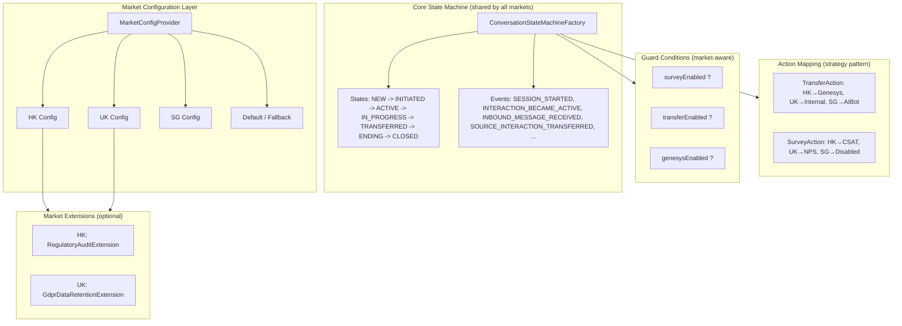

# Multi-Market State Machine Design

> Version: 4.1 | Last Updated: 2026-09-12
> Status: Active Design (aligned with current implementation)
> Aligned with Event-Driven Orchestration Design (v4.0) and ConditionalAction Pattern

## 1. Background & Requirements

### 1.1 Problem Statement

The CBOL messaging hub will be deployed to **multiple markets** (HK, UK, SG, etc.). Each market shares a **similar main flow** (connect → IN_PROGRESS → transfer → survey → ending → closed) but has **differences** in:

- Which features are enabled (survey, transfer, Genesys integration)
- Timeout thresholds (idle, transfer, ending grace, survey)
- Business rules (routing strategy, fallback behavior)
- Regulatory requirements (data retention, audit logging)
- Connector configurations (AIBot endpoint, Genesys org, WebSocket settings)

### 1.2 Key Question

> Should we use **configuration control** (one state machine + market-level config) or **design one per market** (separate state machine instances)?

### 1.3 Design Principles

1. **DRY (Don't Repeat Yourself)**: Main flow logic should be defined once
2. **Open/Closed**: New markets should be addable without modifying core code
3. **Explicit over Implicit**: Market differences should be visible and auditable
4. **Testability**: Each market's behavior should be independently verifiable
5. **Operational Simplicity**: Config changes should not require code deployment

---

## 2. Option Comparison

### 2.1 Option A: Configuration Control (Single State Machine + Market Config)

**Approach**: One state machine definition, all differences controlled by `StateMachineMarketConfig`.

| Pros | Cons |
|------|------|
| Code reuse, single source of truth for main flow | Config complexity grows with market differences |
| New market = add config, no code change | Extreme differences may require "config as code" (anti-pattern) |
| Consistent behavior across markets | Harder to debug (is it config or code?) |
| Easy to roll out global changes | Need flexible config model (guards, action mapping, state extensions) |
| Lower maintenance cost | Market-specific workarounds may pollute core code |

**Best for**: Markets with **80%+ similarity**, differences mainly in thresholds and feature toggles.

---

### 2.2 Option B: One Per Market (Separate State Machine Instances)

**Approach**: Each market has its own state machine factory with custom transitions, actions, and states.

| Pros | Cons |
|------|------|
| Maximum flexibility, each market fully independent | Massive code duplication |
| Simple to implement for highly divergent markets | Global changes require syncing N copies |
| Easy to debug (problem isolated to one market) | Easy to drift apart (one market gets a fix, others don't) |
| No config complexity | New market = copy-paste + modify, error-prone |
| Market-specific code is cleanly separated | High maintenance cost (linear with market count) |

**Best for**: Markets with **<50% similarity**, fundamentally different business logic.

---

### 2.3 Option C: Hybrid (Recommended)

**Approach**: Core state machine defines the **main flow** (shared by all markets). Market differences are handled through:

1. **Market-level config** — thresholds, feature toggles, connector settings
2. **Guard conditions** — transitions gated by market config (e.g., `surveyEnabled`)
3. **Action mapping** — same event triggers different actions per market (strategy pattern)
4. **Extension points** — market-specific states/events added via modular extensions
5. **Market profiles** — predefined config bundles (e.g., `HK-profile`, `UK-profile`)

| Pros | Cons |
|------|------|
| Main flow defined once, differences explicit | Requires upfront design of extension points |
| New market = choose profile + override configs | Moderate config complexity (but manageable) |
| Global changes propagate automatically | Market-specific code needs clear separation |
| Flexible enough for divergent markets | Slightly higher initial design effort |
| Config changes don't require code deployment | Need good tooling for config validation |

**Best for**: Our scenario — markets share main flow but have meaningful differences.

---

## 3. Recommended Design: Hybrid Approach

### 3.1 Architecture Overview



### 3.2 Configuration Model

#### 3.2.1 StateMachineMarketConfig (Current Implementation)

```java
@Builder
public record StateMachineMarketConfig(
    // === Timeouts ===
    long customerIdleSeconds,
    long transferTimeoutSeconds,
    long endingGraceSeconds,
    long surveyTimeoutSeconds,

    // === Feature Toggles ===
    boolean surveyEnabled,
    boolean transferEnabled,
    boolean genesysEnabled,

    // === Business Rules ===
    String fallbackRoutingStrategy,      // DROP / REQUEUE / FALLBACK_QUEUE

    // === Retry Configuration ===
    int maxRetries,
    long retryBaseDelayMs,
    long retryMaxDelayMs
) {
    public static StateMachineMarketConfig defaultConfig() {
        return StateMachineMarketConfig.builder()
                .customerIdleSeconds(300)
                .transferTimeoutSeconds(180)
                .endingGraceSeconds(120)
                .surveyTimeoutSeconds(120)
                .surveyEnabled(false)
                .transferEnabled(true)
                .genesysEnabled(false)
                .fallbackRoutingStrategy("DROP")
                .maxRetries(3)
                .retryBaseDelayMs(1000)
                .retryMaxDelayMs(30000)
                .build();
    }
}
```

#### 3.2.2 Market Profiles (YAML - Future Enhancement)

> **Note**: YAML config loading is a planned enhancement. Current implementation uses
> `StateMachineMarketConfig.defaultConfig()` with programmatic overrides per market.

```yaml
# config/markets/hk.yaml (planned)
market: HK
profile: hk-standard
timeouts:
  customerIdleSeconds: 300
  transferTimeoutSeconds: 180
  endingGraceSeconds: 120
  surveyTimeoutSeconds: 300
features:
  surveyEnabled: true
  transferEnabled: true
  genesysEnabled: true
businessRules:
  fallbackRoutingStrategy: REQUEUE
retry:
  maxRetries: 3
  retryBaseDelayMs: 1000
  retryMaxDelayMs: 30000
```

```yaml
# config/markets/uk.yaml (planned)
market: UK
profile: uk-standard
timeouts:
  customerIdleSeconds: 600      # UK: longer idle timeout
  transferTimeoutSeconds: 240
  endingGraceSeconds: 180
  surveyTimeoutSeconds: 600
features:
  surveyEnabled: true
  transferEnabled: true
  genesysEnabled: false          # UK: no Genesys
businessRules:
  fallbackRoutingStrategy: FALLBACK_QUEUE
retry:
  maxRetries: 2
  retryBaseDelayMs: 2000
  retryMaxDelayMs: 60000
```

```yaml
# config/markets/sg.yaml (planned)
market: SG
profile: sg-lite
timeouts:
  customerIdleSeconds: 300
  transferTimeoutSeconds: 180
  endingGraceSeconds: 120
features:
  surveyEnabled: false           # SG: no survey
  transferEnabled: true
  genesysEnabled: false
businessRules:
  fallbackRoutingStrategy: DROP
retry:
  maxRetries: 1
  retryBaseDelayMs: 500
  retryMaxDelayMs: 10000
```

### 3.3 Market-Aware State Machine Building

#### 3.3.1 Guard Conditions (via ConditionalAction)

Transitions are gated by market config via the `ConditionalAction` pattern.
Each Action implements `ConditionalAction` and provides a `getCondition()` method.
The factory auto-extracts the condition and passes it to COLA's `.when()`:

```java
// Example: Survey-related transitions only allowed if surveyEnabled
// Implemented via ConditionalAction in SurveySubmittedAction
@Override
public Condition<CbolStateContext> getCondition() {
    return ctx -> ctx != null
        && ctx.conversation() != null
        && ctx.marketConfig() != null
        && ctx.marketConfig().surveyEnabled();
}

// In ConversationStateMachineFactory, condition is auto-extracted:
Function<ConversationFact, Condition<CbolStateContext>> conditionProvider = fact -> {
    Action<CbolStateContext> action = actionProvider.apply(fact);
    return ((ConditionalAction<CbolStateContext>) action).getCondition();
};

builder.externalTransition()
    .from(ConversationState.ENDING)
    .to(ConversationState.ENDING)
    .on(ConversationFact.SURVEY_SUBMITTED)
    .when(conditionProvider.apply(ConversationFact.SURVEY_SUBMITTED))
    .perform(actionProvider.apply(ConversationFact.SURVEY_SUBMITTED));
```

> **Reference**: See `04-Usage-Guide.md` section 4 "Condition with ConditionalAction"
> and `05-Advanced-Features.md` section 8.4 "ConditionalAction Pattern" for details.

#### 3.3.2 Action Mapping (Strategy Pattern - Future Enhancement)

> **Current Implementation**: Actions are managed via `@HandlesFact` annotation +
> `ConversationActionRegistry` auto-discovery. Each Action is a Spring `@Component`
> bound to a specific `ConversationFact`. Market-specific action variants can be
> implemented by adding multiple Action beans for the same fact with market-aware
> conditions via `ConditionalAction`.

```java
// Transfer action strategy (future enhancement for market-specific transfer logic)
public interface TransferStrategy {
    void execute(CbolStateContext ctx);
}

public class GenesysTransferStrategy implements TransferStrategy { ... }
public class InternalQueueTransferStrategy implements TransferStrategy { ... }
public class AibotTransferStrategy implements TransferStrategy { ... }

// In Action implementation, resolve strategy by market config
@Component
@HandlesFact(ConversationFact.SOURCE_INTERACTION_TRANSFERRED)
public class SourceInteractionTransferredAction implements ConditionalAction<CbolStateContext> {
    private final TransferStrategyRegistry strategyRegistry;

    @Override
    public void execute(CbolStateContext ctx) {
        TransferStrategy strategy = strategyRegistry.resolve(ctx.marketConfig());
        strategy.execute(ctx);
    }

    @Override
    public Condition<CbolStateContext> getCondition() {
        return ctx -> ctx != null
            && ctx.marketConfig() != null
            && ctx.marketConfig().transferEnabled();
    }
}
```

#### 3.3.3 Market Extensions (Optional - Future Enhancement)

For market-specific states/events that don't fit the core model.
Current implementation does not have a formal extension mechanism;
market differences are handled via config + ConditionalAction.

```java
// Future enhancement: MarketExtension interface
public interface MarketExtension {
    String getName();
    void registerTransitions(StateMachineBuilder<ConversationState, ConversationFact, CbolStateContext> builder);
}

// HK: Regulatory audit on every state change (future)
public class HKRegulatoryAuditExtension implements MarketExtension {
    public String getName() { return "HKRegulatoryAudit"; }

    public void registerTransitions(StateMachineBuilder<...> builder) {
        // Add HK-specific transitions if needed
    }
}

// UK: GDPR data retention on conversation close (future)
public class UKGdprRetentionExtension implements MarketExtension { ... }
```

### 3.4 Market-Aware Service Layer

```java
@Service
public class ChatEngineStateMachineService {
    private final ConversationStateMachineFactory stateMachineFactory;
    private final MarketConfigProvider configProvider;

    /**
     * Fire an event. A new state machine instance is created per fire event
     * to avoid COLA "already built" exception and ensure thread safety.
     */
    public ConversationState fire(String conversationId, String market, ConversationFact fact) {
        StateMachineMarketConfig config = configProvider.getConfig(market);
        CbolStateContext ctx = buildContext(conversationId, config);

        // Create a new state machine instance per fire (with unique machineId)
        StateMachine<ConversationState, ConversationFact, CbolStateContext> machine =
            stateMachineFactory.createStateMachine();

        return machine.fireEvent(ctx.conversation().state(), fact, ctx);
    }

    /**
     * Close conversation: survey path only if surveyEnabled.
     * Survey is field-based (surveyStatus) in ENDING state, not a separate state.
     */
    public ConversationState closeConversation(String conversationId, String market) {
        StateMachineMarketConfig config = configProvider.getConfig(market);
        if (config.surveyEnabled()) {
            // Enter ENDING first, then survey will be handled within ENDING
            return fire(conversationId, market, ConversationFact.ENDING_STARTED);
        } else {
            // Skip survey, go directly to ending actions completion
            return fire(conversationId, market, ConversationFact.ENDING_STARTED);
        }
    }
}
```

---

## 4. Implementation Roadmap

### Phase 1: Config-Only Differences (✅ Completed)

- [x] Implement `StateMachineMarketConfig` with all threshold/toggle fields
- [x] Add guard conditions via `ConditionalAction` pattern for `surveyEnabled`, `transferEnabled`, `genesysEnabled`
- [x] Implement `MarketConfigProvider` with caching
- [x] Write tests for market config

**Status**: Core config model implemented. YAML config loading is planned for future.

### Phase 2: Action Mapping (🔄 In Progress)

- [x] Define `@HandlesFact` annotation for Action-Fact binding
- [x] Implement `ConversationActionRegistry` for auto-discovery
- [x] Implement `ConversationActionService` for action management
- [ ] Implement market-specific action strategy variants
- [ ] Write tests for each action variant

**Status**: Action management framework implemented. Market-specific strategy variants are planned.

### Phase 3: Market Extensions (📋 Planned)

- [ ] Define `MarketExtension` interface
- [ ] Implement `ExtensionRegistry`
- [ ] Implement HK regulatory audit extension
- [ ] Implement UK GDPR retention extension
- [ ] Wire extensions into state machine building
- [ ] Write tests for extension loading and execution

**Estimated effort**: 3-5 days

### Phase 4: Tooling & Operations (📋 Planned)

- [ ] Config validation tool (validate all market configs on startup)
- [ ] Config diff tool (compare two market configs)
- [ ] State machine diagram generator per market
- [ ] Config hot-reload support (refresh config without restart)
- [ ] Monitoring dashboard (per-market state distribution, error rates)
- [ ] YAML config loader with three-layer inheritance

**Estimated effort**: 2-3 weeks

---

## 5. Risk Assessment & Mitigation

| Risk | Likelihood | Impact | Mitigation |
|------|-----------|--------|------------|
| Config becomes too complex (spaghetti config) | Medium | High | Start with config-only, add action mapping/extensions only when needed. Set a "complexity budget" per market. |
| Market-specific code leaks into core | Medium | Medium | Strict package separation: `cbol.extension.hk.*`, `cbol.extension.uk.*`. Core code must not reference market names. |
| Config drift between markets (inconsistent behavior) | Medium | Medium | Config validation + diff tooling. Regular config audit. Default profile as baseline. |
| Hard to debug market-specific issues | Medium | Medium | All state transitions log market + config snapshot. Per-market trace IDs. Config version in audit logs. |
| Extension ordering conflicts | Low | Medium | Extensions declare dependencies. Registry validates DAG on startup. |
| Performance overhead from config lookups | Low | Low | Config cached in memory. Config object is immutable (record). No DB calls per transition. |
| New market requires code deployment (extensions) | Low | Medium | Extensions are optional. Most markets should work with config only. Extensions deployed as separate jars. |

---

## 6. Evaluation & Recommendation

### 6.1 Why Not Option A (Pure Config)?

Pure config control works when differences are **simple toggles and thresholds**. But our markets have differences in:
- **Transfer mechanism** (Genesys vs internal queue vs AIBot) — requires different code paths
- **Survey type** (CSAT vs NPS) — requires different survey UI and data model
- **Regulatory requirements** (HK audit, UK GDPR) — requires different event listeners and data handling

These differences cannot be cleanly expressed as config without creating a "config programming language" (anti-pattern).

### 6.2 Why Not Option B (One Per Market)?

Our markets share **80%+ of the main flow**:
- State definitions are identical
- Most transitions are identical
- Error handling (failover, retry) is identical
- Monitoring and audit infrastructure is identical

Creating separate state machines would duplicate this shared logic, leading to:
- Maintenance burden (fix a bug in 3+ places)
- Inconsistent behavior (one market gets a feature, others don't)
- Onboarding cost (new market = copy-paste + modify)

### 6.3 Recommendation: Option C (Hybrid)

**Adopt the hybrid approach with a phased rollout:**

1. **Start with Phase 1 (config-only)** — covers ~70% of differences
2. **Add Phase 2 (action mapping)** when transfer/survey differences need different code
3. **Add Phase 3 (extensions)** only for markets with truly unique requirements (HK regulatory, UK GDPR)
4. **Most markets should never need extensions** — config + action mapping should suffice

### 6.4 Success Criteria

- [ ] New market can be onboarded with config only (no code change) in < 1 day
- [ ] Global bug fix applies to all markets automatically
- [ ] Each market's IN_PROGRESS transitions can be visualized (config-aware diagram)
- [ ] Config changes can be validated before deployment
- [ ] Market-specific behavior is independently testable
- [ ] No market name appears in core state machine code

---

## 7. Appendix

### 7.1 Market Comparison Matrix (Example - Planned)

| Feature | HK | UK | SG |
|---------|----|----|----|
| Survey | Enabled | Enabled | Disabled |
| Transfer | Enabled (Genesys) | Enabled (Internal) | Enabled (AIBot) |
| Genesys | Enabled | Disabled | Disabled |
| Idle timeout | 300s | 600s | 300s |
| Transfer timeout | 180s | 240s | 180s |
| Ending grace | 120s | 180s | 120s |
| Fallback strategy | REQUEUE | FALLBACK_QUEUE | DROP |
| Max retries | 3 | 2 | 1 |

> **Note**: Survey type (CSAT/NPS), regulatory audit, data retention, and connector
> endpoints are not currently in `StateMachineMarketConfig`. These can be added as
> needed or handled via the extension mechanism.

### 7.2 References

- `StateMachineMarketConfig` — current config model (11 fields: timeouts, feature toggles, fallback strategy, retry config)
- `MarketConfigProvider` — config provider interface with in-memory caching
- `ConditionalAction` — action-bound condition pattern (see `04-Usage-Guide.md` section 4)
- `ConversationActionRegistry` — auto-discovery of Actions via `@HandlesFact` annotation
- `05-Advanced-Features.md` — exception handling mechanism, ConditionalAction pattern
- `02-CBOL-Business-Layer-Design.md` — current CBOL business layer design
- `07-Multi-Market-Best-Practices/` — detailed design docs for 8 multi-market best practices
