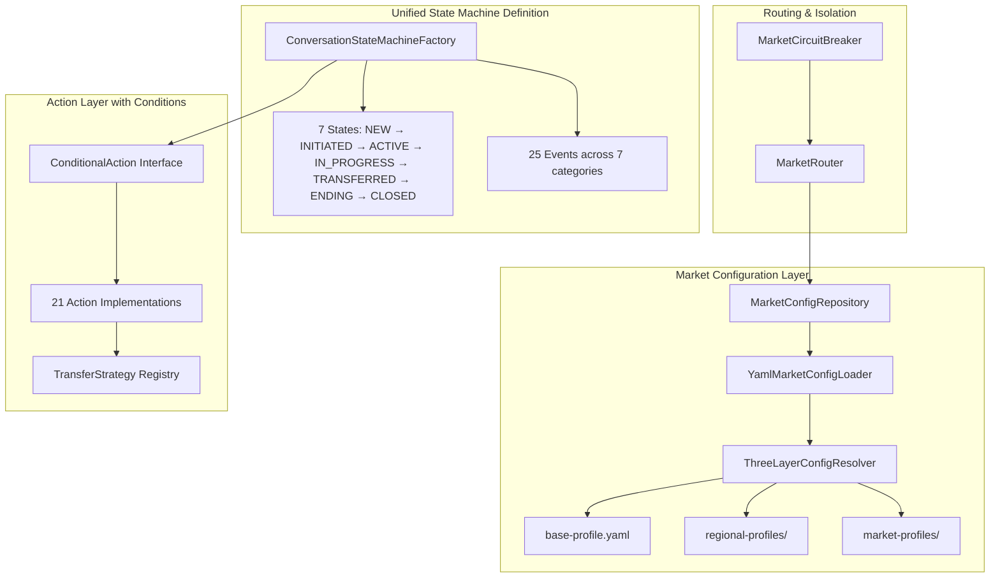
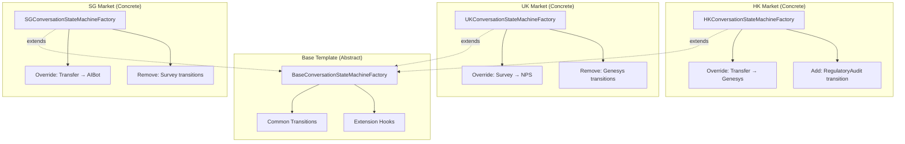
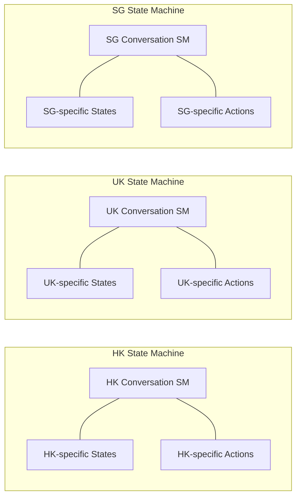

# Multi-Market State Machine Architecture Design

> Version: 1.0 | Last Updated: 2026-09-12
> Status: Design Document (for evaluation)
> Author: AI Assistant

---

## 1. Background & Requirements

### 1.1 Problem Statement

The CBOL messaging hub will be deployed to **multiple markets** (HK, UK, SG, US, etc.). Each market shares a **similar main flow** but has **differences** in:

- **Feature availability**: Survey, transfer, Genesys integration, AI bot
- **Timeout thresholds**: Idle, transfer, ending grace, survey
- **Business rules**: Routing strategy, fallback behavior, retry policy
- **Regulatory requirements**: Data retention, audit logging, compliance
- **Connector configurations**: AIBot endpoint, Genesys org, WebSocket settings
- **State flow variations**: Some markets may need additional states or skip certain steps

### 1.2 Key Question

> How should we design the state machine to support multiple markets while maintaining code quality, operational simplicity, and flexibility?

### 1.3 Design Principles

| Principle | Description |
|-----------|-------------|
| **DRY** | Don't Repeat Yourself — main flow logic should be defined once |
| **Open/Closed** | Open for extension, closed for modification — new markets should not require core code changes |
| **Explicit over Implicit** | Market differences should be visible, auditable, and traceable |
| **Testability** | Each market's behavior should be independently verifiable |
| **Operational Simplicity** | Config changes should not require code deployment |
| **Failure Isolation** | One market's failure should not cascade to other markets |
| **Performance** | No significant overhead from multi-market abstraction |

---

## 2. Solution Options

### 2.1 Option A: Configuration-Driven (Current Approach)

#### 2.1.1 Overview

One unified state machine definition for all markets. Differences are controlled through:
- Market-level configuration (timeouts, feature toggles, routing)
- ConditionalAction pattern (Action-bound conditions)
- Strategy pattern for market-specific logic

#### 2.1.2 Architecture



#### 2.1.3 Key Components

| Component | Package | Responsibility |
|-----------|---------|----------------|
| `StateMachineMarketConfig` | `config` | 19-field market configuration record |
| `YamlMarketConfigLoader` | `config.loader` | Load config from YAML files |
| `ThreeLayerConfigResolver` | `config.loader` | base → regional → market inheritance |
| `MarketConfigRepository` | `config` | Cached config with hot-reload |
| `ConditionalAction` | `action` | Action with built-in condition |
| `MarketRouter` | `routing` | Route requests to market config |
| `MarketCircuitBreaker` | `routing` | Per-market failure isolation |
| `ConfigValidator` | `config.validation` | Config validation with ERROR/WARNING/INFO |
| `TransferStrategy` | `action.strategy` | Market-specific transfer logic |

#### 2.1.4 How It Works

**Step 1: Config Resolution**
```java
// Three-layer inheritance: base → regional → market
StateMachineMarketConfig config = configRepository.getConfig("HK");
```

**Step 2: Condition Evaluation**
```java
// Each Action has a condition that checks market config
public class SurveySubmittedAction implements ConditionalAction<CbolStateContext> {
    @Override
    public Condition<CbolStateContext> getCondition() {
        return ctx -> ctx.marketConfig().surveyEnabled();
    }
}
```

**Step 3: State Machine Execution**
```java
// Factory auto-extracts conditions from Actions
builder.externalTransition()
    .from(ENDING)
    .to(ENDING)
    .on(SURVEY_SUBMITTED)
    .when(conditionProvider.apply(SURVEY_SUBMITTED))  // Condition from Action
    .perform(actionProvider.apply(SURVEY_SUBMITTED));
```

#### 2.1.5 Pros & Cons

| Pros | Cons |
|------|------|
| ✅ High code reuse (single state machine definition) | ❌ Cannot add market-specific states |
| ✅ New market = add config, no code change | ❌ Market-specific logic requires if-else in Actions |
| ✅ Consistent behavior across markets | ❌ Condition only blocks Action, not transition |
| ✅ Easy to roll out global changes | ❌ Complex config can become "config as code" anti-pattern |
| ✅ Config changes don't require deployment | ❌ Hard to debug (is it config or code?) |
| ✅ Lower maintenance cost | ❌ Market-specific workarounds may pollute core |

#### 2.1.6 Best For

Markets with **80%+ similarity**, differences mainly in thresholds, feature toggles, and routing strategies.

---

### 2.2 Option B: State Machine Template + Market Override

#### 2.2.1 Overview

Base state machine template defines common transitions. Each market can:
- Inherit all base transitions
- Override specific transitions (different Action, different condition)
- Add market-specific transitions
- Remove/disable certain transitions

#### 2.2.2 Architecture



#### 2.2.3 Key Components

| Component | Responsibility |
|-----------|----------------|
| `BaseConversationStateMachineFactory` | Abstract base with common transition definitions |
| `MarketStateMachineFactory` | Interface for market-specific factories |
| `TransitionOverride` | Override a specific transition (from, event, to, action, condition) |
| `TransitionRegistry` | Registry for market-specific transitions |
| `MarketFactoryProvider` | Resolve factory by market code |

#### 2.2.4 Implementation Example

```java
// Base template
public abstract class BaseConversationStateMachineFactory {
    
    protected void configureCommonTransitions(StateMachineBuilder builder) {
        // NEW → INITIATED
        builder.externalTransition()
            .from(NEW).to(INITIATED)
            .on(SESSION_STARTED)
            .perform(actionProvider.get(SESSION_STARTED));
        
        // INITIATED → ACTIVE
        builder.externalTransition()
            .from(INITIATED).to(ACTIVE)
            .on(INTERACTION_BECAME_ACTIVE)
            .perform(actionProvider.get(INTERACTION_BECAME_ACTIVE));
        
        // ... more common transitions
    }
    
    protected abstract void configureMarketTransitions(StateMachineBuilder builder);
    
    protected Set<TransitionKey> getDisabledTransitions() {
        return Set.of(); // No disabled transitions by default
    }
}

// HK specific factory
public class HKConversationStateMachineFactory extends BaseConversationStateMachineFactory {
    
    @Override
    protected void configureMarketTransitions(StateMachineBuilder builder) {
        // Override transfer to use Genesys
        builder.externalTransition()
            .from(IN_PROGRESS).to(TRANSFERRED)
            .on(SOURCE_INTERACTION_TRANSFERRED)
            .when(ctx -> ctx.marketConfig().transferEnabled())
            .perform(genesysTransferAction);
        
        // Add HK-specific regulatory audit transition
        builder.internalTransition()
            .within(ANY_STATE)
            .on(REGULATORY_AUDIT_EVENT)
            .perform(regulatoryAuditAction);
    }
    
    @Override
    protected Set<TransitionKey> getDisabledTransitions() {
        return Set.of(); // Enable all
    }
}
```

#### 2.2.5 Pros & Cons

| Pros | Cons |
|------|------|
| ✅ Flexible — can add/remove/override transitions | ❌ Higher initial design effort |
| ✅ Market-specific code cleanly separated | ❌ Multiple state machine definitions to maintain |
| ✅ Can support completely different state flows | ❌ Global changes require syncing across factories |
| ✅ Easy to debug (market-specific code isolated) | ❌ Factory inheritance can become complex |
| ✅ No "config as code" anti-pattern | ❌ New market may require code changes |
| ✅ Type-safe overrides | ❌ Testing matrix grows with market count |

#### 2.2.6 Best For

Markets with **60-80% similarity**, meaningful differences in state flow, and need for market-specific states/transitions.

---

### 2.3 Option C: Completely Independent State Machines

#### 2.3.1 Overview

Each market has its own completely independent state machine factory, transitions, actions, and states. No shared state machine definition.

#### 2.3.2 Architecture



#### 2.3.3 Pros & Cons

| Pros | Cons |
|------|------|
| ✅ Maximum flexibility | ❌ Massive code duplication |
| ✅ Each market fully independent | ❌ Global changes require syncing N copies |
| ✅ Simple to implement | ❌ Easy to drift apart |
| ✅ No abstraction overhead | ❌ High maintenance cost (linear with market count) |
| ✅ Easy to debug (isolated) | ❌ New market = copy-paste + modify, error-prone |
| ✅ Can support fundamentally different logic | ❌ Inconsistent behavior across markets |

#### 2.3.4 Best For

Markets with **<50% similarity**, fundamentally different business logic. **Generally not recommended** for our scenario.

---

## 3. Best Practices Analysis

### 3.1 Industry Best Practices

#### 3.1.1 Netflix Archaius / Spring Cloud Config

**Approach**: Configuration-driven feature toggles and property management.
**Relevance**: Supports Option A's config-driven approach.
**Key Takeaways**:
- Use hierarchical config (global → regional → application)
- Support dynamic config refresh
- Config versioning and audit trail

#### 3.1.2 Feature Toggles (Martin Fowler)

**Approach**: Use feature toggles to control behavior without code deployment.
**Relevance**: Supports Option A's ConditionalAction pattern.
**Key Takeaways**:
- Separate "release toggles" from "business toggles"
- Have a toggle retirement plan
- Avoid toggle explosion (max ~20-30 active toggles)

#### 3.1.3 Strategy Pattern (GoF)

**Approach**: Define a family of algorithms, encapsulate each, make them interchangeable.
**Relevance**: Supports market-specific Action logic.
**Key Takeaways**:
- Use when multiple related behaviors differ only in implementation
- Client should be unaware of concrete strategies
- Strategies should be stateless or have clear lifecycle

#### 3.1.4 Template Method Pattern (GoF)

**Approach**: Define skeleton of algorithm in base class, let subclasses override specific steps.
**Relevance**: Supports Option B's template + override approach.
**Key Takeaways**:
- Use when algorithm structure is fixed but details vary
- Don't overuse — composition is often better than inheritance
- Clearly document which methods are "hooks" vs "must implement"

#### 3.1.5 Circuit Breaker (Netflix Hystrix / Resilience4j)

**Approach**: Fail fast when downstream service is failing, prevent cascade.
**Relevance**: Supports market isolation.
**Key Takeaways**:
- Per-dependency (or per-market) circuit breakers
- Configurable failure threshold, open duration, half-open logic
- Metrics and monitoring integration

#### 3.1.6 Multi-Tenant Architecture Patterns

**Approach**: Support multiple tenants (markets) in a single application.
**Relevance**: Directly applicable to multi-market.
**Key Takeaways**:
- **Shared kernel, tenant-specific extensions** is the most common pattern
- Tenant context should be thread-local (MDC)
- Tenant config should be cached with TTL
- Database-level tenant isolation (row-level or schema-level)

### 3.2 Anti-Patterns to Avoid

| Anti-Pattern | Description | Why It's Bad |
|--------------|-------------|--------------|
| **Config as Code** | Using config to encode complex business logic | Becomes unmaintainable, hard to test, no type safety |
| **God Object Config** | One config object with 50+ fields for all markets | Hard to understand, changes have wide blast radius |
| **Inheritance Hell** | Deep inheritance hierarchy of state machine factories | Fragile, hard to understand, changes break subclasses |
| **Copy-Paste Markets** | Duplicating entire state machine per market | Drift, inconsistency, high maintenance cost |
| **Toggle Explosion** | Hundreds of feature toggles | Confusing, hard to test all combinations, technical debt |
| **Leaky Abstraction** | Market-specific code leaking into core | Core becomes polluted, hard to maintain |

### 3.3 Recommended Hybrid Approach

Based on industry best practices, we recommend a **hybrid approach** combining the best of Option A and Option B:

```
┌─────────────────────────────────────────────────────────┐
│                    Core State Machine                     │
│  (Shared by all markets — Option A base)                 │
│  - 7 standard states                                      │
│  - Common transitions                                     │
│  - ConditionalAction for feature toggles                  │
└────────────────────┬────────────────────────────────────┘
                     │
         ┌───────────┼───────────┐
         ▼           ▼           ▼
    ┌────────┐  ┌────────┐  ┌────────┐
    │HK Ext  │  │UK Ext  │  │SG Ext  │  ← Market-specific extensions
    │(Option │  │(Option │  │(Option │    (Option B lightweight)
    │ B lite)│  │ B lite)│  │ B lite)│
    └────────┘  └────────┘  └────────┘
         │           │           │
         └───────────┼───────────┘
                     ▼
            ┌────────────────┐
            │  Strategy Layer │  ← Market-specific Action strategies
            │  (Transfer,     │    (Option A enhancement)
            │   Survey, etc.) │
            └────────────────┘
```

**Key Design Decisions**:
1. **Core state machine is shared** (Option A) — 7 states, common transitions
2. **Market differences via config** (Option A) — timeouts, feature toggles, routing
3. **Action strategies for complex differences** (Option A enhancement) — Transfer, Survey
4. **Lightweight market extensions** (Option B-lite) — only for truly unique requirements
5. **No full factory inheritance** — use composition over inheritance

---

## 4. Solution Comparison Matrix

### 4.1 Quantitative Comparison

| Criteria | Weight | Option A (Config) | Option B (Template) | Option C (Independent) | Hybrid (Recommended) |
|----------|--------|-------------------|---------------------|------------------------|---------------------|
| **Code Reuse** | 20% | 9/10 | 7/10 | 3/10 | 8/10 |
| **Flexibility** | 15% | 5/10 | 9/10 | 10/10 | 8/10 |
| **Maintainability** | 20% | 8/10 | 6/10 | 3/10 | 8/10 |
| **New Market Effort** | 15% | 2/10 | 5/10 | 9/10 | 3/10 |
| **Testability** | 10% | 7/10 | 7/10 | 8/10 | 8/10 |
| **Operational Simplicity** | 10% | 9/10 | 6/10 | 5/10 | 8/10 |
| **Performance** | 5% | 9/10 | 8/10 | 10/10 | 8/10 |
| **Failure Isolation** | 5% | 7/10 | 8/10 | 10/10 | 8/10 |
| **Weighted Score** | 100% | **7.65** | **7.05** | **5.65** | **7.95** |

### 4.2 Qualitative Comparison

| Aspect | Option A | Option B | Option C | Hybrid |
|--------|----------|----------|----------|--------|
| **Time to first market** | 1 week | 3 weeks | 2 weeks | 2 weeks |
| **Time to add 4th market** | 1 day | 1 week | 2 weeks | 2 days |
| **Global bug fix effort** | 1 place | 3-5 places | N places | 1-2 places |
| **Config complexity** | High | Medium | Low | Medium |
| **Code complexity** | Low | High | Low | Medium |
| **Risk of drift** | Low | Medium | High | Low |
| **Learning curve** | Low | High | Low | Medium |

---

## 5. Recommended Implementation Roadmap

### Phase 1: Foundation (Current — ✅ Done)

- [x] Enhanced `StateMachineMarketConfig` with 19 fields
- [x] YAML config loader with three-layer inheritance
- [x] Market config repository with caching
- [x] ConditionalAction pattern for feature toggles
- [x] Market router and circuit breaker
- [x] Config validation
- [x] Transfer strategy pattern

### Phase 2: Strategy Pattern Enhancement (2-3 days)

- [ ] Implement `SurveyStrategy` for market-specific survey types (CSAT/NPS/CES)
- [ ] Implement `EndingStrategy` for market-specific ending behavior
- [ ] Implement `RoutingStrategy` for market-specific routing
- [ ] Add strategy registry with auto-discovery
- [ ] Update existing Actions to use strategies

### Phase 3: Market Extension Points (3-5 days)

- [ ] Define `MarketExtension` interface
- [ ] Implement `ExtensionRegistry` with auto-discovery
- [ ] Add before/after transition hooks
- [ ] Implement HK regulatory audit extension (example)
- [ ] Implement UK GDPR retention extension (example)
- [ ] Wire extensions into state machine execution

### Phase 4: Advanced Features (1-2 weeks)

- [ ] Config diff visualization tool
- [ ] Market-specific state machine diagram generator
- [ ] Config hot-reload with WebSocket notifications
- [ ] Per-market monitoring dashboard
- [ ] Market test matrix auto-generation

### Phase 5: Optimization (Ongoing)

- [ ] Performance profiling and optimization
- [ ] Config complexity audit
- [ ] Toggle retirement plan
- [ ] Documentation refinement

---

## 6. Risk Assessment & Mitigation

| Risk | Likelihood | Impact | Mitigation |
|------|-----------|--------|------------|
| **Config becomes too complex** | Medium | High | Set "complexity budget" per market. If config needs >5 conditionals, consider an extension. |
| **Market-specific code leaks into core** | Medium | Medium | Strict package separation. Core code must not reference market names. Code review checklist. |
| **Config drift between markets** | Medium | Medium | Config validation + diff tooling. Regular config audit. Default profile as baseline. |
| **Hard to debug market issues** | Medium | Medium | All state transitions log market + config snapshot. Per-market trace IDs. |
| **Extension ordering conflicts** | Low | Medium | Extensions declare dependencies. Registry validates on startup. |
| **Performance overhead** | Low | Low | Config cached in memory. Config object immutable (record). No DB calls per transition. |
| **New market requires code** | Low | Medium | Extensions are optional. Most markets work with config only. |
| **Strategy explosion** | Medium | Medium | Limit strategies to 3-5 core types. Use config for simple variations. |

---

## 7. Decision Framework

Use this framework to decide when to use which mechanism:

```
Is the difference a simple toggle or threshold?
├─ Yes → Use Config (StateMachineMarketConfig)
└─ No
   ├─ Is it a different algorithm for the same step?
   │  ├─ Yes → Use Strategy Pattern
   │  └─ No
   │     ├─ Is it a unique state/transition?
   │     │  ├─ Yes → Use Market Extension
   │     │  └─ No → Reconsider — maybe it's not needed
   └─ No
```

### Examples

| Scenario | Mechanism |
|----------|-----------|
| HK has 300s idle timeout, UK has 600s | Config |
| SG doesn't have survey | Config (surveyEnabled=false) + ConditionalAction |
| HK uses Genesys transfer, UK uses internal queue | Strategy Pattern (TransferStrategy) |
| HK requires regulatory audit on every transition | Market Extension |
| UK needs GDPR data deletion on close | Market Extension |
| All markets share the same 7-state flow | Core State Machine |

---

## 8. References

### 8.1 Internal References

- `06-Multi-Market-Design.md` — High-level architecture decision
- `07-Multi-Market-Best-Practices/` — 8 detailed best practice designs
- `04-Usage-Guide.md` — ConditionalAction usage guide
- `05-Advanced-Features.md` — Advanced state machine features

### 8.2 External References

- **Netflix Archaius** — Dynamic configuration management
- **Spring Cloud Config** — Externalized configuration
- **Martin Fowler — Feature Toggles** — https://martinfowler.com/articles/feature-toggles.html
- **GoF Design Patterns** — Strategy, Template Method, Decorator
- **Resilience4j** — Circuit breaker implementation
- **Microsoft Multi-Tenant Architecture** — https://learn.microsoft.com/en-us/azure/architecture/guide/multitenant/

---

## 9. Conclusion

### 9.1 Recommendation

**Adopt the Hybrid Approach** (Option A base + Strategy Pattern + lightweight Market Extensions):

1. **Start with Option A** (already implemented) — covers ~80% of market differences
2. **Add Strategy Pattern** for complex algorithmic differences (Transfer, Survey)
3. **Add Market Extensions** only for truly unique requirements (regulatory, compliance)
4. **Avoid Option B's full factory inheritance** — use composition over inheritance
5. **Never use Option C** — too much duplication and drift risk

### 9.2 Expected Outcomes

| Metric | Target |
|--------|--------|
| New market onboarding | < 1 day (config only), < 3 days (with extensions) |
| Global bug fix | 1 place (core), 1-2 places (extensions) |
| Config fields per market | < 25 |
| Active feature toggles | < 20 |
| Market extensions | < 5 per market |
| Code duplication | < 10% |

### 9.3 Next Steps

1. ✅ **Phase 1 complete** — Foundation implemented
2. 📋 **Implement Phase 2** — Strategy pattern enhancement
3. 📋 **Implement Phase 3** — Market extension points
4. 📋 **Pilot with HK and UK** — Validate the approach
5. 📋 **Refine based on pilot feedback**

---

*Document created: 2026-09-12*
*Next review: After Phase 2 implementation*
