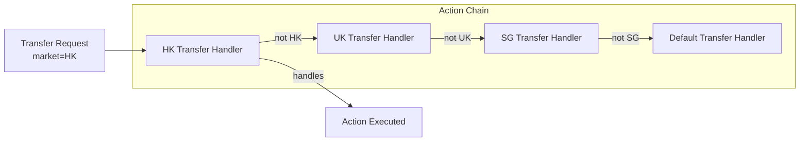
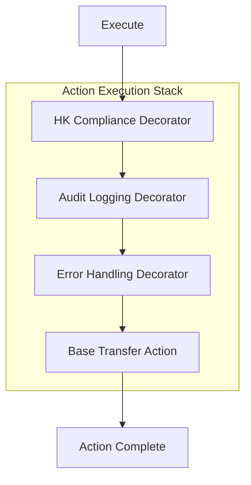

# Multi-Market Action Execution Design

> Version: 1.0 | Last Updated: 2026-09-12
> Status: Design Document (for evaluation)
> Author: AI Assistant

---

## 1. Background & Requirements

### 1.1 Problem Statement

The state machine executes Actions during state transitions. In a multi-market deployment, the same event (e.g., `SOURCE_INTERACTION_TRANSFERRED`) may need different execution logic per market:

- **HK**: Transfer via Genesys cloud API
- **UK**: Transfer via internal agent queue
- **SG**: Transfer via AI bot handoff
- **US**: Transfer via Genesys with different compliance checks

Additionally, markets may differ in:
- Pre-action validation rules
- Post-action cleanup logic
- Error handling and retry strategies
- Audit logging requirements
- Performance characteristics (timeouts, rate limits)

### 1.2 Key Question

> How should we design Action execution to support market-specific logic while maintaining code quality, reusability, and simplicity?

### 1.3 Design Principles

| Principle | Description |
|-----------|-------------|
| **Single Responsibility** | Each Action does one thing; market-specific logic is separated |
| **Open/Closed** | New markets should not require modifying existing Actions |
| **Composition over Inheritance** | Prefer composing behaviors rather than deep inheritance hierarchies |
| **Explicit Binding** | Action-to-market binding should be visible and auditable |
| **Testability** | Each market's Action behavior should be independently testable |
| **Performance** | No significant overhead from market abstraction |
| **Failure Isolation** | One market's Action failure should not affect other markets |

---

## 2. Solution Options

### 2.1 Option A: Config-Driven with ConditionalAction (Current)

#### 2.1.1 Overview

Each Action implements `ConditionalAction` with a `getCondition()` method. The condition checks market config to decide whether to execute. Market-specific logic is handled via if-else branches inside the Action.

#### 2.1.2 Architecture

```mermaid
flowchart TB
    subgraph Action["Single Action Implementation"]
        ACTION[SourceInteractionTransferredAction]
        CONDITION{getCondition()<br/>surveyEnabled?}
        IFELSE{if market == HK<br/>else if market == UK<br/>else}
    end

    subgraph Config["Market Config"]
        HK[HK: genesysEnabled=true]
        UK[UK: genesysEnabled=false]
    end

    ACTION --> CONDITION
    CONDITION -->|true| IFELSE
    IFELSE -->|HK| HK_LOGIC[Genesys transfer]
    IFELSE -->|UK| UK_LOGIC[Internal queue]
    IFELSE -->|SG| SG_LOGIC[AI bot handoff]
    HK --> HK_LOGIC
    UK --> UK_LOGIC
```

#### 2.1.3 Implementation Example

```java
@Component
@HandlesFact(ConversationFact.SOURCE_INTERACTION_TRANSFERRED)
public class SourceInteractionTransferredAction implements ConditionalAction<CbolStateContext> {
    
    @Override
    public Condition<CbolStateContext> getCondition() {
        return ctx -> ctx.marketConfig() != null 
            && ctx.marketConfig().transferEnabled();
    }
    
    @Override
    public void execute(CbolStateContext ctx) {
        String market = ctx.conversation().market();
        
        // Market-specific logic via if-else
        if ("HK".equals(market)) {
            executeGenesysTransfer(ctx);
        } else if ("UK".equals(market)) {
            executeInternalQueueTransfer(ctx);
        } else if ("SG".equals(market)) {
            executeAibotTransfer(ctx);
        } else {
            executeDefaultTransfer(ctx);
        }
    }
    
    private void executeGenesysTransfer(CbolStateContext ctx) { ... }
    private void executeInternalQueueTransfer(CbolStateContext ctx) { ... }
    private void executeAibotTransfer(CbolStateContext ctx) { ... }
    private void executeDefaultTransfer(CbolStateContext ctx) { ... }
}
```

#### 2.1.4 Pros & Cons

| Pros | Cons |
|------|------|
| ✅ Simple to understand | ❌ Action class grows with each market |
| ✅ No additional abstraction | ❌ Violates Open/Closed principle |
| ✅ Easy to debug (single class) | ❌ Hard to test market-specific logic in isolation |
| ✅ Low overhead | ❌ Code duplication across Actions |
| ✅ Good for 2-3 markets | ❌ Becomes unmaintainable with 5+ markets |
| ✅ Already implemented | ❌ Market names leak into core code |

#### 2.1.5 Best For

Projects with **2-3 markets** and simple market differences. **Not recommended** for scaling to 5+ markets.

---

### 2.2 Option B: Strategy Pattern

#### 2.2.1 Overview

Define a strategy interface for each Action category. Market-specific implementations are registered in a strategy registry. The Action delegates to the appropriate strategy based on market config.

#### 2.2.2 Architecture

```mermaid
flowchart TB
    subgraph Action["Action (Thin Wrapper)"]
        ACTION[SourceInteractionTransferredAction]
    end

    subgraph Strategy["Strategy Layer"]
        INTERFACE[TransferStrategy Interface]
        HK_STRATEGY[GenesysTransferStrategy]
        UK_STRATEGY[InternalQueueTransferStrategy]
        SG_STRATEGY[AibotTransferStrategy]
        DEFAULT_STRATEGY[DefaultTransferStrategy]
    end

    subgraph Registry["Strategy Registry"]
        REGISTRY[TransferStrategyRegistry]
        RESOLVE[resolve(marketConfig)]
    end

    ACTION --> REGISTRY
    REGISTRY --> RESOLVE
    RESOLVE --> HK_STRATEGY
    RESOLVE --> UK_STRATEGY
    RESOLVE --> SG_STRATEGY
    RESOLVE --> DEFAULT_STRATEGY
    HK_STRATEGY -.->|implements| INTERFACE
    UK_STRATEGY -.->|implements| INTERFACE
    SG_STRATEGY -.->|implements| INTERFACE
    DEFAULT_STRATEGY -.->|implements| INTERFACE
```

#### 2.2.3 Implementation Example

```java
// Strategy interface
public interface TransferStrategy {
    String getTransferTarget(); // "GENESYS", "INTERNAL_QUEUE", "AIBOT"
    void execute(CbolStateContext ctx);
    boolean isAvailable(CbolStateContext ctx);
}

// HK strategy
@Component
public class GenesysTransferStrategy implements TransferStrategy {
    @Override
    public String getTransferTarget() { return "GENESYS"; }
    
    @Override
    public void execute(CbolStateContext ctx) {
        // Genesys-specific transfer logic
    }
    
    @Override
    public boolean isAvailable(CbolStateContext ctx) {
        return ctx.marketConfig().genesysEnabled()
            && ctx.marketConfig().genesysOrgId() != null;
    }
}

// Action delegates to strategy
@Component
@HandlesFact(ConversationFact.SOURCE_INTERACTION_TRANSFERRED)
public class SourceInteractionTransferredAction implements ConditionalAction<CbolStateContext> {
    
    private final TransferStrategyRegistry strategyRegistry;
    
    @Override
    public void execute(CbolStateContext ctx) {
        TransferStrategy strategy = strategyRegistry.resolve(ctx.marketConfig());
        strategy.execute(ctx);
    }
}
```

#### 2.2.4 Pros & Cons

| Pros | Cons |
|------|------|
| ✅ Clean separation of concerns | ❌ More classes to manage |
| ✅ Open/Closed compliant | ❌ Initial setup effort |
| ✅ Easy to test each strategy independently | ❌ Strategy explosion if overused |
| ✅ New market = add new strategy | ❌ Need to define strategy interfaces |
| ✅ Strategies are reusable | ❌ Slight indirection overhead |
| ✅ Market-specific logic isolated | ❌ Not suitable for one-off market differences |

#### 2.2.5 Best For

Projects with **3+ markets** and well-defined algorithmic differences (transfer, survey, routing). **Recommended** for our scenario.

---

### 2.3 Option C: Action Registry with Market-Specific Actions

#### 2.3.1 Overview

Each market can register its own Action implementation for the same event. The Action registry resolves the appropriate Action based on market code. Falls back to default Action if no market-specific one exists.

#### 2.3.2 Architecture

```mermaid
flowchart TB
    subgraph Registry["Market-Aware Action Registry"]
        REGISTRY[MarketAwareActionRegistry]
        RESOLVE[resolve(fact, market)]
    end

    subgraph Actions["Action Implementations"]
        DEFAULT[DefaultSourceInteractionTransferredAction]
        HK[HKSourceInteractionTransferredAction]
        UK[UKSourceInteractionTransferredAction]
    end

    subgraph Factory["State Machine Factory"]
        FACTORY[ConversationStateMachineFactory]
    end

    FACTORY --> REGISTRY
    REGISTRY --> RESOLVE
    RESOLVE -->|market=HK| HK
    RESOLVE -->|market=UK| UK
    RESOLVE -->|market=SG or default| DEFAULT
```

#### 2.3.3 Implementation Example

```java
// Market-specific Action annotation
@Target(ElementType.TYPE)
@Retention(RetentionPolicy.RUNTIME)
public @interface MarketSpecificAction {
    String market();
    ConversationFact fact();
}

// HK-specific Action
@Component
@MarketSpecificAction(market = "HK", fact = ConversationFact.SOURCE_INTERACTION_TRANSFERRED)
public class HKSourceInteractionTransferredAction implements Action<CbolStateContext> {
    @Override
    public void execute(CbolStateContext ctx) {
        // HK-specific transfer logic with compliance checks
    }
}

// Default Action
@Component
@HandlesFact(ConversationFact.SOURCE_INTERACTION_TRANSFERRED)
public class DefaultSourceInteractionTransferredAction implements Action<CbolStateContext> {
    @Override
    public void execute(CbolStateContext ctx) {
        // Default transfer logic
    }
}

// Registry resolves by market
public class MarketAwareActionRegistry {
    private final Map<String, Map<ConversationFact, Action<CbolStateContext>>> marketActions = new ConcurrentHashMap<>();
    private final Map<ConversationFact, Action<CbolStateContext>> defaultActions = new ConcurrentHashMap<>();
    
    public Action<CbolStateContext> resolve(ConversationFact fact, String market) {
        if (market != null && marketActions.containsKey(market)) {
            Action<CbolStateContext> action = marketActions.get(market).get(fact);
            if (action != null) {
                return action;
            }
        }
        return defaultActions.get(fact);
    }
}
```

#### 2.3.4 Pros & Cons

| Pros | Cons |
|------|------|
| ✅ Maximum flexibility per market | ❌ Code duplication across market Actions |
| ✅ Complete isolation of market logic | ❌ Hard to share common logic |
| ✅ Easy to understand binding | ❌ Many similar Action classes |
| ✅ No if-else in Actions | ❌ Global changes require updating N Actions |
| ✅ Market can completely override behavior | ❌ Drift risk between market Actions |
| ✅ Good for highly divergent markets | ❌ Not suitable for markets with 80%+ similarity |

#### 2.3.5 Best For

Projects with **highly divergent markets** (<50% similarity) where each market needs fundamentally different Action logic. **Not recommended** for our scenario.

---

### 2.4 Option D: Chain of Responsibility

#### 2.4.1 Overview

Multiple Action handlers are chained together. Each handler checks if it can handle the request for the given market. If not, it passes to the next handler in the chain.

#### 2.4.2 Architecture



#### 2.4.3 Implementation Example

```java
public abstract class TransferHandler {
    protected TransferHandler next;
    
    public void setNext(TransferHandler next) {
        this.next = next;
    }
    
    public void handle(CbolStateContext ctx) {
        if (canHandle(ctx)) {
            doHandle(ctx);
        } else if (next != null) {
            next.handle(ctx);
        }
    }
    
    protected abstract boolean canHandle(CbolStateContext ctx);
    protected abstract void doHandle(CbolStateContext ctx);
}

@Component
public class HKTransferHandler extends TransferHandler {
    @Override
    protected boolean canHandle(CbolStateContext ctx) {
        return "HK".equals(ctx.conversation().market());
    }
    
    @Override
    protected void doHandle(CbolStateContext ctx) {
        // HK transfer logic
    }
}

// Action uses the chain
@Component
@HandlesFact(ConversationFact.SOURCE_INTERACTION_TRANSFERRED)
public class SourceInteractionTransferredAction implements Action<CbolStateContext> {
    private final TransferHandler chain;
    
    @Override
    public void execute(CbolStateContext ctx) {
        chain.handle(ctx);
    }
}
```

#### 2.4.4 Pros & Cons

| Pros | Cons |
|------|------|
| ✅ Flexible ordering of handlers | ❌ Hard to debug (which handler executed?) |
| ✅ Easy to add new markets | ❌ Chain ordering can be fragile |
| ✅ Decouples senders from receivers | ❌ Not suitable for parallel execution |
| ✅ Good for middleware-like behavior | ❌ Overkill for simple market routing |
| ✅ Supports fallback naturally | ❌ Performance: O(n) chain traversal |

#### 2.4.5 Best For

**Middleware, logging, validation** cross-cutting concerns. **Not ideal** for market-specific business logic.

---

### 2.5 Option E: Composite / Decorator Pattern

#### 2.5.1 Overview

Base Action contains common logic. Market-specific decorators wrap the base Action to add market-specific behavior before/after execution.

#### 2.5.2 Architecture



#### 2.5.3 Implementation Example

```java
// Base Action
@Component
@HandlesFact(ConversationFact.SOURCE_INTERACTION_TRANSFERRED)
public class BaseTransferAction implements Action<CbolStateContext> {
    @Override
    public void execute(CbolStateContext ctx) {
        // Common transfer logic
    }
}

// Market-specific decorator
public class HKComplianceDecorator implements Action<CbolStateContext> {
    private final Action<CbolStateContext> delegate;
    
    public HKComplianceDecorator(Action<CbolStateContext> delegate) {
        this.delegate = delegate;
    }
    
    @Override
    public void execute(CbolStateContext ctx) {
        // Pre-action: HK compliance check
        performHKComplianceCheck(ctx);
        
        // Execute base action
        delegate.execute(ctx);
        
        // Post-action: HK audit logging
        logHKAudit(ctx);
    }
}

// Factory builds decorated Action per market
public class MarketActionFactory {
    public Action<CbolStateContext> createTransferAction(String market) {
        Action<CbolStateContext> action = baseTransferAction;
        
        if ("HK".equals(market)) {
            action = new HKComplianceDecorator(action);
        }
        action = new AuditLoggingDecorator(action);
        action = new ErrorHandlingDecorator(action);
        
        return action;
    }
}
```

#### 2.5.4 Pros & Cons

| Pros | Cons |
|------|------|
| ✅ Excellent for cross-cutting concerns | ❌ Can be over-engineered |
| ✅ Single Responsibility | ❌ Complex to configure per market |
| ✅ Open/Closed compliant | ❌ Hard to understand full behavior |
| ✅ Reusable decorators across Actions | ❌ Ordering matters |
| ✅ Easy to add/remove behaviors | ❌ Not suitable for fundamentally different logic |
| ✅ Great for logging, metrics, security | ❌ Debugging can be tricky |

#### 2.5.5 Best For

**Cross-cutting concerns** (logging, metrics, security, error handling) that apply to all or specific markets. **Complements** Strategy Pattern, doesn't replace it.

---

## 3. Best Practices Analysis

### 3.1 Industry Best Practices

#### 3.1.1 Strategy Pattern (GoF)

**When to use**: Multiple related algorithms differ only in implementation.
**Relevance**: Perfect for market-specific transfer/survey/routing logic.
**Key Takeaways**:
- Strategies should be stateless
- Use a registry/factory for strategy resolution
- Don't create strategies for one-off differences

#### 3.1.2 Dependency Injection & Auto-Configuration (Spring)

**When to use**: Managing multiple implementations of an interface.
**Relevance**: Auto-discover and register market-specific strategies.
**Key Takeaways**:
- Use `@Component` + interface for auto-discovery
- Use `@Qualifier` or custom annotations for disambiguation
- Consider `List<Strategy>` injection for registry population

#### 3.1.3 Feature Toggles (Martin Fowler)

**When to use**: Controlling behavior without code deployment.
**Relevance**: Simple market differences (enable/disable features).
**Key Takeaways**:
- Use for binary on/off decisions
- Don't use for complex algorithmic differences
- Have a toggle retirement plan

#### 3.1.4 Plugin Architecture (Eclipse, Jenkins)

**When to use**: Third-party or market-specific extensions.
**Relevance**: Market-specific Action extensions.
**Key Takeaways**:
- Define clear extension points (interfaces)
- Use service loader or DI for discovery
- Sandbox extensions for failure isolation

#### 3.1.5 Pipeline / Middleware Pattern (Express.js, ASP.NET)

**When to use**: Cross-cutting concerns around core logic.
**Relevance**: Logging, validation, error handling around Actions.
**Key Takeaways**:
- Use for pre/post processing
- Keep middleware independent of business logic
- Order middleware explicitly

### 3.2 Anti-Patterns to Avoid

| Anti-Pattern | Description | Why It's Bad |
|--------------|-------------|--------------|
| **God Action** | One Action with 500+ lines handling all markets | Hard to maintain, test, and understand |
| **Market If-Else Hell** | Nested if-else for market logic | Fragile, hard to extend, violates Open/Closed |
| **Copy-Paste Actions** | Duplicate Action per market | Drift, inconsistency, high maintenance |
| **Strategy Explosion** | Strategy for every tiny difference | Too many classes, hard to navigate |
| **Leaky Market Names** | Market names hardcoded in core code | Core becomes polluted, hard to add markets |
| **Over-Abstraction** | 3 layers of indirection for simple logic | Hard to understand, performance overhead |

### 3.3 Recommended Hybrid Approach

Based on best practices, we recommend a **layered approach**:

```
┌─────────────────────────────────────────────────────────┐
│                 Action Execution Stack                    │
├─────────────────────────────────────────────────────────┤
│                                                           │
│  Layer 1: ConditionalAction (Feature Toggles)             │
│  ─ Simple on/off based on market config                   │
│  ─ surveyEnabled, transferEnabled, genesysEnabled         │
│                                                           │
│  Layer 2: Strategy Pattern (Algorithmic Differences)      │
│  ─ TransferStrategy, SurveyStrategy, RoutingStrategy      │
│  ─ Resolved by market config (transferTarget, surveyType) │
│                                                           │
│  Layer 3: Decorators (Cross-Cutting Concerns)             │
│  ─ AuditLogging, ErrorHandling, Metrics                   │
│  ─ Applied to all Actions or specific markets             │
│                                                           │
│  Layer 4: Market Extensions (Truly Unique Logic)          │
│  ─ HKRegulatoryAudit, UKGdprRetention                     │
│  ─ Only for markets with unique requirements              │
│                                                           │
└─────────────────────────────────────────────────────────┘
```

**Decision Tree**:
```
Is it a simple on/off feature?
├─ Yes → Layer 1: ConditionalAction + Config
└─ No
   ├─ Is it a different algorithm for the same step?
   │  ├─ Yes → Layer 2: Strategy Pattern
   │  └─ No
   │     ├─ Is it cross-cutting (logging, security)?
   │     │  ├─ Yes → Layer 3: Decorators
   │     │  └─ No
   │     │     ├─ Is it truly unique to one market?
   │     │     │  ├─ Yes → Layer 4: Market Extensions
   │     │     │  └─ No → Reconsider, maybe it's not needed
```

---

## 4. Solution Comparison Matrix

### 4.1 Quantitative Comparison

| Criteria | Weight | Option A (Config) | Option B (Strategy) | Option C (Registry) | Option D (Chain) | Option E (Decorator) | Hybrid |
|----------|--------|-------------------|---------------------|---------------------|------------------|----------------------|--------|
| **Code Reuse** | 15% | 5/10 | 9/10 | 4/10 | 7/10 | 8/10 | 9/10 |
| **Flexibility** | 15% | 4/10 | 8/10 | 10/10 | 7/10 | 9/10 | 9/10 |
| **Maintainability** | 20% | 5/10 | 9/10 | 4/10 | 6/10 | 8/10 | 9/10 |
| **New Market Effort** | 15% | 7/10 | 3/10 | 8/10 | 4/10 | 5/10 | 4/10 |
| **Testability** | 10% | 5/10 | 9/10 | 7/10 | 6/10 | 8/10 | 9/10 |
| **Simplicity** | 10% | 9/10 | 7/10 | 6/10 | 5/10 | 5/10 | 7/10 |
| **Performance** | 5% | 9/10 | 8/10 | 9/10 | 5/10 | 7/10 | 7/10 |
| **Failure Isolation** | 5% | 3/10 | 7/10 | 9/10 | 6/10 | 8/10 | 8/10 |
| **Scalability (5+ markets)** | 5% | 2/10 | 9/10 | 6/10 | 5/10 | 8/10 | 9/10 |
| **Weighted Score** | 100% | **5.55** | **8.15** | **6.25** | **5.95** | **7.35** | **8.35** |

### 4.2 Qualitative Comparison

| Aspect | Option A | Option B | Option C | Option D | Option E | Hybrid |
|--------|----------|----------|----------|----------|----------|--------|
| **Lines of code (4 markets)** | ~500 | ~350 | ~800 | ~400 | ~450 | ~400 |
| **Classes to manage** | 1 | 5-8 | 8-12 | 5-6 | 6-8 | 8-10 |
| **Learning curve** | Low | Medium | Medium | Medium | High | Medium |
| **Refactor effort from current** | 0 | Medium | High | High | Medium | Medium |
| **Risk of over-engineering** | Low | Medium | Low | High | High | Medium |

---

## 5. Recommended Implementation Roadmap

### Phase 1: Foundation (✅ Done)

- [x] ConditionalAction pattern for feature toggles
- [x] TransferStrategy interface + 3 implementations
- [x] TransferStrategyRegistry with auto-discovery

### Phase 2: Strategy Pattern Expansion (2-3 days)

- [ ] Implement `SurveyStrategy` for CSAT/NPS/CES
- [ ] Implement `EndingStrategy` for market-specific ending behavior
- [ ] Implement `RoutingStrategy` for market-specific routing
- [ ] Update existing Actions to use strategies
- [ ] Add unit tests for each strategy

### Phase 3: Decorator Pattern (2-3 days)

- [ ] Implement `AuditLoggingActionDecorator`
- [ ] Implement `ErrorHandlingActionDecorator`
- [ ] Implement `MetricsActionDecorator`
- [ ] Implement `MarketSpecificDecorator` (for HK/UK specific)
- [ ] Create `ActionDecoratorFactory` to build decorated Actions

### Phase 4: Market Extension Points (3-5 days)

- [ ] Define `MarketActionExtension` interface
- [ ] Implement `ExtensionRegistry` with auto-discovery
- [ ] Add before/after execution hooks
- [ ] Implement HK regulatory audit extension (example)
- [ ] Implement UK GDPR retention extension (example)

### Phase 5: Optimization & Tooling (1-2 weeks)

- [ ] Action execution tracing per market
- [ ] Strategy performance monitoring
- [ ] Market-specific Action test matrix generator
- [ ] Documentation for adding new market Actions

---

## 6. Risk Assessment & Mitigation

| Risk | Likelihood | Impact | Mitigation |
|------|-----------|--------|------------|
| **Strategy explosion** | Medium | Medium | Limit to 3-5 core strategy types. Use config for simple variations. |
| **Decorator over-use** | Medium | Medium | Use decorators only for cross-cutting concerns. Don't use for business logic. |
| **Hard to debug** | Medium | Medium | Add execution tracing. Log which strategy/decorator executed. |
| **Performance overhead** | Low | Low | Strategies are singletons. Decorator overhead is minimal. Cache resolved strategies. |
| **Market names leak** | Medium | Medium | Use config values (transferTarget) not market names for strategy resolution. |
| **Testing complexity** | Medium | Medium | Test each strategy independently. Use parameterized tests for market matrix. |
| **Migration effort** | Medium | Low | Incremental migration. Start with TransferStrategy (done), then Survey, etc. |

---

## 7. Code Examples

### 7.1 Recommended: Strategy + ConditionalAction

```java
// Step 1: Define strategy interface
public interface SurveyStrategy {
    String getSurveyType(); // "CSAT", "NPS", "CES"
    void execute(CbolStateContext ctx);
}

// Step 2: Implement strategies
@Component
public class CsatSurveyStrategy implements SurveyStrategy { ... }

@Component
public class NpsSurveyStrategy implements SurveyStrategy { ... }

// Step 3: Action uses strategy + condition
@Component
@HandlesFact(ConversationFact.SURVEY_SUBMITTED)
public class SurveySubmittedAction implements ConditionalAction<CbolStateContext> {
    
    private final SurveyStrategyRegistry strategyRegistry;
    
    @Override
    public Condition<CbolStateContext> getCondition() {
        return ctx -> ctx.marketConfig() != null
            && ctx.marketConfig().surveyEnabled();
    }
    
    @Override
    public void execute(CbolStateContext ctx) {
        SurveyStrategy strategy = strategyRegistry.resolve(ctx.marketConfig());
        strategy.execute(ctx);
    }
}
```

### 7.2 Advanced: Strategy + Decorator

```java
// Build decorated action with market-specific behavior
public Action<CbolStateContext> buildAction(ConversationFact fact, String market) {
    Action<CbolStateContext> action = baseActionRegistry.get(fact);
    
    // Market-specific decorators
    if ("HK".equals(market)) {
        action = new HKComplianceDecorator(action);
    }
    
    // Common decorators
    action = new AuditLoggingDecorator(action);
    action = new ErrorHandlingDecorator(action);
    action = new MetricsDecorator(action);
    
    return action;
}
```

---

## 8. Conclusion

### 8.1 Recommendation

**Adopt the Hybrid Approach** (Strategy Pattern as core, supported by ConditionalAction and Decorators):

1. **Layer 1: ConditionalAction** — Simple feature toggles (already implemented)
2. **Layer 2: Strategy Pattern** — Algorithmic differences (Transfer done, Survey/Ending next)
3. **Layer 3: Decorators** — Cross-cutting concerns (logging, metrics, error handling)
4. **Layer 4: Market Extensions** — Truly unique market logic (regulatory, compliance)

**Avoid**:
- ❌ Option A's if-else hell for 4+ markets
- ❌ Option C's complete Action duplication
- ❌ Option D's chain for simple market routing

### 8.2 Expected Outcomes

| Metric | Target |
|--------|--------|
| Action classes per market | 1 base + N strategies (not N copies) |
| New market Action effort | < 1 day (add strategies + config) |
| Code duplication | < 10% |
| Strategy types | 3-5 core types |
| Test coverage per strategy | > 80% |

### 8.3 Next Steps

1. ✅ **Phase 1 complete** — TransferStrategy implemented
2. 📋 **Implement Phase 2** — SurveyStrategy, EndingStrategy, RoutingStrategy
3. 📋 **Implement Phase 3** — Decorator pattern for cross-cutting concerns
4. 📋 **Pilot with HK and UK** — Validate the approach
5. 📋 **Refine based on feedback**

---

## 9. References

### 9.1 Internal References

- `04-Usage-Guide.md` — ConditionalAction usage
- `05-Advanced-Features.md` — Exception handling, Action patterns
- `09-Multi-Market-Architecture-Design.md` — Overall multi-market architecture

### 9.2 External References

- **GoF Design Patterns** — Strategy, Decorator, Chain of Responsibility
- **Martin Fowler — Feature Toggles** — https://martinfowler.com/articles/feature-toggles.html
- **Spring Framework — Dependency Injection** — https://spring.io/
- **Refactoring.Guru — Strategy Pattern** — https://refactoring.guru/design-patterns/strategy
- **Microsoft — Plugin Architecture** — https://learn.microsoft.com/

---

*Document created: 2026-09-12*
*Next review: After Phase 2 implementation*
