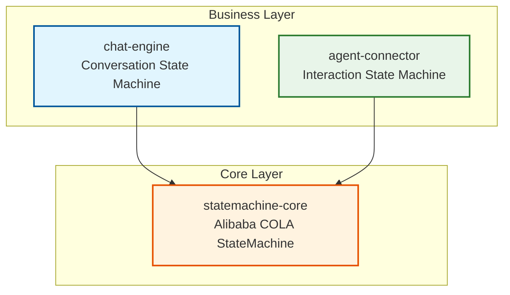
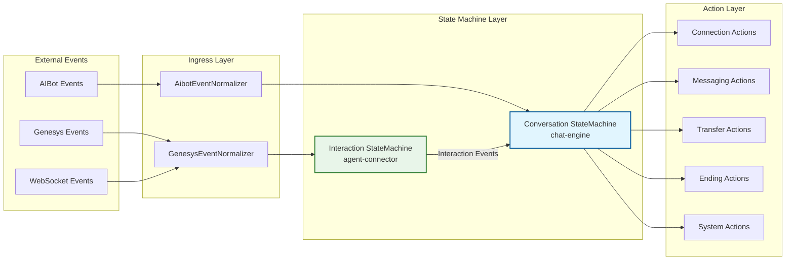

# State Machine Documentation

> Design documents and usage guides for the Multi-Module State Machine project powered by Alibaba COLA StateMachine.

## Document Index

| # | Document | Description |
|---|----------|-------------|
| 00 | [Architecture Overview](./00-Architecture-Overview.md) | High-level architecture, multi-module structure, design principles, package structure, key decisions |
| 01 | [State Machine Core Design](./01-State-Machine-Core-Design.md) | Core framework based on Alibaba COLA StateMachine: Action, Condition, State, Transition, Builder DSL, StateMachineFactory, performance characteristics |
| 02 | [Business Layer Design](./02-CBOL-Business-Layer-Design.md) | chat-engine (Conversation SM) + agent-connector (Interaction SM): states/events, contexts, multi-market config, monitors, services, connectors |
| 03 | [State Transition Diagrams](./03-State-Transition-Diagrams.md) | Mermaid state diagrams, transition tables, monitor flowcharts, event classification, default config |
| 04 | [Usage Guide](./04-Usage-Guide.md) | Quick start, COLA Builder DSL, multi-market, monitors, async actions, error handling, testing, best practices, Spring Boot integration, Demo usage |
| 05 | [Advanced Features](./05-Advanced-Features.md) | Persistence & optimistic locking, build-time validation, idempotency, metrics, event sourcing, resilience/failure handling, timeout events, failover, decorator composition |
| 06 | [Multi-Market Design](./06-Multi-Market-Design.md) | Multi-market architecture: config control vs per-market vs hybrid, market-aware guards/actions/extensions, implementation roadmap, risk assessment |
| 07 | [Multi-Market Best Practices](./07-Multi-Market-Best-Practices/README.md) | 8 detailed best practice guides: three-layer config inheritance, market diff visualization, routing & isolation, config-as-code GitOps, canary release, circuit breaker & degradation, schema validation, test matrix |

## Project Architecture

### Module Dependency Diagram



### Event-Driven Orchestration Flow



## Changelog

### v4.0 (2026-09-05)
- **Event-Driven Orchestration Design (v4.0)**: Aligned both state machines with the latest design document
- **chat-engine refactoring**:
  - Updated ConversationState: 7 states (NEW, INITIATED, ACTIVE, IN_PROGRESS, TRANSFERRED, ENDING, CLOSED) — added ACTIVE, removed ERROR
  - Updated ConversationFact: 25+ events aligned with ConversationFactEvent definition
  - Rewrote ConversationStateMachineFactory with new state transitions
  - Created 13 new action classes categorized by lifecycle/transfer/ending/system
  - Deleted 15 old action classes
  - Updated monitors, normalizer, demo, and tests
- **agent-connector refactoring**:
  - Updated InteractionState: 8 states (INITIATED, CONNECTED, IN_PROGRESS, DEGRADED, RECONNECTING, CONSULT_TRANSFER, TRANSFERRED, CLOSED)
  - Updated InteractionFact: 20+ events aligned with InteractionFactEvent definition
  - Rewrote InteractionStateMachineFactory with 30+ state transitions
  - Created 14 new action classes categorized by connection/messaging/heartbeat/reconnection/genesys/transfer/ending/system
  - Deleted 9 old action classes
  - Updated GenesysEventNormalizer, demo, and InteractionInstance (added withState method)
  - Added InteractionStateMachineTest with 21 test cases
- **Test results**: All 69 tests pass (48 chat-engine + 21 agent-connector), BUILD SUCCESS

### v3.0 (2026-09-04)
- **Core engine replacement**: Replaced custom state machine implementation with Alibaba COLA StateMachine (`com.alibaba.cola.statemachine`)
  - COLA GitHub: https://github.com/alibaba/COLA
  - State machine module: `cola-components/cola-component-statemachine`
  - Package: `com.alibaba.cola.statemachine`
- **API changes**:
  - `StateMachine.fireEvent(S sourceState, E event, C ctx)` returns target state `S` directly
  - `Action.execute(S from, S to, E event, C context)` — COLA Action interface
  - Builder API: `StateMachineBuilderFactory.create()` + `externalTransition()` + `from().to().on().when().perform()`
  - State machine registration: `StateMachineFactory.register(sm)` / `StateMachineFactory.get(machineId)`
- **chat-engine adaptation**:
  - 7 Action implementations directly implement COLA `Action<ConversationState, ConversationFact, CbolStateContext>`
  - `ConversationStateMachineFactory` rewritten with COLA Builder API
  - `ChatEngineStateMachineService.fire()` returns `ConversationState`
  - Added factory caching mechanism to prevent duplicate state machine building
- **agent-connector adaptation**:
  - 9 Action implementations directly implement COLA `Action<InteractionState, InteractionFact, AgentConnectorStateContext>`
  - `InteractionStateMachineFactory` rewritten with COLA Builder API
  - `AgentConnectorStateMachineService` rewritten with COLA API
  - Added factory caching mechanism in `create()` method
- **Test results**: All tests pass (chat-engine: 36 tests, statemachine-core: 219 COLA tests)
- **Removed**: Custom `StateMachineRegistry`, `StateContext`, `CbolAction` interface, custom persistence layer

### v2.4 (2026-09-03)
- **Registry refactoring (Scheme A)**:
  - Added `getInstance()` static method to `StateMachineRegistry` in statemachine-core for global singleton access
  - Removed duplicate business-layer registry classes
  - Updated all business code to use `StateMachineRegistry.getInstance()` directly

### v2.3 (2026-09-03)
- **Code quality fixes (P0)**:
  - Fixed parameter naming in 3 Monitor classes
  - Fixed outdated Javadoc in CustomerIdleMonitor
- **ActionWorker improvements (P1)**:
  - Added `submitWithResult()` method returning `CompletableFuture<Void>`
  - Added `submitWithCallback()` method with success/failure callbacks

### v2.2 (2026-09-03)
- **State rename**: `ACTIVE` → `IN_PROGRESS`
- **Removed state**: `SURVEY_IN_PROGRESS` — survey is now an internal sub-phase within `IN_PROGRESS`
- **New state**: `NEW` — initial state, conversation record created but not initialized
- **Survey redesign**: `SURVEY_START` is now an internal transition (`IN_PROGRESS → IN_PROGRESS`)

### v2.1 (2026-09-03)
- Added Action-First Transition design principle
- Added 6 concrete action implementations

## Multi-Module Structure

```
state-machine/
├── pom.xml                          # Parent POM (packaging=pom)
├── statemachine-core/               # Alibaba COLA StateMachine core engine
│   └── com.alibaba.cola.statemachine
├── chat-engine/                     # Conversation state machine (business layer)
│   └── com.selfdevelopment.chatengine
├── agent-connector/                 # Interaction state machine (channel layer)
│   └── com.selfdevelopment.agentconnector
└── docs/                            # This documentation
```

### Module Responsibilities

| Module | Package | Responsibility |
|--------|---------|----------------|
| **statemachine-core** | `com.alibaba.cola.statemachine` | Alibaba COLA StateMachine core engine: Action, Condition, State, Transition, Builder, StateMachineFactory, StateMachineException |
| **chat-engine** | `com.selfdevelopment.chatengine` | Conversation state machine: 7 states (NEW, INITIATED, ACTIVE, IN_PROGRESS, TRANSFERRED, ENDING, CLOSED), 25+ events, 13 actions, multi-market config, monitors, repository, demo |
| **agent-connector** | `com.selfdevelopment.agentconnector` | Interaction state machine: 8 states (INITIATED, CONNECTED, IN_PROGRESS, DEGRADED, RECONNECTING, CONSULT_TRANSFER, TRANSFERRED, CLOSED), 20+ events, 14 actions, channel connectors, demo |

## Key Design Principles

1. **Action-First Transition with Exception Handling**: Actions are executed synchronously before state transition. A flexible exception handling mechanism wraps all Actions with `ExceptionHandlingAction`, ensuring that **state transitions continue regardless of Action execution failures**. Exceptions are caught and handled by priority-based handlers, never blocking state changes.
2. **Stateless Engine**: The state machine engine only stores transition rules; current state is injected by the business layer.
3. **Table-Driven**: ConcurrentHashMap O(1) lookup for transitions.
4. **Generic Type-Safe**: COLA StateMachine uses generics for type-safe states, events, and contexts.
5. **Multi-Market Support**: Configuration-driven per-market behavior (HK, SG, UK, etc.).
6. **Independent State Machines**: Conversation and Interaction are independent state machines with separate contexts.
7. **Extensible Exception Handling**: Custom exception handlers can be added by implementing `ActionExceptionHandler` and annotating with `@Component`. Default handlers include DownstreamConnection (priority=100), Business (80), System (50), and Fallback (-100).
8. **ConditionalAction Pattern**: All Actions implement `ConditionalAction`, which extends COLA's `Action` with a built-in `getCondition()` method. Conditions are naturally bound to Actions, with a default `ALWAYS_TRUE` implementation. The factory auto-extracts conditions via `instanceof`, requiring zero configuration for simple actions.

## Quick Start

```java
// 1. Build the state machine (COLA Builder API)
StateMachineBuilder<ConversationState, ConversationFact, CbolStateContext> builder =
        StateMachineBuilderFactory.create();

builder.externalTransition()
        .from(ConversationState.NEW)
        .to(ConversationState.INITIATED)
        .on(ConversationFact.SESSION_STARTED)
        .perform(new SessionStartedAction());

StateMachine<ConversationState, ConversationFact, CbolStateContext> sm =
        builder.build("conversation");
StateMachineFactory.register(sm);

// 2. Fire an event
CbolStateContext ctx = buildContext();
ConversationState newState = sm.fireEvent(ConversationState.NEW, ConversationFact.SESSION_STARTED, ctx);
```

## References

- Alibaba COLA StateMachine: https://github.com/alibaba/COLA
- COLA StateMachine module: `cola-components/cola-component-statemachine`

---

*Last updated: 2026-09-05 (v4.0 — Event-Driven Orchestration Design alignment)*
