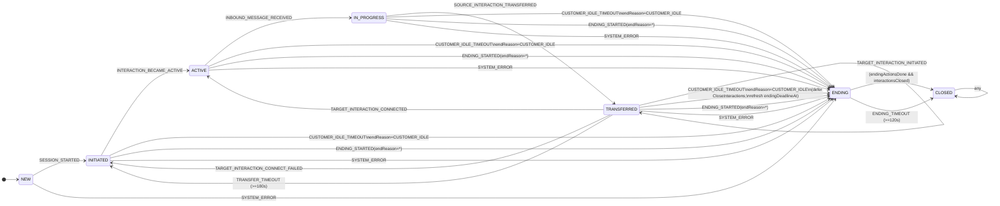
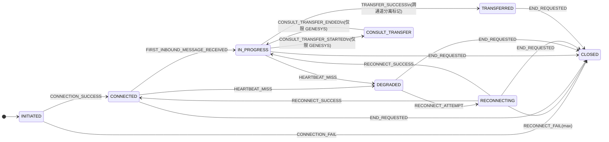
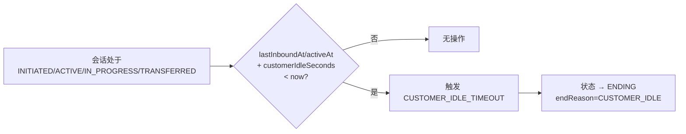
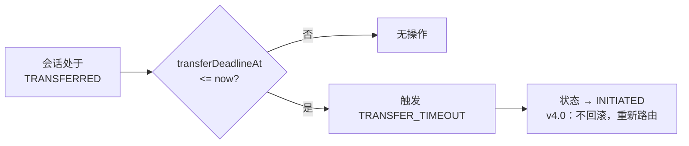
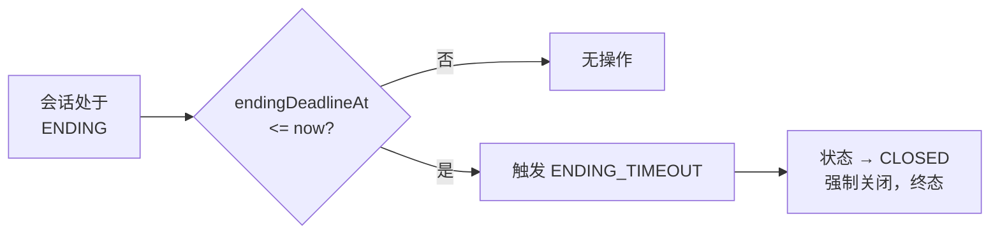
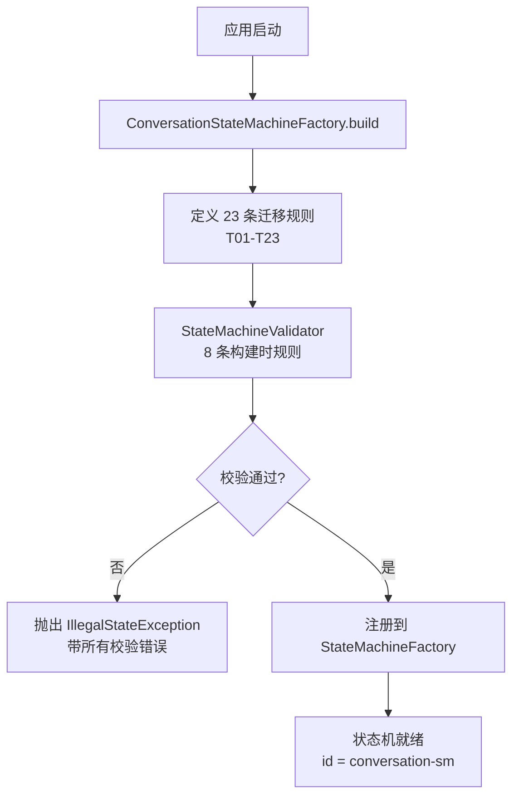
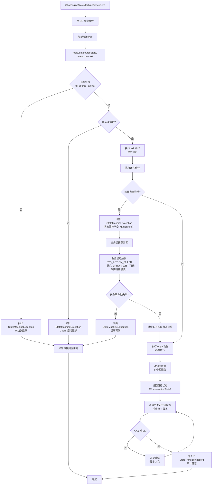

# 状态迁移图与迁移表

> 版本：4.0 | 最后更新：2026-09-05
> 对齐事件驱动编排设计（v4.0）

## 1. 会话状态机

### 1.1 完整状态图



> **满意度调查字段化在 ENDING 中**：满意度调查不再是独立状态。`SURVEY_SUBMITTED`、`SURVEY_TIMEOUT`、`SURVEY_SKIPPED` 是 ENDING 内的内部转换（ENDING → ENDING）。进入 ENDING 时如果 `surveyEligible=true`，会触发满意度调查。

> **转接失败不回滚**：当转接失败或超时时，Conversation 直接返回 INITIATED（不是 IN_PROGRESS）。这允许重新路由或使用回退策略。

### 1.2 迁移表

| ID | 源状态 | 事件 | 目标状态 | Guard | Action | 监控器 | 说明 |
|----|--------|------|---------|-------|--------|--------|------|
| T00 | NEW | CONVERSATION_INITIATED | INITIATED | - | ConversationInitAction | - | 初始化会话，验证配置，分配资源 |
| T01 | INITIATED | CUSTOMER_CONNECT | IN_PROGRESS | - | CustomerConnectAction | - | 客户建立连接 |
| T02 | IN_PROGRESS | TRANSFER_REQUEST | TRANSFERRED | transferEnabled | TransferRequestAction | - | 请求人工客服 |
| T03 | TRANSFERRED | TRANSFER_CONNECTED | IN_PROGRESS | - | - | - | 预留未来使用 |
| T04 | TRANSFERRED | TRANSFER_FAILED | INITIATED | - | TransferFailedAction | - | **v6：不回滚到 IN_PROGRESS** |
| T05 | TRANSFERRED | TRANSFER_TIMEOUT | INITIATED | - | - | - | **v6：不回滚到 IN_PROGRESS** |
| T06 | IN_PROGRESS | CUSTOMER_CLOSE | ENDING | !surveyEnabled | CustomerCloseAction | - | 客户关闭，无满意度调查 |
| T07 | INITIATED | SYS_CUSTOMER_IDLE | ENDING | - | - | CustomerIdleMonitor | 连接前空闲 |
| T08 | IN_PROGRESS | SYS_CUSTOMER_IDLE | ENDING | - | - | CustomerIdleMonitor | 客户空闲超时 |
| T09 | TRANSFERRED | SYS_CUSTOMER_IDLE | ENDING | - | - | CustomerIdleMonitor | 转接期间空闲 |
| T10 | TRANSFERRED | SYS_TRANSFER_TIMEOUT | INITIATED | - | - | TransferMonitor | **v6：不回滚** |
| T11 | ENDING | SYS_ENDING_GRACE_TIMEOUT | CLOSED | - | - | EndingGraceMonitor | 终态转换 |
| T12 | IN_PROGRESS | SURVEY_START | IN_PROGRESS | surveyEnabled | SurveyStartAction | - | **内部转换：调查作为子阶段** |
| T13 | IN_PROGRESS | SURVEY_COMPLETE | ENDING | - | SurveyCompleteAction | - | 满意度调查正常完成 |
| T14 | IN_PROGRESS | SYS_SURVEY_TIMEOUT | ENDING | - | - | SurveyTimeoutMonitor | 满意度调查超时 |
| T15 | NEW | SYS_ACTION_FAILED | ERROR | - | 记录错误，告警 | 业务层 | **故障转移：动作错误（业务层捕获 StateMachineException）** |
| T16 | INITIATED | SYS_ACTION_FAILED | ERROR | - | 记录错误，告警 | 业务层 | **故障转移：动作错误（业务层捕获 StateMachineException）** |
| T17 | IN_PROGRESS | SYS_ACTION_FAILED | ERROR | - | 记录错误，告警 | 业务层 | **故障转移：动作错误（业务层捕获 StateMachineException）** |
| T18 | TRANSFERRED | SYS_ACTION_FAILED | ERROR | - | 记录错误，告警 | 业务层 | **故障转移：动作错误（业务层捕获 StateMachineException）** |
| T19 | ENDING | SYS_ACTION_FAILED | ERROR | - | 记录错误，告警 | 业务层 | **故障转移：动作错误（业务层捕获 StateMachineException）** |
| T20 | ERROR | SYS_RETRY | IN_PROGRESS | - | 重新初始化资源 | - | 手动或系统重试 |
| T21 | ERROR | SYS_ABORT | CLOSED | - | 清理，通知 | - | 不可恢复的错误 |

### 1.3 状态进入/退出动作

| 状态 | 进入动作 | 退出动作 |
|------|---------|---------|
| NEW | （无） | ConversationInitAction（在 CONVERSATION_INITIATED 时） |
| INITIATED | （无） | CustomerConnectAction（在 CUSTOMER_CONNECT 时） |
| IN_PROGRESS | 发送欢迎消息（预留） | 通知通道（预留） |
| TRANSFERRED | 发起转接请求 | 取消待处理转接（预留） |
| ENDING | 启动宽限期计时器 | （无） |
| ERROR | 记录错误，告警值班人员，捕获诊断信息 | 清除错误状态 |
| CLOSED | 清理资源，归档会话 | （无，终态） |

**注意**：满意度调查相关动作（SurveyStartAction、SurveyCompleteAction）是 `IN_PROGRESS` 内的转换动作，而不是状态进入/退出动作，因为调查是 `IN_PROGRESS` 的内部子阶段。

## 2. Interaction 状态机

### 2.1 状态

```java
## 2. 交互状态机

### 2.1 状态（InteractionState）

```java
public enum InteractionState {
    INITIATED,          // 连接已发起，等待连接结果
    CONNECTED,          // 连接已建立，准备进行消息传递
    IN_PROGRESS,        // 活跃消息传递（已收到第一条入站消息）
    DEGRADED,           // 连接降级（心跳丢失，临时问题）
    RECONNECTING,       // 重连进行中
    CONSULT_TRANSFER,   // 仅限 GENESYS：咨询转接
    TRANSFERRED,        // 跨通道源端分离标记
    CLOSED              // 通道已终止（终态）
}
```

### 2.2 事件（InteractionFact）

```java
public enum InteractionFact {
    // 连接生命周期
    CONNECTION_SUCCESS, CONNECTION_FAIL,
    // 消息传递
    FIRST_INBOUND_MESSAGE_RECEIVED, INBOUND_MESSAGE_RECEIVED, OUTBOUND_MESSAGE_SENT,
    // 心跳与降级
    HEARTBEAT_MISS, HEARTBEAT_RESTORED,
    // 重连
    RECONNECT_ATTEMPT, RECONNECT_SUCCESS, RECONNECT_FAIL,
    // genesys 咨询转接（仅限 GENESYS）
    CONSULT_TRANSFER_STARTED, CONSULT_TRANSFER_ENDED,
    // 跨通道转接（源端分离标记）
    TRANSFER_SUCCESS, TRANSFER_FAILED,
    // 结束
    END_REQUESTED, INTERACTION_CLOSED,
    // 系统
    SYSTEM_ERROR,
    // 下游可用性
    DOWNSTREAM_UNAVAILABLE
}
```

### 2.3 状态图



### 2.4 迁移表

| ID | 源状态 | 事件 | 目标状态 | Action | 说明 |
|----|--------|------|---------|--------|------|
| I01 | INITIATED | CONNECTION_SUCCESS | CONNECTED | ConnectionSuccessAction | 通道连接成功 |
| I02 | INITIATED | CONNECTION_FAIL | CLOSED | ConnectionFailAction | 连接失败（网络/认证） |
| I03 | CONNECTED | FIRST_INBOUND_MESSAGE_RECEIVED | IN_PROGRESS | FirstInboundMessageReceivedAction | 第一条入站消息，进入活跃消息传递 |
| I04 | IN_PROGRESS | INBOUND_MESSAGE_RECEIVED | IN_PROGRESS | （无 action） | 内部，更新 lastInboundAt |
| I05 | IN_PROGRESS | OUTBOUND_MESSAGE_SENT | IN_PROGRESS | （无 action） | 内部，仅审计 |
| I06 | CONNECTED | HEARTBEAT_MISS | DEGRADED | HeartbeatMissAction | 心跳丢失，进入降级 |
| I07 | IN_PROGRESS | HEARTBEAT_MISS | DEGRADED | HeartbeatMissAction | 心跳丢失，进入降级 |
| I08 | DEGRADED | HEARTBEAT_RESTORED | CONNECTED | HeartbeatRestoredAction | 心跳恢复，恢复到已连接 |
| I09 | DEGRADED | RECONNECT_ATTEMPT | RECONNECTING | ReconnectAttemptAction | 发起重连 |
| I10 | RECONNECTING | RECONNECT_SUCCESS | CONNECTED | ReconnectSuccessAction | 重连成功，恢复到已连接 |
| I11 | RECONNECTING | RECONNECT_SUCCESS | IN_PROGRESS | ReconnectSuccessAction | 重连成功，恢复到进行中 |
| I12 | RECONNECTING | RECONNECT_FAIL | CLOSED | ReconnectFailAction | 达到最大重连次数 |
| I13 | IN_PROGRESS | CONSULT_TRANSFER_STARTED | CONSULT_TRANSFER | ConsultTransferStartedAction | 仅限 GENESYS：咨询转接开始 |
| I14 | CONSULT_TRANSFER | CONSULT_TRANSFER_ENDED | IN_PROGRESS | ConsultTransferEndedAction | 仅限 GENESYS：咨询转接结束 |
| I15 | IN_PROGRESS | TRANSFER_SUCCESS | TRANSFERRED | TransferSuccessAction | 跨通道转接成功，源端分离 |
| I16 | IN_PROGRESS | TRANSFER_FAILED | IN_PROGRESS | （无 action） | 转接被拒绝，留在原通道 |
| I17 | CONNECTED | END_REQUESTED | CLOSED | EndRequestedAction | 主动关闭 |
| I18 | IN_PROGRESS | END_REQUESTED | CLOSED | EndRequestedAction | 主动关闭 |
| I19 | DEGRADED | END_REQUESTED | CLOSED | EndRequestedAction | 主动关闭 |
| I20 | RECONNECTING | END_REQUESTED | CLOSED | EndRequestedAction | 主动关闭 |
| I21 | TRANSFERRED | END_REQUESTED | CLOSED | EndRequestedAction | 转接后主动关闭 |
| I22 | 任意 | SYSTEM_ERROR | CLOSED | SystemErrorAction | 不可恢复的系统错误 |
| I23 | CONNECTED | DOWNSTREAM_UNAVAILABLE | DEGRADED | DownstreamUnavailableAction | 临时下游不可用 |
| I24 | IN_PROGRESS | DOWNSTREAM_UNAVAILABLE | DEGRADED | DownstreamUnavailableAction | 临时下游不可用 |

## 3. 监控器触发图

### 3.1 CustomerIdleMonitor



### 3.2 TransferMonitor



### 3.3 EndingMonitor


    D --> E[状态 → CLOSED<br/>终态]
```

## 4. 事件分类

### 4.1 按来源

| 类别 | 事件 | 来源 |
|------|------|------|
| 客户驱动 | CUSTOMER_CONNECT, CUSTOMER_CLOSE | 客户通过通道操作 |
| 客服驱动 | AGENT_ATTACHED, AGENT_CLOSE | 人工客服操作（预留） |
| 系统驱动 | TRANSFER_REQUEST, TRANSFER_FAILED, TRANSFER_TIMEOUT | 业务逻辑 / 集成 |
| 监控器驱动 | SYS_CUSTOMER_IDLE, SYS_TRANSFER_TIMEOUT, SYS_ENDING_GRACE_TIMEOUT | 定时监控器 |
| 满意度调查驱动 | SURVEY_COMPLETE | 会话后满意度调查（预留） |

### 4.2 按效果

| 效果 | 事件 |
|------|------|
| 状态推进（正常） | CUSTOMER_CONNECT, TRANSFER_REQUEST, CUSTOMER_CLOSE |
| 状态重置（v6） | TRANSFER_FAILED, TRANSFER_TIMEOUT, SYS_TRANSFER_TIMEOUT |
| 状态进入结束 | SYS_CUSTOMER_IDLE（从任何非终态） |
| 状态终止 | SYS_ENDING_GRACE_TIMEOUT |
| 无状态改变（内部） | （当前未定义） |

## 5. 默认市场配置

| 参数 | 默认值 | 描述 |
|------|--------|------|
| customerIdleSeconds | 300（5分钟） | 客户不活跃后自动关闭 |
| transferTimeoutSeconds | 180（3分钟） | 等待客服连接的最大时间 |
| endingGraceSeconds | 120（2分钟） | 最终关闭前的宽限期 |
| surveyEnabled | false | 是否发送会话后满意度调查 |
| transferEnabled | true | 是否允许人工客服转接 |
| genesysEnabled | false | Genesys 集成是否激活 |
| fallbackRoutingStrategy | "DROP" | 转接失败时的策略 |

## 6. 状态机生命周期

### 6.1 启动阶段



### 6.2 事件处理阶段



### 6.3 生命周期回调

| 阶段 | 监听器回调 | 时机 |
|------|------------|------|
| 状态机启动 | `stateMachineStarted()` | `start()` 调用后 |
| 事件接收 | `eventReceived(event)` | 迁移查找前 |
| 迁移接受 | `transitionAccepted(transition)` | Guard 通过后，动作执行前 |
| 迁移拒绝 | `transitionRejected(event, source)` | 无迁移或 Guard 失败 |
| 状态进入 | `stateEntered(state)` | entry 动作执行后 |
| 状态退出 | `stateExited(state)` | exit 动作执行后 |
| 动作执行 | `actionExecuted(action, result)` | 迁移动作完成后 |
| 状态机停止 | `stateMachineStopped()` | `stop()` 调用后 |
