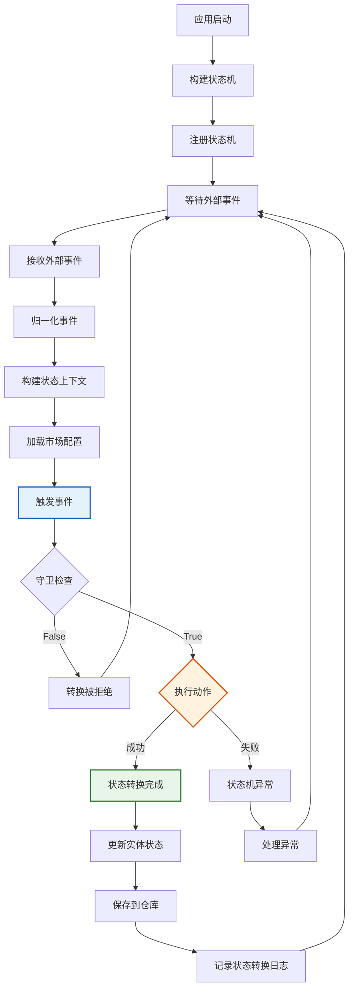

# 使用指南

> 版本：4.0 | 最后更新：2026-09-05
> 基于阿里巴巴 COLA StateMachine：https://github.com/alibaba/COLA
> 对齐事件驱动编排设计（v4.0）

## 1. 快速开始

### 1.1 项目结构

这是一个包含三个模块的多模块 Maven 项目：

| 模块 | ArtifactId | 包名 | 职责 |
|------|-----------|------|------|
| **statemachine-core** | `statemachine-core` | `com.alibaba.cola.statemachine` | 阿里巴巴 COLA StateMachine 核心引擎 |
| **chat-engine** | `chat-engine` | `com.selfdevelopment.chatengine` | 会话状态机（业务层） |
| **agent-connector** | `agent-connector` | `com.selfdevelopment.agentconnector` | 交互状态机（通道层） |

### 1.2 添加依赖

在 `pom.xml` 中添加相应的模块：

```xml
<!-- 核心状态机引擎（阿里巴巴 COLA StateMachine，必需） -->
<dependency>
    <groupId>com.selfdevelopment</groupId>
    <artifactId>statemachine-core</artifactId>
    <version>1.0.0</version>
</dependency>

<!-- 会话状态机（chat-engine） -->
<dependency>
    <groupId>com.selfdevelopment</groupId>
    <artifactId>chat-engine</artifactId>
    <version>1.0.0</version>
</dependency>

<!-- 交互状态机（agent-connector） -->
<dependency>
    <groupId>com.selfdevelopment</groupId>
    <artifactId>agent-connector</artifactId>
    <version>1.0.0</version>
</dependency>
```

### 1.3 构建和注册状态机

```java
import com.selfdevelopment.chatengine.statemachine.factory.ConversationStateMachineFactory;
import com.alibaba.cola.statemachine.StateMachine;

// 构建和注册（在应用启动时调用一次）
// 工厂使用缓存模式防止重复构建
StateMachine<ConversationState, ConversationFact, CbolStateContext> sm =
        ConversationStateMachineFactory.create();
```

### 1.4 触发事件

```java
// 构建上下文
CbolStateContext ctx = CbolStateContext.builder()
        .conversation(conversation)
        .marketConfig(StateMachineMarketConfig.defaultConfig())
        .traceContext(TraceContext.generate())
        .build();

// 触发事件并获取新状态（COLA API 直接返回目标状态）
ConversationState newState = sm.fireEvent(
        ConversationState.NEW,
        ConversationFact.SESSION_STARTED,
        ctx);

// 更新会话状态
conversation.setState(newState);
```

### 1.5 状态机使用流程



## 2. COLA Builder DSL

### 2.1 外部转换

定义外部状态转换（状态会改变）：

```java
StateMachineBuilder<ConversationState, ConversationFact, CbolStateContext> builder =
        StateMachineBuilderFactory.create();

builder.externalTransition()
        .from(ConversationState.NEW)
        .to(ConversationState.INITIATED)
        .on(ConversationFact.CONVERSATION_INITIATED)
        .when(ctx -> ctx.getMarketConfig() != null)  // 可选守卫
        .perform(new ConversationInitAction());
```

**Builder API 顺序：** `from() → to() → on() → when() → perform()`

### 2.2 内部转换

定义内部转换（状态不变，但动作执行）：

```java
builder.internalTransition()
        .within(ConversationState.IN_PROGRESS)
        .on(ConversationFact.SURVEY_START)
        .perform(new SurveyStartAction());
```

### 2.3 构建和注册

```java
StateMachine<ConversationState, ConversationFact, CbolStateContext> sm =
        builder.build("conversation");
StateMachineFactory.register(sm);
```

### 2.4 获取状态机

```java
StateMachine<ConversationState, ConversationFact, CbolStateContext> sm =
        StateMachineFactory.get("conversation");
```

## 3. Action 接口

### 3.1 实现 Action

```java
import com.alibaba.cola.statemachine.Action;

public class CustomerConnectAction
        implements Action<ConversationState, ConversationFact, CbolStateContext> {

    @Override
    public void execute(ConversationState from, ConversationState to,
                        ConversationFact event, CbolStateContext ctx) {
        // 你的业务逻辑
        log.info("客户已连接：conversationId={}",
                ctx.getConversation().getConversationId());
    }
}
```

### 3.2 Action-First 原则

动作在状态变更**之前**执行。如果动作失败，状态不变：

```java
try {
    ConversationState newState = sm.fireEvent(
            ConversationState.INITIATED,
            ConversationFact.CUSTOMER_CONNECT,
            ctx);
    // 状态成功变更
} catch (StateMachineException e) {
    // 动作失败或没有匹配的转换
    // 状态保持 INITIATED
    log.error("转换失败", e);
}
```

## 4. Condition（守卫）与 ConditionalAction

### 4.1 概述

本项目中所有 Action 都实现了 `ConditionalAction` 接口，该接口继承自 COLA 的 `Action`，并增加了 `getCondition()` 方法。这使得 Action 与其执行条件之间形成了自然的绑定关系。

**核心特性：**
- **默认 ALWAYS_TRUE**：`getCondition()` 有默认实现，返回始终满足的条件
- **可选自定义条件**：仅在需要守卫时覆盖 `getCondition()`
- **Factory 自动提取**：状态机工厂自动从 Action 中提取条件
- **COLA 原生 `when()`**：条件通过 COLA 原生的 `when()` 方法进行评估

### 4.2 带自定义条件的 Action

```java
@Component
@HandlesFact(ConversationFact.SESSION_STARTED)
public class SessionStartedAction implements ConditionalAction<ConversationState, ConversationFact, CbolStateContext> {

    @Override
    public Condition<CbolStateContext> getCondition() {
        return ctx -> {
            if (ctx == null || ctx.conversation() == null) {
                log.warn("SessionStartedAction 条件检查失败：context 或 conversation 为 null");
                return false;
            }
            if (ctx.conversation().conversationId() == null || ctx.conversation().conversationId().isBlank()) {
                log.warn("SessionStartedAction 条件检查失败：conversationId 为 null 或空");
                return false;
            }
            return true;
        };
    }

    @Override
    public void execute(ConversationState from, ConversationState to, ConversationFact event, CbolStateContext ctx) {
        // Action 业务逻辑
        log.info("会话已启动：conversationId={}", ctx.conversation().conversationId());
    }
}
```

### 4.3 无条件的 Action（默认）

```java
@Component
@HandlesFact(ConversationFact.INBOUND_MESSAGE_RECEIVED)
public class InboundMessageReceivedAction implements ConditionalAction<ConversationState, ConversationFact, CbolStateContext> {

    // 不覆盖 getCondition() - 使用默认的 ALWAYS_TRUE
    // 当转换被触发时，此 Action 总是会执行

    @Override
    public void execute(ConversationState from, ConversationState to, ConversationFact event, CbolStateContext ctx) {
        // Action 业务逻辑
        log.info("收到入站消息：conversationId={}", ctx.conversation().conversationId());
    }
}
```

### 4.4 Factory 中的工作原理

`ConversationStateMachineFactory` 自动从 Action 中提取条件：

```java
// 辅助方法：从 action 中提取 condition
Function<ConversationFact, Condition<CbolStateContext>> conditionProvider = fact -> {
    Action<ConversationState, ConversationFact, CbolStateContext> action = actionProvider.apply(fact);
    if (action instanceof ConditionalAction) {
        return ((ConditionalAction<ConversationState, ConversationFact, CbolStateContext>) action).getCondition();
    }
    return ctx -> true; // 普通 Action 实现的回退
};

// 在转换定义中使用
builder.externalTransition()
        .from(ConversationState.NEW)
        .to(ConversationState.INITIATED)
        .on(ConversationFact.SESSION_STARTED)
        .when(conditionProvider.apply(ConversationFact.SESSION_STARTED))
        .perform(actionProvider.apply(ConversationFact.SESSION_STARTED));
```

### 4.5 条件评估流程

```
fireEvent(from, fact, ctx)
    ↓
查找匹配的转换
    ↓
评估 when(condition)
    ├─ 条件返回 TRUE → 执行 perform(action) → 状态变更
    └─ 条件返回 FALSE → 跳过转换 → 状态保持不变（返回 null）
```

### 4.6 最佳实践

| 应该做 | 不应该做 |
|--------|----------|
| 保持条件简单快速（无 IO） | 在条件中放置副作用 |
| 条件失败时记录日志（便于调试） | 将应在 action 中的业务逻辑放在条件中 |
| 使用条件进行守卫检查（市场配置、状态验证） | 为同一个（source, event）定义多个无条件转换 |
| 仅在需要时覆盖 `getCondition()` | 从 `getCondition()` 返回 `null`（改用默认值） |

### 4.7 独立 Condition（高级）

对于需要在多个 Action 间复用的复杂条件，仍可创建独立的 Condition 类：

```java
public class SurveyEnabledCondition implements Condition<CbolStateContext> {

    @Override
    public boolean isSatisfied(CbolStateContext ctx) {
        return ctx.marketConfig() != null && ctx.marketConfig().surveyEnabled();
    }
}

// 在 Action 中使用
@Override
public Condition<CbolStateContext> getCondition() {
    return new SurveyEnabledCondition();
}
```

## 5. Chat Engine 使用

### 5.1 会话状态

```java
public enum ConversationState {
    NEW,                // 初始状态，会话已创建，等待交互就绪
    INITIATED,          // 当前绑定的交互已就绪（InteractionState=CONNECTED）
    ACTIVE,             // 交互已激活，等待第一条入站消息
    IN_PROGRESS,        // 业务进行中（已收到第一条入站消息）
    TRANSFERRED,        // CBOL 跨通道转接阶段（进行中）
    ENDING,             // 不可逆：关闭前编排（保证最终 CLOSED）
    CLOSED              // 最终终止状态
}
```

### 5.2 使用 ChatEngineStateMachineService

```java
// 初始化（在启动时调用一次）
ConversationStateMachineFactory.create();
ChatEngineStateMachineService service = new ChatEngineStateMachineService();

// 构建上下文
CbolStateContext ctx = buildContext();

// 触发事件（直接返回 ConversationState）
ConversationState newState = service.fire(ctx, ConversationFact.INTERACTION_BECAME_ACTIVE);
```

### 5.3 运行 Chat Engine Demo

```bash
cd 08-Code/state-machine
mvnw.cmd compile -pl chat-engine
java -cp chat-engine/target/classes:statemachine-core/target/classes com.selfdevelopment.chatengine.demo.ChatEngineDemo
```

## 6. Agent Connector 使用

### 6.1 交互状态

```java
public enum InteractionState {
    INITIATED,          // 连接已发起，等待连接结果
    CONNECTED,          // 连接已建立，准备进行消息传递
    IN_PROGRESS,        // 活跃消息传递（已收到第一条入站消息）
    DEGRADED,           // 连接降级（心跳丢失，临时问题）
    RECONNECTING,       // 重连进行中
    CONSULT_TRANSFER,   // 仅限 GENESYS：咨询转接
    TRANSFERRED,        // 跨通道源端分离标记
    CLOSED              // 通道已终止（终态）
}
```

### 6.2 使用 AgentConnectorStateMachineService

```java
// 初始化（在启动时调用一次）
InteractionStateMachineFactory.create();
AgentConnectorStateMachineService service = new AgentConnectorStateMachineService();

// 构建上下文
AgentConnectorStateContext ctx = buildContext();

// 触发事件（直接返回 InteractionState）
InteractionState newState = service.fire(ctx, InteractionFact.CONNECTION_SUCCESS);
```

### 6.3 运行 Agent Connector Demo

```bash
cd 08-Code/state-machine
mvnw.cmd compile -pl agent-connector
java -cp agent-connector/target/classes:statemachine-core/target/classes com.selfdevelopment.agentconnector.demo.AgentConnectorDemo
```

## 7. 多市场配置

### 7.1 默认配置

```java
StateMachineMarketConfig config = StateMachineMarketConfig.defaultConfig();
// customerIdleSeconds=300, transferTimeoutSeconds=120, endingGraceSeconds=30
// surveyEnabled=true, transferEnabled=true, genesysEnabled=true
```

### 7.2 自定义配置

```java
StateMachineMarketConfig config = StateMachineMarketConfig.builder()
        .customerIdleSeconds(600)
        .transferTimeoutSeconds(200)
        .endingGraceSeconds(60)
        .surveyEnabled(true)
        .transferEnabled(true)
        .genesysEnabled(false)
        .fallbackRoutingStrategy("DROP")
        .build();
```

### 7.3 市场配置提供者

```java
MarketConfigProvider.InMemoryProvider provider = new MarketConfigProvider.InMemoryProvider();
provider.put("HK", customConfig);

StateMachineMarketConfig cfg = provider.getConfig("HK");
```

## 8. 监控器

### 8.1 客户空闲监控器

```java
CustomerIdleMonitor monitor = new CustomerIdleMonitor(service);
long lastActivity = System.currentTimeMillis() - 400 * 1000; // 400秒前
monitor.check(ctx, lastActivity);
// 如果空闲时间 > customerIdleSeconds，触发 SYS_CUSTOMER_IDLE
```

### 8.2 转接监控器

```java
TransferMonitor monitor = new TransferMonitor(service);
long transferStart = System.currentTimeMillis() - 200 * 1000; // 200秒前
monitor.check(ctx, transferStart);
// 如果转接时间 > transferTimeoutSeconds，触发 SYS_TRANSFER_TIMEOUT
// 仅在 TRANSFERRED 状态下激活
```

### 8.3 结束宽限监控器

```java
EndingGraceMonitor monitor = new EndingGraceMonitor(service);
long enterEnding = System.currentTimeMillis() - 60 * 1000; // 60秒前
monitor.check(ctx, enterEnding);
// 如果结束时间 > endingGraceSeconds，触发 SYS_ENDING_GRACE_TIMEOUT
// 仅在 ENDING 状态下激活
```

## 9. 追踪上下文

### 9.1 生成追踪上下文

```java
TraceContext traceContext = TraceContext.generate();
// traceId = UUID, timestamp = 当前时间
```

### 9.2 MDC 传播

```java
// 设置 MDC 用于日志
TraceMdcHelper.set(traceContext);
try {
    // 你的代码 - 所有日志将包含 traceId
} finally {
    TraceMdcHelper.clear();
}
```

### 9.3 异步 Action Worker（预留）

```java
// ActionWorker 是预留的工具类，供未来使用
// 当前设计使用同步的 action-first 转换
ActionWorker worker = new ActionWorker();
worker.submit(action, from, to, event, ctx);
```

## 10. PlantUML 图生成

```java
StateMachine<ConversationState, ConversationFact, CbolStateContext> sm =
        ConversationStateMachineFactory.create();

String plantUml = sm.generatePlantUML();
System.out.println(plantUml);
```

输出：
```
@startuml
[*] --> NEW
NEW --> INITIATED : CONVERSATION_INITIATED
INITIATED --> IN_PROGRESS : CUSTOMER_CONNECT
IN_PROGRESS --> TRANSFERRED : TRANSFER_REQUEST
IN_PROGRESS --> ENDING : CUSTOMER_CLOSE
@enduml
```

## 11. 测试

### 11.1 运行所有测试

```bash
cd 08-Code/state-machine
mvnw.cmd clean test
```

### 11.2 运行模块测试

```bash
# Chat engine 测试
mvnw.cmd test -pl chat-engine

# Agent connector 测试
mvnw.cmd test -pl agent-connector

# 核心测试（COLA）
mvnw.cmd test -pl statemachine-core
```

### 11.3 测试覆盖率

- statemachine-core：219 个 COLA 测试
- chat-engine：36 个测试
- agent-connector：（待添加测试）

## 12. 最佳实践

### 12.1 状态机初始化

```java
// 在应用启动时调用一次
@PostConstruct
public void init() {
    ConversationStateMachineFactory.create();
    InteractionStateMachineFactory.create();
}
```

### 12.2 工厂缓存模式

COLA StateMachine 不允许重新构建。使用缓存模式：

```java
public static StateMachine<...> build() {
    try {
        StateMachine<...> existing = StateMachineFactory.get(MACHINE_ID);
        if (existing != null) return existing;
    } catch (Exception ignored) {
        // 尚未构建
    }
    synchronized (Factory.class) {
        // 双重检查 + 构建 + 注册
    }
}
```

### 12.3 Action 异常处理

状态机包含一套灵活的异常处理机制，确保**无论 Action 执行是否失败，状态转换都会继续**。异常由 `ExceptionHandlingAction` 捕获，并由基于优先级的处理器处理，不会阻塞状态变更。

#### 内置异常类型

```java
// 下游系统连接失败
throw new DownstreamConnectionException("Genesys", "transferCall", "连接超时");

// 业务规则违反
throw new BusinessException("INVALID_STATE", Map.of("reason", "问卷已提交"));

// 意外的系统错误
throw new SystemException("payment-service", "INTERNAL_ERROR", "处理器中空指针");
```

#### 使用异常处理（Spring 环境 - 推荐）

```java
@Service
@RequiredArgsConstructor
public class MyService {
    private final ConversationActionService actionService;

    public void processEvent(CbolStateContext ctx, ConversationFact fact) {
        // buildWithSpringActions() 自动用异常处理包装所有 Action
        StateMachine<ConversationState, ConversationFact, CbolStateContext> sm =
                actionService.buildWithSpringActions();

        // Action 执行期间的异常不会阻塞此状态转换
        ConversationState newState = sm.fireEvent(ctx.conversation().state(), fact, ctx);

        log.info("转换完成：{} -> {} on {}",
                ctx.conversation().state(), newState, fact);
    }
}
```

#### 自定义异常处理器

开发者可以添加自定义异常处理器，无需修改现有代码：

```java
@Component
public class PaymentFailureHandler implements ActionExceptionHandler {
    @Override
    public boolean canHandle(Throwable ex) {
        return ex instanceof PaymentFailureException;
    }

    @Override
    public void handle(Throwable ex, ConversationState from, ConversationState to,
                       ConversationFact fact, CbolStateContext ctx) {
        // 自定义逻辑：告警、退款、重试等
        log.error("支付失败，发起退款：conversationId={}",
                ctx.conversation().conversationId());
    }

    @Override
    public int getPriority() {
        return 200; // 优先级越高 = 越先检查
    }
}
```

#### COLA 原生错误处理（不使用异常包装器）

如果选择不使用异常处理包装器，COLA 遵循 action-first 原则：

```java
try {
    ConversationState newState = sm.fireEvent(source, event, ctx);
} catch (StateMachineException e) {
    // 没有匹配的转换或动作失败
    // 状态保持不变
    log.error("状态转换失败：source={}, event={}", source, event, e);
    throw new BusinessException("转换失败", e);
}
```

> **注意**：使用 `buildWithSpringActions()` 时，Action 会自动用 `ExceptionHandlingAction` 包装，因此不会发生来自 Action 失败的 `StateMachineException`——状态转换始终继续。如果给定的（source, event）对没有匹配的转换，仍可能抛出 `StateMachineException`。

### 12.4 幂等性

```java
// 使用 conversationId + event 作为幂等键
String idempotencyKey = ctx.getConversation().getConversationId() + ":" + event;
if (processedEvents.contains(idempotencyKey)) {
    return currentState; // 已处理
}
processedEvents.add(idempotencyKey);
```

## 13. Spring Boot 集成

### 13.1 配置类

```java
@Configuration
public class StateMachineConfig {

    @Bean
    public StateMachine<ConversationState, ConversationFact, CbolStateContext> conversationStateMachine() {
        return ConversationStateMachineFactory.create();
    }

    @Bean
    public ChatEngineStateMachineService chatEngineStateMachineService() {
        return new ChatEngineStateMachineService();
    }
}
```

### 13.2 Service 使用

```java
@Service
public class ConversationService {

    @Autowired
    private ChatEngineStateMachineService stateMachineService;

    public Conversation handleEvent(Conversation conversation, ConversationFact event) {
        CbolStateContext ctx = buildContext(conversation);
        ConversationState newState = stateMachineService.fire(ctx, event);
        conversation.setState(newState);
        return conversation;
    }
}
```

## 14. 参考资料

- 阿里巴巴 COLA GitHub：https://github.com/alibaba/COLA
- COLA StateMachine 模块：`cola-components/cola-component-statemachine`
- COLA StateMachine 测试：`cola-components/cola-component-statemachine/src/test/java/com/alibaba/cola/test/`

---

*最后更新：2026-09-05（v3.0 — 迁移到阿里巴巴 COLA StateMachine）*
