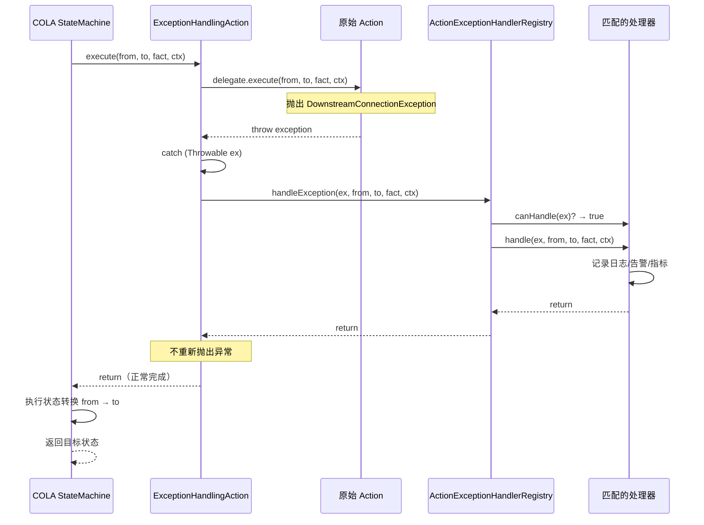

# 05 — 高级功能

> 基于阿里巴巴 COLA StateMachine 的生产级功能：多市场配置、监控器、追踪上下文、幂等性、可观测性、PlantUML 生成和扩展模式。

---

## 1. 多市场配置

### 问题

项目部署到多个市场（HK、SG、UK 等），状态流程相似但略有不同。每个市场可能有不同的超时时间、功能开关和路由策略。

### 解决方案

使用 `StateMachineMarketConfig` record 将市场特定行为捕获为不可变快照。配置在每次状态转换开始时注入到 `CbolStateContext` 中。

```java
@Builder
public record StateMachineMarketConfig(
    int customerIdleSeconds,       // 默认：300
    int transferTimeoutSeconds,    // 默认：120
    int endingGraceSeconds,        // 默认：30
    boolean surveyEnabled,         // 默认：true
    boolean transferEnabled,       // 默认：true
    boolean genesysEnabled,        // 默认：true
    String fallbackRoutingStrategy // 默认："DROP"
) {
    public static StateMachineMarketConfig defaultConfig() { ... }
}
```

### 市场配置提供者

```java
public interface MarketConfigProvider {
    StateMachineMarketConfig getConfig(String market);

    class InMemoryProvider implements MarketConfigProvider {
        private final ConcurrentHashMap<String, StateMachineMarketConfig> cache = new ConcurrentHashMap<>();

        public void put(String market, StateMachineMarketConfig config) {
            cache.put(market, config);
        }

        @Override
        public StateMachineMarketConfig getConfig(String market) {
            return cache.getOrDefault(market, StateMachineMarketConfig.defaultConfig());
        }
    }
}
```

### 在转换中使用

```java
CbolStateContext ctx = CbolStateContext.builder()
        .conversation(conversation)
        .marketConfig(marketConfigProvider.getConfig("HK"))
        .traceContext(TraceContext.generate())
        .build();

ConversationState newState = sm.fireEvent(
        conversation.state(),
        ConversationFact.INTERACTION_BECAME_ACTIVE,
        ctx);
```

### 设计原则

- **配置即快照**：市场配置在转换开始时捕获，而不是在动作执行期间动态读取
- **默认优先**：所有配置字段都有合理的默认值；市场只覆盖不同的部分
- **不可变**：配置是 record，在转换期间不能被修改
- **功能开关**：布尔字段（surveyEnabled、transferEnabled、genesysEnabled）控制哪些转换处于活动状态

---

## 2. 监控器（超时和健康检查）

### 问题

状态机需要检测和处理超时：客户空闲、转接超时、结束宽限期。这些是基于时间的事件，应该触发自动状态转换。

### 解决方案

三个监控器类，检查经过的时间，并在超过阈值时触发系统事件。

### 2.1 客户空闲监控器

```java
public class CustomerIdleMonitor {
    private final ChatEngineStateMachineService service;

    public void check(CbolStateContext ctx, long lastActivityTimestamp) {
        long idleMs = System.currentTimeMillis() - lastActivityTimestamp;
        int threshold = ctx.marketConfig().customerIdleSeconds() * 1000;

        if (idleMs > threshold) {
            service.fire(ctx, ConversationFact.CUSTOMER_IDLE_TIMEOUT);
        }
    }
}
```

### 2.2 转接监控器

```java
public class TransferMonitor {
    private final ChatEngineStateMachineService service;

    public void check(CbolStateContext ctx, long transferStartTimestamp) {
        // 仅在 TRANSFERRED 状态下激活
        if (ctx.conversation().state() != ConversationState.TRANSFERRED) {
            return;
        }

        long elapsedMs = System.currentTimeMillis() - transferStartTimestamp;
        int threshold = ctx.marketConfig().transferTimeoutSeconds() * 1000;

        if (elapsedMs > threshold) {
            service.fire(ctx, ConversationFact.TRANSFER_TIMEOUT);
        }
    }
}
```

### 2.3 结束宽限监控器

```java
public class EndingGraceMonitor {
    private final ChatEngineStateMachineService service;

    public void check(CbolStateContext ctx, long enterEndingTimestamp) {
        // 仅在 ENDING 状态下激活
        if (ctx.conversation().state() != ConversationState.ENDING) {
            return;
        }

        long elapsedMs = System.currentTimeMillis() - enterEndingTimestamp;
        int threshold = ctx.marketConfig().endingGraceSeconds() * 1000;

        if (elapsedMs > threshold) {
            service.fire(ctx, ConversationFact.ENDING_TIMEOUT);
        }
    }
}
```

### 监控器集成模式

```java
// 定时任务（例如，@Scheduled 每 30 秒）
@Scheduled(fixedDelay = 30000)
public void runMonitors() {
    List<Conversation> activeConversations = repository.findActive();

    for (Conversation conv : activeConversations) {
        CbolStateContext ctx = buildContext(conv);

        customerIdleMonitor.check(ctx, conv.getLastActivityAt());
        transferMonitor.check(ctx, conv.getTransferStartedAt());
        endingGraceMonitor.check(ctx, conv.getEnteredEndingAt());
    }
}
```

---

## 3. 追踪上下文和可观测性

### 问题

在分布式系统中，状态转换需要跨服务可追踪。每次转换都应携带追踪 ID 用于日志记录和调试。

### 解决方案

使用带有基于 UUID 的追踪 ID 的 `TraceContext` record，加上用于 SLF4J MDC 传播的 `TraceMdcHelper`。

### 3.1 追踪上下文

```java
public record TraceContext(
    String traceId,
    long timestamp
) {
    public static TraceContext generate() {
        return new TraceContext(UUID.randomUUID().toString(), System.currentTimeMillis());
    }
}
```

### 3.2 MDC 传播

```java
public class TraceMdcHelper {
    private static final String TRACE_ID_KEY = "traceId";

    public static void set(TraceContext ctx) {
        MDC.put(TRACE_ID_KEY, ctx.traceId());
    }

    public static void clear() {
        MDC.remove(TRACE_ID_KEY);
    }
}
```

### 3.3 在 Service 中使用

```java
public ConversationState fire(CbolStateContext ctx, ConversationFact fact) {
    TraceMdcHelper.set(ctx.traceContext());
    long start = System.currentTimeMillis();
    try {
        ConversationState from = ctx.conversation().state();
        ConversationState to = convSm.fireEvent(from, fact, ctx);

        log.info("状态转换：{} --({})--> {}, conversationId={}, durationMs={}",
                from, fact, to,
                ctx.conversation().conversationId(),
                System.currentTimeMillis() - start);
        return to;
    } finally {
        TraceMdcHelper.clear();
    }
}
```

### 3.4 审计日志模式

每次状态转换都应产生一个审计日志条目，包含：
- 业务 ID（conversationId / interactionId）
- 源状态 / 目标状态
- 事件 / Fact
- 市场
- 追踪 ID
- 持续时间
- 时间戳

---

## 4. 幂等性

### 问题

在分布式系统中，事件可能被多次传递（至少一次传递）。状态机应该优雅地处理重复事件，而不会破坏状态。

### 解决方案

使用 `conversationId + event` 作为幂等键，并在触发前检查。

```java
public class IdempotentStateMachineService {
    private final Set<String> processedEvents = ConcurrentHashMap.newKeySet();
    private final ChatEngineStateMachineService delegate;

    public ConversationState fire(CbolStateContext ctx, ConversationFact event) {
        String idempotencyKey = ctx.conversation().conversationId() + ":" + event;

        if (processedEvents.contains(idempotencyKey)) {
            log.warn("检测到重复事件：{}", idempotencyKey);
            return ctx.conversation().state(); // 返回当前状态，无操作
        }

        processedEvents.add(idempotencyKey);
        return delegate.fire(ctx, event);
    }
}
```

### COLA 级别的幂等性

COLA StateMachine 本身在以下意义上是幂等的：
- 如果没有转换匹配 `(sourceState, event)`，它会抛出 `StateMachineException`
- 异常时状态不变（action-first 原则）
- 从同一状态重复触发同一事件将要么重复成功（如果动作是幂等的），要么一致地失败

**最佳实践**：使你的 Action 实现幂等。使用数据库唯一约束或乐观锁来防止重复副作用。

---

## 5. PlantUML 图生成

### 问题

状态机可能因许多状态和转换而变得复杂。可视化文档有助于开发人员理解流程。

### 解决方案

COLA StateMachine 有一个内置的 `generatePlantUML()` 方法，可以生成 PlantUML 状态图。

```java
StateMachine<ConversationState, ConversationFact, CbolStateContext> sm =
        ConversationStateMachineFactory.create();

String plantUml = sm.generatePlantUML();
System.out.println(plantUml);
```

### 输出示例

```
@startuml
[*] --> NEW
NEW --> INITIATED : CONVERSATION_INITIATED
INITIATED --> IN_PROGRESS : CUSTOMER_CONNECT
IN_PROGRESS --> TRANSFERRED : TRANSFER_REQUEST
IN_PROGRESS --> ENDING : CUSTOMER_CLOSE
TRANSFERRED --> IN_PROGRESS : TRANSFER_FAILED
TRANSFERRED --> ENDING : TRANSFER_COMPLETE
ENDING --> CLOSED : SYS_ENDING_GRACE_TIMEOUT
@enduml
```

### 渲染

使用任何 PlantUML 渲染器：
- 在线：https://www.plantuml.com/plantuml/
- VS Code：PlantUML 扩展
- IntelliJ：PlantUML 集成插件

### CI/CD 集成

```bash
# 在 CI 中生成 PlantUML 并渲染为 PNG
java -jar plantuml.jar -tpng state-machine.puml
```

---

## 6. 工厂缓存模式

### 问题

COLA StateMachine 不允许使用相同 ID 重新构建状态机。尝试构建两次会抛出：
```
The state machine with id [conversation] is already built, no need to build again
```

### 解决方案

使用带有双重检查锁定的工厂缓存模式。

```java
public class ConversationStateMachineFactory {
    public static final String MACHINE_ID = "conversation";
    private static volatile StateMachine<ConversationState, ConversationFact, CbolStateContext> instance;

    public static StateMachine<ConversationState, ConversationFact, CbolStateContext> build() {
        // 快速路径：检查是否已构建
        try {
            StateMachine<ConversationState, ConversationFact, CbolStateContext> existing =
                    StateMachineFactory.get(MACHINE_ID);
            if (existing != null) {
                return existing;
            }
        } catch (Exception ignored) {
            // 尚未构建
        }

        // 慢速路径：同步构建
        synchronized (ConversationStateMachineFactory.class) {
            // 双重检查
            try {
                StateMachine<ConversationState, ConversationFact, CbolStateContext> existing =
                        StateMachineFactory.get(MACHINE_ID);
                if (existing != null) {
                    return existing;
                }
            } catch (Exception ignored) {
                // 尚未构建
            }

            // 构建
            StateMachineBuilder<ConversationState, ConversationFact, CbolStateContext> builder =
                    StateMachineBuilderFactory.create();

            // ... 定义转换 ...

            StateMachine<ConversationState, ConversationFact, CbolStateContext> sm =
                    builder.build(MACHINE_ID);
            StateMachineFactory.register(sm);
            return sm;
        }
    }
}
```

### 测试隔离

对于需要全新状态机的测试，每个测试类使用唯一的机器 ID：

```java
class MyTest {
    private static final String TEST_MACHINE_ID = "conversation-test-" + UUID.randomUUID();

    @BeforeEach
    void setUp() {
        // 使用唯一 ID 构建
    }
}
```

---

## 7. Action 异常处理机制

### 问题

当 Action 在状态转换期间抛出异常时，COLA 的默认行为（action-first 原则）会阻止状态变更并抛出 `StateMachineException`。但在许多生产场景中，我们希望：
- 无论 Action 执行是否失败，状态转换都应继续
- 针对不同异常类型（下游连接、业务、系统）有不同的处理策略
- 开发者可以扩展自定义异常处理器
- 未处理的异常有兜底处理器
- 异常被记录和监控，但不阻塞状态机流程

### 解决方案

一套完整的异常处理机制，使用 `ExceptionHandlingAction` 包装 Action，捕获所有异常并委托给基于优先级的 `ActionExceptionHandlerRegistry`。**重要的是，异常不会阻止状态转换**——无论 Action 执行是否失败，状态变更都会继续。

### 7.1 包结构

```
com.selfdevelopment.chatengine.action.exception
├── BusinessException.java              // 异常类型定义
├── DownstreamConnectionException.java
├── SystemException.java
├── handler/                            // 异常处理器
│   ├── ActionExceptionHandler.java          // 接口
│   ├── BusinessExceptionHandler.java
│   ├── DownstreamConnectionExceptionHandler.java
│   ├── FallbackActionExceptionHandler.java
│   └── SystemExceptionHandler.java
├── registry/                           // 处理器注册表
│   └── ActionExceptionHandlerRegistry.java
└── wrapper/                            // Action 包装器
    └── ExceptionHandlingAction.java
```

### 7.2 异常类型

三种内置异常类型覆盖常见场景：

```java
// 下游系统连接失败（数据库、消息队列、外部API、Genesys/Aibot）
public class DownstreamConnectionException extends RuntimeException {
    private final String downstreamSystem;
    private final String operation;
}

// 业务规则违反或预期的业务错误
public class BusinessException extends RuntimeException {
    private final String businessCode;
    private final Map<String, Object> businessContext;
}

// 意外的系统错误（空指针、内存溢出等）
public class SystemException extends RuntimeException {
    private final String systemComponent;
    private final String errorCategory;
}
```

### 7.3 异常处理器接口

```java
public interface ActionExceptionHandler {
    // 判断此处理器是否能处理该异常
    boolean canHandle(Throwable ex);

    // 自定义处理逻辑（告警、重试、降级、指标等）
    void handle(Throwable ex, ConversationState from, ConversationState to,
                ConversationFact fact, CbolStateContext ctx);

    // 处理器优先级（越高越先检查），默认 0
    default int getPriority() { return 0; }
}
```

### 7.4 默认异常处理器

| 处理器 | 优先级 | 处理类型 | 行为 |
|--------|--------|----------|------|
| `DownstreamConnectionExceptionHandler` | 100 | `DownstreamConnectionException` | 记录下游失败详情 |
| `BusinessExceptionHandler` | 80 | `BusinessException` | 记录业务上下文和代码 |
| `SystemExceptionHandler` | 50 | `SystemException` | 记录系统错误及堆栈 |
| `FallbackActionExceptionHandler` | -100 | 所有异常（兜底） | 记录未处理异常详情 |

### 7.5 异常处理器注册表

自动发现所有 Spring 管理的 `ActionExceptionHandler` Bean，按优先级排序，并为每个异常找到第一个匹配的处理器。

```java
@Slf4j
@Component
public class ActionExceptionHandlerRegistry implements InitializingBean {
    private final ApplicationContext applicationContext;
    private final List<ActionExceptionHandler> handlers = new ArrayList<>();
    private ActionExceptionHandler fallbackHandler;

    @Override
    public void afterPropertiesSet() {
        // 自动发现所有处理器 Bean
        var handlerBeans = applicationContext.getBeansOfType(ActionExceptionHandler.class);

        for (var entry : handlerBeans.entrySet()) {
            ActionExceptionHandler handler = entry.getValue();
            if (handler instanceof FallbackActionExceptionHandler) {
                this.fallbackHandler = handler;
            } else {
                handlers.add(handler);
            }
        }

        // 按优先级排序（高优先级在前）
        handlers.sort(Comparator.comparingInt(ActionExceptionHandler::getPriority).reversed());

        // 确保兜底处理器存在
        if (fallbackHandler == null) {
            fallbackHandler = new FallbackActionExceptionHandler();
        }
    }

    public void handleException(Throwable ex, ConversationState from, ConversationState to,
                                ConversationFact fact, CbolStateContext ctx) {
        // 按优先级查找第一个匹配的处理器
        for (ActionExceptionHandler handler : handlers) {
            if (handler.canHandle(ex)) {
                try {
                    handler.handle(ex, from, to, fact, ctx);
                } catch (Exception handlerEx) {
                    // 永远不让处理器异常传播
                    log.error("异常处理器抛出异常", handlerEx);
                }
                return;
            }
        }

        // 使用兜底处理器
        try {
            fallbackHandler.handle(ex, from, to, fact, ctx);
        } catch (Exception handlerEx) {
            log.error("兜底处理器抛出异常", handlerEx);
        }
    }
}
```

### 7.6 异常处理 Action 包装器

用异常处理包装原始 Action。捕获所有异常（包括 Error），委托给注册表，并且**永远不重新抛出**——状态转换始终继续。

```java
@Slf4j
public class ExceptionHandlingAction<S, E, C> implements Action<S, E, C> {
    private final Action<S, E, C> delegate;
    private final ActionExceptionHandlerRegistry exceptionHandlerRegistry;

    @Override
    @SuppressWarnings("unchecked")
    public void execute(S from, S to, E e, C ctx) {
        try {
            delegate.execute(from, to, e, ctx);
        } catch (Throwable ex) {
            // 捕获所有异常（包括 Error）
            log.warn("Action 执行抛出异常: {}", ex.getClass().getSimpleName());

            try {
                exceptionHandlerRegistry.handleException(
                        ex,
                        (ConversationState) from,
                        (ConversationState) to,
                        (ConversationFact) e,
                        (CbolStateContext) ctx
                );
            } catch (Throwable handlerEx) {
                // 最后一道防线——永远不传播
                log.error("异常处理器注册表抛出异常", handlerEx);
            }

            // 重要：不重新抛出异常——状态转换必须继续
            log.debug("尽管 Action 异常，状态转换仍继续: {} -> {} on {}",
                    from, to, e);
        }
    }

    // 工厂方法——幂等（不会重复包装）
    public static <S, E, C> Action<S, E, C> wrap(Action<S, E, C> action,
                                                    ActionExceptionHandlerRegistry registry) {
        if (action == null) return null;
        if (action instanceof ExceptionHandlingAction) return action; // 已包装
        return new ExceptionHandlingAction<>(action, registry);
    }
}
```

### 7.7 执行流程



### 7.8 自定义异常处理器示例

开发者可以添加自定义异常处理器，无需修改现有代码：

```java
@Component
public class MyCustomExceptionHandler implements ActionExceptionHandler {
    @Override
    public boolean canHandle(Throwable ex) {
        return ex instanceof MyCustomException;
    }

    @Override
    public void handle(Throwable ex, ConversationState from, ConversationState to,
                       ConversationFact fact, CbolStateContext ctx) {
        // 自定义逻辑：告警、重试、降级、指标等
        log.error("自定义异常已处理: {}", ex.getMessage());
    }

    @Override
    public int getPriority() {
        return 200; // 高优先级——在默认处理器之前检查
    }
}
```

### 7.9 与 ConversationActionService 的集成

`ConversationActionService` 自动用异常处理包装 Action：

```java
@Slf4j
@Service
@RequiredArgsConstructor
public class ConversationActionService {
    private final ConversationActionRegistry actionRegistry;
    private final ActionExceptionHandlerRegistry exceptionHandlerRegistry;

    // Spring 环境（推荐）——自动发现 + 异常处理
    public StateMachine<ConversationState, ConversationFact, CbolStateContext> buildWithSpringActions() {
        return buildWithRegistry(actionRegistry, exceptionHandlerRegistry);
    }

    // 用异常处理包装每个 Action
    private static Action<...> wrapWithExceptionHandling(
            Action<...> action,
            ActionExceptionHandlerRegistry registry) {
        if (action == null) return null;
        if (action instanceof ExceptionHandlingAction) return action;
        return new ExceptionHandlingAction<>(action, registry);
    }
}
```

### 7.10 关键设计原则

| 原则 | 说明 |
|------|------|
| **状态转换永不阻塞** | 异常被处理，而不是传播；状态始终变更 |
| **开闭原则** | 添加新异常处理器无需修改现有代码 |
| **基于优先级** | 更具体的处理器（更高优先级）先检查 |
| **兜底保证** | 每个异常都会被处理（至少由兜底处理器） |
| **处理器异常永不传播** | 包装器中的最后一道防线 |
| **自动发现** | Spring Bean 自动注册 |
| **幂等包装** | 已包装的 Action 不会重复包装 |
| **向后兼容** | 保留无异常处理的原始 API |

### 7.11 COLA Action-First 原则（参考）

作为参考，COLA StateMachine 默认遵循 **action-first 原则**：
1. Action 在状态变更**之前**执行
2. 如果动作成功 → 状态变更为目标状态
3. 如果动作失败 → 抛出 `StateMachineException`，状态保持不变

我们的异常处理机制**覆盖了此行为**，通过在包装器中捕获异常，允许状态转换无论 Action 失败与否都继续。这对于我们的用例是有意为之的，因为 Action 的副作用（通知、日志、下游调用）不应阻塞核心状态流。

---

## 8. 扩展模式

### 8.1 自定义 Action 组合

将多个动作组合成一个：

```java
public class CompositeAction<S, E, C> implements Action<S, E, C> {
    private final List<Action<S, E, C>> actions;

    @Override
    public void execute(S from, S to, E event, C context) {
        for (Action<S, E, C> action : actions) {
            action.execute(from, to, event, context);
        }
    }
}
```

### 8.2 带重试的 Action

用重试逻辑包装一个动作：

```java
public class RetryAction<S, E, C> implements Action<S, E, C> {
    private final Action<S, E, C> delegate;
    private final int maxRetries;
    private final long backoffMs;

    @Override
    public void execute(S from, S to, E event, C context) {
        int attempts = 0;
        while (true) {
            try {
                delegate.execute(from, to, event, context);
                return;
            } catch (Exception e) {
                if (++attempts >= maxRetries) {
                    throw e;
                }
                try {
                    Thread.sleep(backoffMs * attempts);
                } catch (InterruptedException ie) {
                    Thread.currentThread().interrupt();
                    throw e;
                }
            }
        }
    }
}
```

### 8.3 异步 Action Worker（预留）

`ActionWorker` 是预留的工具类，供未来异步动作执行使用。当前设计使用同步的 action-first 转换。

```java
// 预留：供未来异步动作执行使用
public class ActionWorker {
    private final ExecutorService executor = Executors.newCachedThreadPool();

    public CompletableFuture<Void> submit(
            Action<ConversationState, ConversationFact, CbolStateContext> action,
            ConversationState from, ConversationState to,
            ConversationFact event, CbolStateContext ctx) {
        return CompletableFuture.runAsync(() -> {
            TraceMdcHelper.set(ctx.traceContext());
            try {
                action.execute(from, to, event, ctx);
            } finally {
                TraceMdcHelper.clear();
            }
        }, executor);
    }
}
```

### 8.4 ConditionalAction 模式

`ConditionalAction` 接口继承自 COLA 的 `Action`，内置了 `getCondition()` 方法，在 Action 与其执行守卫条件之间建立了自然的绑定关系。

#### 8.4.1 设计原理

**问题：** 在传统的状态机使用中，条件和动作在工厂中分别定义，导致：
- 条件-动作不匹配风险（错误的条件与错误的动作配对）
- 逻辑分散（条件在工厂中，动作在单独的类中）
- 难以理解（需要查看两个地方才能理解一个转换）

**解决方案：** 通过接口继承将条件直接绑定到 Action 类。

```
传统方式：                         ConditionalAction 方式：
┌─────────────┐                   ┌──────────────────────┐
│ Factory     │                   │ SessionStartedAction │
│  .when(cond)│  ◄── 分离         │  ├─ getCondition()   │
│  .perform(action)               │  └─ execute()        │
└─────────────┘                   └──────────────────────┘
                                        ▲ 条件和动作
                                        │ 在同一个类中
```

#### 8.4.2 接口定义

```java
public interface ConditionalAction<S, E, C> extends Action<S, E, C> {

    /** 始终满足的条件。 */
    Condition<?> ALWAYS_TRUE = ctx -> true;

    /**
     * 返回此 Action 的条件。
     * 默认值：始终满足（ALWAYS_TRUE）。
     * 覆盖此方法以提供自定义守卫条件。
     */
    @SuppressWarnings("unchecked")
    default Condition<C> getCondition() {
        return (Condition<C>) ALWAYS_TRUE;
    }
}
```

#### 8.4.3 使用模式

**模式 1：带自定义条件的 Action**
```java
@Component
@HandlesFact(SESSION_STARTED)
public class SessionStartedAction implements ConditionalAction<...> {
    @Override
    public Condition<CbolStateContext> getCondition() {
        return ctx -> ctx.conversation() != null
            && ctx.conversation().conversationId() != null;
    }
}
```

**模式 2：无条件的 Action（默认）**
```java
@Component
@HandlesFact(INBOUND_MESSAGE_RECEIVED)
public class InboundMessageAction implements ConditionalAction<...> {
    // 不覆盖 getCondition() → 默认使用 ALWAYS_TRUE
}
```

**模式 3：可复用的独立条件**
```java
public class MarketEnabledCondition implements Condition<CbolStateContext> {
    @Override
    public boolean isSatisfied(CbolStateContext ctx) {
        return ctx.marketConfig() != null
            && ctx.marketConfig().transferEnabled();
    }
}

// 在 Action 中使用
@Override
public Condition<CbolStateContext> getCondition() {
    return new MarketEnabledCondition();
}
```

#### 8.4.4 Factory 自动提取

工厂自动提取条件，无需显式配置：

```java
Function<ConversationFact, Condition<CbolStateContext>> conditionProvider = fact -> {
    Action<...> action = actionProvider.apply(fact);
    if (action instanceof ConditionalAction) {
        return ((ConditionalAction<...>) action).getCondition();
    }
    return ctx -> true; // 回退
};

// 每个转换自动获取其条件
builder.externalTransition()
    .from(NEW).to(INITIATED).on(SESSION_STARTED)
    .when(conditionProvider.apply(SESSION_STARTED))  // 自动提取
    .perform(actionProvider.apply(SESSION_STARTED));
```

#### 8.4.5 优势

| 优势 | 说明 |
|------|------|
| **内聚性** | 条件和动作在同一个类中 |
| **类型安全** | 编译器确保条件上下文类型与动作匹配 |
| **零配置** | 工厂通过 `instanceof` 自动发现条件 |
| **可选** | 默认 ALWAYS_TRUE 意味着简单动作没有开销 |
| **可测试** | 条件可以独立进行单元测试 |
| **可调试** | 在 Action 类内部记录条件失败日志 |

#### 8.4.6 异常处理集成

`ExceptionHandlingAction` 包装器也实现了 `ConditionalAction`，并将条件评估委托给被包装的 Action：

```java
public class ExceptionHandlingAction<S, E, C> implements ConditionalAction<S, E, C> {
    private final Action<S, E, C> delegate;

    @Override
    public Condition<C> getCondition() {
        if (delegate instanceof ConditionalAction) {
            return ((ConditionalAction<S, E, C>) delegate).getCondition();
        }
        return ctx -> true;
    }
}
```

这确保了异常处理包装保留了原始 Action 的条件行为。

---

## 9. 总结表

| 功能 | 实现 | 位置 |
|------|------|------|
| 多市场配置 | `StateMachineMarketConfig` record | chat-engine/config |
| 客户空闲监控器 | `CustomerIdleMonitor` | chat-engine/monitor |
| 转接监控器 | `TransferMonitor` | chat-engine/monitor |
| 结束宽限监控器 | `EndingGraceMonitor` | chat-engine/monitor |
| 追踪上下文 | `TraceContext` + `TraceMdcHelper` | chat-engine/context |
| 幂等性 | 业务层模式 | 应用代码 |
| PlantUML 生成 | COLA 内置 `generatePlantUML()` | statemachine-core |
| 工厂缓存 | 双重检查锁定模式 | chat-engine/statemachine/factory |
| Action 异常处理 | `ExceptionHandlingAction` + 处理器注册表 | chat-engine/action/exception |
| 异常类型 | 业务/下游/系统异常 | chat-engine/action/exception |
| 异常处理器 | 基于优先级的处理器链 | chat-engine/action/exception/handler |
| 兜底处理器 | 用于未处理异常的 catch-all 处理器 | chat-engine/action/exception/handler |
| COLA action-first 错误处理 | COLA 内置（被我们的包装器覆盖） | statemachine-core |
| 故障转移 | 业务层模式 | 应用代码 |
| 异步 Action Worker | 预留工具类 | chat-engine/action |
| ConditionalAction 模式 | Action 绑定条件，默认 ALWAYS_TRUE | chat-engine/action |

---

## 10. 参考资料

- 阿里巴巴 COLA GitHub：https://github.com/alibaba/COLA
- COLA StateMachine 模块：`cola-components/cola-component-statemachine`
- COLA StateMachine 测试：`cola-components/cola-component-statemachine/src/test/java/com/alibaba/cola/test/`

---

*最后更新：2026-09-12（v3.2 — 新增 ConditionalAction 模式，默认 ALWAYS_TRUE）*
