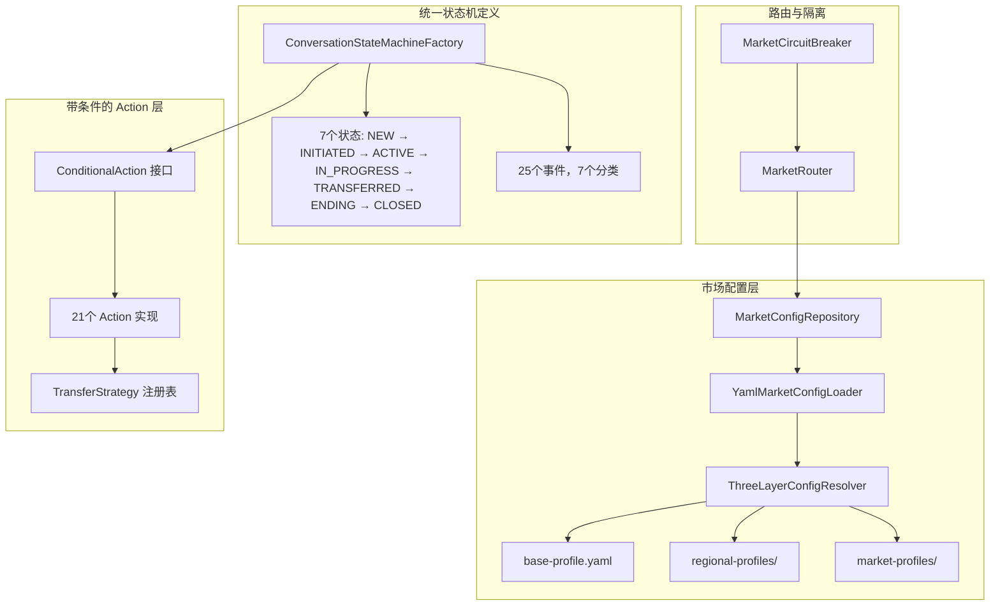
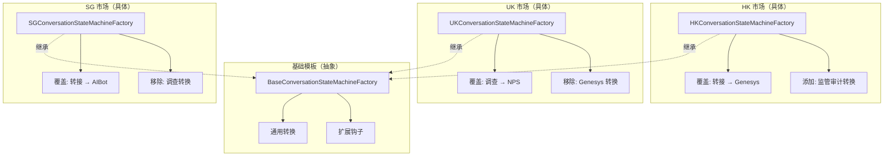
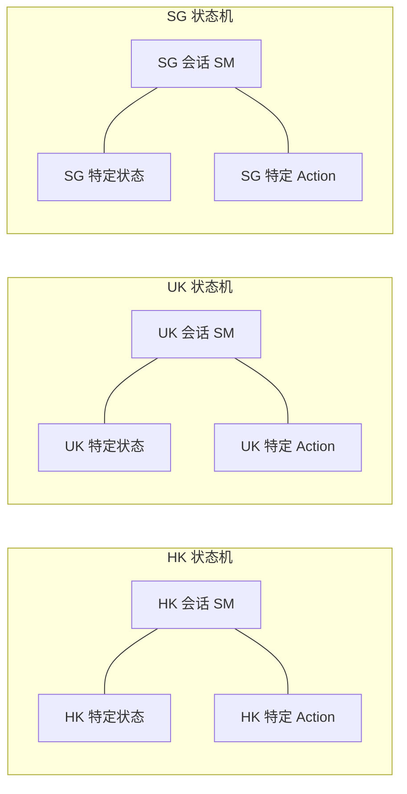

# 多市场状态机架构设计

> 版本：1.0 | 最后更新：2026-09-12
> 状态：设计文档（供评估）
> 作者：AI Assistant

---

## 1. 背景与需求

### 1.1 问题陈述

CBOL 消息中心将部署到**多个市场**（HK、UK、SG、US 等）。每个市场共享**相似的主流程**，但在以下方面存在**差异**：

- **功能可用性**：满意度调查、转接、Genesys 集成、AI 机器人
- **超时阈值**：空闲、转接、结束宽限、调查
- **业务规则**：路由策略、回退行为、重试策略
- **监管要求**：数据保留、审计日志、合规性
- **连接器配置**：AIBot 端点、Genesys 组织、WebSocket 设置
- **状态流程差异**：某些市场可能需要额外状态或跳过某些步骤

### 1.2 关键问题

> 我们应该如何设计状态机以支持多个市场，同时保持代码质量、运维简洁性和灵活性？

### 1.3 设计原则

| 原则 | 描述 |
|------|------|
| **DRY** | 不要重复自己 — 主流程逻辑应定义一次 |
| **开闭原则** | 对扩展开放，对修改关闭 — 新市场不应需要修改核心代码 |
| **显式优于隐式** | 市场差异应可见、可审计、可追溯 |
| **可测试性** | 每个市场的行为应可独立验证 |
| **运维简洁性** | 配置更改不应需要代码部署 |
| **故障隔离** | 一个市场的故障不应级联到其他市场 |
| **性能** | 多市场抽象不应带来显著开销 |

---

## 2. 解决方案选项

### 2.1 方案 A：配置驱动（当前方案）

#### 2.1.1 概述

所有市场使用统一的状态机定义。差异通过以下方式控制：
- 市场级配置（超时、功能开关、路由）
- ConditionalAction 模式（Action 绑定条件）
- 策略模式处理市场特定逻辑

#### 2.1.2 架构



#### 2.1.3 核心组件

| 组件 | 包 | 职责 |
|------|-----|------|
| `StateMachineMarketConfig` | `config` | 19 字段的市场配置记录 |
| `YamlMarketConfigLoader` | `config.loader` | 从 YAML 文件加载配置 |
| `ThreeLayerConfigResolver` | `config.loader` | base → regional → market 三层继承 |
| `MarketConfigRepository` | `config` | 带热重载的缓存配置 |
| `ConditionalAction` | `action` | 内置条件的 Action |
| `MarketRouter` | `routing` | 将请求路由到市场配置 |
| `MarketCircuitBreaker` | `routing` | 每市场故障隔离 |
| `ConfigValidator` | `config.validation` | 配置校验（ERROR/WARNING/INFO） |
| `TransferStrategy` | `action.strategy` | 市场特定转接逻辑 |

#### 2.1.4 工作原理

**步骤 1：配置解析**
```java
// 三层继承：base → regional → market
StateMachineMarketConfig config = configRepository.getConfig("HK");
```

**步骤 2：条件评估**
```java
// 每个 Action 都有检查市场配置的条件
public class SurveySubmittedAction implements ConditionalAction<CbolStateContext> {
    @Override
    public Condition<CbolStateContext> getCondition() {
        return ctx -> ctx.marketConfig().surveyEnabled();
    }
}
```

**步骤 3：状态机执行**
```java
// Factory 自动从 Action 提取条件
builder.externalTransition()
    .from(ENDING)
    .to(ENDING)
    .on(SURVEY_SUBMITTED)
    .when(conditionProvider.apply(SURVEY_SUBMITTED))  // 来自 Action 的条件
    .perform(actionProvider.apply(SURVEY_SUBMITTED));
```

#### 2.1.5 优缺点

| 优点 | 缺点 |
|------|------|
| ✅ 高代码复用（单一状态机定义） | ❌ 无法添加市场特定状态 |
| ✅ 新市场 = 添加配置，无需改代码 | ❌ 市场特定逻辑需要在 Action 内 if-else |
| ✅ 跨市场行为一致 | ❌ 条件只阻止 Action，不阻止转换 |
| ✅ 易于推出全局变更 | ❌ 复杂配置可能变成"配置即代码"反模式 |
| ✅ 配置更改无需部署 | ❌ 难以调试（是配置还是代码？） |
| ✅ 维护成本较低 | ❌ 市场特定的变通方案可能污染核心 |

#### 2.1.6 最适合

市场**相似度 80%+**，差异主要在阈值、功能开关和路由策略。

---

### 2.2 方案 B：状态机模板 + 市场覆盖

#### 2.2.1 概述

基础状态机模板定义通用转换。每个市场可以：
- 继承所有基础转换
- 覆盖特定转换（不同的 Action、不同的条件）
- 添加市场特定转换
- 移除/禁用某些转换

#### 2.2.2 架构



#### 2.2.3 核心组件

| 组件 | 职责 |
|------|------|
| `BaseConversationStateMachineFactory` | 抽象基类，包含通用转换定义 |
| `MarketStateMachineFactory` | 市场特定工厂接口 |
| `TransitionOverride` | 覆盖特定转换（from、event、to、action、condition） |
| `TransitionRegistry` | 市场特定转换注册表 |
| `MarketFactoryProvider` | 按市场代码解析工厂 |

#### 2.2.4 实现示例

```java
// 基础模板
public abstract class BaseConversationStateMachineFactory {
    
    protected void configureCommonTransitions(StateMachineBuilder builder) {
        // NEW → INITIATED
        builder.externalTransition()
            .from(NEW).to(INITIATED)
            .on(SESSION_STARTED)
            .perform(actionProvider.get(SESSION_STARTED));
        
        // INITIATED → ACTIVE
        builder.externalTransition()
            .from(INITIATED).to(ACTIVE)
            .on(INTERACTION_BECAME_ACTIVE)
            .perform(actionProvider.get(INTERACTION_BECAME_ACTIVE));
        
        // ... 更多通用转换
    }
    
    protected abstract void configureMarketTransitions(StateMachineBuilder builder);
    
    protected Set<TransitionKey> getDisabledTransitions() {
        return Set.of(); // 默认不禁用任何转换
    }
}

// HK 特定工厂
public class HKConversationStateMachineFactory extends BaseConversationStateMachineFactory {
    
    @Override
    protected void configureMarketTransitions(StateMachineBuilder builder) {
        // 覆盖转接以使用 Genesys
        builder.externalTransition()
            .from(IN_PROGRESS).to(TRANSFERRED)
            .on(SOURCE_INTERACTION_TRANSFERRED)
            .when(ctx -> ctx.marketConfig().transferEnabled())
            .perform(genesysTransferAction);
        
        // 添加 HK 特定的监管审计转换
        builder.internalTransition()
            .within(ANY_STATE)
            .on(REGULATORY_AUDIT_EVENT)
            .perform(regulatoryAuditAction);
    }
    
    @Override
    protected Set<TransitionKey> getDisabledTransitions() {
        return Set.of(); // 全部启用
    }
}
```

#### 2.2.5 优缺点

| 优点 | 缺点 |
|------|------|
| ✅ 灵活 — 可添加/移除/覆盖转换 | ❌ 初始设计工作量较大 |
| ✅ 市场特定代码清晰分离 | ❌ 需要维护多个状态机定义 |
| ✅ 可支持完全不同的状态流程 | ❌ 全局变更需要跨工厂同步 |
| ✅ 易于调试（市场特定代码隔离） | ❌ 工厂继承可能变得复杂 |
| ✅ 无"配置即代码"反模式 | ❌ 新市场可能需要改代码 |
| ✅ 类型安全的覆盖 | ❌ 测试矩阵随市场数量增长 |

#### 2.2.6 最适合

市场**相似度 60-80%**，状态流程有有意义的差异，需要市场特定状态/转换。

---

### 2.3 方案 C：完全独立的状态机

#### 2.3.1 概述

每个市场有自己完全独立的状态机工厂、转换、Action 和状态。无共享状态机定义。

#### 2.3.2 架构



#### 2.3.3 优缺点

| 优点 | 缺点 |
|------|------|
| ✅ 最大灵活性 | ❌ 大量代码重复 |
| ✅ 每个市场完全独立 | ❌ 全局变更需要同步 N 份 |
| ✅ 实现简单 | ❌ 容易产生漂移 |
| ✅ 无抽象开销 | ❌ 维护成本高（与市场数量线性相关） |
| ✅ 易于调试（隔离） | ❌ 新市场 = 复制粘贴 + 修改，易出错 |
| ✅ 可支持根本不同的逻辑 | ❌ 跨市场行为不一致 |

#### 2.3.4 最适合

市场**相似度 <50%**，业务逻辑根本不同。**我们的场景通常不推荐**。

---

## 3. 最佳实践分析

### 3.1 业界最佳实践

#### 3.1.1 Netflix Archaius / Spring Cloud Config

**方法**：配置驱动的功能开关和属性管理。
**相关性**：支持方案 A 的配置驱动方法。
**关键要点**：
- 使用分层配置（全局 → 区域 → 应用）
- 支持动态配置刷新
- 配置版本控制和审计追踪

#### 3.1.2 功能开关（Martin Fowler）

**方法**：使用功能开关控制行为，无需代码部署。
**相关性**：支持方案 A 的 ConditionalAction 模式。
**关键要点**：
- 区分"发布开关"和"业务开关"
- 制定开关退役计划
- 避免开关爆炸（最多 ~20-30 个活跃开关）

#### 3.1.3 策略模式（GoF）

**方法**：定义算法族，封装每个算法，使它们可互换。
**相关性**：支持市场特定 Action 逻辑。
**关键要点**：
- 当多个相关行为仅实现不同时使用
- 客户端不应感知具体策略
- 策略应无状态或有清晰的生命周期

#### 3.1.4 模板方法模式（GoF）

**方法**：在基类中定义算法骨架，让子类覆盖特定步骤。
**相关性**：支持方案 B 的模板 + 覆盖方法。
**关键要点**：
- 当算法结构固定但细节不同时使用
- 不要过度使用 — 组合通常优于继承
- 清晰记录哪些方法是"钩子" vs "必须实现"

#### 3.1.5 熔断器（Netflix Hystrix / Resilience4j）

**方法**：当下游服务失败时快速失败，防止级联。
**相关性**：支持市场隔离。
**关键要点**：
- 每依赖（或每市场）熔断器
- 可配置的失败阈值、打开时长、半开逻辑
- 指标和监控集成

#### 3.1.6 多租户架构模式

**方法**：在单个应用中支持多个租户（市场）。
**相关性**：直接适用于多市场。
**关键要点**：
- **共享内核 + 租户特定扩展**是最常见的模式
- 租户上下文应是线程本地的（MDC）
- 租户配置应带 TTL 缓存
- 数据库级租户隔离（行级或 schema 级）

### 3.2 需要避免的反模式

| 反模式 | 描述 | 为什么不好 |
|--------|------|------------|
| **配置即代码** | 使用配置编码复杂业务逻辑 | 难以维护、难测试、无类型安全 |
| **上帝对象配置** | 一个配置对象有 50+ 字段供所有市场 | 难理解、变更影响范围大 |
| **继承地狱** | 状态机工厂的深层继承层次 | 脆弱、难理解、变更会破坏子类 |
| **复制粘贴市场** | 每个市场复制整个状态机 | 漂移、不一致、高维护成本 |
| **开关爆炸** | 数百个功能开关 | 混乱、难测试所有组合、技术债务 |
| **泄漏抽象** | 市场特定代码泄漏到核心 | 核心被污染、难维护 |

### 3.3 推荐的混合方法

基于业界最佳实践，我们推荐**混合方法**，结合方案 A 和方案 B 的优点：

```
┌─────────────────────────────────────────────────────────┐
│                    核心状态机                             │
│  （所有市场共享 — 方案 A 基础）                           │
│  - 7 个标准状态                                           │
│  - 通用转换                                               │
│  - ConditionalAction 用于功能开关                         │
└────────────────────┬────────────────────────────────────┘
                     │
         ┌───────────┼───────────┐
         ▼           ▼           ▼
    ┌────────┐  ┌────────┐  ┌────────┐
    │HK 扩展 │  │UK 扩展 │  │SG 扩展 │  ← 市场特定扩展
    │(方案 B │  │(方案 B │  │(方案 B │    （方案 B 轻量版）
    │ 轻量版)│  │ 轻量版)│  │ 轻量版)│
    └────────┘  └────────┘  └────────┘
         │           │           │
         └───────────┼───────────┘
                     ▼
            ┌────────────────┐
            │  策略层         │  ← 市场特定 Action 策略
            │  （转接、调查等）│    （方案 A 增强）
            └────────────────┘
```

**关键设计决策**：
1. **核心状态机共享**（方案 A）— 7 个状态，通用转换
2. **市场差异通过配置**（方案 A）— 超时、功能开关、路由
3. **复杂差异用 Action 策略**（方案 A 增强）— 转接、调查
4. **轻量级市场扩展**（方案 B 轻量版）— 仅用于真正独特的需求
5. **不使用完整工厂继承** — 组合优于继承

---

## 4. 方案对比矩阵

### 4.1 定量对比

| 标准 | 权重 | 方案 A（配置） | 方案 B（模板） | 方案 C（独立） | 混合（推荐） |
|------|------|----------------|----------------|----------------|--------------|
| **代码复用** | 20% | 9/10 | 7/10 | 3/10 | 8/10 |
| **灵活性** | 15% | 5/10 | 9/10 | 10/10 | 8/10 |
| **可维护性** | 20% | 8/10 | 6/10 | 3/10 | 8/10 |
| **新市场工作量** | 15% | 2/10 | 5/10 | 9/10 | 3/10 |
| **可测试性** | 10% | 7/10 | 7/10 | 8/10 | 8/10 |
| **运维简洁性** | 10% | 9/10 | 6/10 | 5/10 | 8/10 |
| **性能** | 5% | 9/10 | 8/10 | 10/10 | 8/10 |
| **故障隔离** | 5% | 7/10 | 8/10 | 10/10 | 8/10 |
| **加权得分** | 100% | **7.65** | **7.05** | **5.65** | **7.95** |

### 4.2 定性对比

| 方面 | 方案 A | 方案 B | 方案 C | 混合 |
|------|--------|--------|--------|------|
| **首个市场上线时间** | 1 周 | 3 周 | 2 周 | 2 周 |
| **添加第 4 个市场时间** | 1 天 | 1 周 | 2 周 | 2 天 |
| **全局 Bug 修复工作量** | 1 处 | 3-5 处 | N 处 | 1-2 处 |
| **配置复杂度** | 高 | 中 | 低 | 中 |
| **代码复杂度** | 低 | 高 | 低 | 中 |
| **漂移风险** | 低 | 中 | 高 | 低 |
| **学习曲线** | 低 | 高 | 低 | 中 |

---

## 5. 推荐实施路线图

### 阶段 1：基础（当前 — ✅ 已完成）

- [x] 增强的 `StateMachineMarketConfig`（19 个字段）
- [x] YAML 配置加载器，三层继承
- [x] 带缓存的市场配置仓库
- [x] ConditionalAction 模式用于功能开关
- [x] 市场路由器和熔断器
- [x] 配置校验
- [x] 转接策略模式

### 阶段 2：策略模式增强（2-3 天）

- [ ] 实现 `SurveyStrategy` 用于市场特定调查类型（CSAT/NPS/CES）
- [ ] 实现 `EndingStrategy` 用于市场特定结束行为
- [ ] 实现 `RoutingStrategy` 用于市场特定路由
- [ ] 添加带自动发现的策略注册表
- [ ] 更新现有 Action 使用策略

### 阶段 3：市场扩展点（3-5 天）

- [ ] 定义 `MarketExtension` 接口
- [ ] 实现带自动发现的 `ExtensionRegistry`
- [ ] 添加转换前/后钩子
- [ ] 实现 HK 监管审计扩展（示例）
- [ ] 实现 UK GDPR 数据保留扩展（示例）
- [ ] 将扩展接入状态机执行

### 阶段 4：高级功能（1-2 周）

- [ ] 配置差异可视化工具
- [ ] 市场特定状态机图表生成器
- [ ] 带 WebSocket 通知的配置热重载
- [ ] 每市场监控仪表板
- [ ] 市场测试矩阵自动生成

### 阶段 5：优化（持续）

- [ ] 性能分析和优化
- [ ] 配置复杂度审计
- [ ] 开关退役计划
- [ ] 文档完善

---

## 6. 风险评估与缓解

| 风险 | 可能性 | 影响 | 缓解措施 |
|------|--------|------|----------|
| **配置变得过于复杂** | 中 | 高 | 为每个市场设置"复杂度预算"。如果配置需要 >5 个条件，考虑扩展。 |
| **市场特定代码泄漏到核心** | 中 | 中 | 严格的包分离。核心代码不得引用市场名称。代码审查清单。 |
| **市场间配置漂移** | 中 | 中 | 配置校验 + 差异工具。定期配置审计。默认配置作为基线。 |
| **难以调试市场问题** | 中 | 中 | 所有状态转换记录市场 + 配置快照。每市场追踪 ID。 |
| **扩展排序冲突** | 低 | 中 | 扩展声明依赖项。注册表在启动时校验。 |
| **性能开销** | 低 | 低 | 配置缓存在内存中。配置对象不可变（record）。每次转换无 DB 调用。 |
| **新市场需要改代码** | 低 | 中 | 扩展是可选的。大多数市场仅用配置即可工作。 |
| **策略爆炸** | 中 | 中 | 将策略限制为 3-5 个核心类型。简单变化用配置。 |

---

## 7. 决策框架

使用此框架决定何时使用哪种机制：

```
差异是简单的开关或阈值吗？
├─ 是 → 使用配置（StateMachineMarketConfig）
└─ 否
   ├─ 是同一步骤的不同算法吗？
   │  ├─ 是 → 使用策略模式
   │  └─ 否
   │     ├─ 是独特的状态/转换吗？
   │     │  ├─ 是 → 使用市场扩展
   │     │  └─ 否 → 重新考虑 — 也许不需要
   └─ 否
```

### 示例

| 场景 | 机制 |
|------|------|
| HK 空闲超时 300 秒，UK 600 秒 | 配置 |
| SG 没有满意度调查 | 配置（surveyEnabled=false）+ ConditionalAction |
| HK 使用 Genesys 转接，UK 使用内部队列 | 策略模式（TransferStrategy） |
| HK 每次转换需要监管审计 | 市场扩展 |
| UK 关闭时需要 GDPR 数据删除 | 市场扩展 |
| 所有市场共享相同的 7 状态流程 | 核心状态机 |

---

## 8. 参考资料

### 8.1 内部参考

- `06-Multi-Market-Design.md` — 高层架构决策
- `07-Multi-Market-Best-Practices/` — 8 个详细最佳实践设计
- `04-Usage-Guide.md` — ConditionalAction 使用指南
- `05-Advanced-Features.md` — 高级状态机功能

### 8.2 外部参考

- **Netflix Archaius** — 动态配置管理
- **Spring Cloud Config** — 外部化配置
- **Martin Fowler — 功能开关** — https://martinfowler.com/articles/feature-toggles.html
- **GoF 设计模式** — 策略、模板方法、装饰器
- **Resilience4j** — 熔断器实现
- **Microsoft 多租户架构** — https://learn.microsoft.com/en-us/azure/architecture/guide/multitenant/

---

## 9. 结论

### 9.1 推荐

**采用混合方法**（方案 A 基础 + 策略模式 + 轻量级市场扩展）：

1. **从方案 A 开始**（已实现）— 覆盖 ~80% 的市场差异
2. **添加策略模式** 处理复杂算法差异（转接、调查）
3. **添加市场扩展** 仅用于真正独特的需求（监管、合规）
4. **避免方案 B 的完整工厂继承** — 组合优于继承
5. **绝不使用方案 C** — 重复和漂移风险太大

### 9.2 预期成果

| 指标 | 目标 |
|------|------|
| 新市场上线 | < 1 天（仅配置），< 3 天（带扩展） |
| 全局 Bug 修复 | 1 处（核心），1-2 处（扩展） |
| 每市场配置字段 | < 25 |
| 活跃功能开关 | < 20 |
| 市场扩展 | < 5 个/市场 |
| 代码重复 | < 10% |

### 9.3 下一步

1. ✅ **阶段 1 完成** — 基础已实现
2. 📋 **实施阶段 2** — 策略模式增强
3. 📋 **实施阶段 3** — 市场扩展点
4. 📋 **用 HK 和 UK 试点** — 验证方法
5. 📋 **根据试点反馈完善**

---

*文档创建：2026-09-12*
*下次评审：阶段 2 实施后*
