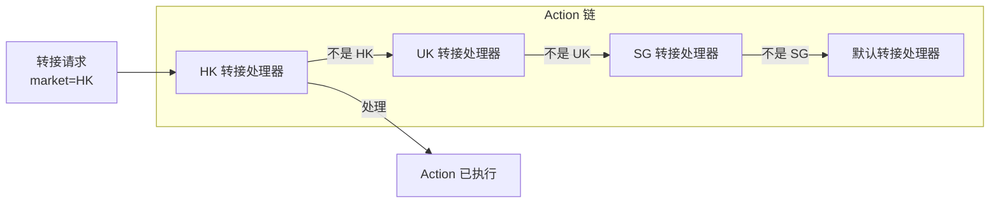
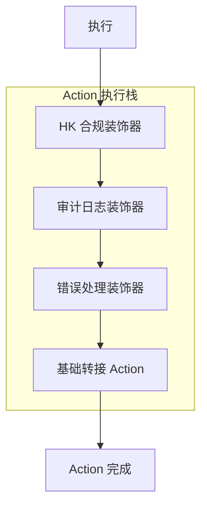

# 多市场 Action 执行设计

> 版本：1.0 | 最后更新：2026-09-12
> 状态：设计文档（供评估）
> 作者：AI Assistant

---

## 1. 背景与需求

### 1.1 问题陈述

状态机在状态转换期间执行 Action。在多市场部署中，同一事件（例如 `SOURCE_INTERACTION_TRANSFERRED`）可能需要按市场执行不同的逻辑：

- **HK**：通过 Genesys 云 API 转接
- **UK**：通过内部坐席队列转接
- **SG**：通过 AI 机器人交接转接
- **US**：通过 Genesys 转接，但有不同的合规检查

此外，市场之间可能在以下方面存在差异：
- Action 前验证规则
- Action 后清理逻辑
- 错误处理和重试策略
- 审计日志要求
- 性能特征（超时、速率限制）

### 1.2 关键问题

> 我们应该如何设计 Action 执行以支持市场特定逻辑，同时保持代码质量、可重用性和简洁性？

### 1.3 设计原则

| 原则 | 描述 |
|------|------|
| **单一职责** | 每个 Action 只做一件事；市场特定逻辑分离 |
| **开闭原则** | 新市场不应需要修改现有 Action |
| **组合优于继承** | 优先组合行为而非深层继承层次 |
| **显式绑定** | Action 到市场的绑定应可见且可审计 |
| **可测试性** | 每个市场的 Action 行为应可独立测试 |
| **性能** | 多市场抽象不应带来显著开销 |
| **故障隔离** | 一个市场的 Action 故障不应影响其他市场 |

---

## 2. 解决方案选项

### 2.1 方案 A：配置驱动 + ConditionalAction（当前方案）

#### 2.1.1 概述

每个 Action 实现 `ConditionalAction` 接口，带有 `getCondition()` 方法。条件检查市场配置以决定是否执行。市场特定逻辑通过 Action 内部的 if-else 分支处理。

#### 2.1.2 架构

```mermaid
flowchart TB
    subgraph Action["单一 Action 实现"]
        ACTION[SourceInteractionTransferredAction]
        CONDITION{getCondition()<br/>surveyEnabled?}
        IFELSE{if market == HK<br/>else if market == UK<br/>else}
    end

    subgraph Config["市场配置"]
        HK[HK: genesysEnabled=true]
        UK[UK: genesysEnabled=false]
    end

    ACTION --> CONDITION
    CONDITION -->|true| IFELSE
    IFELSE -->|HK| HK_LOGIC[Genesys 转接]
    IFELSE -->|UK| UK_LOGIC[内部队列]
    IFELSE -->|SG| SG_LOGIC[AI 机器人交接]
    HK --> HK_LOGIC
    UK --> UK_LOGIC
```

#### 2.1.3 实现示例

```java
@Component
@HandlesFact(ConversationFact.SOURCE_INTERACTION_TRANSFERRED)
public class SourceInteractionTransferredAction implements ConditionalAction<CbolStateContext> {
    
    @Override
    public Condition<CbolStateContext> getCondition() {
        return ctx -> ctx.marketConfig() != null 
            && ctx.marketConfig().transferEnabled();
    }
    
    @Override
    public void execute(CbolStateContext ctx) {
        String market = ctx.conversation().market();
        
        // 通过 if-else 处理市场特定逻辑
        if ("HK".equals(market)) {
            executeGenesysTransfer(ctx);
        } else if ("UK".equals(market)) {
            executeInternalQueueTransfer(ctx);
        } else if ("SG".equals(market)) {
            executeAibotTransfer(ctx);
        } else {
            executeDefaultTransfer(ctx);
        }
    }
    
    private void executeGenesysTransfer(CbolStateContext ctx) { ... }
    private void executeInternalQueueTransfer(CbolStateContext ctx) { ... }
    private void executeAibotTransfer(CbolStateContext ctx) { ... }
    private void executeDefaultTransfer(CbolStateContext ctx) { ... }
}
```

#### 2.1.4 优缺点

| 优点 | 缺点 |
|------|------|
| ✅ 简单易懂 | ❌ Action 类随每个市场增长 |
| ✅ 无额外抽象 | ❌ 违反开闭原则 |
| ✅ 易于调试（单个类） | ❌ 难以独立测试市场特定逻辑 |
| ✅ 低开销 | ❌ Action 间代码重复 |
| ✅ 适合 2-3 个市场 | ❌ 5+ 市场时难以维护 |
| ✅ 已实现 | ❌ 市场名称泄漏到核心代码 |

#### 2.1.5 最适合

**2-3 个市场**且市场差异简单的项目。**不推荐**扩展到 5+ 市场。

---

### 2.2 方案 B：策略模式

#### 2.2.1 概述

为每个 Action 类别定义策略接口。市场特定实现注册在策略注册表中。Action 根据市场配置委托给适当的策略。

#### 2.2.2 架构

```mermaid
flowchart TB
    subgraph Action["Action（薄包装器）"]
        ACTION[SourceInteractionTransferredAction]
    end

    subgraph Strategy["策略层"]
        INTERFACE[TransferStrategy 接口]
        HK_STRATEGY[GenesysTransferStrategy]
        UK_STRATEGY[InternalQueueTransferStrategy]
        SG_STRATEGY[AibotTransferStrategy]
        DEFAULT_STRATEGY[DefaultTransferStrategy]
    end

    subgraph Registry["策略注册表"]
        REGISTRY[TransferStrategyRegistry]
        RESOLVE[resolve(marketConfig)]
    end

    ACTION --> REGISTRY
    REGISTRY --> RESOLVE
    RESOLVE --> HK_STRATEGY
    RESOLVE --> UK_STRATEGY
    RESOLVE --> SG_STRATEGY
    RESOLVE --> DEFAULT_STRATEGY
    HK_STRATEGY -.->|实现| INTERFACE
    UK_STRATEGY -.->|实现| INTERFACE
    SG_STRATEGY -.->|实现| INTERFACE
    DEFAULT_STRATEGY -.->|实现| INTERFACE
```

#### 2.2.3 实现示例

```java
// 策略接口
public interface TransferStrategy {
    String getTransferTarget(); // "GENESYS", "INTERNAL_QUEUE", "AIBOT"
    void execute(CbolStateContext ctx);
    boolean isAvailable(CbolStateContext ctx);
}

// HK 策略
@Component
public class GenesysTransferStrategy implements TransferStrategy {
    @Override
    public String getTransferTarget() { return "GENESYS"; }
    
    @Override
    public void execute(CbolStateContext ctx) {
        // Genesys 特定的转接逻辑
    }
    
    @Override
    public boolean isAvailable(CbolStateContext ctx) {
        return ctx.marketConfig().genesysEnabled()
            && ctx.marketConfig().genesysOrgId() != null;
    }
}

// Action 委托给策略
@Component
@HandlesFact(ConversationFact.SOURCE_INTERACTION_TRANSFERRED)
public class SourceInteractionTransferredAction implements ConditionalAction<CbolStateContext> {
    
    private final TransferStrategyRegistry strategyRegistry;
    
    @Override
    public void execute(CbolStateContext ctx) {
        TransferStrategy strategy = strategyRegistry.resolve(ctx.marketConfig());
        strategy.execute(ctx);
    }
}
```

#### 2.2.4 优缺点

| 优点 | 缺点 |
|------|------|
| ✅ 清晰的关注点分离 | ❌ 需要管理更多类 |
| ✅ 符合开闭原则 | ❌ 初始设置工作量 |
| ✅ 易于独立测试每个策略 | ❌ 过度使用会导致策略爆炸 |
| ✅ 新市场 = 添加新策略 | ❌ 需要定义策略接口 |
| ✅ 策略可重用 | ❌ 轻微的间接开销 |
| ✅ 市场特定逻辑隔离 | ❌ 不适合一次性市场差异 |

#### 2.2.5 最适合

**3+ 个市场**且有明确定义的算法差异（转接、调查、路由）的项目。**我们的场景推荐**。

---

### 2.3 方案 C：Action 注册表 + 市场特定 Action

#### 2.3.1 概述

每个市场可以为同一事件注册自己的 Action 实现。Action 注册表根据市场代码解析适当的 Action。如果不存在市场特定 Action，则回退到默认 Action。

#### 2.3.2 架构

```mermaid
flowchart TB
    subgraph Registry["市场感知 Action 注册表"]
        REGISTRY[MarketAwareActionRegistry]
        RESOLVE[resolve(fact, market)]
    end

    subgraph Actions["Action 实现"]
        DEFAULT[DefaultSourceInteractionTransferredAction]
        HK[HKSourceInteractionTransferredAction]
        UK[UKSourceInteractionTransferredAction]
    end

    subgraph Factory["状态机工厂"]
        FACTORY[ConversationStateMachineFactory]
    end

    FACTORY --> REGISTRY
    REGISTRY --> RESOLVE
    RESOLVE -->|market=HK| HK
    RESOLVE -->|market=UK| UK
    RESOLVE -->|market=SG 或默认| DEFAULT
```

#### 2.3.3 实现示例

```java
// 市场特定 Action 注解
@Target(ElementType.TYPE)
@Retention(RetentionPolicy.RUNTIME)
public @interface MarketSpecificAction {
    String market();
    ConversationFact fact();
}

// HK 特定 Action
@Component
@MarketSpecificAction(market = "HK", fact = ConversationFact.SOURCE_INTERACTION_TRANSFERRED)
public class HKSourceInteractionTransferredAction implements Action<CbolStateContext> {
    @Override
    public void execute(CbolStateContext ctx) {
        // HK 特定的转接逻辑，带合规检查
    }
}

// 默认 Action
@Component
@HandlesFact(ConversationFact.SOURCE_INTERACTION_TRANSFERRED)
public class DefaultSourceInteractionTransferredAction implements Action<CbolStateContext> {
    @Override
    public void execute(CbolStateContext ctx) {
        // 默认转接逻辑
    }
}

// 注册表按市场解析
public class MarketAwareActionRegistry {
    private final Map<String, Map<ConversationFact, Action<CbolStateContext>>> marketActions = new ConcurrentHashMap<>();
    private final Map<ConversationFact, Action<CbolStateContext>> defaultActions = new ConcurrentHashMap<>();
    
    public Action<CbolStateContext> resolve(ConversationFact fact, String market) {
        if (market != null && marketActions.containsKey(market)) {
            Action<CbolStateContext> action = marketActions.get(market).get(fact);
            if (action != null) {
                return action;
            }
        }
        return defaultActions.get(fact);
    }
}
```

#### 2.3.4 优缺点

| 优点 | 缺点 |
|------|------|
| ✅ 每市场最大灵活性 | ❌ 市场 Action 间代码重复 |
| ✅ 市场逻辑完全隔离 | ❌ 难以共享通用逻辑 |
| ✅ 绑定关系易于理解 | ❌ 许多相似的 Action 类 |
| ✅ Action 中无 if-else | ❌ 全局变更需要更新 N 个 Action |
| ✅ 市场可完全覆盖行为 | ❌ 市场 Action 间漂移风险 |
| ✅ 适合高度差异化市场 | ❌ 不适合相似度 80%+ 的市场 |

#### 2.3.5 最适合

**高度差异化市场**（相似度 <50%），每个市场需要根本不同的 Action 逻辑。**我们的场景不推荐**。

---

### 2.4 方案 D：责任链模式

#### 2.4.1 概述

多个 Action 处理器链接在一起。每个处理器检查它是否能处理给定市场的请求。如果不能，则传递给链中的下一个处理器。

#### 2.4.2 架构



#### 2.4.3 实现示例

```java
public abstract class TransferHandler {
    protected TransferHandler next;
    
    public void setNext(TransferHandler next) {
        this.next = next;
    }
    
    public void handle(CbolStateContext ctx) {
        if (canHandle(ctx)) {
            doHandle(ctx);
        } else if (next != null) {
            next.handle(ctx);
        }
    }
    
    protected abstract boolean canHandle(CbolStateContext ctx);
    protected abstract void doHandle(CbolStateContext ctx);
}

@Component
public class HKTransferHandler extends TransferHandler {
    @Override
    protected boolean canHandle(CbolStateContext ctx) {
        return "HK".equals(ctx.conversation().market());
    }
    
    @Override
    protected void doHandle(CbolStateContext ctx) {
        // HK 转接逻辑
    }
}

// Action 使用链
@Component
@HandlesFact(ConversationFact.SOURCE_INTERACTION_TRANSFERRED)
public class SourceInteractionTransferredAction implements Action<CbolStateContext> {
    private final TransferHandler chain;
    
    @Override
    public void execute(CbolStateContext ctx) {
        chain.handle(ctx);
    }
}
```

#### 2.4.4 优缺点

| 优点 | 缺点 |
|------|------|
| ✅ 处理器排序灵活 | ❌ 难以调试（哪个处理器执行了？） |
| ✅ 易于添加新市场 | ❌ 链排序可能脆弱 |
| ✅ 发送者与接收者解耦 | ❌ 不适合并行执行 |
| ✅ 适合类中间件行为 | ❌ 简单市场路由时过度设计 |
| ✅ 自然支持回退 | ❌ 性能：O(n) 链遍历 |

#### 2.4.5 最适合

**中间件、日志、验证**等横切关注点。**不适合**市场特定业务逻辑。

---

### 2.5 方案 E：组合 / 装饰器模式

#### 2.5.1 概述

基础 Action 包含通用逻辑。市场特定装饰器包装基础 Action，在执行前/后添加市场特定行为。

#### 2.5.2 架构



#### 2.5.3 实现示例

```java
// 基础 Action
@Component
@HandlesFact(ConversationFact.SOURCE_INTERACTION_TRANSFERRED)
public class BaseTransferAction implements Action<CbolStateContext> {
    @Override
    public void execute(CbolStateContext ctx) {
        // 通用转接逻辑
    }
}

// 市场特定装饰器
public class HKComplianceDecorator implements Action<CbolStateContext> {
    private final Action<CbolStateContext> delegate;
    
    public HKComplianceDecorator(Action<CbolStateContext> delegate) {
        this.delegate = delegate;
    }
    
    @Override
    public void execute(CbolStateContext ctx) {
        // Action 前：HK 合规检查
        performHKComplianceCheck(ctx);
        
        // 执行基础 Action
        delegate.execute(ctx);
        
        // Action 后：HK 审计日志
        logHKAudit(ctx);
    }
}

// 工厂按市场构建装饰后的 Action
public class MarketActionFactory {
    public Action<CbolStateContext> createTransferAction(String market) {
        Action<CbolStateContext> action = baseTransferAction;
        
        if ("HK".equals(market)) {
            action = new HKComplianceDecorator(action);
        }
        action = new AuditLoggingDecorator(action);
        action = new ErrorHandlingDecorator(action);
        
        return action;
    }
}
```

#### 2.5.4 优缺点

| 优点 | 缺点 |
|------|------|
| ✅ 非常适合横切关注点 | ❌ 可能过度设计 |
| ✅ 单一职责 | ❌ 按市场配置复杂 |
| ✅ 符合开闭原则 | ❌ 难以理解完整行为 |
| ✅ 装饰器可跨 Action 重用 | ❌ 排序很重要 |
| ✅ 易于添加/移除行为 | ❌ 不适合根本不同的逻辑 |
| ✅ 适合日志、指标、安全 | ❌ 调试可能棘手 |

#### 2.5.5 最适合

**横切关注点**（日志、指标、安全、错误处理），适用于所有或特定市场。**补充**策略模式，不替代它。

---

## 3. 最佳实践分析

### 3.1 业界最佳实践

#### 3.1.1 策略模式（GoF）

**何时使用**：多个相关算法仅实现不同。
**相关性**：完美适合市场特定的转接/调查/路由逻辑。
**关键要点**：
- 策略应无状态
- 使用注册表/工厂进行策略解析
- 不要为一次性差异创建策略

#### 3.1.2 依赖注入与自动配置（Spring）

**何时使用**：管理接口的多个实现。
**相关性**：自动发现和注册市场特定策略。
**关键要点**：
- 使用 `@Component` + 接口进行自动发现
- 使用 `@Qualifier` 或自定义注解进行消歧
- 考虑 `List<Strategy>` 注入来填充注册表

#### 3.1.3 功能开关（Martin Fowler）

**何时使用**：无需代码部署即可控制行为。
**相关性**：简单的市场差异（启用/禁用功能）。
**关键要点**：
- 用于二进制开/关决策
- 不用于复杂算法差异
- 制定开关退役计划

#### 3.1.4 插件架构（Eclipse、Jenkins）

**何时使用**：第三方或市场特定扩展。
**相关性**：市场特定 Action 扩展。
**关键要点**：
- 定义清晰的扩展点（接口）
- 使用服务加载器或 DI 进行发现
- 沙箱扩展以进行故障隔离

#### 3.1.5 管道 / 中间件模式（Express.js、ASP.NET）

**何时使用**：核心逻辑周围的横切关注点。
**相关性**：Action 周围的日志、验证、错误处理。
**关键要点**：
- 用于前/后处理
- 保持中间件独立于业务逻辑
- 显式排序中间件

### 3.2 需要避免的反模式

| 反模式 | 描述 | 为什么不好 |
|--------|------|------------|
| **上帝 Action** | 一个 Action 有 500+ 行处理所有市场 | 难以维护、测试和理解 |
| **市场 If-Else 地狱** | 嵌套 if-else 处理市场逻辑 | 脆弱、难扩展、违反开闭原则 |
| **复制粘贴 Action** | 每个市场复制 Action | 漂移、不一致、高维护成本 |
| **策略爆炸** | 每个微小差异都有策略 | 类太多、难导航 |
| **泄漏市场名称** | 市场名称硬编码在核心代码中 | 核心被污染、难添加市场 |
| **过度抽象** | 简单逻辑有 3 层间接 | 难理解、性能开销 |

### 3.3 推荐的混合方法

基于最佳实践，我们推荐**分层方法**：

```
┌─────────────────────────────────────────────────────────┐
│                 Action 执行栈                            │
├─────────────────────────────────────────────────────────┤
│                                                           │
│  第 1 层：ConditionalAction（功能开关）                   │
│  ─ 基于市场配置的简单开/关                                │
│  ─ surveyEnabled、transferEnabled、genesysEnabled         │
│                                                           │
│  第 2 层：策略模式（算法差异）                             │
│  ─ TransferStrategy、SurveyStrategy、RoutingStrategy      │
│  ─ 按市场配置解析（transferTarget、surveyType）           │
│                                                           │
│  第 3 层：装饰器（横切关注点）                             │
│  ─ AuditLogging、ErrorHandling、Metrics                   │
│  ─ 应用于所有 Action 或特定市场                           │
│                                                           │
│  第 4 层：市场扩展（真正独特的逻辑）                       │
│  ─ HKRegulatoryAudit、UKGdprRetention                     │
│  ─ 仅用于有独特需求的市场                                 │
│                                                           │
└─────────────────────────────────────────────────────────┘
```

**决策树**：
```
是简单的开/关功能吗？
├─ 是 → 第 1 层：ConditionalAction + 配置
└─ 否
   ├─ 是同一步骤的不同算法吗？
   │  ├─ 是 → 第 2 层：策略模式
   │  └─ 否
   │     ├─ 是横切关注点（日志、安全）吗？
   │     │  ├─ 是 → 第 3 层：装饰器
   │     │  └─ 否
   │     │     ├─ 是某个市场真正独特的吗？
   │     │     │  ├─ 是 → 第 4 层：市场扩展
   │     │     │  └─ 否 → 重新考虑，也许不需要
```

---

## 4. 方案对比矩阵

### 4.1 定量对比

| 标准 | 权重 | 方案 A（配置） | 方案 B（策略） | 方案 C（注册表） | 方案 D（责任链） | 方案 E（装饰器） | 混合 |
|------|------|----------------|----------------|------------------|------------------|------------------|------|
| **代码复用** | 15% | 5/10 | 9/10 | 4/10 | 7/10 | 8/10 | 9/10 |
| **灵活性** | 15% | 4/10 | 8/10 | 10/10 | 7/10 | 9/10 | 9/10 |
| **可维护性** | 20% | 5/10 | 9/10 | 4/10 | 6/10 | 8/10 | 9/10 |
| **新市场工作量** | 15% | 7/10 | 3/10 | 8/10 | 4/10 | 5/10 | 4/10 |
| **可测试性** | 10% | 5/10 | 9/10 | 7/10 | 6/10 | 8/10 | 9/10 |
| **简洁性** | 10% | 9/10 | 7/10 | 6/10 | 5/10 | 5/10 | 7/10 |
| **性能** | 5% | 9/10 | 8/10 | 9/10 | 5/10 | 7/10 | 7/10 |
| **故障隔离** | 5% | 3/10 | 7/10 | 9/10 | 6/10 | 8/10 | 8/10 |
| **可扩展性（5+ 市场）** | 5% | 2/10 | 9/10 | 6/10 | 5/10 | 8/10 | 9/10 |
| **加权得分** | 100% | **5.55** | **8.15** | **6.25** | **5.95** | **7.35** | **8.35** |

### 4.2 定性对比

| 方面 | 方案 A | 方案 B | 方案 C | 方案 D | 方案 E | 混合 |
|------|--------|--------|--------|--------|--------|------|
| **代码行数（4 市场）** | ~500 | ~350 | ~800 | ~400 | ~450 | ~400 |
| **要管理的类** | 1 | 5-8 | 8-12 | 5-6 | 6-8 | 8-10 |
| **学习曲线** | 低 | 中 | 中 | 中 | 高 | 中 |
| **从当前重构工作量** | 0 | 中 | 高 | 高 | 中 | 中 |
| **过度设计风险** | 低 | 中 | 低 | 高 | 高 | 中 |

---

## 5. 推荐实施路线图

### 阶段 1：基础（✅ 已完成）

- [x] ConditionalAction 模式用于功能开关
- [x] TransferStrategy 接口 + 3 个实现
- [x] 带自动发现的 TransferStrategyRegistry

### 阶段 2：策略模式扩展（2-3 天）

- [ ] 实现 `SurveyStrategy` 用于 CSAT/NPS/CES
- [ ] 实现 `EndingStrategy` 用于市场特定结束行为
- [ ] 实现 `RoutingStrategy` 用于市场特定路由
- [ ] 更新现有 Action 使用策略
- [ ] 为每个策略添加单元测试

### 阶段 3：装饰器模式（2-3 天）

- [ ] 实现 `AuditLoggingActionDecorator`
- [ ] 实现 `ErrorHandlingActionDecorator`
- [ ] 实现 `MetricsActionDecorator`
- [ ] 实现 `MarketSpecificDecorator`（用于 HK/UK 特定）
- [ ] 创建 `ActionDecoratorFactory` 构建装饰后的 Action

### 阶段 4：市场扩展点（3-5 天）

- [ ] 定义 `MarketActionExtension` 接口
- [ ] 实现带自动发现的 `ExtensionRegistry`
- [ ] 添加执行前/后钩子
- [ ] 实现 HK 监管审计扩展（示例）
- [ ] 实现 UK GDPR 数据保留扩展（示例）

### 阶段 5：优化与工具（1-2 周）

- [ ] 每市场 Action 执行追踪
- [ ] 策略性能监控
- [ ] 市场特定 Action 测试矩阵生成器
- [ ] 添加新市场 Action 的文档

---

## 6. 风险评估与缓解

| 风险 | 可能性 | 影响 | 缓解措施 |
|------|--------|------|----------|
| **策略爆炸** | 中 | 中 | 限制为 3-5 个核心策略类型。简单变化用配置。 |
| **装饰器过度使用** | 中 | 中 | 装饰器仅用于横切关注点。不用于业务逻辑。 |
| **难以调试** | 中 | 中 | 添加执行追踪。记录哪个策略/装饰器执行了。 |
| **性能开销** | 低 | 低 | 策略是单例。装饰器开销最小。缓存解析的策略。 |
| **市场名称泄漏** | 中 | 中 | 使用配置值（transferTarget）而非市场名称进行策略解析。 |
| **测试复杂度** | 中 | 中 | 独立测试每个策略。使用参数化测试进行市场矩阵。 |
| **迁移工作量** | 中 | 低 | 增量迁移。从 TransferStrategy（已完成）开始，然后是 Survey 等。 |

---

## 7. 代码示例

### 7.1 推荐：策略 + ConditionalAction

```java
// 步骤 1：定义策略接口
public interface SurveyStrategy {
    String getSurveyType(); // "CSAT", "NPS", "CES"
    void execute(CbolStateContext ctx);
}

// 步骤 2：实现策略
@Component
public class CsatSurveyStrategy implements SurveyStrategy { ... }

@Component
public class NpsSurveyStrategy implements SurveyStrategy { ... }

// 步骤 3：Action 使用策略 + 条件
@Component
@HandlesFact(ConversationFact.SURVEY_SUBMITTED)
public class SurveySubmittedAction implements ConditionalAction<CbolStateContext> {
    
    private final SurveyStrategyRegistry strategyRegistry;
    
    @Override
    public Condition<CbolStateContext> getCondition() {
        return ctx -> ctx.marketConfig() != null
            && ctx.marketConfig().surveyEnabled();
    }
    
    @Override
    public void execute(CbolStateContext ctx) {
        SurveyStrategy strategy = strategyRegistry.resolve(ctx.marketConfig());
        strategy.execute(ctx);
    }
}
```

### 7.2 高级：策略 + 装饰器

```java
// 构建带市场特定行为的装饰后 Action
public Action<CbolStateContext> buildAction(ConversationFact fact, String market) {
    Action<CbolStateContext> action = baseActionRegistry.get(fact);
    
    // 市场特定装饰器
    if ("HK".equals(market)) {
        action = new HKComplianceDecorator(action);
    }
    
    // 通用装饰器
    action = new AuditLoggingDecorator(action);
    action = new ErrorHandlingDecorator(action);
    action = new MetricsDecorator(action);
    
    return action;
}
```

---

## 8. 结论

### 8.1 推荐

**采用混合方法**（策略模式为核心，辅以 ConditionalAction 和装饰器）：

1. **第 1 层：ConditionalAction** — 简单功能开关（已实现）
2. **第 2 层：策略模式** — 算法差异（转接已完成，调查/结束下一步）
3. **第 3 层：装饰器** — 横切关注点（日志、指标、错误处理）
4. **第 4 层：市场扩展** — 真正独特的市场逻辑（监管、合规）

**避免**：
- ❌ 方案 A 的 4+ 市场 if-else 地狱
- ❌ 方案 C 的完整 Action 复制
- ❌ 方案 D 的简单市场路由用责任链

### 8.2 预期成果

| 指标 | 目标 |
|------|------|
| 每市场 Action 类 | 1 个基础 + N 个策略（不是 N 份复制） |
| 新市场 Action 工作量 | < 1 天（添加策略 + 配置） |
| 代码重复 | < 10% |
| 策略类型 | 3-5 个核心类型 |
| 每策略测试覆盖率 | > 80% |

### 8.3 下一步

1. ✅ **阶段 1 完成** — TransferStrategy 已实现
2. 📋 **实施阶段 2** — SurveyStrategy、EndingStrategy、RoutingStrategy
3. 📋 **实施阶段 3** — 装饰器模式用于横切关注点
4. 📋 **用 HK 和 UK 试点** — 验证方法
5. 📋 **根据反馈完善**

---

## 9. 参考资料

### 9.1 内部参考

- `04-Usage-Guide.md` — ConditionalAction 使用
- `05-Advanced-Features.md` — 异常处理、Action 模式
- `09-Multi-Market-Architecture-Design.md` — 整体多市场架构

### 9.2 外部参考

- **GoF 设计模式** — 策略、装饰器、责任链
- **Martin Fowler — 功能开关** — https://martinfowler.com/articles/feature-toggles.html
- **Spring Framework — 依赖注入** — https://spring.io/
- **Refactoring.Guru — 策略模式** — https://refactoring.guru/design-patterns/strategy
- **Microsoft — 插件架构** — https://learn.microsoft.com/

---

*文档创建：2026-09-12*
*下次评审：阶段 2 实施后*
