# State Machine Architecture Design

> Version: 2.0 | Last Updated: 2026-09-02

## 1. Overview

This project implements a **lightweight, stateless, table-driven state machine framework** for the CBOL (AI Messaging Hub) system. The framework is inspired by Spring StateMachine's design philosophy but optimized for simplicity, zero external dependencies, and high performance.

The project is organized as a **multi-module Maven project** with three modules:

| Module | Package | Responsibility |
|--------|---------|----------------|
| **statemachine-core** | `com.selfdevelopment.statemachine` | Generic, reusable state machine engine + advanced features (persistence, event sourcing, idempotency, resilience, metrics, timeout, validation, diagram generation) |
| **chat-engine** | `com.selfdevelopment.chatengine` | Conversation state machine (business-level): 7 states, multi-market config, monitors, async actions, Aibot/ChatHistory connectors |
| **agent-connector** | `com.selfdevelopment.agentconnector` | Interaction state machine (channel-level): 6 states, Genesys/WebSocket connectors, event normalizers |

### Module Dependencies

```
chat-engine ──► statemachine-core
agent-connector ──► statemachine-core
```

`chat-engine` and `agent-connector` have **no direct dependency** on each other. This separation ensures:
- Channel-level concerns (connection, hold, transfer) are isolated from business-level concerns (conversation lifecycle)
- Each module can be developed, tested, and deployed independently
- Clear system boundaries: chat-engine connects to AIBot and ChatHistory; agent-connector connects to Genesys and WebSocket

## 2. Design Principles

### 2.1 Stateless Engine (Mandatory)

The state machine engine itself does **not** store the current state. The caller injects the current state on each `fireEvent` call. This design:

- Allows a single machine instance to serve thousands of concurrent conversations
- Eliminates thread-safety concerns for state storage
- Enables horizontal scaling without session affinity
- Simplifies state persistence (caller manages DB/cache)

```java
// Caller manages state; engine only stores transition rules
ConversationState newState = stateMachine.fireEvent(
    conversation.getCurrentState(),  // injected by caller
    ConversationFact.CUSTOMER_CONNECT,
    context
).getTargetState();
conversation.setCurrentState(newState);
repository.save(conversation);
```

### 2.2 Table-Driven Transitions (O(1) Lookup)

Transitions are stored in a `ConcurrentHashMap` keyed by `(sourceState, event)`, enabling O(1) lookup. Multiple transitions with the same key (different guards) are stored as a list and evaluated in order.

### 2.3 Zero External Dependencies

The core framework depends only on the JDK standard library. No Spring, no Apache Commons, no Guava. This makes it:

- Easy to embed in any Java project
- Lightweight core (~15 core classes, 84 total with business layer and advanced features)
- Free from dependency conflicts
- Fast to start (no framework initialization)

### 2.4 Spring-Style Configuration

While the core has zero dependencies, the configuration API is inspired by Spring StateMachine's `StateMachineConfigurerAdapter`:

```java
public class ConversationConfig extends StateMachineConfigurerAdapter<ConversationState, ConversationFact, CbolStateContext> {
    @Override
    public void configure(StateConfigurer<...> states) {
        states.initial(INITIATED).state(IN_PROGRESS).end(CLOSED);
    }

    @Override
    public void configure(TransitionConfigurer<...> transitions) {
        transitions.withExternal()
            .source(INITIATED).event(CUSTOMER_CONNECT).target(IN_PROGRESS);
    }
}
```

## 3. Architecture Diagram

```mermaid
graph TB
    subgraph "chat-engine Module (com.selfdevelopment.chatengine)"
        subgraph "Event Ingress Layer"
            IN1[AibotEventNormalizer]
            IN3[ChatEngineEventDispatcher]
            IN1 --> IN3
        end

        subgraph "Conversation State Machine"
            A[ChatEngineStateMachineService] --> B[ConversationStateMachineFactory]
            A --> C[ActionWorker]
            D[CustomerIdleMonitor] --> A
            E[TransferMonitor] --> A
            F[EndingGraceMonitor] --> A
            G[MarketConfigProvider] --> A
            H[CbolStateContext] --> A
            I[TraceContext / TraceMdcHelper] --> A
            REPO[ConversationRepository] --> A
        end

        subgraph "Chat Engine Connectors"
            CN1[AibotConnector]
            CN4[ChatHistoryOdsConnector]
        end
    end

    subgraph "agent-connector Module (com.selfdevelopment.agentconnector)"
        subgraph "Interaction State Machine"
            AC1[AgentConnectorStateMachineService] --> AC2[InteractionStateMachineFactory]
            AC3[AgentConnectorStateContext] --> AC1
        end

        subgraph "Agent Connectors"
            CN2[GenesysConnector]
            CN3[CbolWebsocketConnector]
            IN2[GenesysEventNormalizer]
        end
    end

    subgraph "statemachine-core Module (com.selfdevelopment.statemachine)"
        subgraph "Decorator Layer (Advanced Features)"
            DA[TimeoutAwareStateMachine]
            DF[FailoverStateMachine]
            DB[ResilientStateMachine]
            DC[EventSourcedStateMachine]
            DD[MonitoredStateMachine]
            DE[IdempotentStateMachineDecorator]
            DA --> DF --> DB --> DC --> DD --> DE
        end

        subgraph "State Machine Core Framework"
            J[StateMachineBuilder] --> K[SimpleStateMachine]
            K --> L[Transition]
            K --> M[StateDef]
            K --> N[StateContext]
            K --> O[ExtendedState]
            K --> P[StateMachineListener]
            Q[StateMachineRegistry] --> K
            V[StateMachineValidator] --> J
        end

        subgraph "Event-Driven Infrastructure"
            EV1[StandardEvent]
            EV2[EventNormalizer]
            EV3[EventDispatcher]
        end

        subgraph "Supporting Infrastructure"
            R1[StateRepository]
            R2[StateTransitionStore]
            R3[TimeoutScheduler]
            R4[ProcessedEventStore]
            R5[MeterRegistry]
            R6[Connector Interface]
        end
    end

    subgraph "External Systems"
        S1[AIBot API] --> CN1
        S2[Genesys Cloud] --> CN2
        S3[Customer WebSocket] --> CN3
        S4[Chat History ODS] --> CN4
        S5[MySQL / MongoDB] --> REPO
        S6[SLF4J / MDC] --> I
        S7[Prometheus / Grafana] --> R5
    end

    IN3 --> A
    A --> DA
    DE --> K
    A --> CN1
    A --> CN4
    AC1 --> DA
    AC1 --> CN2
    AC1 --> CN3
    IN2 --> AC1
    DA -.-> R3
    DF -.-> failEventProvider
    DB -.-> R1
    DC -.-> R2
    DD -.-> R5
    DE -.-> R4
    CN1 -.-> R6
    CN2 -.-> R6
    CN3 -.-> R6
    CN4 -.-> R6
```



## 4. Package Structure

### 4.1 statemachine-core Module (com.selfdevelopment.statemachine)

```
com.selfdevelopment.statemachine/
├── api/                              # Core interfaces
│   ├── StateMachine.java             # Interface (lifecycle, fireEvent, listeners, getAllTransitions)
│   ├── Action.java                   # Functional interface for transition actions
│   ├── Guard.java                    # Functional interface for guard conditions
│   ├── StateMachineListener.java     # 8 callback hooks
│   └── StateMachineRegistry.java     # Named registry for sharing machines
├── core/                             # Core implementations
│   ├── SimpleStateMachine.java       # Default implementation (stateless, table-driven)
│   ├── Transition.java               # Transition rule (source, event, target, guard, action, kind)
│   ├── StateDef.java                 # State definition (entry/exit actions, initial/end flags)
│   ├── StateContext.java             # Context object passed through transitions
│   ├── ExtendedState.java            # Key-value variables shared across transitions
│   └── TransitionKind.java           # EXTERNAL / INTERNAL enum
├── builder/
│   └── StateMachineBuilder.java      # Fluent DSL builder + fromConfigurer() factory + build(validate)
├── config/                            # Spring-style configuration
│   ├── StateMachineConfigurerAdapter.java
│   ├── StateConfigurer.java
│   ├── DefaultStateConfigurer.java
│   ├── TransitionConfigurer.java
│   └── DefaultTransitionConfigurer.java
├── connector/                         # Generic Connector interface
│   └── Connector.java
├── event/                             # Standard event-driven infrastructure
│   ├── StandardEvent.java
│   ├── EventNormalizer.java
│   └── EventDispatcher.java
├── persistence/                       # State persistence with optimistic locking
│   ├── StateRepository.java
│   ├── InMemoryStateRepository.java
│   ├── VersionedState.java
│   └── OptimisticLockException.java
├── validation/                        # Build-time validation
│   ├── StateMachineValidator.java    # 8 validation rules (ERROR/WARNING levels)
│   └── ValidationError.java
├── idempotency/                       # Idempotent event processing
│   ├── ProcessedEventStore.java
│   ├── InMemoryProcessedEventStore.java
│   └── IdempotentStateMachineDecorator.java
├── metrics/                           # Observability (Micrometer optional)
│   ├── StateMachineMetrics.java
│   └── MonitoredStateMachine.java
├── eventsourcing/                     # Event sourcing / audit trail
│   ├── StateTransitionEvent.java
│   ├── StateTransitionStore.java
│   ├── InMemoryStateTransitionStore.java
│   └── EventSourcedStateMachine.java
├── resilience/                        # Failure handling strategies
│   ├── FailureHandler.java
│   ├── ThrowFailureHandler.java
│   ├── ReturnSourceFailureHandler.java
│   ├── FallbackStateFailureHandler.java
│   ├── RetryFailureHandler.java
│   ├── ResilientStateMachine.java
│   ├── FailoverStateMachine.java
│   └── FailoverContext.java
├── timeout/                           # Scheduled timeout events
│   ├── TimeoutConfig.java
│   ├── StateMachineTimeoutScheduler.java
│   ├── InMemoryTimeoutScheduler.java
│   └── TimeoutAwareStateMachine.java
├── diagram/                           # Diagram generation
│   └── StateMachineDiagramGenerator.java
└── exception/
    └── StateMachineException.java
```

### 4.2 chat-engine Module (com.selfdevelopment.chatengine)

```
com.selfdevelopment.chatengine/
├── enums/
│   ├── ConversationState.java          # 7 states: INITIATED, IN_PROGRESS, TRANSFERRED, IN_PROGRESS, ENDING, ERROR, CLOSED
│   ├── ConversationFact.java           # 18 events (lifecycle, transfer, survey, ending, system, failover)
│   ├── EndReason.java
│   └── TransferOutcome.java
├── model/
│   ├── ConversationInstance.java       # Immutable record (conversationId, state, market, ...)
│   ├── InteractionInstance.java        # Simplified interaction record (for context)
│   └── StateTransitionRecord.java      # Audit record
├── context/
│   ├── CbolStateContext.java           # Aggregate context (conversation + interaction + marketConfig + trace)
│   ├── TraceContext.java               # Trace identifiers (traceId, spanId)
│   └── TraceMdcHelper.java             # SLF4J MDC propagation utility
├── config/
│   ├── StateMachineMarketConfig.java   # Market-level configuration
│   └── MarketConfigProvider.java       # Config provider
├── ingress/                             # Event ingress layer
│   ├── AibotEvent.java
│   ├── AibotEventNormalizer.java
│   └── ChatEngineEventDispatcher.java
├── action/
│   ├── CbolAction.java
│   ├── ActionWorker.java               # Async executor with bounded thread pool + MDC propagation
│   └── CbolActionDefinition.java
├── statemachine/
│   └── factory/
│       └── ConversationStateMachineFactory.java
├── service/
│   └── ChatEngineStateMachineService.java  # Main service entry point
├── connector/                           # Chat engine connectors
│   ├── AibotConnector.java             # AIBot API connector
│   └── ChatHistoryOdsConnector.java    # Chat history ODS connector
├── repository/
│   └── ConversationRepository.java
├── monitor/
│   ├── AbstractTimeoutMonitor.java
│   ├── CustomerIdleMonitor.java
│   ├── TransferMonitor.java
│   └── EndingGraceMonitor.java
└── demo/
    └── ChatEngineDemo.java              # 4 demo scenarios
```

### 4.3 agent-connector Module (com.selfdevelopment.agentconnector)

```
com.selfdevelopment.agentconnector/
├── enums/
│   ├── InteractionState.java           # 6 states: CONNECTING, CONNECTED, RECONNECTING, HELD, TRANSFERRING, DISCONNECTED
│   └── InteractionFact.java            # 14 events (connection lifecycle, hold, transfer)
├── model/
│   └── InteractionInstance.java        # Immutable record (interactionId, channelType, state, ...)
├── context/
│   └── AgentConnectorStateContext.java
├── ingress/
│   ├── GenesysEvent.java
│   ├── GenesysEventNormalizer.java
│   └── AgentConnectorEventDispatcher.java
├── statemachine/
│   └── factory/
│       └── InteractionStateMachineFactory.java
├── service/
│   └── AgentConnectorStateMachineService.java
├── connector/
│   ├── GenesysConnector.java           # Genesys Cloud connector
│   └── CbolWebsocketConnector.java     # Customer WebSocket connector
└── demo/
    └── AgentConnectorDemo.java          # 6 demo scenarios
```

## 5. Key Design Decisions

| Decision | Rationale | Trade-off |
|----------|-----------|-----------|
| Stateless engine | Thread-safe, scalable, simple persistence | Caller must manage state storage |
| Table-driven transitions | O(1) lookup, no if-else chains | Memory overhead for transition map |
| Zero dependencies | Lightweight, no conflicts | No built-in persistence, AOP, etc. |
| Entry/exit actions are best-effort | Side effects shouldn't block state transitions | Action failures only notified via listener |
| Transition action failures propagate | Business logic failures should be visible | Caller must handle StateMachineException |
| Bounded thread pool for ActionWorker | Prevents OOM under high load | CallerRunsPolicy provides backpressure |
| Market-level configuration | Multi-market deployment requires per-market tuning | InMemoryProvider needs external refresh mechanism |
| TraceId via SLF4J MDC | Full-chain observability with zero code changes | MDC must be cleared in finally block |
| **Multi-module structure** | Clear separation of concerns: core vs. chat-engine vs. agent-connector | Slightly more complex build configuration |
| **No circular dependencies** | chat-engine and agent-connector depend only on statemachine-core | Cross-module communication must go through well-defined interfaces |
| **Survey as in-progress state** | Survey flow controlled by state machine, not boolean flags | Additional state in conversation lifecycle |
| **Failover mechanism** | Unhandled exceptions trigger FAIL event, routed to fail branch | Additional ERROR state and retry/abort events |

## 6. Related Documents

- [01-State-Machine-Core-Design.md](./01-State-Machine-Core-Design.md) — Core framework detailed design
- [02-CBOL-Business-Layer-Design.md](./02-CBOL-Business-Layer-Design.md) — CBOL business layer detailed design
- [03-State-Transition-Diagrams.md](./03-State-Transition-Diagrams.md) — State diagrams and transition tables
- [04-Usage-Guide.md](./04-Usage-Guide.md) — Quick start and usage examples
