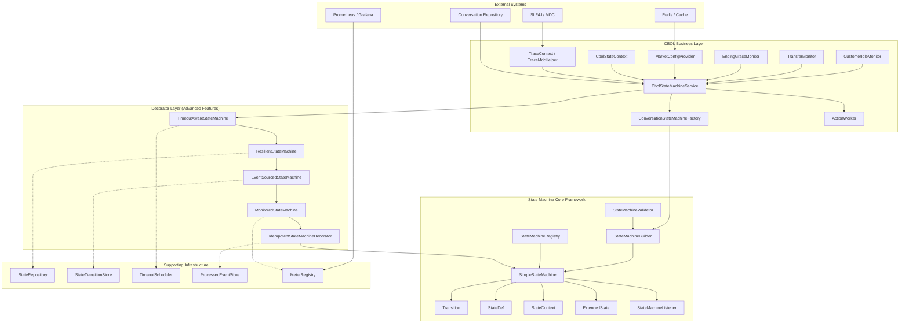

# State Machine Architecture Design

> Version: 1.0 | Last Updated: 2026-09-01

## 1. Overview

This project implements a **lightweight, stateless, table-driven state machine framework** for the CBOL (AI Messaging Hub) system. The framework is inspired by Spring StateMachine's design philosophy but optimized for simplicity, zero external dependencies, and high performance.

The project consists of two layers:

| Layer | Package | Responsibility |
|-------|---------|----------------|
| **Core Framework** | `com.selfdevelopment.ai.messaging.statemachine` | Generic, reusable state machine engine |
| **CBOL Business Layer** | `com.selfdevelopment.ai.messaging.cbol` | CBOL-specific state definitions, transitions, and services |

## 2. Design Principles

### 2.1 Stateless Engine (Mandatory)

The state machine engine itself does **not** store the current state. The caller injects the current state on each `fireEvent` call. This design:

- Allows a single machine instance to serve thousands of concurrent conversations
- Eliminates thread-safety concerns for state storage
- Enables horizontal scaling without session affinity
- Simplifies state persistence (caller manages DB/cache)

```java
// Caller manages state; engine only stores transition rules
ConversationState newState = stateMachine.fireEvent(
    conversation.getCurrentState(),  // injected by caller
    ConversationFact.CUSTOMER_CONNECT,
    context
).getTargetState();
conversation.setCurrentState(newState);
repository.save(conversation);
```

### 2.2 Table-Driven Transitions (O(1) Lookup)

Transitions are stored in a `ConcurrentHashMap` keyed by `(sourceState, event)`, enabling O(1) lookup. Multiple transitions with the same key (different guards) are stored as a list and evaluated in order.

### 2.3 Zero External Dependencies

The core framework depends only on the JDK standard library. No Spring, no Apache Commons, no Guava. This makes it:

- Easy to embed in any Java project
- Lightweight (~15 classes)
- Free from dependency conflicts
- Fast to start (no framework initialization)

### 2.4 Spring-Style Configuration

While the core has zero dependencies, the configuration API is inspired by Spring StateMachine's `StateMachineConfigurerAdapter`:

```java
public class ConversationConfig extends StateMachineConfigurerAdapter<ConversationState, ConversationFact, CbolStateContext> {
    @Override
    public void configure(StateConfigurer<...> states) {
        states.initial(INITIATED).state(ACTIVE).end(CLOSED);
    }

    @Override
    public void configure(TransitionConfigurer<...> transitions) {
        transitions.withExternal()
            .source(INITIATED).event(CUSTOMER_CONNECT).target(ACTIVE);
    }
}
```

## 3. Architecture Diagram



## 4. Package Structure

```
com.selfdevelopment.ai.messaging/
├── statemachine/                          # Core framework
│   ├── core/                              # Core abstractions
│   │   ├── StateMachine.java              # Interface (lifecycle, fireEvent, listeners, getAllTransitions)
│   │   ├── SimpleStateMachine.java        # Default implementation (stateless, table-driven)
│   │   ├── Transition.java                # Transition rule (source, event, target, guard, action, kind)
│   │   ├── StateDef.java                  # State definition (entry/exit actions, initial/end flags)
│   │   ├── StateContext.java              # Context object passed through transitions
│   │   ├── ExtendedState.java             # Key-value variables shared across transitions
│   │   ├── Guard.java                     # Functional interface for guard conditions
│   │   ├── Action.java                    # Functional interface for transition actions
│   │   └── TransitionKind.java            # EXTERNAL / INTERNAL enum
│   ├── builder/
│   │   └── StateMachineBuilder.java       # Fluent DSL builder + fromConfigurer() factory + build(validate)
│   ├── config/
│   │   ├── StateMachineConfigurerAdapter.java  # Base class for Spring-style configuration
│   │   ├── StateConfigurer.java           # State configuration interface
│   │   ├── DefaultStateConfigurer.java    # Default implementation
│   │   ├── TransitionConfigurer.java      # Transition configuration interface
│   │   └── DefaultTransitionConfigurer.java
│   ├── listener/
│   │   └── StateMachineListener.java      # 8 callback hooks (started, stopped, transition*, stateChanged, error)
│   ├── registry/
│   │   └── StateMachineRegistry.java      # Named registry for sharing machines
│   ├── exception/
│   │   └── StateMachineException.java     # Runtime exception for all state machine errors
│   ├── persistence/                       # State persistence with optimistic locking
│   │   ├── StateRepository.java           # Repository interface (findById, save with version)
│   │   ├── InMemoryStateRepository.java   # In-memory implementation with atomic version
│   │   ├── VersionedState.java            # Record (state, version)
│   │   └── OptimisticLockException.java   # Version conflict exception
│   ├── validation/                        # Build-time validation
│   │   ├── StateMachineValidator.java     # 8 validation rules (ERROR/WARNING levels)
│   │   └── ValidationError.java           # Record (rule, level, message, state, event)
│   ├── idempotency/                       # Idempotent event processing
│   │   ├── ProcessedEventStore.java       # Store interface for processed event IDs
│   │   ├── InMemoryProcessedEventStore.java # In-memory implementation
│   │   └── IdempotentStateMachineDecorator.java # Event ID deduplication decorator
│   ├── metrics/                           # Observability (Micrometer optional)
│   │   ├── StateMachineMetrics.java       # Metrics collector (Timer/Counter, 5 metrics)
│   │   └── MonitoredStateMachine.java     # Auto-instrumenting decorator
│   ├── eventsourcing/                     # Event sourcing / audit trail
│   │   ├── StateTransitionEvent.java      # Immutable transition record (timestamp, traceId, metadata)
│   │   ├── StateTransitionStore.java      # Store interface (append, replay, reconstruct, time-travel)
│   │   ├── InMemoryStateTransitionStore.java # Thread-safe in-memory implementation
│   │   └── EventSourcedStateMachine.java  # Auto-recording decorator
│   ├── resilience/                        # Failure handling strategies
│   │   ├── FailureHandler.java            # Strategy interface (NO_TRANSITION/GUARD_FAILED/ACTION_ERROR)
│   │   ├── ThrowFailureHandler.java       # Throws StateMachineException (default)
│   │   ├── ReturnSourceFailureHandler.java # Returns source state, accepted=false
│   │   ├── FallbackStateFailureHandler.java # Transitions to configured fallback state
│   │   ├── RetryFailureHandler.java       # Retries with fixed/exponential backoff
│   │   └── ResilientStateMachine.java     # Decorator integrating failure handlers
│   ├── timeout/                           # Scheduled timeout events
│   │   ├── TimeoutConfig.java             # State timeout config (duration, event, repeat)
│   │   ├── StateMachineTimeoutScheduler.java # Scheduler interface
│   │   ├── InMemoryTimeoutScheduler.java  # ScheduledExecutorService-based implementation
│   │   └── TimeoutAwareStateMachine.java  # Auto-schedule/cancel decorator
│   └── diagram/                           # Diagram generation
│       └── StateMachineDiagramGenerator.java # Mermaid / PlantUML / transition table
│   └── event/                             # Standard event-driven infrastructure
│       ├── StandardEvent.java             # Standard event contract (eventId, type, source, entityId, payload, traceId)
│       ├── EventNormalizer.java           # Event normalizer interface <SRC, DST>
│       └── EventDispatcher.java           # Event dispatcher (handler routing, interceptors)
│
└── cbol/                                   # CBOL business layer
    ├── enums/
    │   ├── ConversationState.java          # 5 states: INITIATED, ACTIVE, TRANSFERRED, ENDING, CLOSED
    │   ├── ConversationFact.java           # 13 events (lifecycle, transfer, ending, system)
    │   ├── InteractionState.java           # Channel-level states (reserved)
    │   ├── EndReason.java                  # Conversation end reasons (reserved)
    │   └── TransferOutcome.java            # Transfer result codes (reserved)
    ├── model/
    │   ├── ConversationInstance.java       # Immutable record (conversationId, state, market, ...)
    │   ├── InteractionInstance.java        # Immutable record (interactionId, channel, deviceType, ...)
    │   └── StateTransitionRecord.java      # Audit record (fromState, toState, fact, durationMs, traceId)
    ├── context/
    │   ├── CbolStateContext.java           # Aggregate context (conversation + interaction + marketConfig + trace)
    │   ├── TraceContext.java               # Trace identifiers (traceId, spanId)
    │   └── TraceMdcHelper.java             # SLF4J MDC propagation utility
    ├── config/
    │   ├── StateMachineMarketConfig.java   # Market-level configuration (timeouts, thresholds)
    │   └── MarketConfigProvider.java       # Config provider interface + InMemoryProvider
    ├── ingress/                            # Event ingress layer
    │   ├── AibotEvent.java                 # AIBot external event record
    │   ├── GenesysEvent.java               # Genesys external event record
    │   ├── AibotEventNormalizer.java       # AIBot → StandardEvent (4 event type mappings)
    │   ├── GenesysEventNormalizer.java     # Genesys → StandardEvent (6 event type mappings)
    │   └── CbolEventDispatcher.java         # Dual state machine pipeline dispatcher
    ├── action/
    │   ├── CbolAction.java                 # Functional interface for CBOL actions
    │   ├── ActionWorker.java               # Async executor with bounded thread pool + MDC propagation
    │   └── CbolActionDefinition.java       # Action metadata (reserved)
    ├── statemachine/
    │   ├── ConversationStateMachineFactory.java  # Builds and registers the conversation state machine
    │   ├── InteractionStateMachineFactory.java   # Channel-level state machine (reserved)
    │   ├── CbolStateMachineService.java    # Main service entry point (fire, audit logging, fireWithLock)
    │   └── CbolStateMachineRegistry.java   # Singleton holder for shared registry
    ├── connector/                          # Business connector layer
    │   ├── Connector.java                  # Connector interface + request/response records + exception
    │   ├── AibotConnector.java             # AIBot API connector (sendMessage, triggerHandoff, endSession)
    │   ├── GenesysConnector.java           # Genesys Cloud connector (routeToQueue, sendAgentMessage, transfer)
    │   ├── CbolWebsocketConnector.java     # Customer WebSocket connector (pushMessage, typingIndicator, session mgmt)
    │   └── ChatHistoryOdsConnector.java    # Chat history ODS connector (saveMessage, saveStateChange, queryHistory)
    ├── repository/                         # CBOL persistence implementation
    │   └── ConversationRepository.java     # Conversation state repository (optimistic locking, instance storage)
    └── monitor/
        ├── AbstractTimeoutMonitor.java     # Base class for time-based monitors
        ├── CustomerIdleMonitor.java        # Fires SYS_CUSTOMER_IDLE when idle threshold exceeded
        ├── TransferMonitor.java            # Fires SYS_TRANSFER_TIMEOUT when transfer takes too long
        └── EndingGraceMonitor.java         # Fires SYS_ENDING_GRACE_TIMEOUT to close conversations
```

## 5. Key Design Decisions

| Decision | Rationale | Trade-off |
|----------|-----------|-----------|
| Stateless engine | Thread-safe, scalable, simple persistence | Caller must manage state storage |
| Table-driven transitions | O(1) lookup, no if-else chains | Memory overhead for transition map |
| Zero dependencies | Lightweight, no conflicts | No built-in persistence, AOP, etc. |
| Entry/exit actions are best-effort | Side effects shouldn't block state transitions | Action failures only notified via listener |
| Transition action failures propagate | Business logic failures should be visible | Caller must handle StateMachineException |
| Bounded thread pool for ActionWorker | Prevents OOM under high load | CallerRunsPolicy provides backpressure |
| Market-level configuration | Multi-market deployment requires per-market tuning | InMemoryProvider needs external refresh mechanism |
| TraceId via SLF4J MDC | Full-chain observability with zero code changes | MDC must be cleared in finally block |

## 6. Related Documents

- [01-State-Machine-Core-Design.md](./01-State-Machine-Core-Design.md) — Core framework detailed design
- [02-CBOL-Business-Layer-Design.md](./02-CBOL-Business-Layer-Design.md) — CBOL business layer detailed design
- [03-State-Transition-Diagrams.md](./03-State-Transition-Diagrams.md) — State diagrams and transition tables
- [04-Usage-Guide.md](./04-Usage-Guide.md) — Quick start and usage examples
