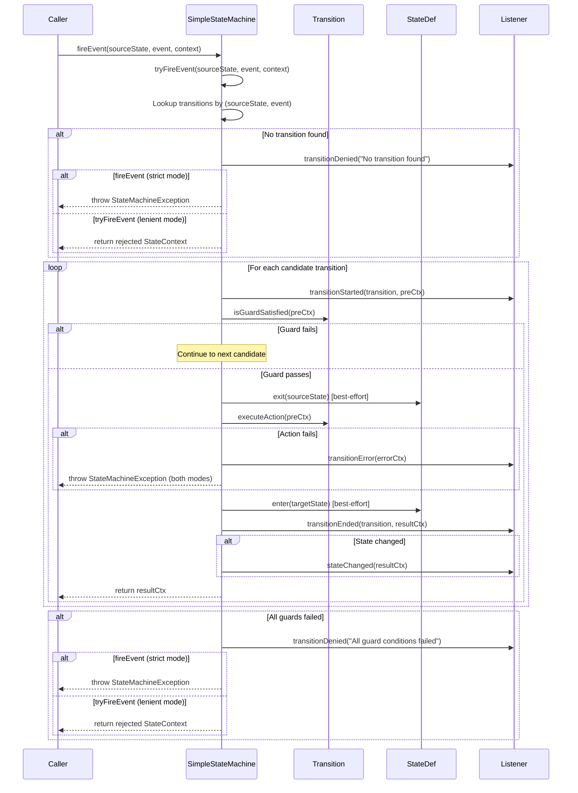

# State Machine Core Framework Design

> Version: 2.0 | Last Updated: 2026-09-02

## 1. Core Abstractions

### Package Structure

The core framework is organized into two main packages:

| Package | Responsibility |
|---------|----------------|
| `com.selfdevelopment.statemachine.api` | Public interfaces: `StateMachine`, `Action`, `Guard`, `StateMachineListener`, `StateMachineRegistry` |
| `com.selfdevelopment.statemachine.core` | Core implementations: `SimpleStateMachine`, `Transition`, `StateDef`, `StateContext`, `ExtendedState`, `TransitionKind` |

### 1.1 StateMachine Interface

The central interface defining the state machine contract.

```java
public interface StateMachine<S, E, C> {
    // Lifecycle
    void start();
    void stop();
    boolean isStarted();

    // Event processing
    StateContext<S, E, C> fireEvent(S sourceState, E event, C context);
    StateContext<S, E, C> fireEvent(S sourceState, E event, C context, ExtendedState extendedState);

    // Query
    boolean hasTransition(S sourceState, E event);
    boolean canFire(S sourceState, E event, C context);
    int getTransitionCount();
    Collection<Transition<S, E, C>> getAllTransitions();
    String getMachineId();
    S getInitialState();
    Collection<S> getEndStates();

    // Listeners
    void addListener(StateMachineListener<S, E, C> listener);
    void removeListener(StateMachineListener<S, E, C> listener);
}
```

**Type Parameters:**
- `S` — State type (typically an enum)
- `E` — Event type (typically an enum)
- `C` — Business context type (carries domain data)

### 1.2 Two Firing Modes

`SimpleStateMachine` supports two firing modes:

| Mode | Method | Behavior on Rejection | Use Case |
|------|--------|----------------------|----------|
| **Strict** | `fireEvent()` | Throws `StateMachineException` | When failures should propagate (with ResilientStateMachine / FailoverStateMachine) |
| **Lenient** | `tryFireEvent()` | Returns rejected `StateContext` (`transitionAccepted=false`) | When "event not applicable" should be handled gracefully |

Both modes still throw on action execution failures (those are real errors, not "not applicable").

```java
// Strict mode — throws on rejection
StateContext<S, E, C> result = machine.fireEvent(state, event, ctx);

// Lenient mode — returns rejected context instead of throwing
StateContext<S, E, C> result = machine.tryFireEvent(state, event, ctx, null);
if (!result.isTransitionAccepted()) {
    log.warn("Event not applicable: {}", event);
    return;
}
```

### 1.2 SimpleStateMachine Implementation

The default, thread-safe implementation.

**Internal Data Structures:**

```java
// Transition lookup: O(1) by (sourceState, event)
private final Map<TransitionKey<S, E>, List<Transition<S, E, C>>> transitions;

// State definitions: entry/exit actions, initial/end flags
private final Map<S, StateDef<S, E, C>> stateDefs;

// Listeners: CopyOnWriteArrayList for thread-safe iteration
private final List<StateMachineListener<S, E, C>> listeners = new CopyOnWriteArrayList<>();

// Machine metadata
private final String machineId;
private final S initialState;
private final Set<S> endStates;

// Lifecycle
private volatile boolean started = false;
```

**TransitionKey** is a private record used as the map key:

```java
private record TransitionKey<S, E>(S sourceState, E event) {
    static <S, E> TransitionKey<S, E> of(S sourceState, E event) {
        return new TransitionKey<>(sourceState, event);
    }
}
```

**Two firing methods:**

```java
// Strict mode: throws StateMachineException on rejection
public StateContext<S, E, C> fireEvent(S sourceState, E event, C context, ExtendedState extendedState) {
    StateContext<S, E, C> result = tryFireEvent(sourceState, event, context, extendedState);
    if (!result.isTransitionAccepted()) {
        throw new StateMachineException(reason);
    }
    return result;
}

// Lenient mode: returns rejected context instead of throwing
public StateContext<S, E, C> tryFireEvent(S sourceState, E event, C context, ExtendedState extendedState) {
    // ... lookup transitions, evaluate guards, execute actions ...
    // Returns StateContext with transitionAccepted=false on rejection
}
```

### 1.3 Transition

Represents a single transition rule.

```java
public final class Transition<S, E, C> {
    private final S sourceState;      // State before transition
    private final E event;            // Triggering event
    private final S targetState;      // State after transition
    private final Guard<S, E, C> guard;    // Optional condition (null = always allowed)
    private final Action<S, E, C> action;  // Optional side effect
    private final TransitionKind kind;      // EXTERNAL (default) or INTERNAL
}
```

**Key Methods:**
- `matches(sourceState, event)` — Checks if this transition applies
- `isGuardSatisfied(context)` — Evaluates guard (null guard = true)
- `executeAction(context)` — Executes action if present
- `isInternal()` — Returns true for INTERNAL transitions

**TransitionKind:**
- `EXTERNAL` — State changes; exit(source) → action → entry(target)
- `INTERNAL` — State does not change; only action executes; no entry/exit

### 1.4 StateDef

Defines metadata for a state, including entry/exit actions.

```java
public final class StateDef<S, E, C> {
    private final S id;
    private final Action<S, E, C> entryAction;
    private final Action<S, E, C> exitAction;
    private final boolean initial;
    private final boolean end;
}
```

**Execution Semantics:**
- `exit(context)` — Executes exit action if present (best-effort, failures don't block transition)
- `enter(context)` — Executes entry action if present (best-effort)
- `hasEntryAction()` / `hasExitAction()` — Null checks

### 1.5 StateContext

The context object passed through every transition.

```java
public final class StateContext<S, E, C> {
    private final S sourceState;
    private final S targetState;
    private final E event;
    private final C businessContext;
    private final ExtendedState extendedState;
    private final Exception exception;        // Non-null if an error occurred
    private final boolean transitionAccepted; // true if transition was applied
}
```

**Builder Pattern:**

```java
StateContext.<S, E, C>builder()
    .sourceState(source)
    .targetState(target)
    .event(event)
    .businessContext(ctx)
    .extendedState(ext)
    .transitionAccepted(true)
    .build();
```

### 1.6 ExtendedState

Key-value store for variables shared across transitions.

```java
public final class ExtendedState {
    private final Map<String, Object> variables = new ConcurrentHashMap<>();

    public ExtendedState set(String key, Object value) { ... }  // returns this for chaining
    public <T> T get(String key) { ... }
    public <T> T getOrDefault(String key, T defaultValue) { ... }
    public boolean contains(String key) { ... }
    public ExtendedState remove(String key) { ... }  // returns this for chaining
    public Map<String, Object> getVariables() { ... }  // unmodifiable view
    public void clear() { ... }
}
```

**Use Cases:**
- Passing data between guard conditions and actions
- Storing intermediate computation results
- Tracking retry counts within a conversation

### 1.7 Guard & Action (Functional Interfaces)

```java
@FunctionalInterface
public interface Guard<S, E, C> {
    boolean evaluate(StateContext<S, E, C> context);
}

@FunctionalInterface
public interface Action<S, E, C> {
    void execute(StateContext<S, E, C> context);
}
```

## 2. Event Processing Flow

### 2.1 fireEvent / tryFireEvent Sequence Diagram



### 2.2 Action Execution Order (EXTERNAL Transition)

```
1. exit action of source state     (best-effort, failure → listener only)
2. transition action                (failure → StateMachineException)
3. entry action of target state    (best-effort, failure → listener only)
```

**INTERNAL Transition:** Only step 2 executes; no entry/exit actions.

### 2.3 Error Handling Strategy

| Component | Failure Behavior | Rationale |
|-----------|-----------------|-----------|
| Exit action | Logged via listener, transition continues | Side effect shouldn't block state change |
| Transition action | StateMachineException thrown | Business logic failure must be visible |
| Entry action | Logged via listener, transition continues | State already changed, can't roll back |
| Guard condition | Next candidate tried; all fail → exception | Guards are conditions, not errors |

## 3. Builder DSL

### 3.1 Fluent API

```java
StateMachine<OrderState, OrderEvent, OrderContext> machine =
    StateMachineBuilder.<OrderState, OrderEvent, OrderContext>builder("order-machine")
        .initialState(OrderState.CREATED)
        .endStates(OrderState.COMPLETED, OrderState.CANCELLED)

        // State with entry/exit actions
        .stateWithEntry(OrderState.PAID, ctx -> sendConfirmation(ctx))
        .stateWithExit(OrderState.PAID, ctx -> logExit(ctx))

        // Basic transition
        .transition()
            .from(OrderState.CREATED)
            .on(OrderEvent.PAY)
            .to(OrderState.PAID)
            .guard(ctx -> ctx.getBusinessContext().isPaymentValid())
            .perform(ctx -> processPayment(ctx))
        .and()

        // Internal transition (state doesn't change)
        .transition()
            .from(OrderState.PAID)
            .on(OrderEvent.UPDATE_ADDRESS)
            .to(OrderState.PAID)
            .internal()
            .perform(ctx -> updateAddress(ctx))
        .and()

        .build();
```

### 3.2 Configurer Adapter (Spring Style)

```java
public class OrderStateMachineConfig
        extends StateMachineConfigurerAdapter<OrderState, OrderEvent, OrderContext> {

    @Override
    public void configure(StateConfigurer<OrderState, OrderEvent, OrderContext> states) {
        states.initial(OrderState.CREATED)
              .state(OrderState.PAID)
              .end(OrderState.COMPLETED)
              .end(OrderState.CANCELLED);
    }

    @Override
    public void configure(TransitionConfigurer<OrderState, OrderEvent, OrderContext> transitions) {
        transitions.withExternal()
            .source(OrderState.CREATED)
            .event(OrderEvent.PAY)
            .target(OrderState.PAID)
            .guard(ctx -> ctx.getBusinessContext().isPaymentValid())
            .action(ctx -> processPayment(ctx))
        .and().withExternal()
            .source(OrderState.PAID)
            .event(OrderEvent.SHIP)
            .target(OrderState.SHIPPED);
    }
}

// Usage
StateMachine<OrderState, OrderEvent, OrderContext> machine =
    StateMachineBuilder.fromConfigurer("order-machine", new OrderStateMachineConfig());
```

## 4. Listener Mechanism

### 4.1 StateMachineListener Interface

```java
public interface StateMachineListener<S, E, C> {
    default void stateMachineStarted() {}
    default void stateMachineStopped() {}
    default void transitionStarted(Transition<S, E, C> transition, StateContext<S, E, C> ctx) {}
    default void transitionEnded(Transition<S, E, C> transition, StateContext<S, E, C> ctx) {}
    default void transitionDenied(StateContext<S, E, C> ctx, String reason) {}
    default void transitionError(StateContext<S, E, C> ctx) {}
    default void stateChanged(StateContext<S, E, C> ctx) {}
}
```

All methods have default empty implementations, so listeners only override what they need.

### 4.2 Common Listener Use Cases

```java
// Audit logging
machine.addListener(new StateMachineListener<>() {
    @Override
    public void stateChanged(StateContext<...> ctx) {
        auditLog.info("State changed: {} -> {} (event={})",
            ctx.getSourceState(), ctx.getTargetState(), ctx.getEvent());
    }
});

// Metrics
machine.addListener(new StateMachineListener<>() {
    @Override
    public void transitionEnded(Transition<...> t, StateContext<...> ctx) {
        metrics.increment("statemachine.transition.success");
    }
    @Override
    public void transitionError(StateContext<...> ctx) {
        metrics.increment("statemachine.transition.error");
    }
});
```

## 5. Registry

### 5.1 StateMachineRegistry

A named registry for sharing state machine instances across the application.

```java
public class StateMachineRegistry {
    private final Map<String, StateMachine<?, ?, ?>> machines = new ConcurrentHashMap<>();

    public void register(StateMachine<?, ?, ?> machine) { ... }
    public <S, E, C> StateMachine<S, E, C> get(String machineId) { ... }
    public boolean contains(String machineId) { ... }
    public boolean unregister(String machineId) { ... }
    public int size() { ... }
    public void clear() { ... }
}
```

**Thread Safety:** `ConcurrentHashMap` for storage; `register` throws `StateMachineException` on duplicate IDs.

## 6. Exception Hierarchy

```
RuntimeException
└── StateMachineException
    ├── "No transition found: state=X, event=Y"
    ├── "Transition guard condition failed: state=X, event=Y"
    ├── "Transition action failed: <cause message>"
    ├── "State machine already registered: id=X"
    └── "State machine not found: id=X"
```

All exceptions carry a descriptive message and, where applicable, the original cause.

## 7. Performance Characteristics

| Operation | Complexity | Notes |
|-----------|-----------|-------|
| Transition lookup | O(1) | ConcurrentHashMap get |
| Guard evaluation | O(n) | n = number of candidates with same (state, event) |
| Action execution | O(1) | Direct method call |
| Listener notification | O(m) | m = number of listeners (CopyOnWriteArrayList) |
| Memory per machine | O(t + s) | t = transitions, s = states |

**Thread Safety:** After construction, `SimpleStateMachine` is immutable and safe for concurrent use by any number of threads.
